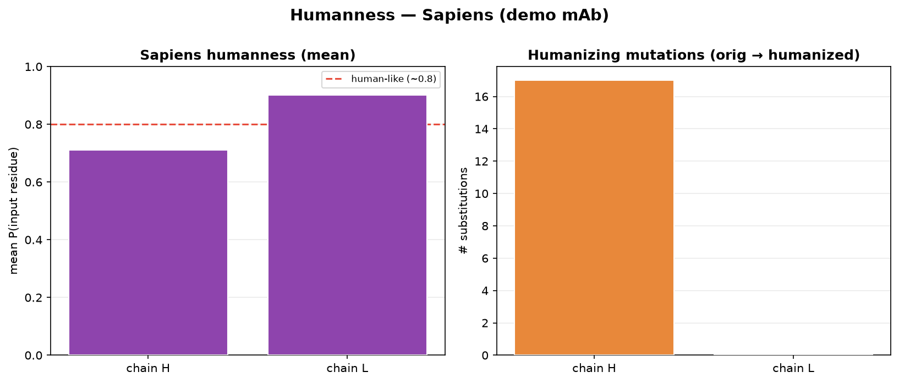
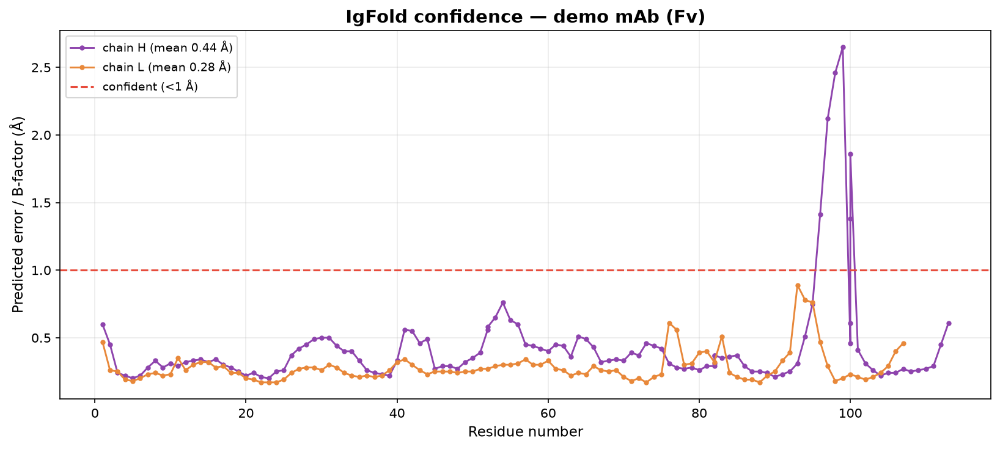
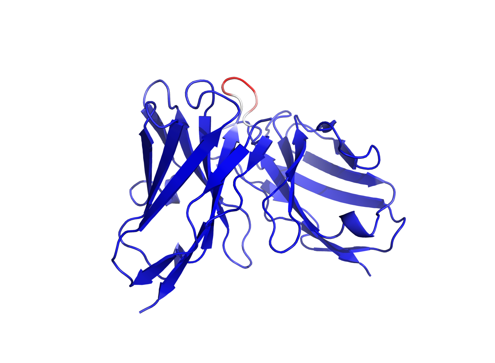
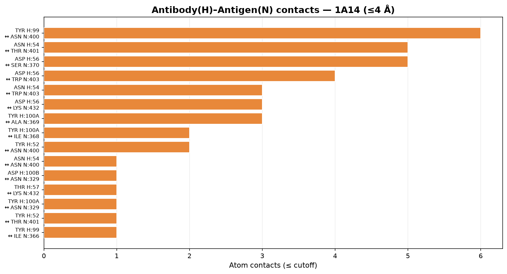
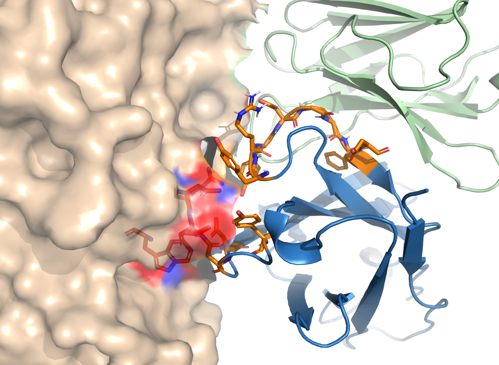
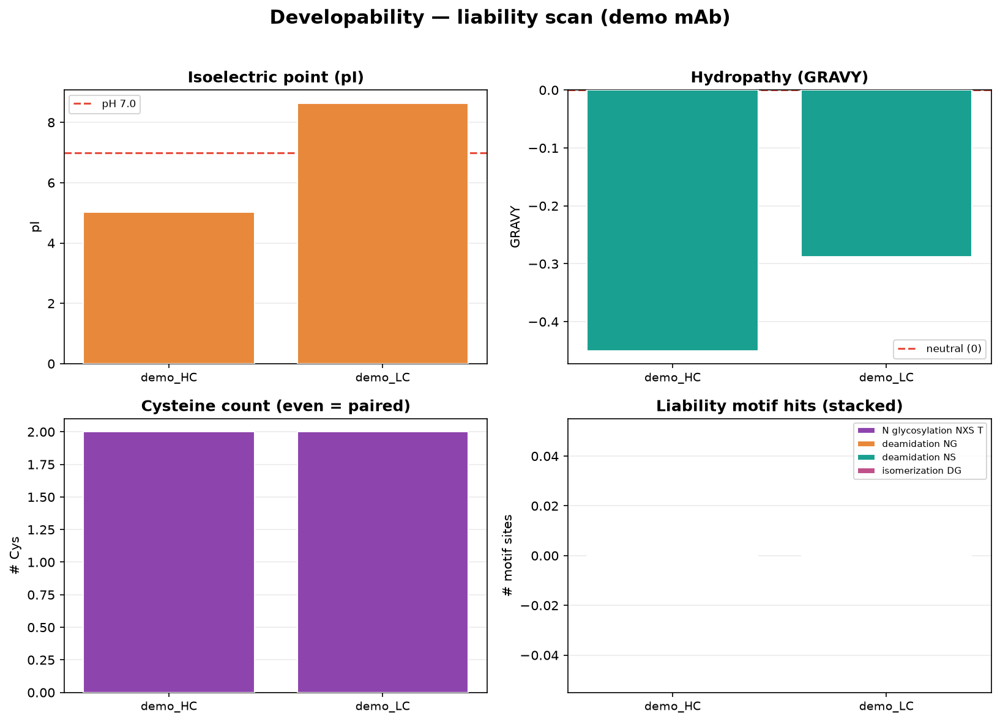
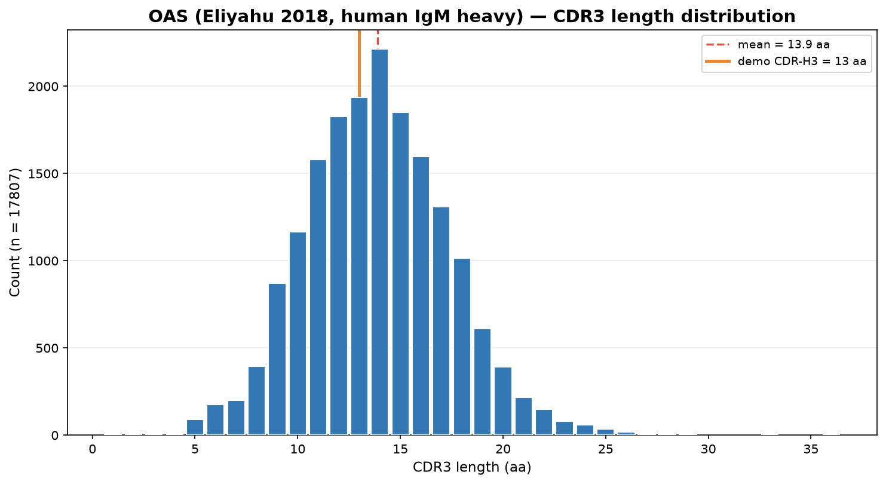

# 항체 데이터베이스·분석 도구 완전 정복

> **이 과정은 공개 항체 데이터베이스와 CLI 도구를 처음부터 끝까지 다루는 자기완결형(self-contained) 실습 과정이에요.**
> 항체 기본 개념(CDR·epitope·germline)부터 시작해, 공개 DB(SAbDab·OAS·IMGT·Thera-SAbDab) 탐색, 그리고 numbering·humanization·구조예측·interface·developability·repertoire까지 **실제 도구를 돌려가며** 한 문서 세트로 완결합니다.
> **읽는 실습이 아니라 만드는 실습이에요** — 노트북이 ANARCI·Sapiens·IgFold·contact 계산·OAS 다운로드를 **직접 실행**해 결과를 여러분의 `my_run/` 폴더에 만들고, 저장소에 커밋된 `data/`(레퍼런스)와 대조해 맞는지 확인합니다.

## 0. 과정 개요

치료용 항체를 컴퓨터로 분석한다는 건, 결국 이 질문들에 답하는 거예요.

- 이 서열은 진짜 항체인가? 어디가 CDR이고 어디가 framework인가? (**numbering**)
- 어떤 germline에서 왔고, 사람 항체와 얼마나 닮았나? (**germline·humanness**)
- 3D 구조는 어떻게 생겼나? (**구조예측**)
- 항원의 어디에 어떻게 붙나? (**interface**)
- 약으로 만들 수 있나? (**developability**)
- 자연 항체 레퍼토리에서 정상 범위인가? (**repertoire**)

이 과정은 위 질문 하나하나를 **공개 DB + 오픈소스 CLI 도구**로 직접 풀어봐요. 개념 → 환경 설치 → 도구별 실습 → 통합 파이프라인·보고서까지 이어집니다.

이 문서는 연구·교육 목적의 전산생물학 가이드이며, 임상적 의사결정이나 실험 검증을 대체하지 않아요.

## 1. 대상 독자와 사전 요구사항

**대상**
- 항체를 **처음 다루는 연구자부터** 분석 파이프라인을 자동화하려는 실무자까지 — 이 과정 하나로 완결
- 항체 서열·구조를 직접 분석해야 하는 바이오·신약 연구개발자
- 후보 항체의 humanness·developability를 정량 평가하려는 계산생물학 실무자

**준비물**
- **웹 브라우저.** 실습 노트북은 Colab에서 그대로 열려요. 첫 셀이 필요한 도구(ANARCI·Sapiens·IgFold 등)를 알아서 설치하고, 나머지 셀이 그 도구를 실제로 돌립니다. 전 셀 실행 시간은 노트북마다 **3~16초**(아래 표, 실측).
- Python 기초와 단백질 서열·구조 기초(서열·도메인·결합 인터페이스). 핵심 용어는 본문에서 설명해요.
- 로컬에서 돌리고 싶다면 conda 환경 3종을 제공해요(Ch.03). 도구를 여러 번 반복 실행하거나 자기 데이터로 돌릴 때 편해요.

### 직접 생성이 기본값 — `my_run/` 과 `data/`

| 폴더 | 무엇 |
|------|------|
| `my_run/` | **여러분이 방금 만든 결과.** 노트북이 도구를 실행해 여기에 씁니다(저장소에는 없음, 실행하면 생겨요) |
| `data/` | **레퍼런스(대조군).** 이 저장소를 만들 때 같은 도구로 만들어 커밋해 둔 결과 — 내 결과가 맞는지 비교하는 데 씁니다 |

각 절은 **① 직접 실행 → ② 내 결과 확인 → ③ 레퍼런스 대조** 순서예요. 어느 단계를 건너뛰거나 실패해도 노트북의 `resolve()` 가 `my_run/` → `data/` 로 폴백하니, 뒤 절이 멈추지 않아요(어느 쪽을 쓰는지 항상 출력됩니다).

## 2. 과정 구성 — 스텝(챕터)별 자기완결

각 챕터는 **자기 폴더 안에 본문(.md)·노트북(.ipynb)·그래프(.png)·데이터(data/)를 모두** 담아요. 한 스텝을 학습할 땐 그 폴더만 보면 됩니다.

`my_run/` 은 저장소에 없어요 — **노트북을 돌리면 그 자리에서 생깁니다.**

### Part A — 개념과 환경

| Ch | 폴더 | 영역 | 핵심 내용 |
|----|------|------|-----------|
| **01** | [01_concepts/](01_concepts/01_concepts.md) | 항체 기본 개념 | IgG 구조, VH/VL·CDR·framework, numbering scheme, epitope/paratope, germline, developability |
| **02** | [02_databases/](02_databases/02_databases.md) | 항체 DB landscape | 구조/서열/치료/항원/mutation DB 분류, SAbDab·OAS·IMGT·Thera-SAbDab·CoV-AbDab·IEDB·AB-Bind·SKEMPI |
| **03** | [03_setup/](03_setup/03_setup.md) | 분석 환경 구축 | abseq/abstruct/abinterface conda 환경 분리, 의존성 충돌 회피, `boltzgen check`식 점검 |

### Part B — 도구별 실습 (Hands-on Labs)

| Ch | 폴더 | 분석 영역 | 노트북이 **직접 실행**하는 것 |
|----|------|-----------|-----------|
| **04** | [04_numbering/](04_numbering/04_numbering.md) | numbering·germline | **ANARCI 실행** → IMGT/Chothia numbering CSV + V/J germline 할당 |
| **05** | [05_humanness/](05_humanness/05_humanness.md) | humanness·humanization | **Sapiens 언어모델 실행** → humanness 점수 행렬 + humanized 서열 |
| **06** | [06_structure/](06_structure/06_structure.md) | 구조예측 | **IgFold 실행** → Fv 구조 예측(PDB) + 잔기별 예측오차 |
| **07** | [07_interface/](07_interface/07_interface.md) | 항원-항체 interface | **RCSB에서 1A14 다운로드 → contact 계산** → paratope/epitope |
| **08** | [08_developability/](08_developability/08_developability.md) | developability | **liability scan 실행** → motif·pI·GRAVY·unpaired Cys |
| **09** | [09_repertoire/](09_repertoire/09_repertoire.md) | repertoire·naturalness | **OAS data unit 다운로드 → CDR3 분포 집계** → 후보 percentile |

### 참조 (Reference)

| | 폴더 | 내용 |
|----|------|------|
| **부록** | [10_appendix/](10_appendix/10_appendix.md) | mini-pipeline 실행 예 · 보고서 체크리스트 · 용어집 · 참고문헌 24종 |

## 3. 실습 노트북 (각 챕터 폴더 안)

노트북은 별도 폴더가 아니라 **해당 챕터 폴더 안**에 있어요. 첫 셀(0. 부트스트랩)이 저장소 클론 → 챕터 폴더 이동 → **도구 설치**까지 해주고, 나머지 셀이 그 도구를 실제로 돌립니다.

전 셀 실행 시간은 **직접 측정한 값**이에요(pip 전용 환경, CPU. 측정 환경 → [부록 E](10_appendix/10_appendix.md)).

| 노트북 | 위치 | 직접 실행하는 도구 | 전 셀 실행 |
|--------|------|--------------------|-----------|
| `02_db_explore.ipynb` | 02 | RCSB Search/Data API → 항체-항원 복합체 스냅샷 | **6초** |
| `03_setup_check.ipynb` | 03 | 스택 진단 + ANARCI 스모크 테스트 | **3초** |
| `04_numbering_lab.ipynb` | 04 | ANARCI (IMGT·Chothia·germline) | **9초** |
| `05_humanness_lab.ipynb` | 05 | Sapiens 언어모델 (humanness·humanization) | **16초** |
| `06_structure_lab.ipynb` | 06 | IgFold (Fv 구조예측) | **16초** |
| `07_interface_lab.ipynb` | 07 | RCSB CIF 다운로드 + contact 계산 | **10초** |
| `08_dev_lab.ipynb` | 08 | liability scan | **3초** |
| `09_repertoire_lab.ipynb` | 09 | OAS data unit 다운로드 + CDR3 분포 집계 | **8초** |

> 표의 시간은 **셀 실행 시간**입니다(도구가 이미 깔린 상태). Colab에서 처음 열면 여기에 첫 셀의 패키지 설치가 더해져요 — 실측으로 노트북 한 권당 **1~6분**이고, 두 번째 실행부터는 표의 시간입니다.

공용 그래프 모듈 `antibody_viz.py`는 저장소 루트에 있고, 각 노트북은 `sys.path`에 루트를 추가해 import해요. **노트북(.ipynb)은 손으로 고치지 말고 `gen_notebooks.py`를 고친 뒤 재생성**하세요.

## 4. 빠른 시작 (Quick Start)

### (A) 브라우저 — Colab에서 바로 실습 (기본 경로)

1. GitHub에서 원하는 챕터 노트북(예: `04_numbering/04_numbering_lab.ipynb`)을 엽니다.
2. **Open in Colab** 으로 실행합니다.
3. 위에서부터 그대로 실행하세요(고칠 값 없음). 클론 → 챕터 폴더 이동 → 도구 설치 → **도구 실행 → `my_run/` 에 결과 생성 → `data/` 와 대조**까지 그대로 흘러갑니다.

ANARCI 계열 노트북의 설치 한 줄은 이거예요(부트스트랩이 자동 실행).

```bash
!apt-get -qq install -y hmmer      # ANARCI가 부르는 hmmscan — pip 로는 안 깔려요
!pip -q install anarci abnumber
```

### (B) 로컬 — 반복 실행·자기 데이터용

```bash
# 1) 분석 환경 (Ch.03 상세)
conda env create -f environment/abseq.yml      # ANARCI(+HMMER)·Sapiens·Biopython·pandas
conda activate abseq

# 2) 설치 점검
ANARCI --help >/dev/null && echo "ANARCI OK"
python -c "import Bio, pandas, matplotlib; print('analysis stack OK')"

# 3) 첫 실행 (developability scan) — 결과는 my_run/ 에
python scripts/liability_scan.py 08_developability/data/demo_mab.fa \
  --out 08_developability/my_run/liability.csv

# 4) numbering (IMGT + germline)
ANARCI -i 04_numbering/data/demo_mab.fa -s imgt --assign_germline --csv \
  --outfile 04_numbering/my_run/demo_imgt
```

> 구조예측(IgFold)은 `environment/abstruct.yml`, interface 심화(FreeSASA/PLIP)는 `environment/abinterface.yml`을 쓰세요 — 도구별 의존성 충돌을 피하려고 환경을 셋으로 나눴어요(Ch.03).

## 5. 학습 경로

```
[개념]  01 개념 → 02 DB landscape → 03 환경 설치
                                        │
[실습]  04 numbering → 05 humanness → 06 구조예측
                                        │
        07 interface → 08 developability → 09 repertoire
        (관심 분석부터 선택 가능)
                                        │
[정리]  10 부록 (mini-pipeline · 보고서 체크리스트)
```

- **입문자**: 01 → 10 순서대로.
- **특정 분석이 급하면**: 03(설치) → 해당 실습 챕터로 바로.

## 6. 표기 규약

- `코드` = 실제 명령·파일명·컬럼명
- 본문 콜아웃 표기: **심화**(배경 지식) · **주의**(흔한 함정) · **실습**(노트북 연동 + 실측 실행 시간 배지)
- DB·도구는 **공식 출처**로 인용 (부록 참고문헌 [1]~[24])
- 모든 수치·그래프는 **도구를 실제로 실행한 결과**예요(임의 값·합성 데이터 아님). 데이터 출처와 취득 시점은 [부록 E 재현 환경](10_appendix/10_appendix.md)에 적어 뒀어요.

<div class="pagebreak"></div>

# Ch.01 — 항체 기본 개념

본격적인 분석에 들어가기 전에, 항체가 어떻게 생겼고 왜 일반 단백질처럼 다루면 안 되는지부터 잡고 갈게요. 이 챕터의 용어들은 뒤의 모든 실습 챕터에서 계속 나오니까, 여기서 한 번 제대로 익혀두면 나머지가 훨씬 쉬워요.

> 이 챕터는 개념 위주라 노트북이 없어요. 다음 [Ch.02 DB landscape](02_databases/02_databases.md)부터 실제 데이터를 만집니다.

## 1.1 항체란 무엇인가

항체는 B cell이 만드는 면역 단백질이에요. 특정 **항원(antigen)**을 알아보고 달라붙는 게 일이죠. 치료용 항체를 개발할 땐 "얼마나 세게 붙느냐(affinity)"만 보는 게 아니라, 표적 선택성·안정성·생산성·면역원성·용해도·응집 위험 같은 **developability** 요소를 같이 봐요.

항체 분석에서 가장 기본이 되는 단위는 이거예요.

| 용어 | 의미 | 분석에서의 중요성 |
|------|------|------------------|
| Antigen | 항체가 인식하는 표적 분자 | 항체 discovery와 epitope 분석의 출발점 |
| Antibody | 항원을 인식하는 면역 단백질 | 서열·구조·developability 분석 대상 |
| Epitope | 항원에서 항체가 인식하는 부위 | 중화능·선택성·escape mutation 분석에 중요 |
| Paratope | 항체에서 항원을 인식하는 부위 | CDR 중심의 binding interface |
| Affinity | 항체와 항원 간 결합 강도 | KD, kon, koff 등으로 표현 |
| Specificity | 원하는 항원만 선택적으로 인식하는 정도 | off-target·cross-reactivity 평가에 중요 |

> **주의** — 항체는 일반 단백질과 달라요. V(D)J recombination과 somatic hypermutation 때문에 서열이 엄청나게 다양하고, 결합 부위가 **CDR loop 중심**으로 구성돼요. 그래서 일반 단백질 numbering이나 단순 sequence alignment만으로는 구조적·면역학적 의미를 제대로 못 읽어요. 항체 전용 numbering(1.4)이 필요한 이유예요.

## 1.2 IgG 구조 — heavy/light chain, Fab, Fc

가장 널리 쓰는 치료용 항체 형식은 **IgG**예요. heavy chain 2개 + light chain 2개로 된 Y자 모양 단백질이죠.

| 구조 단위 | 설명 |
|-----------|------|
| Heavy chain | 긴 사슬. VH, CH1, hinge, CH2, CH3 domain 포함 |
| Light chain | 짧은 사슬. VL, CL domain 포함 |
| VH / VL | heavy/light chain의 variable domain |
| Fab | 항원을 결합하는 팔. VH/VL + CH1/CL |
| Fc | effector function·FcRn binding·half-life 관련 영역 |

항원 결합은 주로 **Fv(VH+VL) 영역과 CDR loop**가 담당해요. 반면 ADCC/CDC/FcRn binding 같은 effector·약동학 특성은 **Fc**가 맡아요. 전산 분석에서 다루는 단위는 보통 이거예요.

- **Fv**: VH + VL. 항원 결합 부위의 최소 구조 단위.
- **Fab**: Fv + constant domain. 구조 안정성·실제 복합체 분석에 유용.
- **scFv**: VH와 VL을 linker로 이은 single-chain format.
- **VHH/nanobody**: 단일 variable domain. 낙타과 항체 유래.

## 1.3 VH/VL, CDR, framework region

variable domain은 **framework region(FR)**과 **CDR(complementarity-determining region)**으로 나뉘어요. CDR이 항원과 직접 닿고, framework는 그 CDR loop의 위치·구조를 지지해요.

| Chain | CDR | 특징 |
|-------|-----|------|
| Heavy | CDR-H1, H2, H3 | **CDR-H3**가 다양성이 가장 크고 결합 특이성을 좌우 |
| Light | CDR-L1, L2, L3 | 항원 접촉 + VH/VL orientation 안정화 |

CDR-H3는 V·D·J segment가 만나는 junction에서 만들어져서 길이·서열 다양성이 극단적으로 커요. 많은 항체가 CDR-H3로 epitope 중심을 인식하지만, 전부 그런 건 아니에요 — light chain CDR이나 framework 근처 residue가 중요한 접촉을 만들기도 해요.

> **심화** — **CDR만 보존한다고 결합력이 유지되는 건 아니에요.** framework residue 일부는 CDR conformation·VH/VL packing·paratope geometry를 지지하거든요. humanization(Ch.05)이나 affinity maturation에서는 이런 residue를 **Vernier zone** 또는 **CDR-supporting residue**로 보고 조심히 다뤄요.

## 1.4 항체 numbering이 중요한 이유

항체 서열은 그냥 1번부터 센 잔기 번호로 비교하기 어려워요. 항체마다 CDR 길이가 다르고 insertion/deletion이 있거든요. 그래서 **numbering scheme**을 써요.

| Numbering scheme | 특징 | 주 사용처 |
|------------------|------|-----------|
| Kabat | sequence variability 기반 | 전통적 항체 문헌, 일부 특허 |
| Chothia | canonical structure·loop boundary 반영 | 구조 기반 분석 |
| IMGT | 표준화된 immunogenetics 체계 | germline, V/J assignment, 국제 표준 |
| AHo | 구조 비교용 균일 numbering | 다중 항체 구조 비교 |
| Martin / Enhanced Chothia | 구조 분석 개선 | ANARCI 등에서 지원 |

> **주의** — **보고서에 residue 위치를 쓸 땐 반드시 어떤 scheme인지 명시하세요.** 예를 들어 "H52"가 Kabat/Chothia에선 CDR-H2지만 IMGT에선 FR2예요 — scheme이 다르면 같은 번호가 다른 위치를 가리켜요. Ch.04에서 ANARCI로 직접 IMGT vs Chothia boundary 차이를 봅니다.

## 1.5 Epitope과 paratope

항체-항원 결합을 이해하려면 둘을 구분해야 해요. **epitope = 항원 쪽 표면 부위**, **paratope = 항체 쪽 표면 부위**.

- **Linear epitope**: 서열상 연속된 peptide 구간.
- **Conformational epitope**: 3D에서 가까이 모인 여러 residue. 서열상으론 멀 수 있음.

> **심화** — 치료용·중화 항체에서는 conformational epitope이 매우 중요해요. 그래서 서열만으로 epitope을 결론짓기보다, 구조·solvent accessibility·항원 conformational state·glycan shielding을 같이 봐야 해요. Ch.07에서 실제 복합체 구조로 epitope/paratope 잔기를 뽑아봐요.

## 1.6 Germline, V(D)J recombination, somatic hypermutation

variable domain은 germline V·D·J gene segment의 조합으로 만들어져요. heavy는 V+D+J, light는 V+J가 결합하고, 이후 항원을 만난 B cell이 **somatic hypermutation**으로 mutation을 쌓고 **affinity maturation**으로 잘 붙는 clone이 선택돼요.

germline 정보가 분석에서 중요한 이유:

1. 항체가 어떤 V/J gene family에서 왔는지 알 수 있어요.
2. humanization에서 적절한 human framework를 고를 수 있어요.
3. somatic mutation 정도를 추정할 수 있어요.
4. 특정 germline이 특정 항원 class에 반복 쓰이는지 분석할 수 있어요.
5. 후보 항체가 자연 human repertoire와 얼마나 닮았는지 평가할 수 있어요.

IgBLAST, IMGT/V-QUEST, OAS, BioPhi/OASis가 이 과정의 단골 도구예요(Ch.04·05·09).

## 1.7 Chimeric, humanized, fully human

치료용 항체는 인간 서열 비율·기원에 따라 나뉘어요.

| 유형 | 일반적 suffix | 설명 |
|------|---------------|------|
| Murine | -omab | mouse 유래 |
| Chimeric | -ximab | mouse variable + human constant |
| Humanized | -zumab | human framework에 비인간 CDR grafting |
| Human | -umab | fully human 또는 human platform 유래 |

> **주의** — 이 suffix 분류는 역사적인 것이고, 최신 INN naming(2021~)에서는 체계가 바뀌었어요. 개념 이해용으로만 쓰고, 규제 명명은 따로 확인하세요. **humanization의 핵심**은 면역원성을 줄이면서 결합 특성을 유지하는 것 — 단순히 CDR을 붙여넣으면 실패할 수 있고, CDR 구조를 지지하는 framework residue는 back-mutation 후보가 돼요(Ch.05).

## 1.8 Developability란

developability는 후보 항체가 **실제 약으로 개발될 수 있는 가능성**이에요. affinity가 좋아도 이게 나쁘면 생산·정제·제형·보관·투여에서 문제가 생겨요.

| 항목 | 위험 |
|------|------|
| Aggregation | 응집, 면역원성 증가 |
| Hydrophobic patch | 비특이 결합, 낮은 용해도 |
| Charge patch | 높은 viscosity, 비특이 결합 |
| Deamidation motif | N-G·N-S에서 chemical liability |
| Isomerization motif | D-G에서 구조 변화 |
| Oxidation | Met·Trp 노출 시 산화 |
| N-glycosylation motif | CDR 내 glycosylation → binding 영향 |
| Unpaired cysteine | mispairing·응집 위험 |
| Immunogenicity | T-cell epitope·non-human motif |

> **심화** — 좋은 후보는 affinity·specificity·developability의 **균형**을 가져요. 전산에서는 TAP·BioPhi/OASis·CamSol·SAP·liability scan을 조합해 초기 risk를 봐요 — 이걸 Ch.08에서 `liability_scan.py`로 직접 돌립니다.

### 이 챕터 핵심 요약

1. 항체 결합은 **Fv(VH+VL)의 CDR loop**가 담당, 특히 **CDR-H3**가 다양성·특이성의 핵심.
2. framework는 거의 고정이지만 **Vernier zone**처럼 CDR을 지지하는 residue가 있어 조심해야 해요.
3. 항체는 CDR 길이가 제각각이라 **numbering scheme(IMGT/Kabat/Chothia)**이 필수 — 위치를 말할 땐 scheme을 꼭 명시.
4. **germline·humanness·developability**가 치료 항체 분석의 3대 축이고, 뒤 챕터에서 도구로 하나씩 측정해요.

<div class="pagebreak"></div>

# Ch.02 — 항체 데이터베이스 landscape

항체 분석은 결국 "어떤 DB에서 무엇을 가져오느냐"로 시작해요. 그런데 항체 DB는 종류가 많고 성격이 제각각이라, 먼저 **지도(landscape)**를 그려두는 게 중요해요. 이 챕터에서 DB들을 성격별로 분류하고, **공개 API로 항체-항원 복합체 스냅샷을 직접 받아** 표로 만들어 봅니다.

> **실습 — [`02_db_explore.ipynb`](02_databases/02_db_explore.ipynb)** · **전 셀 실행 6초** — RCSB Search/Data API를 **직접 호출**해 항체-항원 복합체 12건의 스냅샷을 `my_run/` 에 만들고, 커밋된 레퍼런스 스냅샷과 대조해요.

## 2.1 항체 DB는 어떻게 분류하나

데이터의 **성격**으로 나누는 게 가장 이해하기 쉬워요.

| DB 유형 | 대표 DB | 주요 데이터 | 주 용도 |
|---------|---------|------------|---------|
| 구조 DB | SAbDab, IMGT/3Dstructure-DB, SAbDab-nano | 항체 구조, 항원-항체 복합체 | 구조 비교, epitope/paratope 분석 |
| 서열 repertoire DB | OAS, AIRR Data Commons, iReceptor | BCR/항체 서열 대량 데이터 | naturalness, germline, repertoire |
| 치료용 항체 DB | Thera-SAbDab | 임상/승인 항체 서열·메타데이터 | benchmark, developability 비교 |
| 질병·항원 특화 DB | CoV-AbDab, IEDB | 항원 특이 항체, epitope | 중화항체, epitope 분석 |
| affinity/mutation DB | AB-Bind, SKEMPI | mutation별 binding 변화 | affinity maturation, ΔΔG 예측 |
| 통합 분석 시스템 | abYsis | sequence/structure annotation | 항체-aware annotation |

한 줄 요약으로 외워두면 편해요.

- **SAbDab** = 구조를 찾는 곳 (Ch.06·07)
- **OAS** = 자연 항체 서열 공간을 보는 곳 (Ch.09)
- **Thera-SAbDab** = 치료용 항체 benchmark를 만드는 곳 (Ch.05)
- **AB-Bind / SKEMPI** = mutation이 결합력에 미치는 영향을 보는 곳
- **IEDB** = 항원 epitope 실험 데이터를 찾는 곳

## 2.2 SAbDab — Structural Antibody Database

SAbDab은 PDB의 항체 구조를 **consistent fashion으로 annotation**해 제공하는 대표 구조 DB예요.[1] 항체 chain·antigen chain·resolution·method·species·affinity·CDR length 같은 항체 분석용 필드로 검색할 수 있어요.[2]

SAbDab을 쓸 때 확인할 필드(노트북에서 체크리스트로 만들어요):

- PDB ID, heavy/light/antigen chain ID, resolution, antibody species, antigen type
- affinity value 존재 여부, bound/unbound 여부, CDR sequence/length

**SAbDab-nano**는 nanobody/VHH 구조를 모은 하위 resource예요. nanobody는 VH/VL pair 없이 단일 domain으로 항원을 인식해서, 긴 CDR3·concave epitope 접근성 등 설계 전략이 일반 항체와 달라요.

## 2.2b 직접 해보기 — 항체-항원 복합체 스냅샷 만들기

SAbDab·Thera-SAbDab 웹 UI는 스크립트로 바로 긁기 어려워요(JS 렌더링 앱이라 HTML만 돌아옵니다). 그래서 이 과정에서는 **같은 원본인 PDB**를 RCSB **Search API + Data API**로 직접 조회해 "SAbDab스러운" 요약 표를 만듭니다. 노트북이 하는 일이 이거예요.

```bash
python scripts/fetch_rcsb_ab_snapshot.py --rows 12 --out 02_databases/my_run/rcsb_ab_complexes.csv
```

- **검색 조건**: X-ray · 해상도 ≤ 2.5 Å · 단백질 entity ≥ 3 · full-text `"Fab antibody complex"`
- **정렬**: release date 오름차순(오래된 entry부터) → 시간이 지나도 목록이 잘 안 흔들려요
- **사슬 역할 파생**: entity 설명(`pdbx_description`)에 `HEAVY`/`LIGHT`가 있으면 그대로, 없으면(`"FAB NC10"` 같은 이름) 사슬 ID가 `H*`/`L*`인지로 추정

`data/rcsb_ab_complexes.csv` 는 **2026-07-14에 같은 스크립트로 받아 커밋해 둔 스냅샷**(대조군)이에요. 그날 조건에 맞는 entry는 **939건**이었고, 그중 오래된 12건이 아래예요.

| PDB | 공개일 | 해상도 (Å) | H | L | 항원 사슬 | 항원 |
|-----|--------|-----------|---|---|-----------|------|
| 1FDL | 1991-10-15 | 2.50 | H | L | Y | Hen egg white lysozyme |
| 1NCA | 1994-01-31 | 2.50 | H | L | **N** | Influenza N9 neuraminidase |
| 1TET | 1994-01-31 | 2.30 | H | L | P | Cholera toxin peptide 3 |
| 1VFB | 1994-05-31 | 1.80 | **B** | **A** | C | Hen egg white lysozyme |
| 1MLC | 1995-06-03 | 2.50 | B;D | A;C | E;F | Hen egg white lysozyme |
| 2HRP | 1997-12-31 | 2.20 | H | L | P;Q | HIV-1 protease peptide |
| 1KB5 | 1998-04-08 | 2.50 | H | L | B;A | KB5-C20 **T-cell 수용체** |

*(전체 12건은 `data/rcsb_ab_complexes.csv`. 노트북에서 직접 받아 이 표와 대조합니다.)*

> **주의** — **이 표 안에 함정이 세 개나 있어요.**
> ① **1VFB의 항체 사슬은 H/L이 아니라 B/A예요.** "항체=H/L"은 관례일 뿐 규칙이 아닙니다.
> ② **2HRP에는 항체가 두 벌(H/L, N/M)** 들어 있어요 — 여기서 chain **N은 항원이 아니라 중쇄**예요(1NCA에서는 N이 항원이었죠!).
> ③ **1KB5의 "항원"은 T-cell 수용체**예요 — full-text 검색은 이런 걸 같이 물어옵니다. 검색 결과는 항상 눈으로 검수하세요.
>
> 그래서 실전 규칙은 하나예요 — **chain ID를 직접 확인하고, 무엇이 항원인지 눈으로 보세요.** Ch.07에서 1A14를 열 때 이걸 그대로 겪습니다.

> **심화** — 같은 항체가 여러 PDB entry로 존재하고(1NCA/1NCB/1NCC가 그래요 — 같은 NC41 Fab–neuraminidase의 변이체 시리즈), biological assembly와 asymmetric unit이 다를 수 있어요. glycan·ligand·buffer·engineered mutation이 섞여 있을 수도 있고요.

## 2.3 OAS — Observed Antibody Space

OAS는 구조 DB가 아니라 **대규모 항체 repertoire 서열 DB**예요. 10억 개 이상의 sequence와 80개 이상 연구의 repertoire를 모았고[3], cleaned·annotated·translated된 unpaired/paired 서열을 제공해요.[4]

핵심 가치는 **"자연 항체 서열 공간"**이에요. de novo 설계나 humanization에서 후보 서열이 자연 human repertoire와 얼마나 가까운지 평가할 때 강력하죠. Ch.09에서 OAS 서브셋으로 CDR3 길이 분포를 그려 후보의 위치를 봐요.

> **주의** — OAS는 규모가 커서 전체 다운로드보다 **subset 분석**이 현실적이에요. unpaired/paired 구분, sequencing platform·species·disease state·isotype 메타데이터, 서열 중복·clonal expansion·sequencing error를 꼭 고려하세요.

## 2.4 IMGT/3Dstructure-DB

IMGT는 immunoglobulins·TCR·MHC를 다루는 국제 immunogenetics 표준 체계예요.[5] IMGT/3Dstructure-DB는 그 표준 안에서 면역 단백질 구조를 annotation해요. SAbDab과 비교하면:

| 항목 | SAbDab | IMGT/3Dstructure-DB |
|------|--------|---------------------|
| 중심 관점 | 항체 구조 실무 분석 | IMGT 표준 immunogenetics annotation |
| 강점 | chain·항원-항체 구조 검색, dataset 구축 | IMGT numbering, domain annotation, 표준 nomenclature |
| 활용 | 구조 기반 antibody engineering | germline/numbering 기준 통일 |

> **심화** — ANARCI의 IMGT scheme(Ch.04)이 바로 이 IMGT 표준 numbering을 따라요. germline 기준을 통일하고 싶으면 IMGT를 기준으로 잡으세요.

## 2.5 치료·질병 특화 DB

**Thera-SAbDab**은 WHO-recognized 치료용 항체와 single-domain 항체의 sequence·structure·metadata를 추적해요.[7] 후보 항체를 **임상 항체 분포와 비교(benchmark)**할 때 기준선이 돼요(Ch.05).

**CoV-AbDab**은 SARS-CoV-2·SARS-CoV-1·MERS-CoV에 결합하는 published/patented 항체·나노바디를 모은 public DB예요.[9][10] 중화항체 epitope class·escape mutation 분석에 좋아요.

**IEDB**는 NIAID가 지원하는 epitope DB로, antibody·T-cell epitope 실험 데이터를 catalog해요.[8] 단, epitope 중심이라 항체 서열·구조가 항상 들어있진 않아요 — 항원 epitope을 찾고 SAbDab 구조와 연결하는 식으로 쓰면 좋아요.

## 2.6 affinity·mutation DB와 통합 시스템

- **AB-Bind**: 32개 complex의 1,101개 mutant에 대한 실험 ΔΔG.[11] CDR mutation의 affinity 영향 학습·alanine scanning 해석용.
- **SKEMPI 2.0**: 항체 전용은 아니지만 구조 있는 PPI에서 mutation→binding/kinetics 영향 7,085건.[12] antibody-antigen subset으로 affinity maturation benchmark.
- **AIRR / iReceptor / VDJServer**: repertoire 데이터 표준화·검색·분석 생태계.[13][14]
- **abYsis**: 항체 서열·구조를 통합 annotation하는 web 시스템.[15]

> **심화** — AB-Bind는 antibody-focused, SKEMPI는 broader PPI mutation dataset이에요. 항체 affinity prediction을 검증할 땐 둘을 같이 보면 좋아요.

### 이 챕터 핵심 요약

1. 항체 DB는 **구조 / 서열 repertoire / 치료 / 항원 특화 / mutation / 통합**으로 나뉘어요.
2. 실무 4대 축: **SAbDab(구조) · OAS(서열) · IMGT(표준) · Thera-SAbDab(benchmark)** — 이 과정 제목이기도 해요.
3. 구조 스냅샷은 **RCSB Search/Data API로 직접** 뽑을 수 있어요(노트북에서 실행). 웹 UI가 막히면 API로 우회하세요.
4. 스냅샷을 직접 만들어 보면 배우는 것: **사슬 ID는 규칙이 아니라 관례**(1VFB=B/A), **같은 문자가 entry마다 다른 역할**(N=항원 vs 중쇄), **검색 노이즈**(TCR 복합체)가 섞인다는 것.
5. epitope을 찾을 땐 IEDB에서 정보를 얻고 SAbDab 구조와 연결하는 식으로 DB를 **조합**하세요.

<div class="pagebreak"></div>

# Ch.03 — 분석 환경 구축

항체 분석 도구는 의존성 충돌이 정말 잦아요. ANARCI는 HMMER 실행파일을, IgFold는 특정 torch/transformers를, FreeSASA/PLIP는 또 다른 스택을 요구하거든요. 이 챕터는 **브라우저(Colab)에서 바로 시작하는 경로**를 먼저 깔고, 로컬에서 반복 실행할 때 쓰는 conda 환경 3종을 이어서 다뤄요.

> **실습 — [`03_setup_check.ipynb`](03_setup/03_setup_check.ipynb)** · **전 셀 실행 3초** — import 여부만 보는 게 아니라 **ANARCI를 실제로 한 번 돌려** numbering 결과가 나오는지 확인하고, 정답지(`data/setup_expected.csv`)와 대조해요.

## 3.0 브라우저에서 바로 시작 — Colab 설치 두 줄

노트북 첫 셀(부트스트랩)이 아래를 자동으로 해줘요. 손으로 칠 일은 없지만, **무슨 일이 일어나는지는 알아야** 문제가 생겼을 때 고칠 수 있어요.

```bash
!apt-get -qq install -y hmmer        # ANARCI가 호출하는 hmmscan 실행파일
!pip -q install anarci abnumber
```

> **주의** — **`pip install anarci` 만으로는 안 돌아가요.** ANARCI는 내부적으로 **HMMER의 `hmmscan` 실행파일**을 subprocess로 부르는데, 이건 파이썬 패키지가 아니라 시스템 바이너리예요. 빼먹으면 numbering 시점에 이렇게 죽습니다.
>
> ```
> FileNotFoundError: [Errno 2] No such file or directory: 'hmmscan'
> ```
>
> `apt-get install hmmer`(Colab/Ubuntu) 또는 `conda install -c bioconda hmmer`(로컬) 로 먼저 깔아 주세요. 이 한 줄이면 `abnumber.Chain(seq, scheme='imgt')` 가 **0.1초 만에** 돕니다.

챕터별로 pip 로 더 얹는 것들이에요 — **전부 pip 한 줄이고, 노트북 부트스트랩이 알아서 깔아요.**

| 챕터 | 추가로 설치하는 것 | 비고 |
|------|--------------------|------|
| 02 · 07 | `requests` · `biopython` | RCSB API·CIF 파싱 |
| 03 · 04 · 09 | `anarci` `abnumber` (+ hmmer) | numbering |
| 05 | `sapiens` `abnumber` (+ hmmer) | **BioPhi CLI는 bioconda 전용**이지만, 그 안에서 쓰는 `sapiens` 모델은 pip에 있어요(5.1) |
| 06 | `igfold` + **`transformers==4.36.2`** | 버전 고정 이유는 3.3 |

**한 가지만 pip로 안 돼요 — PyMOL.** Ch.06·07의 3D 렌더 그림은 PyMOL로 만들었는데, PyMOL은 pip 로 설치되지 않아요(Colab 불가). 그래서 그 절만은 **저장소에 커밋된 렌더 이미지**를 보여주고, 로컬에 PyMOL이 있으면 자동으로 다시 렌더합니다. 렌더 스크립트(`scripts/render_*.pml`)와 입력 구조는 모두 들어 있으니 재현은 언제든 가능해요.

## 3.1 로컬 — 환경을 셋으로 나누는 이유

| 환경 | 포함 도구 | 목적 |
|------|-----------|------|
| `abseq` | ANARCI(+HMMER), abnumber, Sapiens, pandas, Biopython, matplotlib | numbering, humanness, sequence QC, 모든 분석/플로팅 |
| `abstruct` | IgFold(+transformers 4.36.2), Biopython | 구조예측, PDB 처리 |
| `abinterface` | FreeSASA, PLIP, MDAnalysis | surface/interface 심화 분석 |

> **심화** — 왜 나누냐면 — **IgFold는 옛 transformers(4.x)를 요구**하는데, 같은 환경의 다른 도구는 최신 transformers를 원할 수 있어요. 한 환경에 합치면 한쪽을 업데이트할 때 다른 쪽이 깨집니다. Colab에서는 노트북마다 런타임이 따로라 이 충돌이 자연히 없어요 — 그래서 **Colab이 더 편한 면도 있어요.**

환경 정의 파일은 [`environment/`](environment)에 있어요(`abseq.yml`·`abstruct.yml`·`abinterface.yml`).

## 3.2 abseq — 서열 분석 메인 환경

대부분의 실습(Ch.03·04·05·08·09 + 모든 그래프)은 이 환경 하나로 돌아가요.

```yaml
# environment/abseq.yml
name: abseq
channels: [conda-forge, bioconda]
dependencies:
  - python=3.11
  - pandas
  - biopython
  - matplotlib
  - requests
  - hmmer          # ← ANARCI가 부르는 hmmscan (conda로만 옴)
  - jupyter
  - pip
  - pip: [anarci, abnumber, sapiens]
```

```bash
conda env create -f environment/abseq.yml
conda activate abseq
ANARCI --help >/dev/null && echo "ANARCI OK"
```

> **주의** — **BioPhi CLI(`biophi sapiens`)는 PyPI가 아니라 bioconda**에 있어요(`pip install biophi` → `No matching distribution`). 그런데 BioPhi가 **내부에서 쓰는 부품**인 `sapiens`(언어모델)와 `abnumber`(numbering)는 **둘 다 pip에 있어요.** 그래서 이 과정의 Ch.05는 BioPhi CLI 대신 두 부품으로 같은 알고리즘을 직접 돌립니다 — Colab에서도 그대로 되고, 결과도 CLI와 **완전히 같아요**(Ch.05에서 대조합니다).

## 3.3 abstruct — 구조예측 환경 (IgFold)

```yaml
# environment/abstruct.yml
name: abstruct
channels: [conda-forge, bioconda]
dependencies:
  - python=3.10
  - pandas
  - biopython
  - hmmer
  - pip
  - pip: [igfold, "transformers==4.36.2", anarci, abnumber]
```

```bash
conda env create -f environment/abstruct.yml
conda activate abstruct
python -c "import igfold, torch; print('igfold OK, CUDA:', torch.cuda.is_available())"
```

> **주의** — **IgFold 설치에서 실제로 겪은 함정 셋** (전부 회피책이 코드에 들어 있어요):
> 1. **torch ≥ 2.6의 `weights_only=True`** 기본값 → IgFold 체크포인트 로드가 막혀요. → `torch.load`를 `weights_only=False`로 감싸면 됩니다(신뢰된 패키지 가중치).
> 2. **transformers 5.x 비호환.** 체크포인트에 **옛 토크나이저 객체가 pickle 돼 있어서**, 클래스가 옮겨지거나 사라지면 unpickle이 실패해요. 실제로 이렇게 죽습니다:
>    ```
>    AttributeError: module 'transformers.tokenization_utils_sentencepiece' has no attribute 'Trie'
>    AttributeError: module 'transformers.models.bert.tokenization_bert' has no attribute 'BasicTokenizer'
>    ```
>    사라진 심볼을 하나씩 되돌려 붙이는 건 끝이 없어요 — **`transformers==4.36.2`로 고정**하는 게 정답입니다(노트북 부트스트랩이 자동으로 맞춰 줘요).
> 3. torch가 시스템 드라이버보다 최신 CUDA로 빌드돼 있으면 GPU 초기화에서 실패해요. → `CUDA_VISIBLE_DEVICES=""` (스크립트의 `--cpu` 옵션)로 우회합니다.

이 회피책들은 [`scripts/run_igfold_demo.py`](scripts/run_igfold_demo.py)에 그대로 들어 있고, Ch.06 노트북이 그 스크립트를 실행해요.

## 3.4 abinterface — interface 분석 환경

```yaml
# environment/abinterface.yml
name: abinterface
channels: [conda-forge, bioconda]
dependencies:
  - python=3.9
  - pandas
  - biopython
  - freesasa
  - mdanalysis
  - openbabel
  - pip
  - pip: [plip]
```

> **심화** — PLIP는 Docker로도 돌릴 수 있어요(Ch.07). contact 계산만 할 땐 `pdb_contacts.py`가 Biopython만 쓰므로 `abseq`로도 충분해요.

## 3.5 설치 점검 — "설치됐다"의 기준은 결과가 나오는가

import 가 된다고 도구가 도는 게 아니에요(ANARCI가 대표적 — import는 되는데 `hmmscan`이 없어 실행에서 죽죠). 그래서 점검도 **실제로 한 번 돌려 보는 것**으로 합니다.

```bash
conda activate abseq
ANARCI --help >/dev/null 2>&1 && echo "[abseq] ANARCI OK"
python -c "from abnumber import Chain; c=Chain('EVQLQQSGAEVVRSGASVKLSCTASGFNIKDYYIHWVKQRPEKGLEWIGWIDPEIGDTEYVPKFQGKATMTADTSSNTAYLQLSSLTSEDTAVYYCNAGHDYDRGRFPYWGQGTLVTVSA', scheme='imgt'); print('[abseq] numbering OK:', c.chain_type, c.cdr3_seq)"

conda activate abstruct
python -c "import igfold, transformers; print('[abstruct] igfold OK, transformers', transformers.__version__)"

conda activate abinterface
freesasa --help >/dev/null 2>&1 && echo "[abinterface] FreeSASA OK"
```

노트북 `03_setup_check.ipynb`가 위를 자동으로 돌리고, 나온 numbering 결과를 정답지(`data/setup_expected.csv` — 같은 서열을 ANARCI로 돌려 커밋해 둔 값)와 **대조**까지 해줘요. 데모 중쇄가 `chain_type=H`, CDR3 `NAGHDYDRGRFPY` 로 나오면 환경이 제대로 선 거예요.

### 이 챕터 핵심 요약

1. **Colab 경로**: `apt-get install hmmer` + `pip install anarci abnumber` — ANARCI가 부르는 **hmmscan은 pip로 안 깔린다**는 게 1번 함정.
2. **BioPhi CLI는 bioconda 전용**이지만, 그 부품인 **`sapiens`·`abnumber`는 pip**에 있어 Colab에서도 humanization을 그대로 돌릴 수 있어요.
3. **IgFold는 `transformers==4.36.2` 고정**(체크포인트에 pickle 된 옛 토크나이저) + `weights_only=False` 패치가 필수.
4. **PyMOL만 pip로 못 깔아요** — 3D 렌더 절은 커밋된 이미지로 대체(스크립트·입력은 저장소에 있음).
5. 점검은 import 가 아니라 **실제 실행 결과로**. `03_setup_check.ipynb`가 정답지와 대조해 줍니다.

<div class="pagebreak"></div>

# Ch.04 — numbering & germline (ANARCI)

항체 서열을 받으면 가장 먼저 할 일은 **"어디가 CDR이고 어디가 framework인가"**를 정하는 거예요. 그래야 그다음 모든 분석(humanization·interface·developability)이 같은 좌표 위에서 돌아가거든요. 이걸 해주는 표준 도구가 **ANARCI**예요.[16]

이 챕터에서는 데모 항체(demo mAb)를 **여러분이 직접 ANARCI로** IMGT·Chothia numbering하고, V/J germline까지 할당해봐요.

> **실습 — [`04_numbering_lab.ipynb`](04_numbering/04_numbering_lab.ipynb)** · **전 셀 실행 9초** — ANARCI를 **직접 실행**해 `my_run/` 에 numbering CSV를 만들고, 커밋된 레퍼런스 CSV와 셀 단위로 대조해요.

## 4.1 ANARCI로 numbering하기 — 직접 실행

ANARCI는 항체·TCR variable domain을 IMGT·Chothia·Kabat·Martin·AHo로 numbering해요. CSV로 받으면 각 위치가 컬럼이 돼서 다루기 쉬워요.

```bash
# IMGT numbering + germline 할당 (CSV) — 결과는 내 폴더(my_run/)에
ANARCI -i data/demo_mab.fa -s imgt --assign_germline --csv --outfile my_run/demo_imgt
# Chothia numbering
ANARCI -i data/demo_mab.fa -s chothia --csv --outfile my_run/demo_chothia
```

실행하면 사슬별 CSV가 생겨요(`demo_imgt_H.csv`, `demo_imgt_KL.csv`). 노트북이 이 두 명령을 그대로 돌립니다.

## 4.2 실행 결과 — germline 할당

ANARCI `--assign_germline`이 붙여준 결과예요(노트북에서 그대로 재현됩니다).

| 사슬 | chain type | V gene | V identity | J gene | J identity |
|------|-----------|--------|-----------|--------|-----------|
| Heavy | H | **IGHV14-4*02** (mouse) | 95% | IGHJ3*01 | 93% |
| Light | K (κ) | **IGKV1-39*01** (human) | 100% | IGKJ4*01 | 100% |

> **심화** — **핵심 발견**: heavy chain의 V gene이 **IGHV14-4** — 이건 **마우스(mouse) germline 유전자**예요(인간 IGHV는 1~7 패밀리). 즉 우리 demo 항체의 중쇄는 **murine 유래**라는 뜻이에요. 반면 경쇄는 **IGKV1-39\*01에 100% 일치**하는 human germline이고요. 이 비대칭이 다음 챕터(Ch.05)로 그대로 이어져요 — Sapiens도 중쇄만 "덜 사람스럽다"고 판정하고, humanize 시 중쇄만 고칩니다.

> **주의** — 노트북의 레퍼런스 대조에서 **bit score만 살짝 다를 수 있어요**(예: 경쇄 193.1 vs 194.6). germline 할당(gene·identity)은 같은데 점수만 다르다면, 그건 **ANARCI/HMM 프로파일 DB 버전 차이**예요(레퍼런스는 2024.05, pip 최신은 2026.02). numbering 컬럼과 germline 이름이 같으면 정상입니다 — 보고서엔 **도구 버전을 함께 적으세요.**

## 4.3 IMGT vs Chothia — boundary가 정말 달라져요

Ch.01에서 "scheme을 꼭 명시하라"고 했죠? 같은 demo 중쇄를 두 scheme으로 numbering하면 CDR-H1 경계에 들어가는 잔기 수가 실제로 달라져요.

| scheme | CDR-H1 정의 구간 | demo 중쇄에서 점유 잔기 |
|--------|------------------|------------------------|
| IMGT | 27–38 | **8** 잔기 |
| Chothia | 26–32 | **7** 잔기 |

> **주의** — 그래서 "H31"이 어떤 scheme이냐에 따라 다른 위치를 가리켜요. 보고서·mutation table에는 항상 **(IMGT)** 또는 **(Chothia)**를 명시하세요. 노트북에서 두 CSV의 같은 위치 잔기를 나란히 비교해봐요.

## 4.4 Workflow — 서열을 받았을 때 가장 먼저 (QC)

ANARCI numbering은 항체 QC의 1단계예요. 실전 순서는 이래요.

1. FASTA header 정리(항체 ID·chain type)
2. **ANARCI로 chain type·numbering 확인** ← 이 챕터
3. IgBLAST/IMGT로 V/D/J germline 할당 (ANARCI `--assign_germline`로도 가능)
4. CDR sequence·length 추출
5. unusual residue·stop codon·ambiguous AA 확인 (Ch.08 liability_scan)
6. liability motif scan (Ch.08)
7. OAS·Thera-SAbDab reference와 비교 (Ch.09)
8. 구조예측 필요 여부 판단 (Ch.06)

| QC 항목 | Heavy | Light |
|---------|-------|-------|
| Chain type | H | κ |
| V gene | IGHV14-4*02 (mouse, 95%) | IGKV1-39*01 (human, 100%) |
| CDR3 (IMGT) | NAGHDYDRGRFPY (13 aa) | QQSYSTPLT (9 aa) |
| Numbering 성공 | 양호 | 양호 |
| Sequence length | 120 | 107 |

> **심화** — IgBLAST(NCBI)는 standalone 설치·germline DB 설정이 다소 복잡해요. 이 과정에선 ANARCI `--assign_germline`으로 germline까지 한 번에 받았지만, 정밀한 D gene·junction 분석이 필요하면 IgBLAST 웹/standalone을 병행하세요.[17]

### 이 챕터 핵심 요약

1. ANARCI는 항체 numbering의 표준 도구 — CSV로 받으면 각 위치가 컬럼이 돼요. **노트북에서 직접 돌려 `my_run/` 에 만들었죠.**
2. 실행 결과: demo 중쇄는 **마우스 germline(IGHV14-4*02, 95%)**, 경쇄는 **human IGKV1-39*01(100%)** → Ch.05 humanization 대상은 중쇄.
3. **IMGT(CDR-H1 27–38, 8잔기) vs Chothia(26–32, 7잔기)** 경계가 실제로 달라요 — scheme 명시는 선택이 아니라 필수.
4. 레퍼런스와 **bit score만 다른 건 도구 버전 차이** — germline·numbering이 같으면 정상. 보고서엔 도구 버전을 적으세요.
5. numbering은 모든 후속 분석의 공통 좌표계 — QC의 1단계예요.

<div class="pagebreak"></div>

# Ch.05 — humanness & humanization (BioPhi/Sapiens)

Ch.04에서 우리 demo 항체의 중쇄가 **마우스 germline(IGHV14-4)**이라는 걸 알았죠. 마우스 항체를 사람에게 투여하면 면역원성(anti-drug antibody) 위험이 커요. 그래서 **humanization** — 결합은 유지하면서 사람 항체에 가깝게 서열을 고치는 작업 — 이 필요해요. 이 챕터에서 **BioPhi의 Sapiens** 언어모델을 직접 돌려 humanness를 점수화하고 실제로 humanize해봐요.[6]

> **실습 — [`05_humanness_lab.ipynb`](05_humanness/05_humanness_lab.ipynb)** · **전 셀 실행 16초** — Sapiens를 **직접 실행**해 점수 행렬·humanized 서열을 `my_run/` 에 만들고, **bioconda BioPhi CLI로 만든 레퍼런스와 대조**해요(같으면 재현 성공).

## 5.1 humanness란 — 그리고 Colab에서 BioPhi를 쓰는 법

humanness는 항체 서열이 **자연 human antibody repertoire와 얼마나 닮았는지**예요. BioPhi는 두 도구를 묶어 제공해요.

- **Sapiens**: 항체 언어모델. 각 위치에서 "사람 항체라면 어떤 아미노산일까"를 확률로 줘요 → humanization·humanness 점수.
- **OASis**: OAS 9-mer 사전 기반 humanness 평가(별도 DB 필요, 용량 큼).

이번엔 Sapiens로 갈게요(OASis는 DB 다운로드가 커서 Ch.09 OAS와 연계해 설명).

원래 명령은 이거예요.

```bash
biophi sapiens data/demo_mab.fa --scores-only --output data/demo_sapiens_scores.csv   # 점수 행렬
biophi sapiens data/demo_mab.fa --fasta-only  --output data/demo_humanized.fa          # humanized 서열
```

**그런데 BioPhi CLI는 bioconda 전용이라 Colab(pip)에서는 못 써요.** 여기서 막히지 않는 방법이 있어요 — **BioPhi가 내부에서 쓰는 부품 두 개가 모두 pip에 있거든요.**

| 부품 | 역할 | 설치 |
|------|------|------|
| `sapiens` | 위치별 아미노산 확률(언어모델) | `pip install sapiens` |
| `abnumber` | numbering·CDR 정의·**CDR grafting** | `pip install abnumber` (+ hmmer) |

BioPhi의 Sapiens humanization 알고리즘은 딱 세 줄이에요(원본 `sapiens_humanize_chain` 그대로).

```python
pred = sapiens.predict_scores(chain.seq, chain.chain_type)   # ① 위치별 확률 행렬
best = "".join(pred.idxmax(axis=1).values)                    # ② 각 위치 최대확률 아미노산
humanized = parental.graft_cdrs_onto(parental.clone(best))    # ③ 원본 CDR 재이식 (결합부위 보존)
```

이걸 담은 게 [`scripts/sapiens_humanize.py`](scripts/sapiens_humanize.py)이고, 노트북이 이 스크립트를 돌려요.

```bash
python scripts/sapiens_humanize.py data/demo_mab.fa \
    --scores-out my_run/demo_sapiens_scores.csv --fasta-out my_run/demo_humanized.fa
```

> **심화** — **이게 진짜 BioPhi와 같은 결과인가?** 네 — `data/`의 레퍼런스는 **bioconda BioPhi CLI로 만든 것**이고, 노트북 마지막 절에서 내 pip 결과와 대조합니다. 실측: humanness(H 0.7101 / L 0.9022)와 humanized 서열이 **완전히 동일**했어요.

> **주의** — 로컬에서 BioPhi CLI를 굳이 쓴다면: BioPhi가 `~/.local`의 신버전 werkzeug를 끌어와 `cannot import name 'url_encode'`로 죽는 함정이 있어요. → `PYTHONNOUSERSITE=1`로 user-site를 격리하면 해결됩니다.

## 5.2 실행 결과 — Sapiens humanness

데모 항체의 사슬별 humanness(입력 잔기에 Sapiens가 준 평균 확률, 높을수록 사람스러움)예요. 노트북에서 여러분이 직접 만든 숫자와 같아야 해요.

| 사슬 | mean Sapiens humanness | 해석 |
|------|------------------------|------|
| Heavy (H) | **0.710** | 상대적으로 낮음 → 마우스 framework 흔적 |
| Light (L, κ) | **0.902** | 사람 항체에 가까움 |



*그림. 좌우 2개 패널. **왼쪽**은 사슬별 평균 Sapiens humanness(입력 잔기에 모델이 부여한 평균 확률, 높을수록 사람스러움) — 보라 막대, 빨간 점선(~0.8)이 "사람스러움" 기준. **오른쪽**은 원본 → humanized 변환에서 바뀐 잔기 수 — 주황 막대. 가로축은 chain H / chain L. (이미지: `05_humanness_overview.png`)*

**그림 읽는 법** — 왼쪽 패널에서 중쇄(H)는 0.71로 빨간 기준선(0.8) **아래**에 있고, 경쇄(L)는 0.90으로 기준선 **위**에 있어요. 즉 중쇄가 덜 사람스럽다는 뜻이죠. 오른쪽 패널을 보면 그 결과가 그대로 행동으로 나타나요 — 덜 사람스러운 **중쇄는 17곳**이나 바뀐 반면, 이미 사람스러운 **경쇄는 0곳**이 바뀌었어요. 두 패널을 나란히 보면 "humanness가 낮은 사슬일수록 humanize 시 더 많이 손본다"는 인과가 한눈에 들어와요. 그리고 이건 Ch.04에서 ANARCI가 중쇄를 마우스 germline으로 판정한 것과 정확히 일치하는, **세 번째 독립 증거**예요.

> **심화** — Ch.04와 완벽히 맞아떨어져요. ANARCI가 중쇄를 **마우스 germline**으로 판정했는데, Sapiens도 중쇄 humanness를 0.71로 낮게(=덜 사람스럽게) 평가했어요. 경쇄(κ)는 0.90으로 이미 사람스럽고요. **두 독립 도구(germline 할당 + 언어모델)가 같은 결론**에 도달한 거예요.

## 5.3 실행 결과 — 실제 humanize하면 몇 군데 바뀌나

Sapiens가 만든 humanized 서열을 원본과 비교했어요.

| 사슬 | 길이 | 변이 수 | 변이율 |
|------|------|---------|--------|
| Heavy | 120 | **17** | 14% |
| Light | 107 | **0** | 0% |

> **심화** — 마우스 중쇄는 사람스럽게 만드느라 **17개**나 바뀐 반면, 이미 사람스럽던 경쇄는 **0개** — Sapiens가 "고칠 필요 없다"고 본 거예요. 이게 humanness 점수와 정확히 일치하죠(낮은 humanness = 많은 변이).

## 5.4 주의 — humanization의 함정 — 결합을 잃지 마세요

humanness만 보고 무작정 바꾸면 항원 결합을 잃을 수 있어요. Ch.01에서 본 **Vernier zone / CDR-supporting residue** 때문이에요.

실전 humanization workflow:

1. ANARCI로 CDR/FR 정의 (Ch.04)
2. IgBLAST/IMGT로 closest human germline 탐색
3. Sapiens/BioPhi로 humanized 후보 생성 ← 이 챕터
4. **CDR-supporting residue·Vernier zone 검토** (함부로 바꾸지 않기)
5. **항원 접촉 residue는 가급적 보존** (Ch.07 interface 분석으로 확인)
6. back-mutation 후보 선정
7. 원본·humanized 구조예측 후 CDR RMSD·paratope geometry 비교 (Ch.06)
8. humanness·developability 재평가 (Ch.08)

humanization mutation table 예 (Chothia numbering 기준 — §scheme 명시):

| Position | Region | Original | Humanized | 근거 | Back-mutation |
|----------|--------|----------|-----------|------|---------------|
| H27 | CDR-H1 | Y | Y | 항원 접촉 가능성 | 유지 |
| H71 | FR3 | K | R | human germline 유사도↑ | 후보 |
| L49 | FR2 | A | S | CDR-L2 support 가능성 | 검토 |

> **주의** — 목표는 "100% 사람 서열"이 아니라 **"면역원성을 낮추면서 결합을 유지"**예요. 그래서 humanness↑와 결합 유지 사이의 균형점을 찾고, 위험한 위치는 back-mutation으로 되돌려요.

### 이 챕터 핵심 요약

1. **Sapiens humanness**: 중쇄 0.710(마우스 흔적) vs 경쇄 0.902(사람스러움) — Ch.04 germline 결과와 일치.
2. 실제 humanize 시 **중쇄 17개 변이, 경쇄 0개** — humanness 낮은 쪽이 더 많이 바뀌어요.
3. **BioPhi CLI는 bioconda 전용이지만, 부품(`sapiens`+`abnumber`)은 pip** — Colab에서도 같은 알고리즘을 직접 돌릴 수 있고, 결과가 CLI와 **비트 단위로 같음**을 노트북이 대조로 보여줘요.
4. humanization = **argmax 재구성 + 원본 CDR 재이식** — CDR을 건드리지 않는 게 기본값이라는 걸 코드로 확인하세요.
5. humanness만 좇지 말고 **Vernier zone·항원 접촉 잔기 보존 + back-mutation**으로 결합을 지키세요.

<div class="pagebreak"></div>

# Ch.06 — 항체 구조예측 (IgFold)

서열만으로는 항원에 어떻게 붙는지, CDR loop가 어떤 모양인지 알 수 없어요. 그래서 **구조예측**이 필요해요. 항체 전용 딥러닝 구조예측 도구 **IgFold**로 demo 항체의 Fv 구조를 **직접 예측**해봅니다.[18][19]

> **실습 — [`06_structure_lab.ipynb`](06_structure/06_structure_lab.ipynb)** · **전 셀 실행 16초** — IgFold를 **직접 실행**해 `my_run/demo_antibody_igfold.pdb` 를 만들고, 커밋된 예측 구조와 **CA-RMSD**로 대조해요. (예측 자체는 CPU에서 9초로 측정 — 이 노트북에서 가장 무거운 단계예요.)

## 6.1 IgFold로 예측하기 — 직접 실행

IgFold는 항체 언어모델(AntiBERTy) + graph network로 backbone 좌표를 빠르게 예측해요. 예측 PDB의 **B-factor 컬럼에 잔기별 예측오차(Å)**를 적어줘서, "어디를 못 믿겠는지"를 바로 알 수 있어요.

```bash
python scripts/run_igfold_demo.py --fasta data/demo_mab.fa --out my_run/demo_antibody_igfold.pdb
```

스크립트 알맹이는 이게 전부예요.

```python
import torch
torch.load = (lambda f: (lambda *a, **k: f(*a, **{**k, "weights_only": False})))(torch.load)  # ① 참고
from igfold import IgFoldRunner
seqs = {"H": "EVQLQQSGAE...VTVSA", "L": "DIQMTQSPSS...TKVEIK"}
IgFoldRunner().fold("my_run/demo_antibody_igfold.pdb", sequences=seqs,
                    do_refine=False, do_renum=True)
```

> **주의** — **실제로 겪은 3가지 함정**(Ch.03의 3.3에 상세):
> ① torch≥2.6의 `weights_only=True` → 체크포인트 로드 실패. `torch.load`를 `weights_only=False`로 감싸요.
> ② **최신 transformers(5.x)에서는 체크포인트 unpickle 이 실패해요**(`Trie`·`BasicTokenizer` AttributeError) → **`transformers==4.36.2`** 로 고정(노트북 부트스트랩이 자동으로 맞춰 줍니다).
> ③ torch가 시스템 드라이버보다 최신 CUDA로 빌드됐으면 GPU 초기화가 실패해요 → 스크립트의 `--cpu`(=`CUDA_VISIBLE_DEVICES=""`)로 우회.

## 6.2 실행 결과 — 예측 신뢰도 프로파일

예측된 Fv는 **1,115 atoms** (중쇄 120잔기 + 경쇄 107잔기). 사슬별 예측오차는 이래요.

| 사슬 | 잔기 수 | 평균 예측오차 | 최대 예측오차 |
|------|---------|---------------|---------------|
| Heavy (H) | 120 | **0.44 Å** | **2.65 Å** |
| Light (L) | 107 | **0.28 Å** | 0.89 Å |



*그림. IgFold가 예측한 demo mAb Fv의 잔기별 신뢰도 프로파일. 가로축은 잔기 번호, 세로축은 PDB B-factor 컬럼에 기록된 예측오차(Å, 낮을수록 신뢰도 높음). 보라색 선이 중쇄(H, 평균 0.44 Å), 주황색 선이 경쇄(L, 평균 0.28 Å), 빨간 점선(1 Å)은 "신뢰할 만함" 기준선이에요. (이미지: `06_structure_confidence.png`)*

**그림 읽는 법** — 대부분의 잔기가 빨간 1 Å 선 아래에 깔려 있어요(신뢰도 높음). 그런데 중쇄(보라)에서 딱 한 곳만 2.65 Å까지 솟구치는 봉우리가 보이는데, 잔기 번호를 보면 **CDR-H3 구간**이에요. 즉 IgFold도 "framework·경쇄 골격은 확신하지만 CDR-H3 loop의 정확한 형태는 자신 없다"고 말하는 거예요. 경쇄(주황)는 전 구간이 1 Å 아래로 평탄해서 가장 안정적으로 예측됐고요. 그래서 이 후보를 다룰 땐 **framework·경쇄 좌표는 신뢰하되, CDR-H3는 ImmuneBuilder 등으로 교차검증**하는 게 안전해요.

같은 예측오차를 **3D 구조에 입히면** 훨씬 직관적이에요.



*그림. IgFold가 예측한 demo mAb Fv의 3D cartoon(PyMOL 렌더). 색은 위 선그래프와 동일한 잔기별 예측오차(B-factor)로, **파랑 = 낮음(신뢰)·빨강 = 높음(불확실)** 스펙트럼이에요. 두 개의 β-sheet 면역글로불린 도메인(VH·VL)이 맞물린 전형적 Fv 모양이고, 윗부분에 빨간 loop 하나가 도드라져요. (이미지: `06_structure_3d.png`)*

**그림 읽는 법** — 구조 거의 전체가 파랑(예측오차 < 1 Å)인데 위쪽에 딱 하나 빨간 loop가 튀죠 — 그게 **CDR-H3**예요. 선그래프의 2.65 Å 봉우리가 3D에서는 바로 이 빨간 loop로 나타나는 거예요. "골격은 단단히 예측됐고, 항원 결합을 좌우하는 CDR-H3만 형태가 불확실하다"를 **2D 그래프와 3D 구조 두 방식으로 동일하게** 확인하는 셈이에요.

> **주의** — **이 3D 그림만은 여러분이 노트북에서 다시 만들 수 없어요.** PyMOL은 pip로 설치되지 않아서(Colab 불가) 이 절은 **커밋된 렌더 이미지**를 그대로 보여줍니다. 대신 렌더 스크립트(`scripts/render_06_structure.pml`)와 입력 PDB가 저장소에 있으니, 로컬에 open-source PyMOL이 있으면 노트북이 자동으로 다시 렌더해요(`pymol -cq scripts/render_06_structure.pml`). 위의 **선그래프는 여러분의 예측 결과로 직접 그립니다.**

## 6.2b 내 예측이 맞게 나왔나 — 레퍼런스와 대조

노트북 4절이 **내 예측 PDB와 커밋된 예측 PDB를 CA-RMSD로 비교**해요. 같은 서열·같은 모델이라도 BLAS·스레드 수에 따라 좌표가 소수점 단위로 흔들릴 수 있어서, "완전 동일"이 아니라 **RMSD로** 보는 게 맞아요.

| 비교 항목 | 값 |
|-----------|-----|
| CA 원자 수 | 227 (내 결과 = 레퍼런스) |
| **CA-RMSD (내 예측 vs 커밋 예측)** | **0.002 Å** |
| 사슬별 예측오차 | H: mean 0.44 / max 2.65 Å · L: mean 0.28 / max 0.89 Å (양쪽 동일) |

0.002 Å면 사실상 같은 구조예요 — **IgFold 예측은 결정론적으로 재현됩니다.**

> **심화** — 그래프에서 중쇄에 **2.65 Å짜리 뾰족한 봉우리**가 보일 거예요. 위치를 보면 **CDR-H3 부근**이에요. Ch.01에서 "CDR-H3는 길이·서열 다양성이 가장 크다"고 했죠 — 그래서 구조예측도 여기서 가장 불확실해요. 반대로 framework와 경쇄는 0.3~0.4 Å로 매우 신뢰도가 높아요(< 1 Å). **"전체 구조는 믿되, CDR-H3 loop는 조심"**이 정확한 해석이에요.

## 6.3 주의 — 예측 구조를 과신하지 마세요

- 예측 구조는 **실험 구조가 아니에요**. 보고서에서 실험 구조처럼 단정하면 안 돼요.
- CDR-H3·long loop·unusual antibody는 불확실성이 커요(위 2.65 Å가 그 증거).
- 항체 단독 구조 예측이 **항원 결합 pose를 보장하지 않아요** — 결합 분석은 복합체 구조로(Ch.07).

## 6.4 ImmuneBuilder와 교차검증

IgFold 외에 OPIG의 **ImmuneBuilder**(ABodyBuilder2/NanoBodyBuilder2/TCRBuilder2)도 있어요.[20] 두 모델을 함께 쓰면 신뢰도를 교차검증할 수 있어요.

1. 같은 VH/VL을 두 모델로 예측
2. framework RMSD와 CDR RMSD 비교
3. **CDR-H3 orientation 차이** 확인 (여기서 갈리면 불확실성 큼)
4. 구조적 불확실성이 큰 후보는 후순위로

> **심화** — TAP(Ch.08 developability profiler)는 내부적으로 ABodyBuilder2로 구조 모델을 만들어 developability를 평가해요 — 구조예측이 developability 분석의 입력이 되는 셈이에요.

### 이 챕터 핵심 요약

1. IgFold로 demo Fv를 **직접 예측**(**1,115 atoms**, CPU 9초 실측) — B-factor에 잔기별 예측오차가 들어 있어요.
2. framework·경쇄는 0.3~0.4 Å로 신뢰도 높고, **CDR-H3에서 2.65 Å로 가장 불확실** — 이론과 정확히 일치.
3. 내 예측 vs 커밋된 예측 **CA-RMSD 0.002 Å** — 재현성 확인.
4. 설치 함정(torch `weights_only`·**transformers 4.36.2 고정**·CUDA)은 Ch.03 회피책으로 해결. **PyMOL 3D 렌더만 pip 불가 → 커밋 이미지 사용.**
5. 예측≠실험. CDR-H3는 조심하고, ImmuneBuilder로 교차검증, 결합은 복합체로 확인.

<div class="pagebreak"></div>

# Ch.07 — 항원-항체 interface 분석

항체가 "어디에, 어떻게" 붙는지를 보는 게 interface 분석이에요. 실제 항원-항체 복합체 구조(PDB)에서 **paratope(항체 쪽 접촉 잔기)**와 **epitope(항원 쪽 접촉 잔기)**를 뽑고, contact·H-bond·BSA를 정량합니다. 이 챕터는 실제 복합체 **1A14(Fab–neuraminidase)**를 **여러분이 RCSB에서 직접 받아** `pdb_contacts.py`로 분석해요.

> **실습 — [`07_interface_lab.ipynb`](07_interface/07_interface_lab.ipynb)** · **전 셀 실행 10초** — RCSB에서 **1A14.cif 를 직접 다운로드**(`my_run/pdb/`)하고 contact을 계산해 `my_run/contacts_*.tsv` 를 만든 뒤, 커밋된 결과와 대조해요.

## 7.1 interface에서 보는 것들

| 항목 | 설명 |
|------|------|
| Contact residue | 일정 cutoff(보통 4 Å) 내 접촉 잔기 |
| Hydrogen bond | 방향·거리 조건을 만족하는 polar interaction |
| Salt bridge | 양/음전하 잔기 간 electrostatic |
| Hydrophobic contact | 비극성 잔기 간 접촉 |
| Buried surface area (BSA) | 결합으로 묻히는 표면적 |
| Shape complementarity | paratope·epitope 표면의 기하학적 적합성 |

간단한 contact는 **4 Å cutoff**로 시작하고, 논문 수준에선 H-bond geometry·solvent accessibility(FreeSASA)·interface area·energy term을 함께 봐요.

## 7.2 복합체 받아서 contact 계산 — 직접 실행

```bash
# ① 먼저 구조를 내려받고 chain 목록부터 확인 (my_run/pdb/1A14.cif 로 저장)
python scripts/pdb_contacts.py --pdb 1A14 --outdir my_run/pdb
# ② 항원-항체 contact
python scripts/pdb_contacts.py --pdb 1A14 --chain1 H --chain2 N --cutoff 4.0 \
    --outdir my_run/pdb --out my_run/contacts_H_N.tsv
```

`--pdb 1A14`만 주면 RCSB(`files.rcsb.org`)에서 CIF를 받아 chain 목록을 찍어줘요.

```
[download] https://files.rcsb.org/download/1A14.cif
Chains: A, H, L, N
```

> **주의** — Ch.02에서 겪었죠 — **chain ID를 직접 확인하세요**. 1A14는 항체가 H/L, 항원(neuraminidase)이 **N**이에요. 그래서 "항원-항체" interface는 `--chain1 H --chain2 N`이고, `--chain1 H --chain2 L`은 **VH–VL(중쇄-경쇄) packing** interface예요(전혀 다른 분석!). 이걸 헷갈리면 엉뚱한 걸 분석하게 돼요. (Ch.02의 2HRP에서는 chain N이 **중쇄**였다는 것도 기억하세요.)

> **심화 — 저장소에 `data/pdb/1A14.cif` 가 이미 있는데 왜 또 받나요?** 커밋본은 **오프라인 폴백**이에요(네트워크가 막힌 사내망·비행기 안). 기본 경로는 **여러분이 직접 받는 것**이고(`--outdir my_run/pdb`), 다운로드가 실패할 때만 `--fallback-cif data/pdb/1A14.cif` 로 커밋본을 씁니다 — 노트북이 이 두 경로를 모두 넣어 실행해요. 어느 쪽을 썼는지는 셀 출력(`[download]` / `[네트워크 실패] … 커밋된 사본으로 대체`)에 그대로 찍혀요.

## 7.3 실행 결과 — paratope·epitope

H(항체)–N(항원) 4 Å contact: **15개 residue pair, 총 39 atom contacts**. 상위 접촉이에요.

| 항체 잔기 (paratope) | CDR | 항원 잔기 (epitope) | atom contacts |
|----------------------|-----|---------------------|---------------|
| Tyr H99 | CDR-H3 | Asn N400 | **6** |
| Asp H56 | CDR-H2 | Ser N370 | 5 |
| Asn H54 | CDR-H2 | Thr N401 | 5 |
| Asp H56 | CDR-H2 | Trp N403 | 4 |
| Tyr H100A | CDR-H3 | Ala N369 | 3 |



*그림. 1A14(Fab–neuraminidase) 복합체에서 4 Å 이내로 접촉하는 항체(H)–항원(N) residue pair를 atom contact 수 기준 상위 15개로 나타낸 가로 막대그래프. 세로축은 "paratope 잔기 ↔ epitope 잔기" 쌍, 가로축은 그 쌍의 원자 접촉 수(주황 막대, 길수록 강한 접촉). (이미지: `07_interface_contacts.png`)*

**그림 읽는 법** — 가장 위(가장 긴 막대)가 **Tyr H99 ↔ Asn N400 (6 contacts)**, 그다음이 Asp H56·Asn H54가 항원의 N370·N401·N403과 만드는 접촉이에요. paratope 쪽(H 잔기)을 보면 번호가 **52·54·56(CDR-H2)**과 **99·100A(CDR-H3)**에 몰려 있죠 — 이론대로 CDR이 결합을 주도한다는 걸 막대 길이로 직접 확인하는 거예요. 항원 쪽(N 잔기)은 N369·370·400·401·403처럼 번호가 가까워서, neuraminidase 표면의 **한 패치에 모인 conformational epitope**임을 알 수 있어요. 막대가 긴(접촉 많은) 잔기일수록 affinity maturation·humanization에서 **함부로 바꾸면 안 되는 hot-spot**이에요.

이 접촉을 **복합체 3D 구조로 보면** paratope·epitope가 어떻게 맞물리는지 한눈에 들어와요.



*그림. 1A14 복합체의 결합 계면(PyMOL 렌더). **베이지 표면**이 항원 neuraminidase(chain N), **하늘색 cartoon**이 항체 중쇄(H), **연두색 cartoon**이 경쇄(L)예요. 항체 쪽 paratope 접촉 잔기는 **주황 스틱**, 항원 쪽 epitope 잔기는 **빨강 스틱**으로 표시했어요. (이미지: `07_complex_3d.png`)*

**그림 읽는 법** — 주황 스틱(paratope, CDR-H2·H3 loop)이 항원 표면의 **빨간 epitope 패치**로 정확히 파고드는 게 보여요. 위 표·막대그래프에서 숫자로 본 "Tyr H99·Asp H56·Asn H54 ↔ N400·N370·N401" 접촉이, 3D에서는 이렇게 **CDR loop가 항원 표면의 오목한 자리에 꽂히는 모습**으로 나타나요. 빨간 잔기들이 표면 한 패치에 모여 있는 것도 conformational epitope의 증거고요. 보고서에서 "이 항체가 항원의 어디에 붙는가"를 한 장으로 전달하는 핵심 figure예요.

> **주의** — Ch.06과 마찬가지로 **이 3D 렌더만은 pip 경로로 재생성할 수 없어요**(PyMOL은 Colab 미지원). 커밋된 이미지를 보여주고, 로컬에 PyMOL이 있으면 노트북이 자동 재렌더합니다(`pymol -cq scripts/render_07_complex.pml`). **contact 표와 막대그래프는 여러분이 방금 계산한 값으로 그려요.**

> **심화** — **paratope이 CDR-H2(54·56)와 CDR-H3(99·100A)에 몰려 있어요** — 이론대로 CDR이 결합을 주도하죠. Tyr·Asn·Asp가 자주 보이는데, 방향족(Tyr)·극성(Asn/Asp) 잔기가 항원과 H-bond·packing을 만드는 전형적 패턴이에요. 항원 쪽 epitope 잔기는 N369·N370·N400·N401·N403 — neuraminidase 표면의 한 패치에 모여 있어요(conformational epitope).

비교로, **H–L(VH/VL packing)** interface는 33개 pair로 더 넓어요 — 두 가변 도메인이 맞물리는 큰 계면이라 그래요. interface 분석할 땐 "무엇 대 무엇"인지가 결과를 완전히 바꿔요.

## 7.4 FreeSASA·PLIP로 더 깊이

contact만으로 부족할 때:

```bash
# SASA / buried surface area
freesasa data/pdb/1A14.cif --format=rsa > data/1A14.rsa
# PLIP (Docker, 설치 환경에 따라 조정)
docker run --rm -v $PWD:/work pharmai/plip:latest -f /work/data/pdb/1A14.cif -o /work/data/plip_out
```

> **심화** — `pdb_contacts.py`는 Biopython만 쓰므로 `abseq`로도 돌아가요. FreeSASA·PLIP는 `abinterface` 환경(Ch.03)이고요. 항체-항원 interface에선 PLIP 결과 + 자체 contact script를 함께 쓰면 해석이 더 안정적이에요.

### 이 챕터 핵심 요약

1. 실제 복합체 **1A14(Fab–neuraminidase)**를 **직접 다운로드**해 contact 계산 — 항원은 chain **N**(꼭 chain ID 확인!).
2. 실행 결과 paratope이 **CDR-H2(54·56)·CDR-H3(99·100A)**에 집중 — 이론대로 CDR이 결합 주도. (H–N 15 pair / 39 atom contacts, 노트북에서 레퍼런스와 **완전 일치** 확인)
3. epitope 잔기(N369·370·400·401·403)가 표면 한 패치에 모인 **conformational epitope**.
4. `--chain2 N`(항원, 15 pair) vs `--chain2 L`(VH/VL packing, 33 pair)은 완전히 다른 분석 — cutoff·chain을 항상 명시.
5. 커밋된 `data/pdb/1A14.cif` 는 **오프라인 폴백**일 뿐 — 기본 경로는 직접 다운로드예요.

<div class="pagebreak"></div>

# Ch.08 — developability (liability scan)

항체가 항원에 잘 붙어도, **약으로 만들 수 없으면** 소용없어요. 응집·산화·이성질화·비특이 결합 같은 위험을 **developability**라고 하고, 후보 단계에서 미리 거르는 게 중요해요. 이 챕터에서 `liability_scan.py`로 demo 항체의 liability motif·물리화학 특성을 **직접 스캔**합니다.

> **실습 — [`08_dev_lab.ipynb`](08_developability/08_dev_lab.ipynb)** · **전 셀 실행 3초** — liability scan을 **직접 실행**해 `my_run/liability.csv` 를 만들고, 커밋된 결과와 값이 완전히 같은지 대조해요.

## 8.1 developability risk 한눈에

| 항목 | 위험 | 스캔 방법 |
|------|------|-----------|
| Aggregation | 응집·면역원성 | hydrophobic patch, SAP |
| Deamidation | N-G·N-S에서 chemical liability | motif regex |
| Isomerization | D-G에서 구조 변화 | motif regex |
| Oxidation | Met·Trp 노출 산화 | Met/Trp count |
| N-glycosylation | CDR 내 glycosylation → binding 영향 | N-X-S/T sequon |
| Unpaired cysteine | mispairing·응집 | Cys count 홀짝 |
| Charge/pI | viscosity·비특이 결합 | pI 계산 |

`liability_scan.py`는 이 중 **motif·Cys·pI·GRAVY**를 빠르게 잡아줘요.

```bash
python scripts/liability_scan.py data/demo_mab.fa --out my_run/liability.csv
```

> **주의** — **robustness 보강**: QC 입력엔 가끔 `X`·`B`·`Z` 같은 모호 잔기가 섞여요. 원래 Biopython `ProteinAnalysis`는 여기서 예외로 죽는데, 이 저장소의 `liability_scan.py`는 모호 잔기를 `ambiguous_residues` 컬럼에 따로 기록하고 물리화학 계산은 표준 20종만으로 수행하도록 고쳤어요(Ch.03 정신 — 도구가 입력에 강건해야 함).

## 8.2 실행 결과 — demo 항체 liability scan

| 사슬 | length | pI | GRAVY | Cys (홀짝) | Trp | liability motif |
|------|--------|------|-------|-----------|-----|-----------------|
| demo_HC | 120 | 5.02 | −0.45 | 2 (짝, paired) | 4 | 없음 |
| demo_LC | 107 | 8.64 | −0.29 | 2 (짝, paired) | 1 | 없음 |



*그림. 2×2 패널로 본 demo 항체의 developability 지표. **좌상** 등전점 pI(주황, pH 7 기준선) · **우상** 평균 소수성 GRAVY(청록, 0 기준선) · **좌하** 시스테인 개수(보라, 짝수면 disulfide 짝맞음) · **우하** liability motif hit 수(누적 막대: N-glyc·deamidation NG/NS·isomerization DG). 가로축은 demo_HC / demo_LC. (이미지: `08_liability_overview.png`)*

**그림 읽는 법** — 좌상 pI 패널에서 중쇄(5.02)는 pH 7 기준선 아래(산성), 경쇄(8.64)는 위(염기성)로 갈려요 — 사슬 간 전하가 반대라 charge symmetry는 TAP로 따로 봐야 한다는 신호예요. 우상 GRAVY는 둘 다 0 아래(음수)라 평균적으로 친수성 → 용해도 측면 무난. 좌하 Cys 패널은 둘 다 정확히 2개(짝수)라 **unpaired cysteine 위험 없음**. 가장 중요한 건 우하 패널인데, **막대가 아예 비어 있어요** — deamidation·isomerization·N-glyc sequon이 0건이라는 뜻으로, 이 데모 항체는 **서열 liability가 깨끗**합니다. 만약 우하에 막대가 솟아 있고 그 위치가 CDR이라면, 결합력이 좋아도 임상 후보로는 위험 신호예요.

해석 포인트:

- **Cys 2개(짝수)** — 양쪽 다 도메인 내 disulfide가 짝이 맞아요. **unpaired cysteine 위험 없음**(홀수면 mispairing·응집 경고).
- **deamidation(N-G/N-S)·isomerization(D-G)·N-glyc sequon이 0건** — 이 데모 항체는 서열 liability가 깨끗한 편이에요.
- **pI**: 중쇄 5.02(산성) vs 경쇄 8.64(염기성) — 전하가 사슬 간 반대 방향. 전체 항체의 net charge·charge symmetry는 TAP 같은 도구로 따로 봐요.
- **GRAVY 둘 다 음수** — 평균적으로 친수성이라 용해도 측면은 무난.

> **심화** — **결합력(ipTM·affinity)만으로 후보를 고르면 안 돼요.** Ch.01에서 본 것처럼 affinity·specificity·developability의 **균형**이 핵심이에요. liability가 깨끗한 후보를 우선하고, 특히 **CDR 안에** Met/Trp(산화)·N-glyc sequon·NG/DG(불안정)가 몰려 있으면 임상으로 가기 어려워요.

## 8.3 TAP — 임상 기준 developability 프로파일

OPIG의 **TAP(Therapeutic Antibody Profiler)**는 variable domain 서열을 받아 ABodyBuilder2로 구조를 만들고, **임상 단계 항체 분포와 비교**해요.[23] TAP가 보는 5개 축:

- CDR length
- Surface hydrophobicity (PSH)
- Patches of positive charge (PPC)
- Patches of negative charge (PNC)
- Heavy/light chain charge symmetry (SFvCSP)

TAP 외에 병행하면 좋은 분석: sequence liability scan(이 챕터)·OASis humanness(Ch.05)·hydrophobic/charge patch 시각화·aggregation predictor·T-cell epitope prediction.

> **심화** — TAP는 "임상 항체 분포에서 벗어나는지"를 봐요. 벗어났다고 무조건 나쁜 건 아니지만, **왜 벗어났는지 설명하고 risk mitigation 전략을 제시**하는 게 좋은 보고서예요(Ch.10 체크리스트).

### 이 챕터 핵심 요약

1. `liability_scan.py` 실측: demo 항체는 **Cys 짝수(paired) + liability motif 0건**으로 서열 liability가 깨끗.
2. pI는 중쇄 5.0 / 경쇄 8.6으로 갈려요 — charge symmetry는 TAP로 별도 평가.
3. 도구는 입력에 강건해야 — **모호 잔기(X/B/Z)도 죽지 않게** 보강했어요.
4. 결합력만 보지 말고 **developability와 함께** — 특히 CDR 내 산화·glyc·불안정 motif를 경계.

<div class="pagebreak"></div>

# Ch.09 — repertoire & naturalness (OAS)

후보 항체가 "자연 human 항체 레퍼토리에서 정상 범위인가?"를 보는 게 **naturalness** 분석이에요. 비정상적으로 긴 CDR3, 희귀한 V gene, 이상한 motif는 발현·안정성·면역원성 위험 신호일 수 있거든요. 이 챕터는 **진짜 OAS(Observed Antibody Space) data unit을 직접 내려받아** CDR3 길이 분포를 그리고, 후보 항체가 어디쯤 위치하는지 봐요.

> **실습 — [`09_repertoire_lab.ipynb`](09_repertoire/09_repertoire_lab.ipynb)** · **전 셀 실행 8초** — OAS data unit을 **직접 다운로드**해 `my_run/` 에 CDR3 분포를 집계하고, 후보의 CDR-H3 길이(ANARCI로 직접 계산)를 분포 위에 얹어요.

## 9.1 OAS와 naturalness — data unit 직접 받기

OAS는 10억+ 서열의 자연 항체 repertoire DB예요(Ch.02).[3][4] 핵심 가치는 **"자연 항체 서열 공간"**을 제공한다는 것 — 후보가 이 공간 안에 있으면 "사람 항체스럽다"는 신호예요.

주요 활용:

- **CDR-H3 길이 분포**: 후보 길이가 자연 분포 안인지
- **naturalness**: de novo 후보가 비정상 motif를 갖는지
- **V/J gene usage**: 후보 germline이 흔한지 희귀한지
- humanization·언어모델 학습 corpus

OAS는 **data unit**(study × run × 사슬 × isotype) 단위로 gzip CSV를 공개해요. 노트북이 받는 unit은 이거예요.

```bash
python scripts/fetch_oas_unit.py --out my_run/oas_subset.tsv.gz
python scripts/oas_cdr3_length.py my_run/oas_subset.tsv.gz --column cdr3_aa \
  --out my_run/oas_cdr3_length_summary.csv
```

| 항목 | 값 |
|------|-----|
| Data unit | `Eliyahu_2018 / ERR2843400_Heavy_IGHM.csv.gz` |
| 출처 | OAS unpaired (`opig.stats.ox.ac.uk/webapps/ngsdb/unpaired/…`) |
| 메타데이터 | Species **human** · BSource **PBMC** · BType **Unsorted-B-Cells** · Chain **Heavy** · Isotype **IgM** · Disease **HCV** |
| 서열 수 | **17,807** (전부 productive) · 원본 10 MB, 슬림 TSV 140 KB |
| 취득일 | 2026-07-14 (`data/oas_subset.tsv.gz` = 그날 받은 **진짜 OAS 데이터** 사본) |

> **주의** — **OAS 원본 CSV는 첫 줄이 메타데이터(JSON 한 줄)** 이고 둘째 줄이 헤더예요. 그냥 `pd.read_csv` 하면 컬럼을 못 찾습니다 — `skiprows=1` 이 필요해요(스크립트가 자동 감지합니다).

> **주의 — 이 unit의 한계를 알고 쓰세요.** 이건 **HCV 코호트 피험자 1명(subject CI15)의 IgM 레퍼토리**예요. "인간 레퍼토리 일반"의 대표값이 아니라 **한 사람의 한 시점 샘플**입니다. 교육·감(感) 잡기에는 충분하지만, 실전 benchmark라면 **여러 건강 도너의 여러 data unit**을 합쳐 쓰세요(같은 스크립트에 `--url` 만 바꾸면 됩니다).

## 9.2 실행 결과 — CDR3 길이 분포에서 후보의 위치

받은 unit **17,807 서열**의 CDR3(IMGT 정의) 길이 분포예요.



*그림. OAS data unit(Eliyahu 2018, human IgM heavy, 17,807 서열)의 CDR3 길이 분포. 가로축은 CDR3 길이(aa), 세로축은 해당 길이의 서열 수(파란 막대). 빨간 점선은 분포 평균(13.9 aa), 주황 실선은 후보 demo 항체의 CDR-H3 길이(13 aa) 위치. (이미지: `09_cdr3_length.png`)*

**그림 읽는 법** — 분포는 **14 aa 봉우리**를 중심으로 한 종형(오른쪽 꼬리가 긴) 모양이에요 — 실제 인간 heavy CDR3 길이 분포의 전형이죠. 후보(주황 실선, 13 aa)는 봉우리 바로 왼쪽, 즉 **분포의 한복판**에 있어요(하위 46 percentile). 그래서 "길이 측면에서 이 후보는 자연 human 항체와 다를 바 없다 = naturalness 정상"으로 읽어요. 만약 주황선이 오른쪽 꼬리 끝(예: 30 aa)에 찍혔다면 "비정상적으로 긴 CDR3 → 발현·안정성·면역원성 점검 필요" 경고였을 거예요. 반대로 너무 짧아도(왼쪽 꼬리) 결합 표면이 부족할 수 있고요. 단, 분포 중앙이라고 무조건 좋은 항체란 뜻은 아니에요(9.3 참고) — 어디까지나 "정상 범위"라는 신호일 뿐이에요.

| 통계 | 값 |
|------|-----|
| n (서열 수) | 17,807 |
| 평균 CDR3 길이 | 13.9 aa (최빈값 14 aa) |
| 범위 | 1 – 36 aa |
| 후보(demo) CDR-H3 | **13 aa** (IMGT: `NAGHDYDRGRFPY`) → 하위 **46 percentile** |

> **주의** — **길이를 잴 때 정의를 맞추세요.** OAS의 `cdr3_aa` 는 **IMGT CDR3(105–117, 양쪽 앵커 제외)** 이에요. 그래서 후보 항체도 **같은 IMGT 정의**로 재야 해요(노트북이 `abnumber` 로 직접 계산 → 13 aa). Kabat/Chothia CDR-H3로 재면 길이가 달라져서 **엉뚱한 percentile**이 나옵니다.

> **심화** — 분포 왼쪽 끝에 1~4 aa 짜리가 4건 있어요(전체의 0.02%). 실제 항체라기보다 **시퀀싱/어노테이션 노이즈**로 보는 게 맞고, 이런 꼬리를 어떻게 처리할지(자를지 남길지) 정하고 **보고서에 밝히는 것**이 repertoire 분석의 기본기예요. 이 과정에서는 자르지 않고 그대로 집계했습니다(그래서 최솟값이 1로 찍혀요).

## 9.3 주의 — naturalness 해석의 함정

- OAS는 **sequencing repertoire DB**예요 — 실험적 affinity를 직접 알려주지 않아요.
- 자연에서 **흔하다고 좋은 항체**라는 뜻이 아니에요(흔한 게 안전하다는 신호일 뿐).
- 자연에서 **드물다고 반드시 나쁜 후보**도 아니에요 — 신규성이 강점일 수도 있어요. 다만 "왜 드문지" 설명할 수 있어야 해요.

> **심화** — 그래서 naturalness는 **단독 판정이 아니라 다른 축과 함께** 봐요. 예: CDR3가 자연 범위 + humanness 높음(Ch.05) + liability 깨끗(Ch.08) + 구조 신뢰도 높음(Ch.06) → 균형 잡힌 후보. Thera-SAbDab의 임상 항체 분포와 비교하면 더 강력한 benchmark가 돼요.

## 9.4 통합 — 후보 항체 종합 triage

이 과정의 모든 분석을 한 후보에 모으면 이렇게 돼요(demo 항체 실측 종합).

| 축 | 챕터 | demo 항체 실행 결과 | 판정 |
|----|------|----------------|------|
| numbering·germline | 04 | 중쇄 = 마우스(IGHV14-4*02) / 경쇄 = human IGKV1-39*01 | 주의 — 중쇄 humanize 필요 |
| humanness | 05 | H 0.710 / L 0.902, 중쇄 17변이 | 주의→양호 (humanized) |
| 구조 신뢰도 | 06 | mean 0.3–0.4 Å, CDR-H3 2.65 Å | 양호 (H3만 주의) |
| interface | 07 | CDR-H2·H3 paratope (1A14 예시) | 양호 CDR 주도 |
| developability | 08 | Cys paired, motif 0건 | 양호 깨끗 |
| naturalness | 09 | CDR-H3 13 aa (46 percentile) | 양호 정상 |

> **심화** — 한 줄 결론: demo 항체는 **결합·구조·developability·naturalness는 양호하지만 중쇄가 마우스라 humanization이 필요**한 후보예요. 이렇게 여러 축을 한 표로 모으는 게 좋은 항체 분석 보고서의 핵심이에요(Ch.10).

### 이 챕터 핵심 요약

1. OAS는 **자연 항체 서열 공간** — 후보가 그 안에 있는지(naturalness)를 봐요. **data unit은 URL 하나로 직접 받을 수 있어요.**
2. 실행 결과: 실제 OAS unit 17,807 서열의 CDR3 평균 **13.9 aa**, demo CDR-H3(**13 aa**, IMGT)는 **46 percentile = 분포 중앙**.
3. **정의를 맞추세요** — OAS `cdr3_aa` 는 IMGT 기준. 후보도 IMGT로 재야 percentile이 의미 있어요.
4. **데이터의 출처와 한계를 밝히세요** — 이 unit은 HCV 코호트 한 명의 IgM 레퍼토리예요. 실전 benchmark는 여러 도너·여러 unit으로.
5. naturalness는 **단독 판정 금지** — 흔함≠좋음, 드묾≠나쁨. 다른 축과 함께.
6. 모든 챕터 분석을 **한 triage 표**로 모으면 후보의 강점·약점이 한눈에.

<div class="pagebreak"></div>

# Ch.10 — 부록

이 과정에서 쓴 도구·데이터·체크리스트를 한곳에 모았어요. 실전에서 후보 항체를 받았을 때 이 부록만 보고도 한 바퀴 돌릴 수 있게요.

## A. Mini-pipeline — 한 번에 돌리기

서열 1개를 받아 QC → humanness → 구조 → interface → liability → repertoire 까지 도는 예예요. 각 줄은 **실제로 실행해 검증한 명령**이고, 노트북이 돌리는 것과 같은 스크립트예요. 산출물은 전부 각 챕터의 `my_run/` 에 쌓입니다.

```bash
# 0) 환경 (Ch.03)
conda env create -f environment/abseq.yml && conda activate abseq

# 1) numbering & germline (Ch.04)
ANARCI -i 04_numbering/data/demo_mab.fa -s imgt --assign_germline --csv \
  --outfile 04_numbering/my_run/demo_imgt

# 2) humanness + humanization (Ch.05; pip 만으로 — BioPhi CLI 불필요)
python scripts/sapiens_humanize.py 05_humanness/data/demo_mab.fa \
  --scores-out 05_humanness/my_run/demo_sapiens_scores.csv \
  --fasta-out  05_humanness/my_run/demo_humanized.fa

# 3) 구조예측 (Ch.06; abstruct 환경. GPU 없으면 --cpu)
conda activate abstruct
python scripts/run_igfold_demo.py --fasta 06_structure/data/demo_mab.fa \
  --out 06_structure/my_run/demo_antibody_igfold.pdb

# 4) interface — 복합체 직접 다운로드 + contact (Ch.07, 인터넷 필요)
conda activate abseq
python scripts/pdb_contacts.py --pdb 1A14 --outdir 07_interface/my_run/pdb   # chain 확인
python scripts/pdb_contacts.py --pdb 1A14 --chain1 H --chain2 N --cutoff 4.0 \
  --outdir 07_interface/my_run/pdb --out 07_interface/my_run/contacts_H_N.tsv

# 5) developability — liability scan (Ch.08)
python scripts/liability_scan.py 08_developability/data/demo_mab.fa \
  --out 08_developability/my_run/liability.csv

# 6) repertoire — OAS data unit 다운로드 + CDR3 분포 (Ch.09)
python scripts/fetch_oas_unit.py --out 09_repertoire/my_run/oas_subset.tsv.gz
python scripts/oas_cdr3_length.py 09_repertoire/my_run/oas_subset.tsv.gz \
  --column cdr3_aa --out 09_repertoire/my_run/oas_cdr3_length_summary.csv

# 7) (참고) DB 스냅샷 — RCSB Search/Data API (Ch.02)
python scripts/fetch_rcsb_ab_snapshot.py --rows 12 \
  --out 02_databases/my_run/rcsb_ab_complexes.csv
```

보고서에 넣을 산출물: numbering CSV, humanness scores + humanized FASTA, IgFold PDB, contact table, `liability.csv`, `oas_cdr3_length_summary.csv`, 그리고 각 챕터 노트북이 그린 `.png`(메트릭 차트 5종). **PyMOL 3D 렌더 2종(Ch.06·07)은 pip 경로로 재생성되지 않아 커밋 이미지를 씁니다** — 재현하려면 로컬 PyMOL + `scripts/render_*.pml`.

## B. 좋은 항체 분석 보고서 체크리스트

최종 보고서에 이 항목들이 들어가야 해요.

| 체크 항목 | 본 과정 챕터 |
|-----------|--------------|
| Input sequence와 chain type이 명확하다 | 04 |
| Numbering scheme을 명시했다 (IMGT/Kabat/Chothia) | 01·04 |
| CDR/FR boundary를 제시했다 | 04 |
| Germline assignment 방법을 설명했다 | 04 |
| 사용 DB와 버전을 기록했다 | 02 |
| 사용 도구와 파라미터를 기록했다 | 03 |
| 구조예측 결과를 실험 구조처럼 과장하지 않았다 | 06 |
| Interface 분석에서 chain ID와 cutoff를 명시했다 | 07 |
| Developability risk를 affinity와 함께 평가했다 | 08 |
| Naturalness를 단독 판정에 쓰지 않았다 | 09 |
| 모든 외부 데이터·그림 출처를 표기했다 | 전부 |

## C. 용어집

| 용어 | 설명 |
|------|------|
| ADCC | Antibody-dependent cellular cytotoxicity |
| CDC | Complement-dependent cytotoxicity |
| CDR | Complementarity-determining region (상보성 결정 영역) |
| FR | Framework region |
| Fv | VH/VL로 구성된 최소 antigen-binding unit |
| Fab | Antigen-binding fragment |
| Fc | Effector function·half-life 관련 영역 |
| Germline | 항체 V/D/J gene segment의 원형 유전자 |
| SHM | Somatic hypermutation |
| Epitope | 항원에서 항체가 인식하는 부위 |
| Paratope | 항체에서 항원을 인식하는 부위 |
| Developability | 항체가 실제 의약품으로 개발될 가능성 |
| Humanness | 항체 서열이 human repertoire와 유사한 정도 |
| Liability motif | 화학적/생산성/안정성 risk를 유발하는 sequence motif |
| Vernier zone | CDR conformation을 지지하는 framework 잔기 |
| BSA | Buried surface area (결합으로 묻히는 표면적) |

## D. 참고문헌

| # | 자료 | 링크 |
|---|------|------|
| [1] | SAbDab official page | <https://opig.stats.ox.ac.uk/webapps/sabdab-sabpred/sabdab> |
| [2] | Dunbar J. et al. SAbDab. NAR 2014 | <https://academic.oup.com/nar/article/42/D1/D1140/1044118> |
| [3] | OAS official page | <https://opig.stats.ox.ac.uk/webapps/oas/> |
| [4] | Olsen T.H. et al. Observed Antibody Space. Protein Science 2022 | <https://onlinelibrary.wiley.com/doi/full/10.1002/pro.4205> |
| [5] | IMGT/3Dstructure-DB Help | <https://www.imgt.org/3Dstructure-DB/doc/IMGT3DstructureDBHelp.shtml> |
| [6] | BioPhi GitHub | <https://github.com/merck/biophi> |
| [7] | Raybould M.I.J. et al. Thera-SAbDab. NAR 2020 | <https://academic.oup.com/nar/article/48/D1/D383/5573951> |
| [8] | IEDB official page | <https://www.iedb.org/> |
| [9] | Raybould M.I.J. et al. CoV-AbDab. Bioinformatics 2021 | <https://academic.oup.com/bioinformatics/article/37/5/734/5893556> |
| [10] | CoV-AbDab official page | <https://opig.stats.ox.ac.uk/webapps/covabdab/> |
| [11] | Sirin S. et al. AB-Bind. Protein Science 2016 | <https://pmc.ncbi.nlm.nih.gov/articles/PMC4815335/> |
| [12] | Jankauskaitė J. et al. SKEMPI 2.0. Bioinformatics 2019 | <https://academic.oup.com/bioinformatics/article/35/3/462/5055583> |
| [13] | iReceptor Gateway | <https://gateway.ireceptor.org/> |
| [14] | VDJServer AIRR docs | <https://docs.airr-community.org/en/stable/miairr/vdjserver.html> |
| [15] | abYsis official page | <https://www.abysis.org/> |
| [16] | ANARCI / SAbPred | <https://opig.stats.ox.ac.uk/webapps/sabdab-sabpred/sabpred/anarci/> |
| [17] | NCBI IgBLAST | <https://www.ncbi.nlm.nih.gov/igblast/> |
| [18] | IgFold GitHub | <https://github.com/Graylab/IgFold> |
| [19] | Ruffolo J.A. et al. IgFold. Nature Communications 2023 | <https://www.nature.com/articles/s41467-023-38063-x> |
| [20] | ImmuneBuilder GitHub | <https://github.com/oxpig/ImmuneBuilder> |
| [21] | PLIP 2025 update | <https://academic.oup.com/nar/article/53/W1/W463/8128215> |
| [22] | FreeSASA official page | <https://freesasa.github.io/> |
| [23] | TAP official page | <https://opig.stats.ox.ac.uk/webapps/sabdab-sabpred/sabpred/tap> |
| [24] | ChimeraX GitHub | <https://github.com/RBVI/ChimeraX> |

## E. 재현 환경 (Reproducibility)

이 과정의 수치·그래프가 **어디서 나왔는지**를 밝혀 둡니다. 같은 사양을 갖출 필요는 없어요 — 노트북은 여러분 환경에서 도구를 다시 돌려 `my_run/` 에 결과를 새로 만드니까요.

### E.1 노트북 실행 시간 (실측)

`jupyter nbconvert --to notebook --execute` 로 **전 셀을 실제 실행해 측정**한 값이에요. 도구가 이미 설치된 상태의 실행 시간이고, **pip 설치 시간은 빠져 있어요**.

| 노트북 | 전 셀 실행 (콜드) | 두 번째 실행 (웜) | 그중 무거운 단계 |
|--------|------------------|------------------|------------------|
| `02_db_explore.ipynb` | 6초 | 4.8초 | RCSB API 2회 왕복 |
| `03_setup_check.ipynb` | 3초 | 2.3초 | — |
| `04_numbering_lab.ipynb` | 9초 | 2.8초 | ANARCI(hmmscan) 2회 |
| `05_humanness_lab.ipynb` | 16초 | 5.7초 | Sapiens 추론 (H 3.3초 + L 1.0초) |
| `06_structure_lab.ipynb` | 16초 | 14.5초 | **IgFold 예측 9.0초** (CPU) |
| `07_interface_lab.ipynb` | 10초 | 6.8초 | 1A14 CIF 다운로드 + contact 3회 |
| `08_dev_lab.ipynb` | 3초 | 3.0초 | — |
| `09_repertoire_lab.ipynb` | 8초 | 8.4초 | OAS unit 10 MB 다운로드 (3.8초) |

본문 실습 콜아웃의 배지는 **콜드 실행 값**이에요(더 보수적인 쪽).

### E.2 측정·검증 환경

| 항목 | 값 |
|------|-----|
| 실행 방식 | **pip 전용 가상환경**(Colab 경로를 그대로 흉내) + `hmmscan`(HMMER 3.4) |
| Python | 3.11 |
| 도구 버전 | ANARCI 2026.2.13 · abnumber 0.4.4 · **sapiens 1.1.0** · **IgFold 0.4.0** · transformers **4.36.2**(고정) · torch 2.13 · Biopython 1.87 · pandas 3.0 |
| 하드웨어 | Intel Core i9-14900K · 32 스레드 · RAM 31 GB · **GPU 미사용**(`CUDA_VISIBLE_DEVICES=""`, torch 스레드 4) |
| 네트워크 | RCSB(`files.rcsb.org`·`search.rcsb.org`·`data.rcsb.org`) · OAS(`opig.stats.ox.ac.uk`) 접속 필요 |
| 그림 | 메트릭 차트 5종 = 노트북이 `antibody_viz.py` 로 생성 · 3D 렌더 2종(Ch.06·07) = **PyMOL(open-source) 로컬 렌더**, pip 경로에서는 재생성 불가 |

> IgFold 예측 시간은 CPU 스레드 수에 민감해요(위 환경에서 4스레드 9.0초). Colab 무료 런타임은 코어가 적어 더 걸릴 수 있습니다.

### E.3 커밋된 레퍼런스 데이터의 출처

`data/` 는 **대조군**이에요. 각 파일이 언제·무엇으로 만들어졌는지는 이렇습니다.

| 파일 | 출처 · 취득 시점 |
|------|------------------|
| `02_databases/data/rcsb_ab_complexes.csv` | RCSB Search+Data API 스냅샷 (`fetch_rcsb_ab_snapshot.py`, **2026-07-14**. 그날 조건 충족 entry 939건 중 오래된 12건) |
| `03_setup/data/setup_expected.csv` | ANARCI/abnumber IMGT numbering 결과 (정답지) |
| `04_numbering/data/demo_*.csv` | ANARCI 2024.05 실행 결과 (bit score만 최신 버전과 다를 수 있음 — Ch.04) |
| `05_humanness/data/demo_sapiens_scores.csv`·`demo_humanized.fa` | **bioconda BioPhi CLI** 실행 결과 (pip `sapiens` 재현본과 완전 일치 확인) |
| `06_structure/data/demo_antibody_igfold.pdb` | IgFold CPU 실행 결과 (1,115 atoms. 재실행 시 CA-RMSD 0.002 Å) |
| `07_interface/data/pdb/1A14.cif` | RCSB 다운로드 사본 — **오프라인 폴백용**(기본 경로는 직접 다운로드) |
| `07_interface/data/contacts_H_*.tsv` | `pdb_contacts.py` 4 Å contact 계산 결과 (H–N 15 pair / H–L 33 pair) |
| `08_developability/data/liability.csv` | `liability_scan.py` 실행 결과 |
| `09_repertoire/data/oas_subset.tsv.gz` | **진짜 OAS data unit** — `Eliyahu_2018 / ERR2843400_Heavy_IGHM` (human PBMC, unsorted B cells, IgM heavy, HCV 코호트 subject CI15), productive 17,807 서열, **2026-07-14** 다운로드 |
| `09_repertoire/data/oas_cdr3_length_summary.csv` | 위 unit을 `oas_cdr3_length.py` 로 집계한 결과 |

> **주의 — 이전 버전(v0.2)의 정정.** v0.2의 `oas_subset.tsv.gz` 는 실제 OAS 데이터가 아니라 **합성(시뮬레이션) 서열 3,000개**(seed=20260618)였고, 그 위에서 계산한 "평균 CDR3 19.3 aa, 후보 18 aa" 도 합성 분포에서 나온 값이었어요. v0.3에서 **진짜 OAS data unit**으로 교체하고 모든 수치를 다시 계산했습니다(평균 **13.9 aa**, 후보 **13 aa**). 옛 문서를 인용 중이라면 이 수치를 갱신하세요.

### 과정을 마치며

이 과정은 공개 DB(**SAbDab·OAS·IMGT·Thera-SAbDab**)와 오픈소스 도구(**ANARCI·Sapiens·IgFold·Biopython contact**)로 항체를 *numbering → humanness → 구조 → interface → developability → repertoire* 순으로 한 바퀴 돌았어요. 그것도 **읽기만 한 게 아니라 매 챕터에서 도구를 직접 돌려** `my_run/` 에 결과를 만들고 레퍼런스와 대조하면서요.

이제 `data/demo_mab.fa` 를 **여러분의 후보 서열**로 바꾸고 같은 노트북을 다시 돌려 보세요 — numbering·humanness·구조·liability·percentile 이 전부 여러분 항체 기준으로 새로 계산됩니다.

처음으로 → **[00. README (과정 인덱스)](00_README.md)**
