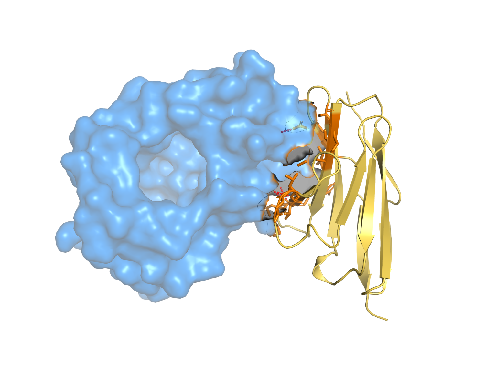

# Ch.04 — 기본 사용법

환경도 갖췄으니 이제 본격적으로 BoltzGen을 **돌려볼** 차례입니다. 이 챕터에서는 `boltzgen run`의 구조를 뜯어보고, 어떤 옵션을 어떻게 조절해야 원하는 결과가 나오는지 그 **전략**을 깊이 있게 다뤄보겠습니다.

기초에서는 "명령어 한 줄 넣고 기다린다"였다면, 여기서는 "왜 이 옵션을 이 값으로 줘야 하는가"를 이해하는 것이 목표입니다.

> **실습 — `04_run_pipeline.ipynb`** · ① 스모크 실행(6스텝) → ② 내 출력물 해부 · **분석 셀 5초**
>
> 실행 명령·옵션 전략을 짚은 뒤, `--num_designs 4 --budget 2` 스모크 실행(**약 5분**)으로 `my_run/`에 6스텝 출력물을 직접 만들고 그 구조를 해부합니다. GPU 런타임이 없거나 설계를 건너뛰면 커밋된 vanilla 레퍼런스(`05_result_interpretation/data/vanilla`)로 폴백해 그대로 이어집니다.

---

## 4.1 `boltzgen run` 명령의 구조

기본 형태는 다음과 같습니다.

```bash
boltzgen run <설계명세.yaml> \
  --output <출력디렉토리> \
  --protocol <프로토콜> \
  --num_designs <중간 디자인 수> \
  --budget <최종 선별 수>
```

실제 예시(우리가 돌린 그대로).

```bash
boltzgen run example/vanilla_protein/1g13prot.yaml \
  --output workbench/vanilla_gt \
  --protocol protein-anything \
  --num_designs 4 \
  --budget 2
```

각 인자의 의미.

| 인자 | 의미 |
|------|------|
| `1g13prot.yaml` | 무엇을 만들지 — 설계 명세(Ch.02) |
| `--output` | 결과를 저장할 폴더 |
| `--protocol` | 어떤 종류의 설계인지(Ch.01의 6종) — 내부 설정을 통째로 결정 |
| `--num_designs` | 생성할 **중간 디자인 수**(분포에서 뽑는 표본 수) |
| `--budget` | 그중 최종적으로 **다양성까지 고려해 선별**할 수 |

내부적으로 `boltzgen run`은 두 일을 순서대로 합니다. **① configure**(프로토콜에 맞는 스텝별 설정 파일 생성) → **② execute**(스텝 순차 실행). 그래서 출력 폴더에 `config/`와 `steps.yaml`이 먼저 만들어지고, 그다음 각 스텝이 돌아갑니다.

---

## 4.2 6스텝 파이프라인 — 실제로 무슨 일이 일어나나

`protein-anything` 기준으로 실행하면 로그에 이렇게 찍힙니다(우리 실측).

```
[1] design                   213.7s  (예시; 규모에 따라 다름)
[2] inverse_folding         
[3] folding                 
[4] design_folding          
[5] analysis                
[6] filtering               
```

각 단계가 무엇을 만드는지(Ch.01 복습 + 실제 산출물).

1. **design** — 타깃에 맞는 백본을 `num_designs`개 생성. → `intermediate_designs/*.cif`(+ `*.npz`)
2. **inverse_folding** — 각 백본에 서열을 채움. → `intermediate_designs_inverse_folded/*.cif`
3. **folding** — Boltz-2로 바인더+타깃 재접힘. → `.../refold_cif/*.cif` (분석의 핵심 입력)
4. **design_folding** — 바인더 단독 재접힘. → `.../refold_design_cif/*.cif` (펩타이드/나노바디/항체는 생략 → 5스텝)
5. **analysis** — 메트릭 계산. → `aggregate_metrics_analyze.csv`, `per_target_metrics_analyze.csv`
6. **filtering** — 하드필터 + 다양성 선택. → `final_ranked_designs/...`

> 심화 — 소분자 프로토콜(`protein-small_molecule`)은 design_folding 다음에 **affinity** 스텝이 끼어들어 **7스텝**이 됩니다(Ch.10). 즉 스텝 수는 프로토콜이 결정합니다. 펩타이드/나노바디/항체 5, 단백질 6, 소분자 7.

---

## 4.3 핵심 옵션 전략 (1): `--num_designs`와 `--budget`

이 두 값이 **결과 품질과 실행 시간을 가장 크게 좌우**합니다. 원리부터 이해하고 가겠습니다.

### `--num_designs` — 많이 뽑을수록 좋은 꼬리를 만난다

BoltzGen은 확률 분포에서 표본을 뽑는 것이라고 했습니다(Ch.01). 좋은 바인더는 분포의 "좋은 꼬리"에 있습니다. 표본을 많이 뽑을수록 그 꼬리를 만날 확률이 올라갑니다.

직관적으로, "적어도 하나는 좋은 디자인"을 얻을 확률은 표본 수 $N$에 대해

$$
P(\ge 1\text{ good}) = 1 - (1-p)^N
$$

처럼 증가합니다($p$는 한 표본이 좋은 디자인일 확률). $p$가 작아도 $N$을 키우면 성공 확률이 1에 가까워집니다. 그래서 **어려운 타깃일수록 `num_designs`를 크게** 가져갑니다.

| 상황 | 권장 `num_designs` |
|------|-------------------|
| 빠른 테스트 / 환경 검증 | 4 ~ 100 |
| 일반 설계 | 1,000 ~ 5,000 |
| 어려운 타깃 / 복잡한 제약 | 10,000 ~ 60,000 |

> 주의 — `num_designs`를 키우면 시간·계산도 비례해 늘어납니다. 그래서 보통 **작게 테스트 → 크게 프로덕션**의 2단계로 갑니다. 처음부터 60,000개를 돌리지 마십시오.

> **함정 — `num_designs` 100이 메모리 분기점입니다.** `--diffusion_batch_size`를 지정하지 않으면 BoltzGen이 **`num_designs` 100 미만이면 1, 100 이상이면 10**으로 자동 결정합니다. 즉 99개에서 100개로 늘리는 순간 백본을 10개씩 동시 생성하면서 메모리 사용량이 확 뜁니다. 메모리가 빠듯하면 `--diffusion_batch_size 1`을 명시하십시오. 대신 배치가 작으면 그만큼 느립니다(메모리 ↔ 속도 트레이드오프, Ch.03의 3.1.5).

### `--budget` — 다양성까지 고려한 최종 선별 수

`num_designs`로 수천~수만 개를 만든 뒤, 그중 **실제로 실험·검토할 후보 수**가 `budget`입니다. 단순히 점수 상위 N개를 뽑는 것이 아니라, **서로 다른 전략의 디자인을 골고루** 뽑습니다(다양성 선택; 4.5와 Ch.05에서 상세). 보통 50~200 사이를 씁니다.

> 심화 — 왜 다양성이 중요한가? 점수 1~3등이 거의 똑같은 서열이면, 하나가 실험에서 실패하면 셋 다 실패할 가능성이 큽니다. 반면 서로 다른 결합 전략 3개면, 하나가 실패해도 다른 것이 살 가능성이 있습니다. **실험 성공 확률을 높이는 보험**입니다.

---

## 4.4 핵심 옵션 전략 (2): `--steps`로 부분 실행

파이프라인 전체를 매번 처음부터 돌릴 필요는 없습니다. `--steps`로 **원하는 단계만** 실행할 수 있습니다.

```bash
# design과 inverse_folding만
boltzgen run spec.yaml --output out --steps design inverse_folding

# 분석이 끝난 결과에서 필터링만 다시 (선택 기준 튜닝용 — 몇 초!)
boltzgen run spec.yaml --output out --steps filtering
```

사용 가능한 스텝: `design`, `inverse_folding`, `design_folding`, `folding`, `affinity`, `analysis`, `filtering`.

> 심화 — 가장 자주 쓰는 패턴은 "**무거운 단계는 한 번만, 필터링은 여러 번**" 입니다. design~analysis는 시간이 오래 걸리지만 한 번만 하면 되고, `filtering`은 몇 초라 선택 기준(`--budget`, `--metrics_override`, `--additional_filters`)을 바꿔가며 반복할 수 있습니다. 이것이 Ch.06 자동화의 핵심 레버입니다.

---

## 4.5 핵심 옵션 전략 (3): `--config`로 스텝별 세부 제어

각 스텝의 내부 설정을 `--config <스텝명> 키=값`으로 덮어쓸 수 있습니다. 고급 사용자를 위한 강력한 노브입니다.

```bash
# folding 스텝의 워커 수·디바이스 수 조정
boltzgen run spec.yaml --output out \
  --config folding num_workers=4 trainer.devices=2
```

그 외 자주 쓰는 실행 제어 옵션.

| 옵션 | 용도 |
|------|------|
| `--devices N` | 사용할 GPU 수 |
| `--num_workers N` | 데이터로더 워커 수 |
| `--use_kernels {auto,true,false}` | CUDA 가속 커널 사용(기본 auto) |
| `--reuse` | 기존 결과 재사용, 부족한 것만 추가 생성 |
| `--diffusion_batch_size N` | 디자인 배치 크기(길이 다양성에 영향 — Ch.01) |
| `--inverse_fold_num_sequences N` | 백본당 서열 수 |
| `--inverse_fold_avoid 'KEC'` | 특정 잔기 금지 |

---

## 4.6 출력 구조 완전 해부

먼저 최종 산출물이 어떻게 생겼는지 보겠습니다. 디자인된 바인더(금색)가 타깃(파랑)에 결합한 **3D 복합체**입니다.



*BoltzGen이 만든 최종 디자인 1개의 실제 구조(vanilla 단백질 바인더 + 타깃). 이런 복합체가 `--budget`개만큼 나옵니다. (렌더링 레시피: `../FIGURE_PLAN.md`)*

그리고 `--output` 폴더에는 이런 **파일 구조**가 생깁니다(우리 실측 트리 그대로).

```
results/                                   # = --output
├── config/                                # 스텝별 설정 yaml (6~7개)
├── steps.yaml                             # 실행된 스텝 매니페스트
├── <name>.cif                             # 설계 명세 시각화
│
├── intermediate_designs/                  # [design] 백본
│   ├── <name>_0.cif ... _N.cif            #   디자인된 백본
│   └── <name>_0.npz ...                   #   메타데이터(NPZ)
│
├── intermediate_designs_inverse_folded/   # [inverse_folding/folding/analysis]
│   ├── <name>_*.cif, *.npz
│   ├── refold_cif/                        #   재접힘 복합체 (분석·시각화의 진짜 입력!)
│   ├── refold_design_cif/                 #   바인더 단독 재접힘
│   ├── aggregate_metrics_analyze.csv
│   └── per_target_metrics_analyze.csv
│
└── final_ranked_designs/                  # [filtering] 최종 결과
    ├── final_<budget>_designs/            #   최종 선별셋
    │   ├── rank1_<name>_K.cif ...          #     순위별 CIF (서열+구조 포함)
    │   └── before_refolding/
    ├── all_designs_metrics.csv            #   전체 디자인 메트릭
    ├── final_designs_metrics_<budget>.csv #   최종 선별셋 메트릭
    └── results_overview.pdf               #   요약 시각화 PDF
```

꼭 기억할 세 가지.

- **최종 디자인**은 `final_ranked_designs/final_<budget>_designs/rankN_<name>_K.cif`입니다. 폴더가 아니라 **순위 붙은 단일 CIF 파일**이고, 서열·구조가 그 안에 다 들어 있습니다. (`summary.csv`, 디자인별 `rank_001/` 폴더, 별도 `sequence.fasta`/`metrics.json` 같은 것은 **생기지 않습니다.** 흔한 오해입니다.)
- **메트릭**은 `final_designs_metrics_<budget>.csv`(최종셋)와 `all_designs_metrics.csv`(전체)에 들어 있습니다. 한 디자인이 한 행, 컬럼은 240여 개입니다(Ch.05).
- **시각화·인터페이스 분석**은 반드시 `refold_cif/`(또는 최종 CIF) 기준. inverse_folded 직후 파일은 측쇄가 원점에 뭉쳐 있습니다(Ch.01).

> 주의 — 실행 로그는 표준출력으로 나옵니다. 출력 폴더에 `run.log`가 자동 생성되지는 않으니, 따로 추적하려면 `boltzgen run ... > run.log 2>&1`처럼 직접 리다이렉트하십시오.

---

## 4.7 프로토콜별 실행 예시

같은 `boltzgen run`이라도 프로토콜에 따라 명령과 결과가 달라집니다. 대표 3종을 미리 맛보기로(자세한 실습은 Part B).

**단백질–단백질 바인더** (Ch.01의 기본).
```bash
boltzgen run example/vanilla_protein/1g13prot.yaml \
  --output out/protein --protocol protein-anything --num_designs 1000 --budget 50
```

**고리형 펩타이드** (Cys 자동 금지, design_folding 생략 → Ch.07).
```bash
boltzgen run example/cyclotide/3ivq.yaml \
  --output out/peptide --protocol peptide-anything --num_designs 1000 --budget 30
```

**소분자 결합 + 친화도** (affinity 스텝 추가 → Ch.10).
```bash
boltzgen run example/protein_binding_small_molecule/chorismite.yaml \
  --output out/sm --protocol protein-small_molecule --num_designs 3000 --budget 40
```

> 심화 — 소분자는 결합부위가 까다로워 더 많은 디자인(3,000+)을 권장하고, 펩타이드는 작아서 상대적으로 적게도 괜찮습니다. 타깃 난이도에 맞춰 `num_designs`를 조절하는 감각을 길러두십시오.

> **위 세 예시는 프로덕션 규모입니다.** 학습·검증 단계에서는 `--num_designs`를 **4~30**으로 줄여 돌리십시오(Colab 무료 T4 런타임이 딱 이 규모입니다). Part B의 각 실습 챕터는 30~100개 규모로 돌린 결과를 쓰고, 그 결과가 `data/`에 커밋돼 있어서 **설계를 건너뛰어도 분석 실습은 그대로 이어집니다.**

> **함정 — 한 스텝이 갑자기 죽는 경우가 있습니다.** 저희가 준비하면서 `design_folding` 단계가 `SIGSEGV`로 한 번 죽었습니다(같은 명령을 다시 돌리니 멀쩡히 끝났으니, 규모 때문이 아니라 간헐적인 문제입니다). **이럴 땐 같은 명령을 같은 `--output` 폴더로 다시 실행하십시오.** 이미 만들어진 산출물을 재사용해 이어서 끝냅니다. 실측으로 `num_designs 16` 기준 신규 실행이 **763초**, 중단 후 재개가 **486초**였습니다. 그래서 큰 작업일수록 `--output`을 고정해 두는 것이 안전합니다.

---

## 4.8 실행 모니터링

오래 걸리는 작업은 진행 상황을 봐야 안심이 됩니다.

```bash
# 다른 터미널에서 GPU 사용량
watch -n 1 nvidia-smi

# 로그 추적 (리다이렉트했다면)
tail -f run.log
```

로그에서 각 스텝이 `Pipeline step k of N` → ` Step ... completed successfully in Xs`로 찍히는지 보면 됩니다. 특정 스텝에서 멈추거나 `Traceback`이 나오면, 그 스텝의 오류 메시지를 위로 스크롤해 확인하십시오(예: design에서 `undefined symbol`이면 Ch.03 cuBLAS 문제).

---

### 이 챕터 핵심 요약

1. `boltzgen run`은 내부적으로 **configure → execute**, `protein-anything` 기준 6스텝(소분자 7, 펩타이드/나노바디/항체 5)입니다.
2. **`--num_designs`(많이 뽑아 좋은 꼬리)**와 **`--budget`(다양성 선별)**이 품질·시간의 핵심. 작게 테스트 → 크게 프로덕션.
3. **`--steps`로 부분 실행** — 무거운 단계는 한 번, `filtering`은 여러 번 반복(선택 기준 튜닝).
4. **`--config`로 스텝 내부 제어** — 워커·디바이스·배치 등 고급 노브.
5. 최종 디자인은 `final_<budget>_designs/rankN_*.cif`, 메트릭은 `*_metrics_*.csv`. **분석은 `refold_cif` 기준**.

다음 → **[05. 결과 해석](../05_result_interpretation/05_result_interpretation.md)**
