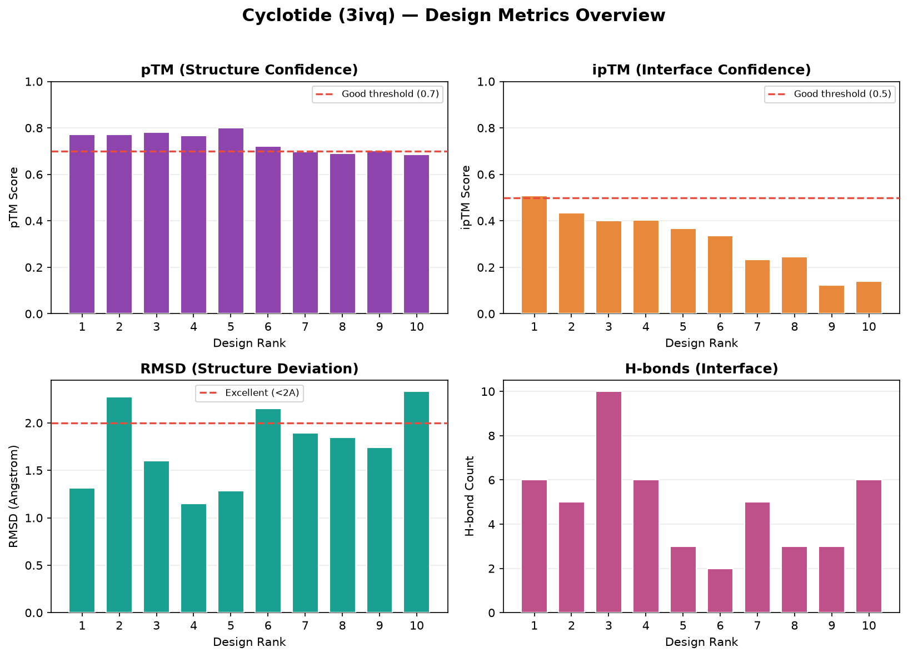
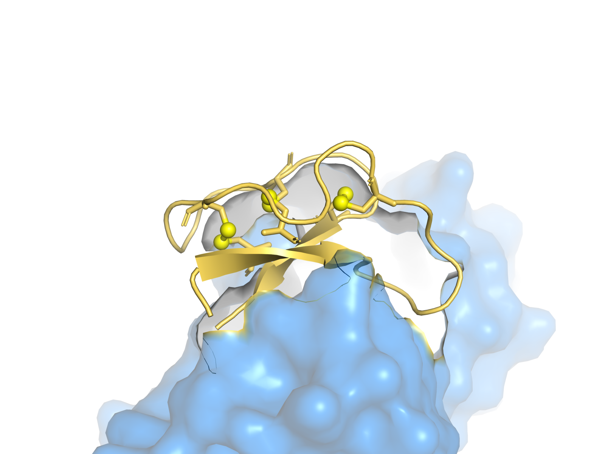

# Ch.07 — 실습: 펩타이드·고리형 펩타이드 설계

Part B에 오신 걸 환영해요! 여기서부터는 **타깃 타입별 실전 설계**를 직접 해봐요. 첫 주자는 펩타이드, 그중에서도 BoltzGen의 표현력이 가장 빛나는 **고리형(cyclic)·이황화(disulfide) 펩타이드**예요.

이 챕터는 실제로 우리가 돌린 **cyclotide(3ivq 타깃, 34아미노산 고리형 펩타이드) 결과**를 그래프와 함께 해석해요.

> **실습 — `07_peptide_lab.ipynb`** · ① 직접 설계 실행 → ② 내 결과 확인 → ③ 레퍼런스 대조 · **분석 셀 7초**
>
> 내가 돌린 결과(건너뛰면 `data/cyclotide`)로 메트릭 그래프 · **34aa·Cys 6개 보존 검증** · 최종 CIF에서 **disulfide(SG–SG) 거리 측정(gemmi)** 까지 직접 해봅니다.

---

## 7.1 왜 펩타이드인가

펩타이드는 단백질보다 작아요(보통 수십 아미노산). 그래서 장점이 뚜렷해요.

| 특성 | 단백질 | 펩타이드 |
|------|--------|----------|
| 크기 | 수백 잔기 | 수십 잔기 |
| 합성 | 어렵고 비쌈(세포 발현) | 화학 합성(SPPS) 가능, 상대적 저렴 |
| 경구 투여 | 거의 불가 | 고리형은 일부 가능 |
| 안정성 | 변수 | 제약(고리·이황화)으로 크게 향상 |

실제 펩타이드 약물도 많아요. 인슐린(51잔기, 이황화 2개), 비만 치료제 GLP-1 작용제, 면역억제제 cyclosporine(고리형) 등. 즉 **작지만 제대로 제약을 걸면 강력한** 분자예요.

---

## 7.2 `peptide-anything` 프로토콜의 특성

Ch.01에서 봤듯, 펩타이드는 전용 프로토콜을 써요. 내부적으로 두 가지가 다르다는 걸 꼭 기억하세요.

- **inverse folding에서 시스테인(C) 자동 금지** — 단, 우리가 `constraints`로 명시한 이황화용 Cys는 별개로 배치돼요. 자유 Cys로 인한 잘못된 이황화/응집을 막는 거예요.
- **design_folding 생략 → 5단계** — 펩타이드는 타깃 의존적이라 단독 폴딩이 의미가 약해요.

```bash
boltzgen run example/cyclotide/3ivq.yaml \
  --output workbench/cyclotide --protocol peptide-anything \
  --num_designs 100 --budget 10
```

> **직접 돌려보려면** — 위 명령이 이 챕터의 실측 결과(7.8)를 만든 그 명령이에요(cyclotide 복합체 174 토큰). Colab **T4 런타임**에 그대로 붙여 넣으면 되고, 더 빨리 맛보려면 아래처럼 규모를 줄이세요.
>
> ```bash
> boltzgen run example/cyclotide/3ivq.yaml \
>   --output workbench/cyclotide --protocol peptide-anything \
>   --num_designs 8 --budget 4
> ```
>
> **8 designs / budget 4 → 약 10분(실측 585초, 가중치 캐시 기준·최종 4개).** 노트북의 설계 셀도 같은 규모예요.
>
> 규모를 줄이든 이 단계를 건너뛰든 **이어지는 분석·해석은 그대로 따라올 수 있어요.** 노트북은 여러분이 직접 만든 `my_run/`을 먼저 읽고, 설계를 건너뛰었으면 커밋된 `data/cyclotide`(100개 실행 결과) 레퍼런스로 폴백하거든요.

---

## 7.3 고리형 펩타이드 — `cyclic: true`

선형 펩타이드의 가장 큰 약점은 **양 끝(N-말단, C-말단)이 노출**되어 단백질 분해효소(protease)에 쉽게 잘린다는 거예요. 그래서 생체 내 반감기가 짧아요.

고리형은 머리와 꼬리를 이어 **끝이 없게** 만들어요. 그러면.

- 분해효소가 공격할 말단이 없어 **안정성 급상승**
- 구조가 더 단단하게 고정 → **결합 특이성 향상**
- 일부는 **경구 투여**까지 가능

YAML에서는 한 줄이면 돼요.

```yaml
- protein:
    id: B
    sequence: 3C8C6C5C3C1C2
    cyclic: true            # 머리-꼬리 펩타이드 결합 자동 생성
```

`cyclic: true`를 주면 N-말단과 C-말단 사이에 펩타이드 결합이 자동 형성돼요(head-to-tail cyclization).

---

## 7.4 이황화결합 — `constraints` / `bond`

이황화결합(disulfide bond)은 두 시스테인의 황(SG) 원자가 산화되어 만드는 공유결합(-S-S-)이에요. 펩타이드 구조를 **못박아 고정**하는 역할을 해요.

```yaml
constraints:
  - bond:
      atom1: [B, 4, SG]    # chain B, 잔기 4, SG 원자
      atom2: [B, 26, SG]   # 잔기 26의 SG와 연결 → 이황화
```

형식은 `[체인, 잔기번호, 원자이름]`이에요. 이황화 거리의 이상값은 약 **2.0~2.1 Å**예요(결과 검증 시 PyMOL로 측정).

> 심화 — 시스테인을 서열상 너무 멀리(예: `5C20C5`) 두면 이황화가 안 닫힐 수 있어요. 보통 두 Cys 사이 **3~15잔기**가 적당해요. 거리가 8Å처럼 크게 나오면 패턴을 좁히세요(`5C10C5`).

---

## 7.5 Cystine Knot — 자연이 만든 초안정 구조

cyclotide는 식물이 방어용으로 만드는 천연 고리형 펩타이드예요. 핵심은 **3쌍의 이황화결합이 서로 얽혀 매듭(knot)을 이루는** cystine knot 구조예요. 이게 극도로 안정해서 분해효소에 거의 끄떡없어요.

서열 패턴 `3C8C6C5C3C1C2`를 해석하면.

```
3개 + C + 8개 + C + 6개 + C + 5개 + C + 3개 + C + 1개 + C + 2개
= 시스테인 6개, 총 34잔기
```

시스테인 6개가 3쌍의 이황화를 만들고, 고리형까지 더해져 cystine knot이 완성돼요.

```yaml
entities:
  - protein: { id: B, sequence: 3C8C6C5C3C1C2, cyclic: true }
  - file: { path: 3ivq.cif, include: [ { chain: { id: A } } ], structure_groups: "all" }
constraints:
  - bond: { atom1: [B, 4, SG],  atom2: [B, 26, SG] }
  - bond: { atom1: [B, 13, SG], atom2: [B, 30, SG] }
  - bond: { atom1: [B, 20, SG], atom2: [B, 32, SG] }
```

---

## 7.6 2차구조 조건화 — `secondary_structure`

펩타이드가 작아서 구조가 흔들릴 때, 원하는 2차구조를 **강제**할 수 있어요.

```yaml
- protein:
    id: B
    sequence: 1C11..16C1
    secondary_structure:
        sheet: 1,3..11          # 이 잔기들을 beta-sheet로
```

- 평평한 결합면(예: 항체 CDR 틈새)에는 **sheet**가 유리
- 깊은 groove에는 **helix**가 유리

> 심화 — sheet는 최소 3~4잔기 이상이어야 형성돼요. 너무 짧게 지정하면 loop로 끝나요. 또 2차구조는 *선택* 기능이라, 굳이 강제 안 해도 AI가 알아서 최적화해요 — 특정 구조가 결합에 꼭 필요할 때만 쓰세요.

---

## 7.7 결합부위 지정 — 특정 자리만 노리기

Ch.02의 `binding_types`를 펩타이드에 그대로 써요. 예를 들어 타깃의 특정 3잔기(343, 344, 251)에만 결합하는 펩타이드.

```yaml
- file:
    path: target.cif
    include: [ { chain: { id: A } } ]
    binding_types:
      - chain: { id: A, binding: 343,344,251 }
    structure_groups: "all"
```

결과 CSV에서 인터페이스 접촉 잔기를 확인해, 지정한 자리에 실제로 붙었는지 검증하세요.

---

## 7.8 실측 결과 — Cyclotide (3ivq)

자, 실제로 돌린 결과를 보죠. `peptide-anything`, 고리형 + 이황화 3쌍, `3C8C6C5C3C1C2`(34잔기) 설계의 최종 10개 디자인이에요.



실제로 만든 1위 디자인의 구조를 PyMOL로 렌더링하면 이래요.



*설계한 cyclotide(금색)가 타깃(파랑 표면)에 결합한 모습. 노란 구는 이황화결합의 SG(황) 원자, 빨간 점선은 cystine knot을 이루는 3쌍의 이황화(Cys4–26, 13–30, 20–32)예요. 작은 펩타이드가 매듭처럼 단단히 고정된 게 보이죠. (렌더링 레시피: `../FIGURE_PLAN.md`)*

읽는 법.

- **pTM**: 상위 5개가 0.75 이상(최고는 rank 5의 0.799)이고, 하위권은 0.69대까지 내려가요 — 10개 평균 약 0.74. 고리+이황화 덕에 구조 예측이 대체로 안정적이지만, 순위가 내려갈수록 확신도가 떨어지는 게 그대로 보여요.
- **ipTM**: rank 1이 0.508로 최고. 펩타이드 설계에서도 **ipTM·pTM·PAE가 함께 순위를 좌우**해요(이 디자인에선 rank 1이 ipTM도 1위).
- **RMSD**: 모두 3Å 이하, rank 4가 1.15Å로 최저 — 작은 펩타이드인데도 자기일관성이 우수해요.
- **H-bonds**: 2~10개 분포. rank 3이 10개로 최다지만 최종 3위 — H-bond 수만으론 순위가 안 정해진다는 증거예요.

가장 인상적인 건 **모든 디자인이 정확히 34잔기, 시스테인 6개**로 나왔다는 거예요. 즉 우리가 건 `3C8C6C5C3C1C2` + cyclic + 이황화 3쌍 제약을 BoltzGen이 정확히 준수했어요. 자연 cyclotide 크기(29~37잔기)와도 일치하고요.

rank 1 서열 예시: `SGVCTPASPSATCPKEGEPCTPGSDCGENCICDS` (34잔기). Cys 위치(4, 13, 20, 26, 30, 32)가 우리가 정의한 3쌍(Cys4–26, 13–30, 20–32)을 이루며 cystine knot을 형성해요.

---

## 7.9 실험으로 가는 길

34잔기 작은 펩타이드라 **SPPS(고상 펩타이드 합성)**가 용이해요. 합성 후.

1. SPPS로 선형 펩타이드 합성 (약 2주)
2. Native chemical ligation으로 고리화
3. Oxidative folding으로 이황화 3쌍 형성
4. Mass spec + NMR로 구조 검증
5. SPR로 결합 친화도 측정

실험 후보로는 **결합력(ipTM) 최고인 rank 1, 구조 안정성(pTM) 최고인 rank 5, 균형형 rank 4** 정도를 함께 테스트하길 권해요.

---

## PyMOL 검증 (고리형·이황화 확인)

```python
# 최종 디자인 + 타깃 함께 열기 (refold 구조 사용!)
pymol final_ranked_designs/final_10_designs/rank001_3ivq_02.cif

# 이황화결합 거리 측정 (이상값 ~2.0 Å)
distance bond1, //B/4/SG, //B/26/SG
distance bond2, //B/13/SG, //B/30/SG
distance bond3, //B/20/SG, //B/32/SG
# 고리형 연결 (N말단-C말단)
distance cyclic, //B/1/N, //B/34/C
```

---

### 이 챕터 핵심 요약

1. 펩타이드는 작고 합성이 쉽고, **제약(고리·이황화)으로 안정성을 크게** 올릴 수 있어요.
2. `peptide-anything`은 **Cys 자동 금지 + design_folding 생략(5단계)** 가 특징.
3. `cyclic: true`(고리화) + `constraints/bond`(이황화) + 서열 Cys 패턴으로 **cystine knot** 같은 초안정 구조를 만들어요.
4. 실측 cyclotide: 34잔기·Cys 6개 제약을 정확히 준수, **ipTM·pTM·PAE가 핵심**, 자기일관성(RMSD) 우수.
5. 작은 크기라 SPPS 합성·실험 검증이 현실적이에요.

다음 → **[08. 실습: 항체 Fab 설계](../08_antibody_fab/08_antibody_fab.md)**
