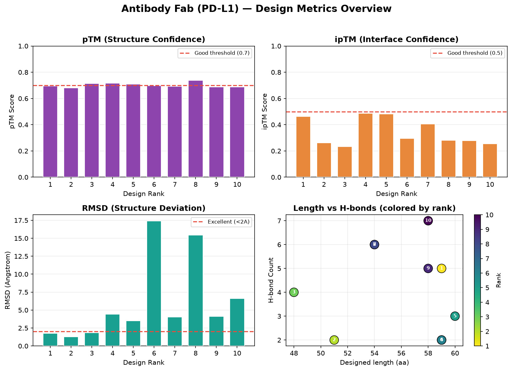
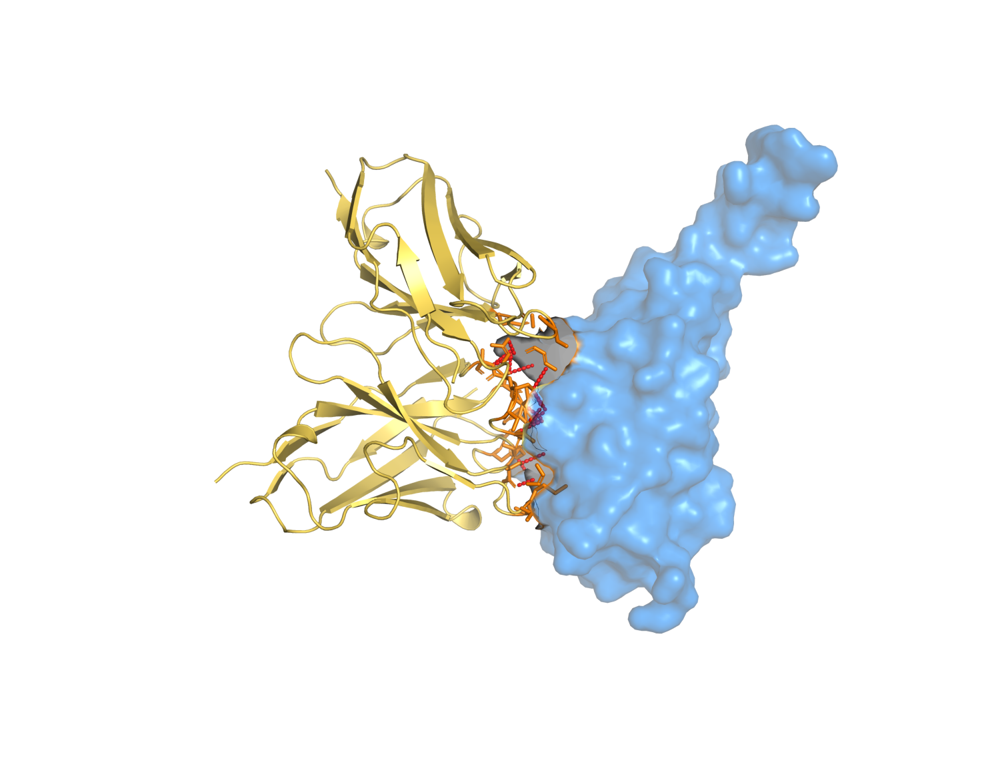

# Ch.08 — 실습: 항체 Fab 설계

이번 실습은 신약 개발에서 가장 중요한 분자 클래스 중 하나, **항체**예요. 정확히는 항체의 결합 단편인 **Fab(Fragment antigen-binding)**를, 실제 임상 항체 골격(scaffold) 위에 **CDR만 새로 설계**해서 만들어볼 거예요.

타깃은 면역항암의 핵심 표적인 **PD-L1**(PDB `7uxq`)이고, scaffold로는 adalimumab(휴미라)·dupilumab·secukinumab 등 **실제 시판 항체 14종**을 써요.

> **실습 — `08_fab_lab.ipynb`** · ① 직접 설계 실행 → ② 내 결과 확인 → ③ 레퍼런스 대조 · **분석 셀 5초**
>
> 내가 돌린 결과(건너뛰면 `data/fab`)로 메트릭·그래프 + developability(liability) 모티프 분포 + **VH/VL framework 보존 검증**(중쇄 `EVQLVE…`/경쇄 `DIQMTQ…`)까지 분석해요.

---

## 8.1 항체와 Fab — 구조부터 이해하기

항체(IgG)는 Y자 모양의 큰 단백질(약 150 kDa)이에요. 그 끝의 **두 팔이 항원에 결합**하는데, 이 팔 부분을 잘라낸 게 **Fab**예요. Fab는 무거운 사슬(heavy chain)과 가벼운 사슬(light chain)의 가변 도메인(VH, VL)으로 이뤄져요.

결합을 실제로 담당하는 건 가변 도메인 끝의 **CDR(Complementarity-Determining Region, 상보성 결정 영역)**이에요. CDR은 H1·H2·H3, L1·L2·L3 여섯 개의 loop인데, 그중 **CDR-H3가 길이·서열이 가장 다양**하고 결합 특이성을 좌우해요.

```
Fab = [ VH ─ CDR(H1,H2,H3) ] + [ VL ─ CDR(L1,L2,L3) ]
        └ framework(고정) ┘  └ CDR(재설계) ┘
```

핵심: **framework는 구조 안정성을 담당(거의 고정)**, **CDR은 항원 결합을 담당(다양하게 변함)**. 그래서 항체 설계 = "검증된 framework는 그대로 두고, CDR만 타깃에 맞게 바꾸기"예요.

---

## 8.2 왜 scaffold 기반 설계인가

완전히 맨땅에서 항체를 설계하는 건 위험해요. 항체는 발현·접힘·안정성이 까다롭거든요. 대신 **이미 임상에서 검증된 항체(framework)를 골격으로 빌려와**, CDR만 새로 디자인하면:

- framework가 검증돼 있어 **발현·안정성이 보장**
- 설계 공간이 좁아져 **빠르고 성공률 높음**
- 사람 항체 기반이라 **면역원성 위험이 낮음**(humanness)

비유하면, 검증된 자동차 섀시(scaffold)를 가져와 **타이어와 핸들(CDR)만 용도에 맞게 교체**하는 거예요. 맨땅에서 차를 설계하는 것보다 훨씬 안전하고 빠르죠.

---

## 8.3 `antibody-anything` 프로토콜

항체 설계는 전용 프로토콜을 써요. 특성은 나노바디와 동일해요(Ch.01).

- **inverse folding에서 Cys 자동 금지** — CDR에 자유 시스테인이 생기면 항체 구조가 꼬여요.
- **design_folding 생략 → 5단계** — CDR은 framework·타깃에 의존적이라 단독 폴딩이 무의미.
- 최대 소수성 패치 미계산.

```bash
boltzgen run example/fab_targets/pdl1.yaml \
  --output workbench/fab --protocol antibody-anything \
  --num_designs 30 --budget 10
```

> **직접 돌려보려면** — 위 명령이 아래 실측 결과(8.7)를 만든 그 명령이에요. Fab 복합체는 이 과정에서 가장 큰 **372 토큰**이지만 folding은 늘 복합체를 하나씩 처리하니, Colab **T4 런타임**에서 그대로 붙여 넣으면 돌아가요. 더 빨리 맛보려면 `--num_designs 8 --budget 4`로 줄이세요 — **약 10분(실측 585초, 최종 4개)** 규모예요. 노트북은 여러분이 만든 `my_run/`을 먼저 읽고, 설계를 건너뛰면 커밋된 `data/fab`(30개) 레퍼런스로 폴백하니 이 단계를 건너뛰어도 됩니다.

---

## 8.4 PD-L1 타깃 + 14종 scaffold 라이브러리

이 실습의 설계 명세(`fab_targets/pdl1.yaml`)는 이렇게 구성돼요.

```yaml
entities:
  - file:                       # 타깃: PD-L1 (7uxq의 A 체인)
      path: 7uxq.cif
      include: [ { chain: { id: A } } ]
  - file:                       # scaffold 라이브러리 14종 (CDR 그래프팅 템플릿)
      path:
        - ../fab_scaffolds/adalimumab.6cr1.yaml   # 휴미라
        - ../fab_scaffolds/dupilumab.6wgb.yaml    # 듀피젠트
        - ../fab_scaffolds/secukinumab.6wio.yaml  # 코센틱스
        - ... (총 14종)
```

> 주의 — Ch.02에서 강조했듯, 타깃 구조 `7uxq.cif`는 레포에 없어서 **RCSB에서 직접 받아야** 해요. 안 받고 돌리면 `FileNotFoundError`로 죽어요.
> ```bash
> curl -sSL -o example/fab_targets/7uxq.cif https://files.rcsb.org/download/7uxq.cif
> ```
> 반면 scaffold 14종의 `.cif`는 레포 `fab_scaffolds/`에 들어 있어요(직접 받을 필요 없음).

### scaffold YAML은 어떻게 생겼나

각 scaffold는 "어디를 고정하고 어디를 재설계할지"를 기술해요(Ch.06의 커스텀 scaffold와 같은 구조).

```yaml
# adalimumab.6cr1.yaml (요약)
path: adalimumab.6cr1.cif
include: [ { chain: { id: H } } ]
design:                          # CDR 영역 재설계
  - chain: { id: H, res_index: 27..38,56..65,99..110 }
not_design:                      # framework 고정
  - chain: { id: H, res_index: 1..26,39..55,66..98,111.. }
design_insertions:               # CDR3 길이 가변
  - insertion: { id: H, res_index: 99, num_residues: 1..12 }
```

> 심화 — 14종 scaffold를 동시에 주는 이유: 각 항체의 **CDR-H3 길이·형태가 달라**, 짧은 CDR3는 평평한 epitope에, 긴 CDR3는 깊은 pocket에 유리해요. BoltzGen이 14종으로 각각 시도하고 **타깃에 가장 잘 맞는 골격을 자동 선택**해요. 즉 "어떤 항체 골격이 PD-L1에 잘 맞을까"를 데이터로 탐색하는 거예요.

---

## 8.5 항체의 숨은 핵심 — Developability (Liability)

항체 설계에서 ipTM만 보면 안 돼요. **"약으로 만들 수 있는가"**, 즉 developability가 항체의 생명이거든요. Ch.05에서 봤듯, 항체/나노바디 프로토콜은 `liability_*` 컬럼군을 제공해요.

| liability 모티프 | 무엇이 문제인가 |
|------------------|-----------------|
| `MetOx` | 메티오닌 산화 → 활성 저하·변질 |
| `TrpOx` | 트립토판 산화 |
| `AspCleave` / `AspBridge` | 아스파르트산 이성질화·절단 → 불안정 |
| `ProtTryp` | 단백분해 효소 절단 부위 노출 |
| `HydroPatch` | 소수성 패치 → 응집(aggregation) 위험 |

종합 지표 `liability_score`가 **낮을수록** 발현·정제·보관이 안정적인, 즉 개발하기 쉬운 후보예요.

> 심화 — 실전 항체 선별 기준: ① ipTM(결합) ② RMSD(자기일관성) ③ **liability_score(개발성)** 를 함께 봐요. 결합은 잘하는데 Met 산화·Asp 절단 위험이 크면, 임상으로 못 가요. 그래서 "결합 + 개발성"을 동시에 만족하는 후보를 골라야 해요. CDR3에 산화되기 쉬운 Met/Trp이 몰려 있지 않은지도 확인하고요.

---

## 8.6 결과에서 무엇을 확인하나

실행이 끝나면(5단계) 메트릭 CSV에서 다음을 봐요.

- **`design_to_target_iptm`** — PD-L1 결합 신뢰도(가장 중요)
- **`design_ptm`, `filter_rmsd`** — Fab 구조 신뢰도·자기일관성
- **`num_design`** — 재설계된 CDR 영역 길이(짧은/긴 CDR 전략 확인)
- **`liability_score`, `liability_*_count`** — 개발성
- **`designed_chain_sequence`** — framework 보존 + CDR3 다양성 확인

> 심화 — framework 보존 확인: 항체 가변 도메인은 보통 `EVQLVESGGGLVQPGGSLRLSCAAS...`처럼 시작해요. 출력 서열의 앞부분(framework)이 scaffold와 거의 동일하면(높은 보존), CDR(중간 loop)만 바뀐 정상적인 그래프팅이 된 거예요. framework가 많이 변했다면 `not_design` 영역을 더 넓혀 고정하세요.

---

## 8.7 실측 결과 — PD-L1 표적 Fab

실제로 `antibody-anything`, num_designs 30, budget 10으로 돌린 최종 10개 디자인이에요. 5단계 파이프라인이 정상 완료됐어요.



1위 디자인의 복합체 구조예요:



*설계한 Fab(금색, VH+VL 두 도메인의 면역글로불린 fold)가 PD-L1(파랑 표면)에 결합한 모습. 주황색이 인터페이스 접촉 잔기예요. CDR 루프가 PD-L1 표면에 닿아 있는 게 보여요.*

최종 선별셋의 실제 수치(상위 5개):

| rank | id | pTM | ipTM | RMSD(Å) | 디자인영역(aa) |
|------|----|-----|------|---------|----------------|
| 1 | pdl1_05 | 0.694 | **0.463** | **1.77** | 59 |
| 2 | pdl1_13 | 0.682 | 0.262 | 1.29 | 51 |
| 3 | pdl1_18 | 0.714 | 0.233 | 1.84 | 48 |
| 4 | pdl1_11 | 0.716 | **0.486** | 4.41 | 59 |
| 5 | pdl1_07 | 0.708 | 0.482 | 3.49 | 60 |

읽는 법과 해석:

- **pTM**: 10개 모두 0.68~0.74로 안정적 — scaffold 기반이라 Fab 골격 구조가 잘 잡혔어요.
- **ipTM**: rank 1이 0.463, rank 4·5도 0.48 전후로 PD-L1 결합 신뢰도가 양호해요. 나노바디(Ch.09)의 0.2대보다 높은데, **항체 scaffold + 더 긴 CDR 영역(48~60aa)**이 넓은 인터페이스를 만든 덕이에요.
- **RMSD**: rank 1·2·3이 2Å 미만으로 우수(자기일관성 좋음). rank 4·5는 ipTM은 높지만 RMSD가 3.5~4.4Å로, **결합력과 구조 안정성의 trade-off**를 보여줘요.
- **디자인 영역(`num_design`)**: 48~60aa — 재설계된 CDR 영역(H1/H2/H3 + 삽입) 길이예요.

종합하면, **rank 1(ipTM 0.463 + RMSD 1.77)** 이 결합력과 구조 안정성을 동시에 갖춘 가장 균형 잡힌 후보예요. rank 4·5는 결합력은 좋지만 RMSD가 높아 추가 검증이 필요하고요.

### Developability(liability) 점검

이 실행의 메트릭 CSV에는 `liability_score`를 비롯한 `liability_*` 컬럼이 실제로 들어 있어요(노트북 `08_fab_lab.ipynb`에서 분석). 항체는 결합력(ipTM)만으로 고르면 안 되고, **liability_score가 낮은(개발성이 좋은)** 후보를 함께 봐야 해요. 예컨대 ipTM이 높아도 CDR에 MetOx·TrpOx·HydroPatch 위반이 몰려 있으면 임상 후보로는 부적합할 수 있어요.

> 심화 — 이 run은 데모용 소규모(num_designs 30)예요. 실전 항체 캠페인은 `num_designs`를 수천 개로 올려, **ipTM 높음 + RMSD 낮음 + liability_score 낮음**을 동시에 만족하는 희귀한 후보를 꼬리에서 건져내요. 규모가 곧 후보 품질이라는 원리(Ch.04)가 항체에서 특히 중요한데, developability라는 추가 제약까지 통과해야 하기 때문이에요.

---

### 이 챕터 핵심 요약

1. 항체 Fab 설계 = **검증된 framework는 고정, CDR(특히 H3)만 타깃에 맞게 재설계**.
2. **scaffold 기반**이라 발현·안정성·humanness가 보장되고 성공률이 높아요. 14종을 동시에 줘서 최적 골격을 자동 탐색.
3. `antibody-anything`은 **Cys 금지 + design_folding 생략(5단계)**.
4. 항체의 생명은 **developability(`liability_*`)** — ipTM·RMSD에 더해 liability_score가 낮은 후보를 골라야 약이 돼요.
5. 타깃 구조(`7uxq.cif`)는 RCSB에서 직접 받고, scaffold cif는 레포에 포함.

다음 → **[09. 실습: 나노바디 설계](../09_nanobody/09_nanobody.md)**
