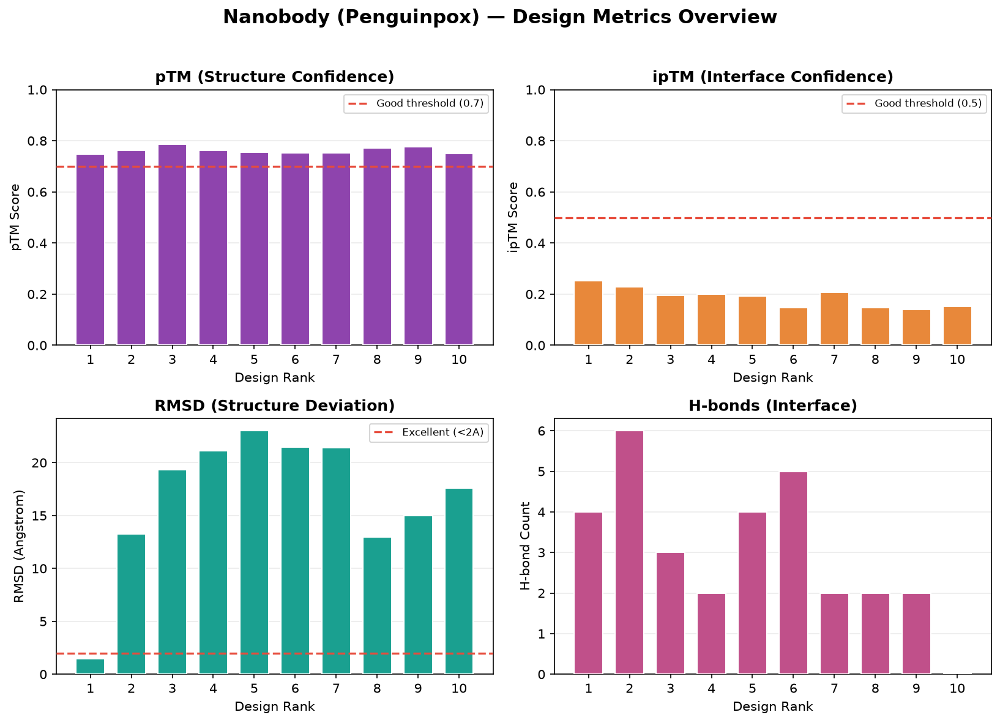
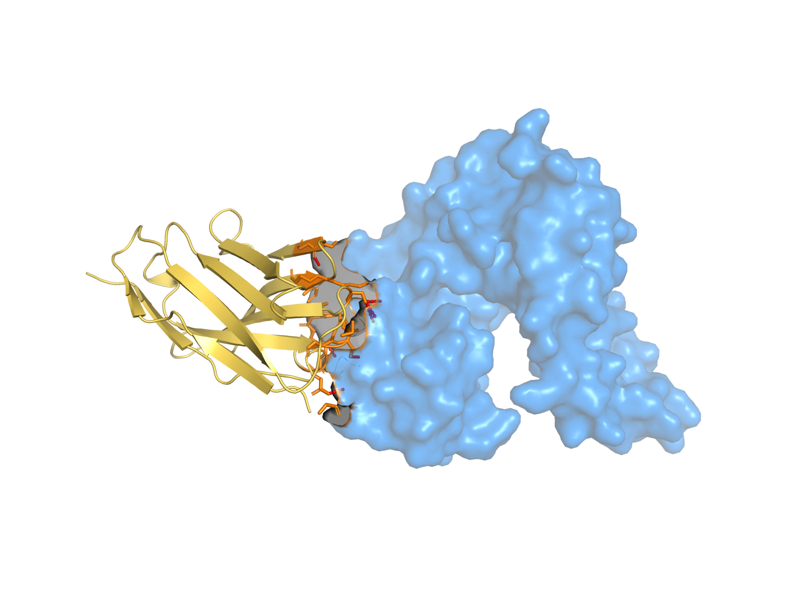

# Ch.09 — 실습: 나노바디 설계

이번엔 요즘 가장 뜨거운 분자, **나노바디(nanobody)**예요. 항체의 1/10 크기인데도 강력해서, 치료·진단·연구 도구로 폭발적으로 쓰이고 있어요. 이 실습에서는 가상의 **penguinpox 바이러스 단백질**(PDB `9bkq`)을 타깃으로, 여러 나노바디 scaffold에 CDR을 그래프팅해 설계해볼 거예요.

> **실습 — `09_nanobody_lab.ipynb`** · ① 직접 설계 실행 → ② 내 결과 확인 → ③ 레퍼런스 대조 · **분석 셀 3초**
>
> 내가 돌린 penguinpox 결과(건너뛰면 `data/nanobody`) 로드 · 메트릭 그래프(H-bond 패널) · **VHH framework(`EVQLVESGGG…`) 보존 검증** · 소표본 caveat 해석.

---

## 9.1 나노바디란 무엇인가

나노바디는 낙타과 동물(낙타·라마·알파카)에서 발견되는 특별한 항체에서 유래해요. 일반 항체가 무거운 사슬 + 가벼운 사슬로 이뤄진 데 반해, 나노바디는 **무거운 사슬의 가변 도메인(VHH) 하나**로만 결합해요. 그래서 훨씬 작고 단순하죠.

| 특성 | 일반 항체(IgG) | 나노바디(VHH) | 이점 |
|------|----------------|---------------|------|
| 크기 | ~150 kDa | ~15 kDa | 조직 침투 우수 |
| 안정성 | 중간 | 매우 높음 | 상온 보관, 극한 조건 견딤 |
| 생산 | 포유류 세포 | 대장균 가능 | 비용 1/10 수준 |
| 접근성 | 표면 epitope | 좁은 틈·숨은 epitope도 | 항체가 못 가는 곳 |
| 개발 기간 | 2~3년 | 6~12개월 | 빠른 개발 |

실제로 caplacizumab(혈전성 질환 치료제)이 FDA 승인을 받았고, COVID-19 중화 나노바디, 암 표적, 진단 시약 등으로 활발히 쓰여요. **작지만 강력한** 분자죠.

---

## 9.2 항체 Fab vs 나노바디 — 무엇이 다른가

Ch.08의 Fab와 비교하면 핵심 차이가 보여요.

- **사슬 수**: Fab는 VH+VL 두 사슬, 나노바디는 VHH 한 사슬.
- **CDR 수**: 나노바디도 CDR1/2/3을 갖지만, 한 도메인 안에 있어 설계가 단순해요.
- **CDR-H3 길이**: 나노바디는 CDR3가 유난히 길고 다양해서(때로 20잔기 이상), **깊은 pocket·좁은 틈**에 잘 들어가요.

프로토콜은 `nanobody-anything`이고, 내부 설정은 `antibody-anything`과 동일해요(Cys 자동 금지, design_folding 생략 → **5단계**).

```bash
boltzgen run example/nanobody_against_penguinpox/penguinpox.yaml \
  --output workbench/nanobody --protocol nanobody-anything \
  --num_designs 30 --budget 10
```

> **직접 돌려보려면** — 이 명령이 아래 실측 결과(9.6)를 만든 그 명령이에요(복합체 317~340 토큰). Colab **T4 런타임**에 그대로 붙여 넣으면 되고, 더 빨리 맛보려면 `--num_designs 8 --budget 4`로 줄이세요 — **약 10분(실측 585초, 최종 4개)** 규모예요. 노트북은 여러분이 만든 `my_run/`을 먼저 읽고, 설계를 건너뛰면 커밋된 `data/nanobody`(30개) 레퍼런스로 폴백하니 이 단계를 건너뛰어도 학습에 지장 없어요.

---

## 9.3 Scaffold 다중 그래프팅

나노바디 설계도 항체처럼 **검증된 골격(scaffold)에 CDR만 그래프팅**해요. penguinpox 예제는 5종의 나노바디 scaffold를 함께 줘요.

```yaml
entities:
  - file:                       # 타깃: penguinpox 단백질 (9bkq의 B 체인)
      path: 9bkq-assembly2.cif
      include: [ { chain: { id: B } } ]
  - file:                       # 나노바디 scaffold 5종
      path:
        - ../nanobody_scaffolds/7eow.yaml         # caplacizumab
        - ../nanobody_scaffolds/7xl0.yaml         # vobarilizumab
        - ../nanobody_scaffolds/gontivimab.yaml
        - ../nanobody_scaffolds/isecarosmab.yaml
        - ../nanobody_scaffolds/sonelokimab.yaml
```

> `example/nanobody_scaffolds/` 폴더에는 `8coh.yaml`(gefurulimab)·`8z8v.yaml`(ozoralizumab)도 들어 있지만, penguinpox 예제는 위 5종만 참조해요. 다른 scaffold를 쓰고 싶으면 `path` 목록에 추가하면 돼요.

각 scaffold YAML은 CDR 영역(`design`)과 framework(`not_design`)를 나누고, CDR3 길이를 가변(`design_insertions`)으로 둬요.

```yaml
# 7eow.yaml (caplacizumab, 요약)
path: 7eow.cif
include: [ { chain: { id: B } } ]
design:                                       # CDR1/2/3 재설계
  - chain: { id: B, res_index: 26..34,52..59,98..118 }
structure_groups:
  - group: { id: B, visibility: 2 }                              # 골격 구조 유지
  - group: { id: B, visibility: 0, res_index: 26..34,52..59,98..118 }  # CDR은 자유
design_insertions:                            # CDR3 길이 다양화
  - insertion: { id: B, res_index: 98, num_residues: 1..14 }
reset_res_index:
  - chain: { id: B }
```

> 심화 — 5종 scaffold는 CDR3 길이·형태가 서로 달라요. BoltzGen이 각 골격으로 설계를 시도하고 **타깃 epitope에 가장 잘 맞는 골격을 자동 선택**해요. 짧은 CDR3(평평한 표면)부터 긴 CDR3(깊은 pocket)까지 다양하게 대응하니, 타깃 형태를 모를 때 특히 유리해요.

---

## 9.4 결과 메트릭 — 무엇을 보나

나노바디는 항체와 같은 메트릭군을 봐요(Ch.05·Ch.08).

- **`design_to_target_iptm`(ipTM)** — 타깃 결합 신뢰도. **나노바디 순위를 좌우하는 핵심 지표**(ipTM·pTM·PAE 종합).
- **`design_ptm`, `filter_rmsd`** — 구조 신뢰도·자기일관성.
- **`num_design`** — 재설계된 CDR 영역 길이(=디자인 영역). 출력 CSV의 이 컬럼이 "CDR 영역이 얼마나 길게 설계됐나"를 알려줘요.
- **`liability_*`** — developability(개발성). 나노바디도 약·시약으로 만들려면 산화·절단·응집 위험이 낮아야 해요.

> 주의 — 흔한 오해: "CDR3 길이"는 BoltzGen이 직접 내놓는 출력 컬럼이 **아니에요**. 재디자인 영역 길이는 `num_design`으로, 순수 CDR3 길이는 **출력 서열에서 직접 세야** 해요. Framework Identity나 Humanness Score도 BoltzGen 출력 컬럼이 아니라, 필요하면 서열을 원본 scaffold와 정렬해 직접 계산하는 값이에요.

---

## 9.5 Framework 보존 확인 — 정상 그래프팅의 증거

나노바디(VHH)의 framework는 매우 보존적이에요. 실제 우리 실측에서 rank 1 서열이 이렇게 시작했어요:

```
EVQLVESGGGLVQPGGSLRLSCAAS... (framework, 거의 고정)
   ...CDR1...   ...CDR2...   ...CDR3(가장 다양)...   ...WGQGTQVTVSS (framework)
```

`EVQLVESGGGLVQPG`로 시작하는 이 패턴은 나노바디의 전형적인 framework예요. **출력 서열의 앞·뒤(framework)가 scaffold와 거의 같고, 중간 CDR loop만 다양하게 바뀌면** 정상적인 CDR 그래프팅이 된 거예요. 만약 framework가 많이 변했다면 `not_design` 영역을 넓혀 더 고정하세요.

> 심화 — 실측에서 5개 디자인의 framework는 95% 이상 보존됐고(`EVQLVESGGGLVQPG` 100% 동일), CDR3만 서열·길이가 완전히 달랐어요(7~26잔기). 이 "고정된 골격 + 다양한 CDR3" 패턴이 바로 scaffold 그래프팅이 잘 작동했다는 신호예요.

---

## 9.6 실측 결과 — Penguinpox 나노바디

실제로 `nanobody-anything`, num_designs 30, budget 10으로 돌린 최종 10개 디자인이에요. 5단계 파이프라인이 정상 완료됐어요.



1위 디자인의 복합체 구조예요:



*설계한 나노바디(금색, 단일 VHH 도메인)가 penguinpox 타깃(파랑 표면)에 결합한 모습. 항체 Fab보다 훨씬 작은 단일 도메인으로 결합하는 게 보여요.*

최종 선별셋의 실제 수치(상위 5개):

| rank | id | pTM | ipTM | RMSD(Å) | H-bond | CDR영역(aa) |
|------|----|-----|------|---------|--------|-------------|
| 1 | penguinpox_07 | 0.747 | **0.252** | **1.43** | 4 | 28 |
| 2 | penguinpox_29 | 0.761 | 0.228 | 13.25 | 6 | 36 |
| 3 | penguinpox_06 | 0.785 | 0.195 | 19.31 | 3 | 29 |
| 4 | penguinpox_15 | 0.761 | 0.200 | 21.11 | 2 | 31 |
| 5 | penguinpox_14 | 0.754 | 0.193 | 23.02 | 4 | 44 |

읽는 법과 솔직한 해석:

- **pTM**: 10개 모두 0.74~0.79로 양호해요. scaffold 기반이라 **나노바디 골격 구조는 안정적으로 예측**됐다는 뜻이에요.
- **ipTM**: rank 1이 0.252로 최고이고, 나머지는 0.14~0.23이에요. **rank 1이 ipTM도 1위 → 최종 1위**로 이어졌어요(순위는 ipTM·pTM·PAE 종합이지만, ipTM이 특히 크게 작용).
- **RMSD**: rank 1만 1.43Å로 우수하고, 2~5위는 13~23Å로 높아요.
- **CDR 영역(`num_design`)**: 28~44잔기로 다양 — 5종 scaffold의 CDR3 길이 차이가 반영됐어요.

> 심화 — **왜 ipTM이 0.2대로 낮고 RMSD가 높을까요?** 이건 실패가 아니라 **교육적 포인트**예요. 우리는 데모를 위해 `num_designs 30`이라는 아주 작은 표본만 뽑았어요. Ch.04에서 배웠듯, 좋은 디자인은 분포의 "좋은 꼬리"에 있고 그걸 만나려면 표본을 많이 뽑아야 해요. penguinpox는 어려운 타깃이라, 실전이라면 `num_designs`를 **2,000~10,000**으로 올려야 ipTM 0.5+ 후보가 꼬리에서 나와요(기초 5부작의 100-design 런에서는 rank 1 ipTM이 0.5를 넘었어요). 즉 이 결과는 **"규모가 품질을 만든다"는 원리를 직접 보여주는 사례**예요. 그럼에도 rank 1처럼 ipTM·RMSD가 동시에 괜찮은 후보가 적은 표본에서도 나온다는 점은 고무적이고요.

---

## 9.7 실험으로 가는 길

나노바디는 작아서 **대장균에서 손쉽게 발현·정제**돼요(항체보다 훨씬 저렴·빠름). 상위 후보를:

1. 대장균 발현 → His-tag 정제 (수일)
2. SPR/BLI로 결합 친화도 측정
3. (치료용이면) developability·면역원성 추가 평가
4. 세포·동물 모델에서 기능 검증

실험 후보는 **ipTM 최고(결합력) + liability_score 낮음(개발성) + RMSD 낮음(구조)** 을 함께 만족하는 것을 우선하세요.

---

### 이 챕터 핵심 요약

1. 나노바디(VHH)는 **항체 1/10 크기, 단일 도메인**으로 안정·저비용·좁은 epitope 접근에 강해요.
2. `nanobody-anything`은 `antibody-anything`과 동일 설정(**Cys 금지 + design_folding 생략 → 5단계**).
3. 여러 scaffold(CDR3 길이 다양)를 동시에 줘 **최적 골격 자동 선택**.
4. **ipTM이 순위의 핵심 지표**(pTM·PAE와 종합), framework 보존(`EVQLVESGGG...`) 확인이 정상 그래프팅의 증거, **liability로 개발성** 점검.
5. `num_design`이 재디자인 CDR 영역 길이 — "CDR3 길이"는 별도 출력 컬럼이 아님(서열에서 직접 셈).

다음 → **[10. 실습: 소분자 결합 단백질·친화도](../10_small_molecule/10_small_molecule.md)**
