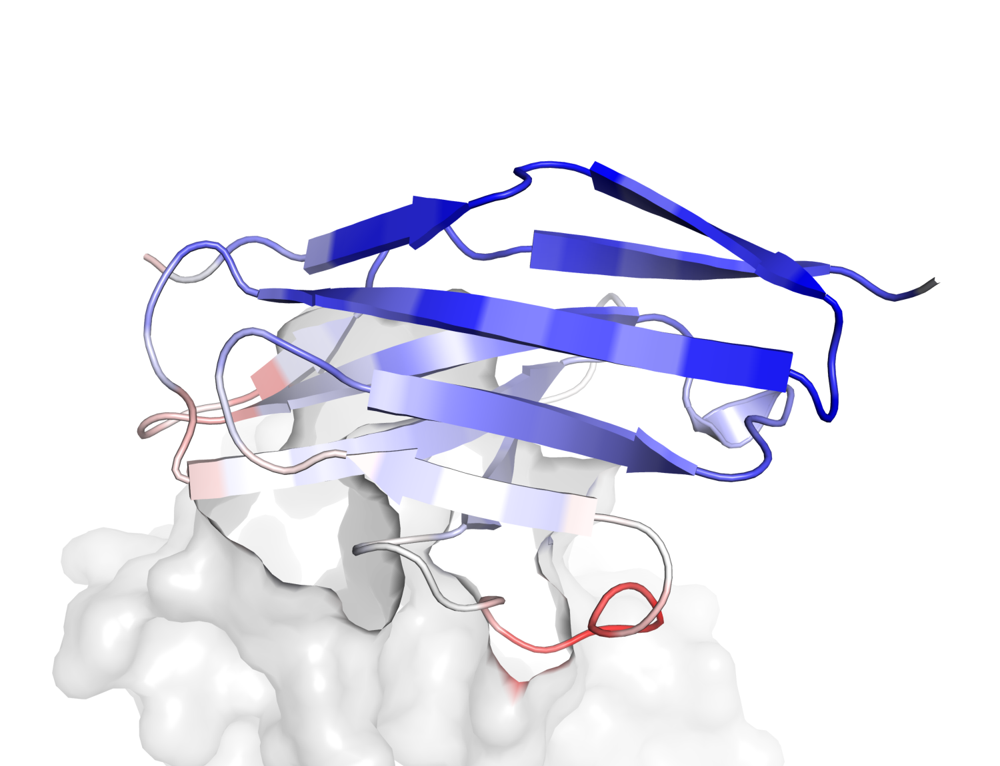
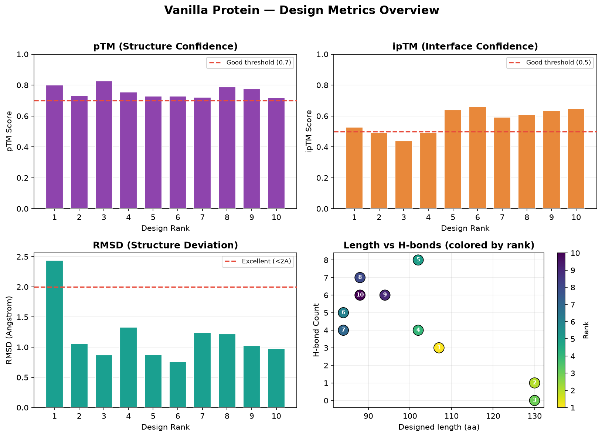
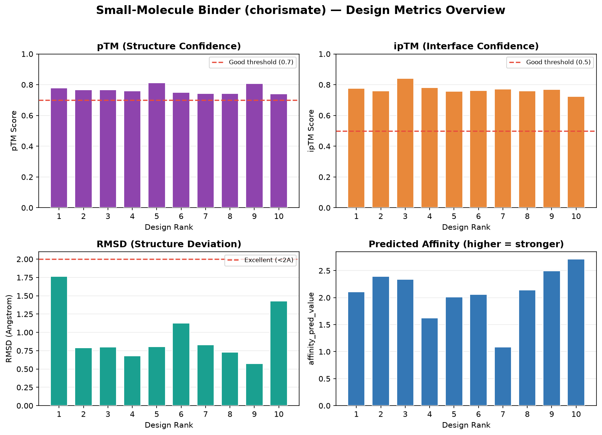
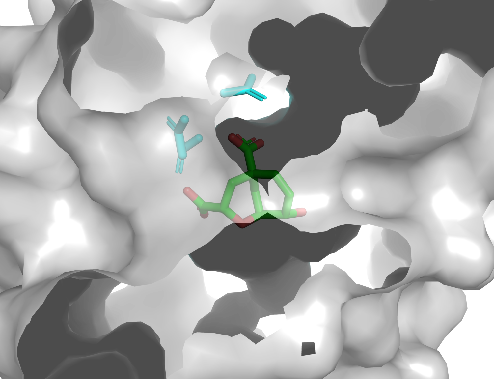
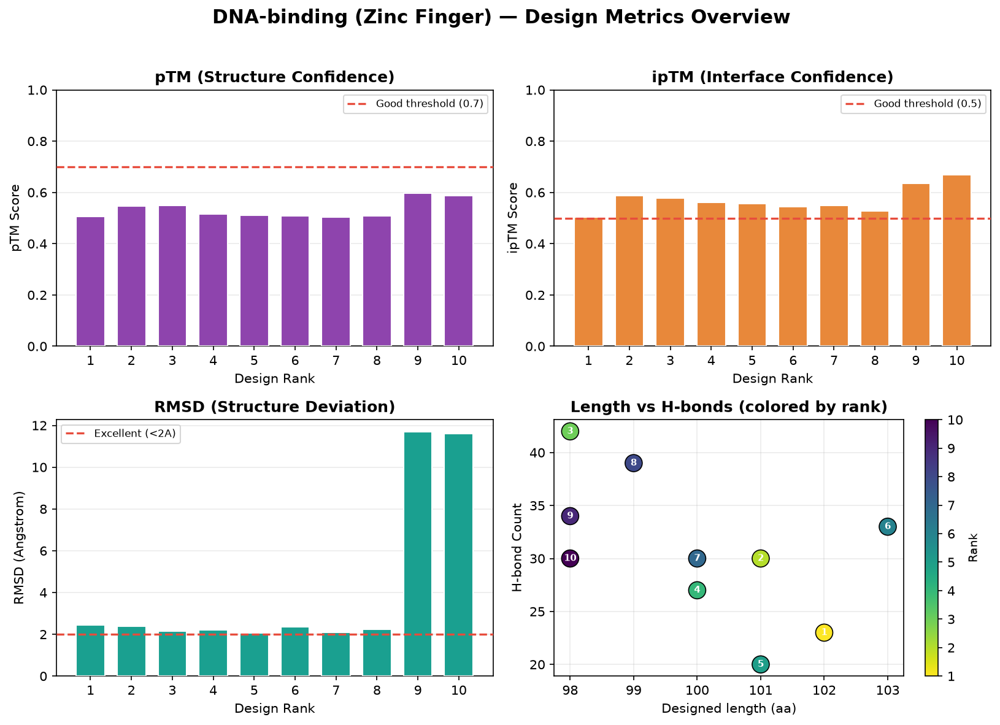
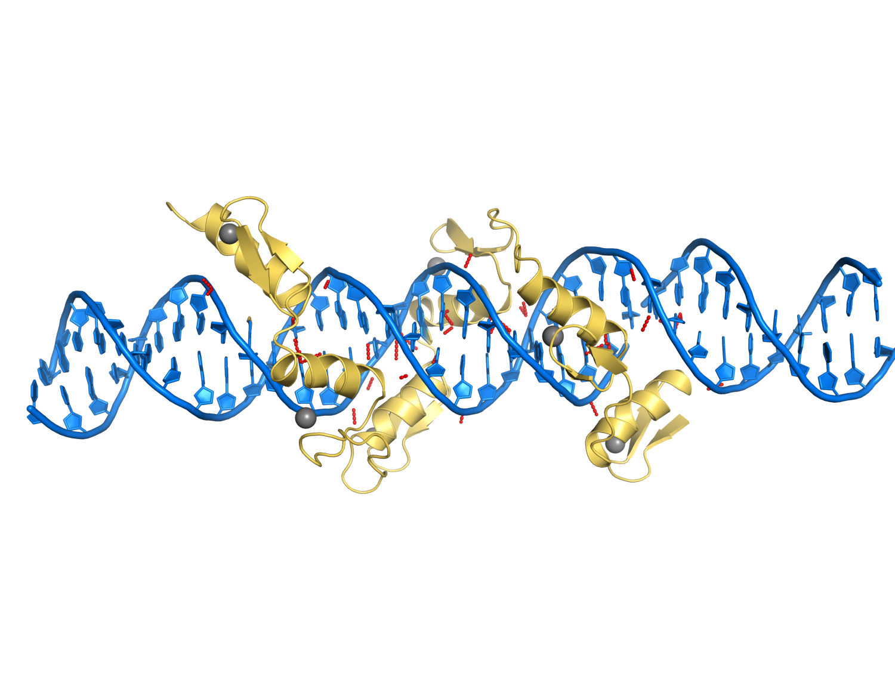
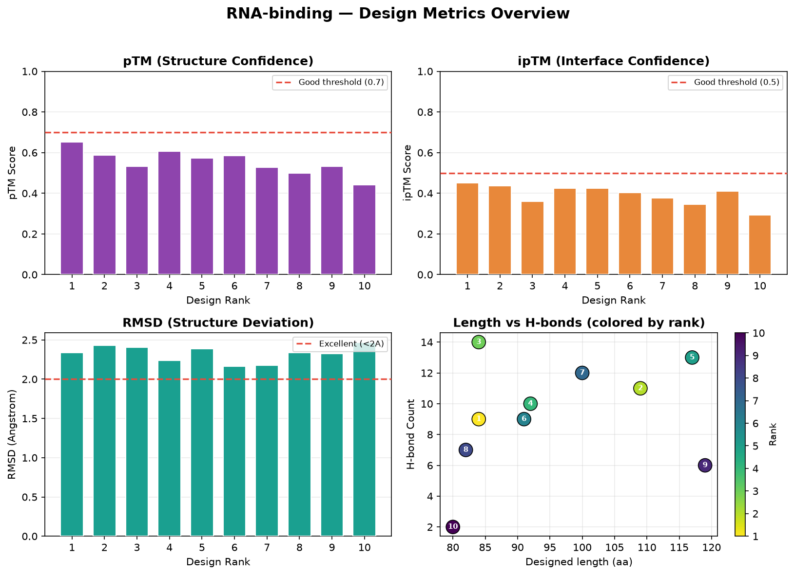
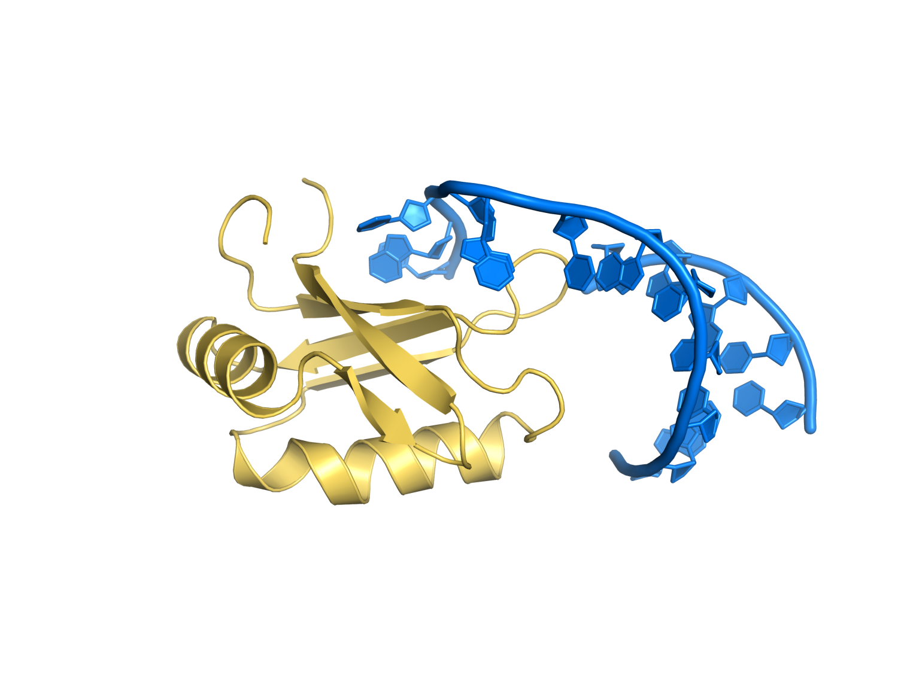

<div style="text-align:center">

# BoltzGen 완전 정복 — AI 바인더 설계 통합 심화 과정

</div>

> **이 과정은 BoltzGen을 처음부터 끝까지 다루는 자기완결형(self-contained) 통합 심화 튜토리얼입니다.**
> 입문 개념(바인더란 무엇인가, 설치, 첫 실행)부터 시작해, 펩타이드·고리형·항체·나노바디·소분자·핵산까지 **모든 바인더 타입의 실전 설계**, 그리고 메트릭 정량 해석·파이프라인 자동화·연구/산업 적용까지 한 문서 세트로 완결합니다.
> 사전 지식이 없어도 이 과정만으로 학습할 수 있으며, 모든 명령·수치·그래프는 **BoltzGen 0.3.2를 실제 실행해 재현·검증**했습니다. (재현 환경 상세 → 부록 A8)


## 0. 과정 개요

BoltzGen은 MIT에서 개발한 **생성형 AI 기반 바인더 설계 도구**입니다. 타깃(단백질·핵산·소분자)에 결합하는 단백질/펩타이드/항체/나노바디를, 백본 생성(diffusion) → 서열 설계(inverse folding) → 구조 검증(Boltz-2) → 분석 → 필터링의 자동 파이프라인으로 만들어냅니다.

이 과정은 다음을 **모두** 담습니다.

- **개념·이론**: 왜 AI 바인더 설계인가, 6개 프로토콜·모델 아키텍처·입출력 데이터 구조
- **실무 전 과정**: 입력 준비(QC·포맷변환) → 설치/접근(로컬·클라우드) → 실행(옵션 전략) → 해석(메트릭·시각화) → 자동화
- **타깃별 실습 5종**: 펩타이드/고리형 · 항체 Fab · 나노바디 · 소분자(친화도) · 핵산(DNA/RNA)
- **단계별 Jupyter 노트북**과 **재현 가능한 그래프**


## 1. 대상 독자와 사전 요구사항

**대상**
- BoltzGen을 **처음 접하는 사람부터** 실전 활용·자동화를 원하는 연구자까지 — 이 과정 하나로 완결
- 항체/나노바디/펩타이드/핵산/효소 바인더를 **직접 설계**해야 하는 바이오·신약 연구개발자
- 설계 결과를 **정량 해석하고 파이프라인으로 자동화**하려는 계산생물학 실무자

**준비물**
- **웹 브라우저.** 실습 노트북은 Colab 무료 런타임에서 그대로 열려요. 실습 랩(04·05·07~11)은 **설계 셀이 여러분의 결과를 `my_run/`에 만들고, 분석 셀이 그 결과를 읽어** 표·그래프를 그립니다. 설계 셀을 건너뛰거나 실패해도 괜찮아요 — 각 챕터의 `data/` 폴더에 **레퍼런스 설계 결과(메트릭 CSV·구조 CIF)가 커밋돼 있어서** 자동으로 그쪽으로 폴백하거든요. 분석 셀만 돌리면 노트북 한 권이 **몇 초**면 끝나요.
- Python 기초와 단백질 구조 기초(서열·2차구조·도메인·결합 인터페이스). 핵심 용어는 본문에서 설명해요.
- 설계를 **직접 돌려보고 싶을 때만** NVIDIA GPU가 필요해요(BoltzGen은 CPU 폴백이 없어요). 이 과정의 예제는 Colab **무료 T4 런타임**에서 전부 돌아갑니다 — Ch.03에서 그대로 따라 하면 돼요.


## 2. 과정 구성 — 스텝(챕터)별 자기완결

각 챕터는 **자기 폴더 안에 본문(.md)·노트북(.ipynb)·그래프(.png)·데이터(data/)를 모두** 담습니다. 한 스텝을 학습할 때 그 폴더만 보면 됩니다.

### Part A — 핵심 워크플로우 (6대 영역)

| Ch | 폴더 | 영역 | 핵심 내용 |
|----|------|------|-----------|
| **01** | [01_tool_understanding/](01_tool_understanding/01_tool_understanding.md) | 툴의 이해 | 바인더 설계의 의미, 6 프로토콜 선택 기준, diffusion+inverse folding+Boltz-2 아키텍처 |
| **02** | [02_input_data_prep/](02_input_data_prep/02_input_data_prep.md) | 입력 데이터 준비 | entity 5종, CIF/PDB 준비·정제, 결합부위 선정, 품질 체크 |
| **03** | [03_install_access/](03_install_access/03_install_access.md) | 툴 설치 및 접근 | 로컬·클라우드·Colab, GPU/CUDA 의존성, **cuBLAS/cuequivariance 실전 트러블슈팅** |
| **04** | [04_basic_usage/](04_basic_usage/04_basic_usage.md) | 기본 사용법 | 6스텝 파이프라인, `--steps`·`--config`·`--num_designs`/`--budget` 전략 |
| **05** | [05_result_interpretation/](05_result_interpretation/05_result_interpretation.md) | 결과 해석 | 메트릭 수십 종, `filter.ipynb`, **시각화 스타일 가이드** |
| **06** | [06_advanced_ai/](06_advanced_ai/06_advanced_ai.md) | 고급 활용·AI 적용 | 계층적 스크리닝, 자동화, `metrics_override`/`additional_filters`, 커스텀 scaffold |

### Part B — 타깃별 실습 (Hands-on Labs)

| Ch | 폴더 | 타깃 타입 | 실측 예제 |
|----|------|-----------|-----------|
| **07** | [07_peptide_cyclic/](07_peptide_cyclic/07_peptide_cyclic.md) | 펩타이드·고리형 | cyclotide(3ivq), cyclic·disulfide·cystine-knot |
| **08** | [08_antibody_fab/](08_antibody_fab/08_antibody_fab.md) | 항체 Fab | PD-L1(7uxq) + 임상 항체 14종 scaffold |
| **09** | [09_nanobody/](09_nanobody/09_nanobody.md) | 나노바디 | penguinpox(9bkq), scaffold 다중 그래프팅, developability |
| **10** | [10_small_molecule/](10_small_molecule/10_small_molecule.md) | 소분자·효소 | chorismate(TSA), **친화도(affinity) 예측** |
| **11** | [11_nucleic_acid/](11_nucleic_acid/11_nucleic_acid.md) | 핵산(DNA/RNA) | de novo zinc finger(DNA) + RNA 커스텀 타깃 |

### 참조 (Reference)

| | 폴더 | 내용 |
|----|------|------|
| **부록** | [12_appendix/](12_appendix/12_appendix.md) | 메트릭 240컬럼 사전 · CLI 전체 레퍼런스 · YAML 치트시트 · 트러블슈팅 종합 · FAQ · 용어집 |


## 3. 실습 노트북 (각 챕터 폴더 안)

노트북은 별도 폴더가 아니라 **해당 챕터 폴더 안**에 있습니다. 실행 결과·그래프도 같은 폴더의 `data/`·`.png`에 저장됩니다.

첫 셀(부트스트랩)이 저장소를 클론하고 해당 챕터 폴더로 자동 이동해 `data/`의 실제 결과로 실습합니다 — **고칠 값은 없습니다.** 로컬 주피터에서도 그대로 열려요.

**실습 랩(04·05·07~11)은 여러분이 직접 BoltzGen을 돌려 결과를 만드는 구조**입니다 — 설계 셀이 `my_run/`에 내 결과를 만들고, 이어지는 분석 셀이 **그 결과**를 읽습니다. 설계 셀을 건너뛰면 저장소에 커밋된 레퍼런스 결과로 이어져 실습이 끊기지 않아요.

아래 **소요 시간은 노트북을 실제로 실행해 측정한 값**입니다(분석 셀 기준. 설계 셀은 별도 — 4.(B) 참고).

| 노트북 | 위치(챕터) | 내용 | 분석 셀 |
|--------|-----------|------|--------|
| `02_data_prep.ipynb` | 02 | CIF 다운로드·gemmi 검사, entity 5종 명세 작성, `boltzgen check` | 4초 |
| `03_setup_check.ipynb` | 03 | 설치·GPU·CUDA·cuequivariance 진단, `boltzgen check` | 19초 |
| `04_run_pipeline.ipynb` | 04 | **직접 스모크 실행**(6스텝) → 내 출력 구조 해부 | 5초 |
| `05_analysis_viz.ipynb` | 05 | **직접 설계 실행** → 메트릭 로드·해석·그래프·상관행렬 | 6초 |
| `06_advanced_filtering.ipynb` | 06 | 하드필터·`metrics_override`·`additional_filters`·다양성(alpha) — 05의 내 결과를 이어받음 | 3초 |
| `07_peptide_lab.ipynb` | 07 | **직접 설계 실행** → cyclotide 메트릭·Cys 보존·disulfide 거리(gemmi) | 7초 |
| `08_fab_lab.ipynb` | 08 | **직접 설계 실행** → 항체 Fab + developability + VH/VL framework 검증 | 5초 |
| `09_nanobody_lab.ipynb` | 09 | **직접 설계 실행** → 나노바디 메트릭·VHH framework 보존 | 3초 |
| `10_small_molecule_lab.ipynb` | 10 | **직접 설계 실행** → 소분자 메트릭·affinity 랭킹·포켓 품질 | 3초 |
| `11_nucleic_lab.ipynb` | 11 | **직접 설계 실행** → DNA/RNA 분석·DNA vs RNA H-bond 비교 | 3초 |

> 표의 시간은 **셀 실행 시간**입니다. Colab에서 처음 열면 여기에 패키지 설치가 더해져요 — 실측으로 노트북 한 권당 **1~6분**(설치 포함, 두 번째 실행부터는 표의 시간).


공용 그래프 모듈 `boltzgen_viz.py`는 advanced/ 루트에 있으며, 각 노트북은 `sys.path`에 루트를 추가해 import합니다.


## 4. 빠른 시작 (Quick Start)

### (A) 브라우저에서 바로 — 설치 없음 (권장 입문)

1. GitHub에서 원하는 챕터 노트북(예: `05_result_interpretation/05_analysis_viz.ipynb`)을 열고 **Open in Colab** 으로 엽니다. 2. 위에서부터 실행하면 클론→챕터 폴더 이동→`data/`의 실제 결과로 표·그래프가 그대로 재현됩니다. **런타임은 기본값 그대로, 고칠 값도 없습니다.**

### (B) 직접 설계까지 — Colab GPU 런타임 또는 로컬

설계 실행(`boltzgen run`)에는 NVIDIA GPU가 필요해요. Colab이라면 **런타임 → 런타임 유형 변경 → T4 GPU**로 바꾸면 아래를 그대로 쓸 수 있고, 로컬 GPU가 있다면 로컬에서 해도 됩니다.

```bash
# 1) 환경 (Ch.03 상세)
conda create -n boltzgen_env python=3.12 -y && conda activate boltzgen_env
git clone https://github.com/HannesStark/boltzgen.git && cd boltzgen
python -m pip install -e .

# 2) GPU·CUDA 검증 (Ch.03 트러블슈팅 — cuBLAS 정합 주의)
python -c "import torch; print('CUDA:', torch.cuda.is_available())"

# 3) 설계 명세 검증
boltzgen check example/vanilla_protein/1g13prot.yaml

# 4) 첫 실행 (스모크 테스트 규모)
boltzgen run example/vanilla_protein/1g13prot.yaml \
  --output workbench/test --protocol protein-anything \
  --num_designs 4 --budget 2
```

> 이 스모크 실행(`num_designs 4`)은 6스텝 전체가 **약 5분**이었어요(가중치가 캐시된 상태의 실측값. 측정 환경 → 부록 A8). 첫 실행에는 모델 가중치 약 6GB 다운로드가 더해집니다.
>
> 설계 규모별 실측(가중치 캐시 기준).
>
> | 규모 | 소요 | 최종 선별 |
> |------|------|-----------|
> | `--num_designs 4 --budget 2` (Ch.04 스모크) | **약 5분** (307초) | 2개 |
> | `--num_designs 8 --budget 4` (Ch.05·07~11 랩) | **약 10분** (585초) | 4개 |
>
> 실습 랩의 설계 셀은 모두 두 번째 규모(8/4)예요. 규모를 키우면 시간은 대체로 `num_designs`에 비례해 늘고, 복합체가 클수록 refolding이 더 무거워져요(Ch.01의 단계별 시간 표 참고).

> 설치 후 `CUDA: False` 또는 `cuequivariance ... undefined symbol: cublasGemmGroupedBatchedEx` 오류가 나면 **Ch.03의 "CUDA/cuBLAS 트러블슈팅"** 을 먼저 보세요. 드라이버↔torch↔cuequivariance의 CUDA 버전 정합이 핵심입니다.


## 5. 학습 경로

```
[개념]  01 툴 이해 → 02 입력 준비 → 03 설치/접근
                                        │
[실행]  04 기본 사용 ────────────────────┘
            │
[해석]  05 결과 해석 → 06 고급/AI 적용
            │
[실습]  07 펩타이드 · 08 항체 · 09 나노바디 · 10 소분자 · 11 핵산
        (관심 타깃부터 선택 가능)
```

- **입문자**: 01 → 11 순서대로.
- **특정 타깃이 급하면**: 03(설치) → 04(실행) → 해당 실습 챕터로 바로.


## 6. 표기 규약

- `코드` = 실제 명령·파일명·컬럼명
- 실습(노트북 연동) · 그래프 · 흔한 함정 · 심화 팁
- 메트릭은 **실제 CSV 컬럼명**으로 병기 (예: ipTM = `design_to_target_iptm`)
- 모든 수치·그래프는 실제 실행 결과 기반(임의 값 아님)

<div class="pagebreak"></div>

<div style="text-align:center">

# Ch.01 — 툴의 이해

</div>

안녕하세요! 본격적으로 설계를 시작하기 전에, 우리가 다룰 **BoltzGen이 도대체 안에서 무슨 일을 하는지**부터 차근차근 들여다볼 거예요.

기초 과정에서는 "명령어를 넣으면 바인더가 나온다" 정도로만 알아도 충분했죠. 하지만 전문가 수준으로 올라가려면, **왜 그렇게 동작하는지**를 알아야 해요. 그래야 결과가 이상하게 나왔을 때 원인을 짚고, 옵션을 어떻게 바꿔야 할지 직접 판단할 수 있거든요.

이 챕터를 다 읽고 나면, BoltzGen을 더 이상 "블랙박스"가 아니라 **여러 AI 모델이 협업하는 조립 라인**으로 이해하게 될 거예요. 자, 시작해볼까요?

## 1.1 그래서, BoltzGen은 왜 필요한가요? — 용도와 목적

본격적인 기술 이야기에 들어가기 전에, 가장 근본적인 질문부터 짚고 갈게요. **"애초에 이런 도구가 왜 필요할까요?"**

### 단백질 바인더가 뭐고, 왜 중요할까요?

우리 몸속에서 일어나는 거의 모든 일은 **단백질끼리 서로 달라붙으면서** 일어나요. 바이러스가 세포에 침투하는 것도, 암세포가 신호를 받아 증식하는 것도, 면역세포가 적을 알아보는 것도 전부 "어떤 단백질이 어떤 단백질(또는 분자)에 결합하는" 사건이에요.

그래서 만약 우리가 **특정 타깃 단백질에 딱 달라붙는 분자**를 만들 수 있다면? 그 타깃의 작동을 막거나, 표시를 붙여 추적하거나, 원하는 위치로 약물을 운반할 수 있게 돼요. 이렇게 타깃에 결합하도록 설계된 분자를 **바인더(binder)**라고 불러요. 자물쇠(타깃)에 꼭 맞는 열쇠(바인더)를 만드는 일이라고 생각하면 쉬워요.

바인더는 이미 우리 일상 깊숙이 들어와 있어요.

- **항체 치료제** — 허셉틴(유방암), 키트루다(면역항암제) 같은 약들이 전부 바인더예요. 다만 크고 비싸고 만들기 까다롭죠.
- **나노바디** — 항체의 1/10 크기인 미니 항체예요. 싸고 안정적이라 차세대 치료·진단 도구로 주목받아요.
- **펩타이드 약물** — 인슐린, 비만/당뇨 치료제 GLP-1(위고비·오젬픽) 등. 작고 특이적이에요.
- **진단·바이오센서·효소** — 특정 분자를 검출하거나, 새로운 반응을 촉매하는 단백질도 바인더 설계의 영역이에요.

### 그런데 왜 어려웠을까요? — 기존 방법의 한계

문제는, **이런 바인더를 만드는 게 전통적으로 엄청나게 어렵고 느렸다**는 거예요. 크게 두 가지 방법이 있었는데, 둘 다 한계가 뚜렷했어요.

**① 실험실 스크리닝** — 수십억 개의 후보 분자를 만들어 하나씩 실험으로 테스트하는 방식이에요. 운 좋게 잘 붙는 걸 찾으면 또 최적화하고 다시 테스트하고... 이렇게요.
- **시간**: 보통 몇 년이 걸려요. 바이러스 하나 잡을 나노바디를 찾는 데 3년 넘게 걸린 사례도 있어요.
- **비용**: 수백만~수십억 원.
- **운**: 아무리 많이 테스트해도 좋은 게 나온다는 보장이 없어요.

**② 합리적 설계(rational design)** — 타깃의 3D 구조를 분석해서 "여기가 결합 부위구나"를 찾고, 사람이 직접 컴퓨터로 바인더를 설계하는 방식이에요.
- 엄청난 **전문 지식**이 필요해요.
- 단백질 상호작용이 워낙 복잡해서 **예측이 자주 빗나가요**.
- 결국 **성공률이 낮아요**.

### 그래서 등장한 게 BoltzGen이에요

**BoltzGen**은 MIT에서 개발한 **생성형 AI 기반 바인더 설계 도구**예요. ChatGPT가 글을, Midjourney가 그림을 생성하듯이, BoltzGen은 **타깃에 결합하는 단백질 구조를 직접 생성**해줘요.

무엇이 달라졌을까요?

| 기존 방식 | BoltzGen |
|-----------|----------|
| 후보 탐색에 수개월~수년 | 수천 개 디자인을 **하루~며칠**에 생성 |
| 성공률 낮음, 운에 의존 | 사람이 거르기 전에 **AI가 검증·순위화** |
| 단백질 위주, 도구마다 따로 | **단백질·펩타이드·항체·나노바디·소분자·핵산** 한 도구로 |
| 상용 라이선스 장벽 | **오픈소스(MIT 라이선스)** |

핵심은, **실험으로 검증할 가치가 있는 초기 후보를 찾는 시간을 극적으로 줄여준다**는 거예요. (물론 최종적으로는 실험 검증이 필요해요 — AI는 후보를 빠르게 좁혀주는 강력한 출발점이에요.)

### BoltzGen으로 무엇을 만들 수 있나요?

이 과정에서 우리가 직접 실습할 것들이기도 해요.

1. **단백질–단백질 바인더** — 가장 기본. 암 단백질 억제, 바이러스 중화 등 (Ch.04)
2. **펩타이드·고리형 펩타이드** — 작고 안정적, 일부는 경구 투여 가능 (Ch.07)
3. **항체 Fab** — 임상 항체 scaffold에 CDR만 새로 설계 (Ch.08)
4. **나노바디** — 작고 강력한 미니 항체 (Ch.09)
5. **소분자 결합 단백질** — 효소·바이오센서, 결합 친화도까지 예측 (Ch.10)
6. **핵산(DNA·RNA) 결합 단백질** — 유전자 편집 도구, 전사인자 등 (Ch.11)

**누가 쓰면 좋을까요?** 신약을 개발하는 연구자, 진단 도구를 만드는 엔지니어, 효소나 바이오센서를 설계하는 합성생물학자 — 즉 "특정 타깃에 붙는 분자가 필요한 모든 사람"이에요.

자, 이제 *왜* 필요한지 감이 잡혔으니, 본격적으로 *어떻게* 동작하는지 안을 열어볼까요?


## 1.2 BoltzGen은 어디쯤 있는 도구일까요?

단백질을 컴퓨터로 설계하는 분야는 지난 몇 년간 정말 빠르게 발전했어요. 그런데 재미있는 건, 그동안 **세 가지 일을 서로 다른 도구가 하나씩 나눠서** 담당했다는 거예요.

| 단계 | 무슨 일을 하나요? | 대표 도구 | 결과물 |
|------|------------------|-----------|--------|
| ① 백본(뼈대) 만들기 | 단백질의 3D 형태를 그려요 (아직 서열은 없음) | RFdiffusion | 백본 좌표 |
| ② 서열 채우기 | 그 형태에 맞는 아미노산 순서를 정해요 | ProteinMPNN, ESM-IF | 아미노산 서열 |
| ③ 검증하기 | 그 서열이 정말 그 모양으로 접히는지 확인해요 | AlphaFold2/3, Boltz | 예측 구조 + 신뢰도 |

예전에는 이 세 도구를 **사람이 직접 스크립트로 이어 붙여서** 썼어요. "RFdiffusion 돌리고 → 그 결과를 ProteinMPNN에 넣고 → 또 그 결과를 AlphaFold에 넣고..." 이런 식이죠.

그런데 이게 생각보다 까다로워요. 도구마다 파일 형식이 다르고, 좌표를 매기는 방식이나 잔기 번호 붙이는 규칙이 제각각이라, 중간에서 **데이터가 어긋나 실패하는 일**이 정말 많았거든요.

**BoltzGen이 똑똑한 지점이 바로 여기예요.** 이 세 단계를 *하나의 일관된 데이터 흐름과 엔진*으로 묶어버린 거죠. 게다가 단순히 묶기만 한 게 아니라.

- **타깃을 중심에 놓고 설계**해요 (그냥 단백질을 만드는 게 아니라 "이 타깃에 붙는" 단백질을 만들죠)
- **단백질뿐 아니라 DNA·RNA·소분자**까지 타깃으로 다룰 수 있어요
- **고리형·이황화결합·2차구조** 같은 복잡한 제약을 명세 파일 하나로 지정할 수 있어요

> **심화 포인트**: BoltzGen의 검증 단계는 외부 AlphaFold가 아니라 **내장된 Boltz-2**예요. 이게 왜 중요할까요? 생성과 검증이 *같은 좌표 규약·같은 표현 방식*을 공유하니까, 단계 사이에서 정보가 어긋나거나 손실되는 일이 줄어들어요. 한 팀이 처음부터 끝까지 같은 언어로 일하는 셈이죠.


## 1.3 바인더 설계를 한 문장으로 정리하면

조금 추상적이지만, 우리가 BoltzGen에게 시키는 일을 한 문장으로 요약해볼게요.

> "타깃 구조 **T**와 설계 제약 **C**(길이, 결합부위, 고리형 여부 등)가 주어졌을 때, 거기에 딱 맞는 바인더의 **모양(백본)과 서열**을 여러 개 만들어줘."

BoltzGen은 이 일을 **두 단계로 쪼개서** 풀어요.

1. **먼저 모양을 만들고** (타깃 T를 보면서 백본을 생성)
2. **그 모양에 맞는 서열을 채워요** (역접힘, inverse folding)

그리고 여기서 BoltzGen만의 핵심 철학이 등장해요. 만든 바인더가 *정말 의도대로 작동하는지*를, **그걸 만들지 않은 별도의 모델(Boltz-2)에게 다시 물어보는** 거예요.

```
"내가 만든 이 서열을, 나랑 상관없는 다른 모델이 다시 접어봐도
 똑같이 타깃에 붙는 모양이 나올까?"
```

이걸 **자기일관성(self-consistency)**이라고 불러요. 생성 모델이 만든 구조와, 검증 모델이 다시 예측한 구조가 **얼마나 일치하는가** — 이게 BoltzGen에서 "좋은 설계"를 판단하는 가장 중요한 기준이에요. 나중에 보게 될 핵심 메트릭(ipTM, RMSD, PAE)이 전부 이 자기일관성을 숫자로 잰 거랍니다.

쉽게 비유하면, 시험 문제를 낸 사람과 채점하는 사람이 다른 거예요. 출제자(생성 모델)가 "이게 정답"이라고 해도, 독립적인 채점자(Boltz-2)가 봐도 맞아야 진짜 믿을 수 있는 거죠.


## 1.4 안을 열어보면 — 어떤 AI 모델들이 일하고 있을까요?

BoltzGen을 실제로 돌리면, 로그에 이런 모델 파일들이 줄줄이 로드돼요. 한번 직접 본 거예요.

```
boltzgen1_diverse.ckpt      ← 백본 생성 (다양성 담당)
boltzgen1_adherence.ckpt    ← 백본 생성 (제약 준수 담당)
boltzgen1_ifold.ckpt        ← 서열 채우기 (역접힘)
boltz2_conf_final.ckpt      ← 구조 검증 (Boltz-2)
```

하나씩 친절하게 풀어볼게요.

### (1) 백본 생성 — 왜 모델이 두 개일까요?

가장 먼저 눈에 띄는 건, 백본을 만드는 데 **체크포인트가 두 개**나 쓰인다는 거예요 (`diverse` + `adherence`). 왜 그럴까요?

여기엔 생성형 설계의 **근본적인 딜레마**가 있어요. 우리는 두 가지를 동시에 원하거든요.

- **다양하게** 만들고 싶어요 (서로 다른 결합 전략을 폭넓게 탐색)
- **시키는 대로** 만들고 싶어요 (결합부위·고리형 같은 제약을 정확히 지킴)

그런데 이 둘은 종종 충돌해요. 너무 자유롭게 탐색하면 제약을 어기고, 너무 제약에 매달리면 다양성이 죽죠. BoltzGen은 이걸 **분업**으로 풀었어요.

- **`diverse`**: "여러 가능성을 넓게 펼쳐봐" — 분포의 *폭*을 담당
- **`adherence`**: "지킬 건 확실히 지켜" — 분포의 *정확도*를 담당

그럼 백본은 어떻게 만들까요? **확산(diffusion)** 방식이에요. 완전히 뒤죽박죽인 노이즈에서 출발해서, 조금씩 노이즈를 걷어내며 단백질 모양을 드러내요. 마치 안개 속에서 조각상이 서서히 나타나는 것처럼요. 그리고 이 과정의 매 순간마다 **타깃 정보를 옆에서 계속 알려줘서**, "이 타깃에 붙는" 형태가 나오도록 유도해요.

**여기서 우리가 만질 수 있는 노브들:**

- `--num_designs`: 백본을 몇 개나 만들지. 많이 만들수록 그중에 좋은 게 나올 확률이 올라가요 (분포의 좋은 꼬리를 만날 기회).
- `--diffusion_batch_size`: 한 번에 몇 개씩 묶어서 만들지 (기본: 100개 미만이면 1, 이상이면 10).
  - **주의**: 같은 배치 안의 디자인들은 **길이를 공유**해요! 그래서 길이를 `80..140`처럼 랜덤으로 뽑는 설계인데 배치를 크게 잡으면, 길이 다양성이 오히려 줄어들어요. 길이 다양성이 중요하면 배치를 작게 가져가세요.
- `--step_scale`, `--noise_scale`: 디노이징의 "보수성"을 조절해요. 작으면 안정적·보수적, 크면 탐험적. 결과가 너무 비슷비슷하게만 나온다면 노이즈를 살짝 올려보는 게 한 방법이에요.

### (2) 서열 채우기 — `boltzgen1_ifold`

모양(백본)이 나왔으면, 이제 "이 모양을 실제로 만들려면 어떤 아미노산을 어떤 순서로 배열해야 할까?"를 풀 차례예요. 이걸 **역접힘(inverse folding)**이라고 해요. 보통 접힘(folding, 서열→구조)의 정반대 방향이라 그렇게 불러요.

재미있는 건, BoltzGen은 외부 ProteinMPNN이나 ESM-IF를 쓰지 않고 **자체 역접힘 모델(공식 이름 BoltzIF)**을 쓴다는 거예요. 타깃 문맥까지 함께 보도록 학습된 전용 모델이죠. (BoltzIF와 전체 아키텍처는 1.5에서 그림으로 정리해요.)

**만질 수 있는 노브:**

- `--inverse_fold_num_sequences` (기본 1): 백본 하나당 서열을 몇 개 만들지. 늘리면 같은 모양에서 다른 서열들을 더 뽑아볼 수 있어요.
- `--inverse_fold_avoid`: 특정 아미노산을 금지해요. 기본값이 프로토콜마다 다른데, 단백질은 제한이 없지만 **펩타이드·나노바디·항체는 시스테인(C)을 자동으로 금지**해요.
  - 왜냐고요? 의도하지 않은 자유 시스테인이 생기면 엉뚱한 곳에서 이황화결합을 만들어 구조가 꼬이거나 응집될 수 있거든요. 그래서 작은 바인더에서는 아예 막아두는 거예요.

### (3) 구조 검증 — Boltz-2 (`boltz2_conf_final`)

이제 채워진 서열이 **정말 의도한 복합체를 만드는지** 확인할 차례예요. 그래서 Boltz-2로 다시 접어봐요. 그런데 검증이 **두 종류**예요.

- **`folding`**: 바인더 **+ 타깃을 함께** 접어봐요 → "둘이 진짜 복합체를 이루나?" (인터페이스 신뢰도 ipTM, 위치 오차 PAE를 측정)
- **`design_folding`**: 바인더 **혼자만** 접어봐요 → "타깃이 없어도 이 바인더가 의도한 모양을 유지하나?" (구조적 자립성)

> `design_folding`은 `protein-anything`·`protein-small_molecule`에서만 돌고, **펩타이드·나노바디·항체에서는 생략**돼요. 작은 펩타이드나 CDR 같은 건 애초에 타깃에 의존해서 모양이 잡히기 때문에, 혼자 접어보는 게 큰 의미가 없거든요. 그래서 이들은 6단계가 아니라 **5단계** 파이프라인이에요.

> **심화 — cuequivariance 커널이 뭐예요?**
> Boltz-2와 생성 트렁크는 AlphaFold3 계열의 **triangle attention / triangle multiplicative update**라는 연산을 써요. 잔기 쌍(pair) 사이의 기하 정보를 다루는 핵심 연산인데, 계산이 무거워요. BoltzGen은 이걸 `cuequivariance_ops`라는 CUDA 가속 커널로 빠르게 처리해요.
> **그런데** 이 커널이 **cuBLAS 12.5 이상의 특정 함수(`cublasGemmGroupedBatchedEx`)**를 요구해요. 그래서 설치할 때 torch가 들고 온 cuBLAS 버전이 이보다 낮으면, `undefined symbol` 오류가 나면서 design 단계가 죽어버려요. (이 함정과 해결법은 Ch.03에서 실제 사례로 자세히 다뤄요. 미리 알아두면 설치할 때 당황하지 않아요!)


## 1.5 공식 아키텍처와 입력 표현 (논문 Figure 기준)

앞에서 모델 컴포넌트를 하나씩 봤는데, 이제 **BoltzGen 논문의 공식 그림**을 따라 전체 그림과 "작동 원리"를 정리해볼게요. 이걸 알면 우리가 YAML에 쓰는 모든 게 왜 그렇게 동작하는지 근본부터 이해돼요.

### Any-modality 입력 → All-atom 출력

BoltzGen의 가장 큰 특징은 **"어떤 종류의 타깃이든(any-modality)"** 받는다는 거예요.

```
[입력] Any-modality Targets          [출력] All-atom Structure (제약 준수)
  · Protein   (단백질)         ──▶     · Protein–Protein
  · Nucleotide(DNA/RNA)        ──▶     · Protein–Nucleotide
  · Small Molecule(소분자)     ──▶     · Protein–Small Molecule
                                       · Nanobody / Cyclotide / Helicon – Protein
```

핵심 두 가지: ① 입력 타깃이 단백질·핵산·소분자 무엇이든 **같은 방식으로** 처리하고, ② 출력은 백본만이 아니라 측쇄·리간드 원자까지 포함한 **all-atom 구조**이며, 우리가 건 제약(고리형·이황화·결합부위)을 **준수(adhering to constraints)**해요.

### 작동 원리의 핵심 — 입력을 3계층 Feature로 인코딩

그럼 어떻게 단백질·핵산·소분자를 하나로 다룰까요? 비결은 **모든 입력을 3가지 층위의 feature로 변환**하는 거예요. 이게 BoltzGen 작동 원리의 심장이에요.

| Feature 층위 | 무엇을 담나 | 우리 YAML의 무엇이 여기로 |
|--------------|------------|---------------------------|
| **Atomic Features** (원자 수준) | Charge(전하), Element(원소), Reference positions(기준 좌표) | 소분자(ccd/smiles)·비표준 잔기까지 원자 단위로 표현 |
| **Token Features** (토큰=잔기 수준) | (target) Sequence, Residue/Chain index, **Binding site**, **Flexible/Fixed**, **Secondary structure** | `sequence`, `binding_types`, `structure_groups`(visibility), `secondary_structure`, `design/not_design` |
| **Pairwise Features** (잔기 쌍 수준) | **Structure constraints**, **Covalent bonds** | `constraints/bond`(이황화·공유결합), 구조 제약 |

다시 말해, **우리가 YAML에 쓰는 모든 항목은 결국 이 3계층 feature로 변환돼 모델에 들어가요.** YAML 문법은 이 feature들을 사람이 쓰기 쉽게 추상화한 껍데기인 셈이죠. 그래서 "binding_types를 주면 결합부위가 Token feature로 인코딩되어 그 자리에 결합하도록 유도되고", "constraints/bond를 주면 Pairwise feature로 두 잔기를 묶는다"는 식으로 동작 원리가 이어져요.

> 심화 — Pairwise feature(잔기 쌍 표현)가 바로 1.4에서 말한 **triangle attention/multiplication**이 다루는 그 표현이에요. 잔기 쌍의 기하·제약 정보를 반복적으로 갱신하는 게 AlphaFold3·Boltz 계열의 핵심 연산이고, 그래서 계산이 무겁고 cuequivariance 커널로 가속하는 거예요.

### 명명된 모델 파이프라인 (논문 Figure b·c)

논문 그림은 파이프라인을 **이름 붙은 모델들의 흐름**으로 보여줘요. 우리가 본 6스텝과 1:1로 대응돼요.

```
Target Biomolecule
   │
   ▼  BoltzGen (Design)                      ~6s   → All-atom + Backbone 구조 생성
   ▼  BoltzIF  (Sequence Redesign = 역접힘)   ~1s   → Refined Sequence  [점선=선택적, 건너뛸 수 있음]
   ▼  Boltz-2  (Structure Prediction=Refolding) ~36s → Confidence + Refolded All-atom 구조
   ▼  Boltz-2  (Affinity Prediction)          ~17s  → Affinity          [소분자 프로토콜만]
   ▼  Analyze                                 ~2s   → Solubility, #H-bonds, #Saltbridges, ΔSASA
   ▼  Filter                                        → Top N structures
```

- **BoltzGen (Design)**: 백본·all-atom을 생성하는 본체(우리가 본 `diverse`+`adherence` 체크포인트).
- **BoltzIF**: 서열 재설계(inverse folding) **전용 모델의 공식 이름**이에요. 우리가 로그에서 본 `boltzgen1_ifold`가 바로 BoltzIF예요. Figure에서 이 단계가 점선(dashed)인 건 **선택적으로 건너뛸 수 있다**는 뜻이고(`--skip_inverse_folding`), 그래서 시간도 ~1s로 가장 짧아요.
- **Boltz-2**: **구조 예측(refolding)과 친화도 예측을 둘 다** 담당하는 모델(`boltz2_conf_final`). 즉 검증·affinity가 같은 모델 계열이에요.
- **Analyze**: 그림 오른쪽의 Solubility·#H-bonds·#Saltbridges·ΔSASA가 분석 단계 산출물이에요(Ch.05의 인터페이스 메트릭과 정확히 일치).

### 단계별 소요 시간 (디자인 1개당 — BoltzGen 논문/README Fig 기준)

아래는 **복합체(설계 + 타깃) 잔기 200개 지점**의 값이에요. 출처 그림의 x축이 "설계+타깃 잔기 수"라서, **이 값들은 상수가 아니라 복합체 크기에 따라 늘어나요** — 예컨대 refolding은 50잔기 ~18초 → 200잔기 ~36초 → 500잔기 ~81초로 커져요. Part B 실습 복합체가 158~372토큰인 걸 감안하고 읽으세요.

| 단계 | 담당 모델 | 대략 시간/design (200잔기 기준) |
|------|-----------|:---:|
| design | BoltzGen | ~6초 |
| inverse folding | BoltzIF | ~1초 |
| **refolding** | Boltz-2 | **~36초 (가장 무거움)** |
| affinity | Boltz-2 | ~17초 (소분자만) |
| analyze | — | ~2초 |

> 심화 — **refolding이 왜 압도적으로 무거울까요?** 디자인마다 Boltz-2로 전체 구조를 다시 예측해야 하기 때문이에요(생성보다 검증이 비싸요). 그래서 `num_designs`를 키우면 전체 시간은 **refolding이 지배**해요. Ch.04에서 "작게 테스트 → 크게 프로덕션"을 권하는 이유도, 이 refolding 비용 때문이에요. (참고: 이 수치는 디자인 1개당 대략치라, 우리 실측 30개 런의 folding이 수십 초~수 분 걸린 것과 일치해요.)


## 1.6 6개 프로토콜 — 언제 무엇을 골라야 할까요?

`--protocol` 옵션은 단순한 이름표가 아니에요. 사실은 **여러 내부 설정을 한 번에 바꿔주는 프리셋**이에요. 그래서 잘못 고르면 결과 품질과 속도가 둘 다 나빠질 수 있어요. 정확한 차이를 표로 정리해볼게요.

| 프로토콜 | 언제 쓰나요? | design_folding | 역접힘 시 Cys | affinity 예측 |
|----------|-------------|:---:|:---:|:---:|
| `protein-anything` (기본) | 단백질이 단백질/펩타이드에 결합 | 함 | 허용 | 안 함 |
| `peptide-anything` | 펩타이드·고리형 펩타이드 바인더 | 안 함 | **금지** | 안 함 |
| `protein-small_molecule` | 단백질이 소분자에 결합 | 함 | 허용 | **함** |
| `nanobody-anything` | 나노바디 CDR 설계 | 안 함 | **금지** | 안 함 |
| `antibody-anything` | 항체 Fab CDR 설계 | 안 함 | **금지** | 안 함 |
| `protein-redesign` | 기존 단백질 재설계·최적화 | 안 함 | 허용 | 안 함 |

말로만 보면 헷갈리니, **고르는 순서**를 흐름도로 만들어봤어요.

```
타깃이 소분자(ligand)인가요?
 ├─ 네 → protein-small_molecule   (친화도 예측이 필요하면 이게 필수!)
 └─ 아니요 →
     바인더가 항체나 나노바디(scaffold에 CDR만 새로 디자인)인가요?
      ├─ 나노바디 → nanobody-anything
      ├─ 항체 Fab → antibody-anything
      └─ 아니요 →
          짧은 펩타이드 / 고리형 / 이황화 펩타이드인가요?
           ├─ 네 → peptide-anything   (Cys를 자동으로 막아 잘못된 이황화 방지)
           └─ 아니요 →
               기존 단백질을 재설계·최적화하나요(대칭 복합체 포함)?
                ├─ 네 → protein-redesign
                └─ 아니요 (완전히 새 단백질 바인더) → protein-anything
```

**정말 흔한 실수 하나**: 펩타이드를 만들면서 `protein-anything`을 쓰는 거예요. 이러면 두 가지 문제가 생겨요.
1. 역접힘이 시스테인을 마음대로 넣어서, 원치 않는 이황화결합이나 응집이 생길 수 있어요.
2. 펩타이드엔 필요도 없는 `design_folding` 단계까지 돌아서 **시간을 낭비**해요.

그래서 "타깃이 뭔지, 바인더가 어떤 종류인지"에 맞춰 프로토콜을 고르는 게 **모든 설계의 1순위 결정**이에요.


## 1.7 파이프라인 6단계 — 데이터는 어떻게 흘러갈까요?

`boltzgen run`을 누르면, 안에서는 ① 프로토콜에 맞는 단계별 설정 파일을 자동으로 만들고 ② 그 단계들을 순서대로 실행해요. `protein-anything` 기준으로 데이터가 어떻게 흘러가는지 따라가볼까요?

```
[입력] design_spec.yaml (+ 타깃 CIF 파일)
   │
   ▼ ① design          (백본 생성: diverse + adherence)
   │     → intermediate_designs/*.cif  (모양만 있고 서열은 아직 없음) + *.npz
   │
   ▼ ② inverse_folding (서열 채우기: ifold)
   │     → intermediate_designs_inverse_folded/*.cif  (서열 채움, 단 측쇄 좌표는 아직 0)
   │
   ▼ ③ folding         (Boltz-2: 바인더+타깃 함께 재접힘)
   │     → .../refold_cif/*.cif  ← 분석·필터의 진짜 입력! (측쇄까지 다 채워진 복합체)
   │
   ▼ ④ design_folding  (Boltz-2: 바인더 혼자 재접힘)   [펩타이드/나노바디/항체는 건너뜀]
   │     → .../refold_design_cif/*.cif
   │
   ▼ ⑤ analysis        (메트릭 계산: 수소결합, 표면적, ipTM/PAE, liability 등)
   │     → aggregate_metrics_analyze.csv, per_target_metrics_analyze.csv
   │
   ▼ ⑥ filtering       (하드필터 + 다양성 선택)
         → final_ranked_designs/final_<budget>_designs/rankN_*.cif
         → all_designs_metrics.csv, final_designs_metrics_<budget>.csv, results_overview.pdf
```

여기서 꼭 기억할 점 두 가지!

- **`--steps`로 일부 단계만 골라 돌릴 수 있어요.** 예를 들어 분석까지 다 끝낸 뒤에 선택 기준만 바꿔보고 싶으면 `--steps filtering`만 반복하면 돼요 (몇 초면 끝나요). 이건 Ch.06에서 아주 유용하게 써먹어요.
- **소분자 프로토콜**은 ④와 ⑤ 사이에 **`affinity`** 단계가 하나 더 들어가서, 결합 친화도를 예측해줘요 (Ch.10에서 실습).

> 노트북 `04_run_pipeline.ipynb`에서 각 단계가 만든 파일을 실제로 하나씩 열어볼 거예요.


## 1.8 입력과 출력은 어떤 형태일까요?

### 입력 — 설계 명세(YAML) 파일

BoltzGen에게 "이런 걸 만들어줘"라고 말하는 방법은 **YAML 파일**이에요. 핵심은 `entities`(등장하는 개체들)와, 필요하면 `constraints`(공유결합 같은 제약)예요.

그리고 중요한 사실 하나! BoltzGen은 **5가지 entity 타입**을 지원해요. 특히 **DNA·RNA도 정식으로 지원**한다는 게 핵심이에요 (Ch.11 핵산 실습의 토대가 돼요).

```yaml
entities:
  - protein: { id: B, sequence: 80..140 }            # 설계할 단백질 (길이 범위)
  - dna:     { id: D, sequence: ATGC... }             # DNA (설계 또는 고정)
  - rna:     { id: R, sequence: AUGC... }             # RNA
  - ligand:  { id: L, ccd: ATP }                       # 소분자 (CCD 코드 또는 SMILES)
  - file:    { path: target.cif, include: [...] }      # 기존 구조 파일에서 가져오기
constraints:
  - bond: { atom1: [B, 4, SG], atom2: [B, 26, SG] }   # 이황화 등 공유결합
```

서열을 적는 방법도 여러 가지예요 (자세한 건 Ch.02·Ch.04에서 하나씩 실습해요).
- `80..140` → 80~140 사이 랜덤 길이
- `3C8C6C5C3C1C2` → 고정된 시스테인 사이에 디자인 잔기를 배치 (고리형 펩타이드용)
- `cyclic: true` → 머리와 꼬리를 이어 고리로 만들기

### 중간·출력 데이터

- **CIF 파일**: 구조예요 (백본 → 서열 채움 → 재접힘 순서로 바뀌어가요). 예측 구조의 경우, B-factor 칸에 잔기별 신뢰도(pLDDT)가 들어 있어요.
- **NPZ 파일**: 좌표와 메타데이터를 텐서로 담은 거예요. 분석 단계의 입력으로 쓰여요.
- **메트릭 CSV**: 디자인 하나당 한 줄씩, **무려 240개가 넘는 컬럼**이 들어 있어요! 이 많은 메트릭을 어떻게 읽는지는 Ch.05에서 전부 풀어드릴게요.

> **꼭 알아두세요**: 역접힘(inverse folding) 직후의 CIF는 **백본 원자만 좌표가 있고, 측쇄(side chain)는 전부 (0,0,0)** 이에요. 측쇄까지 제대로 채워진 "진짜" 구조는 `refold_cif/` 폴더(folding 단계 결과)에 있어요. 그러니 **시각화나 인터페이스 분석을 할 때는 반드시 `refold_cif`를 써야 해요.** 이거 모르고 inverse_folded 파일을 PyMOL로 열면 "측쇄가 다 원점에 뭉쳐 있는" 이상한 그림이 나와서 당황하게 돼요.


## 1.9 한눈에 정리 — 각 단계가 무엇을 책임지나요?

| 단계 | 담당 모델 | 무엇을 최적화? | 핵심 결과 메트릭 |
|------|-----------|----------------|------------------|
| design | diverse + adherence (확산) | 타깃에 맞는 백본 | (백본만, 서열 없음) |
| inverse_folding | ifold | 그 백본을 실현할 서열 | `designed_chain_sequence` |
| folding | Boltz-2 | 복합체 자기일관성 | `design_to_target_iptm`(ipTM), `min_design_to_target_pae`(PAE), `design_ptm`(pTM) |
| design_folding | Boltz-2 | 바인더 단독 자립성 | `designfolding-filter_rmsd` |
| analysis | PLIP/SASA/기하 | 인터페이스·개발성 | `plip_hbonds_refolded`, `delta_sasa_refolded`, `liability_*` |
| filtering | lazy-greedy 알고리즘 | 품질 × 다양성 | `final_rank`, `quality_score` |


### 이 챕터 핵심 요약

1. BoltzGen은 **타깃에 맞춘 생성(확산 + 역접힘)** 과 **독립 검증(Boltz-2)** 을 하나로 묶은 통합 엔진이에요.
2. "좋은 설계"의 기준은 결국 **자기일관성** — 만든 구조와 다시 예측한 구조가 얼마나 일치하느냐(ipTM/PAE/RMSD)예요.
3. `--protocol`은 design_folding 유무·Cys 허용·affinity 같은 **내부 설정을 통째로 바꾸는 스위치**예요. 타깃과 바인더 종류에 맞춰 고르는 게 가장 먼저 할 결정이고요.
4. 데이터는 `YAML → 백본 CIF → 서열 CIF → 재접힘 CIF → 메트릭 CSV` 순으로 흐르고, **인터페이스 분석은 언제나 `refold_cif` 기준**이에요.

이제 BoltzGen이 안에서 무슨 일을 하는지 감이 잡히셨죠? 다음 챕터에서는 이 엔진에 **무엇을, 어떻게 넣어줘야 하는지** — 입력 데이터 준비를 깊이 있게 다뤄볼게요.

<div class="pagebreak"></div>

<div style="text-align:center">

# Ch.02 — 입력 데이터 준비

</div>

자, Ch.01에서 BoltzGen이 안에서 무슨 일을 하는지 봤어요. 이제 이 엔진에 **무엇을, 어떻게 넣어줘야 하는지**를 깊이 있게 다뤄볼게요.

사실 BoltzGen 설계에서 **결과 품질의 절반 이상은 입력 단계에서 결정**돼요. "쓰레기를 넣으면 쓰레기가 나온다(garbage in, garbage out)"는 말이 여기서도 정확히 통하거든요. 타깃 구조가 지저분하거나, 결합부위를 엉뚱하게 잡거나, entity 타입을 잘못 쓰면 — 아무리 좋은 모델이라도 좋은 바인더를 만들 수 없어요.

이 챕터에서는 **① 설계 명세(YAML)를 정확히 쓰는 법 → ② 타깃 구조를 준비·정제하는 법 → ③ 결합부위를 고르는 법 → ④ 품질을 검증하는 법** 순서로 가볼게요.

> **실습 — `02_data_prep.ipynb`** · Colab에서 열고 그대로 실행 · **전 셀 4초**
>
> RCSB 다운로드 · gemmi 검사 · entity 5종(단백질·DNA/RNA·소분자 CCD/SMILES·file) 명세 작성 · `boltzgen check`를 단계별로 따라 합니다.


## 2.1 BoltzGen 입력의 큰 그림

BoltzGen에 넣는 입력은 딱 두 종류예요.

```
① 설계 명세 (YAML)  ─ "무엇을 만들지" 를 기술
② 타깃 구조 (CIF/PDB) ─ "어디에 붙일지" 의 실제 3D 좌표
```

YAML 안의 `file` entity가 ②번 구조 파일을 가리키고, 거기서 어떤 체인·잔기를 타깃으로 쓸지 골라내요. 그래서 우리가 준비할 건 사실상 **이 두 파일을 제대로 만드는 것**이에요.

전체 흐름을 그림으로 보면.

```
PDB/실험구조 ──(다운로드·정제)──▶ target.cif
                                      │
설계 의도 ──(YAML 작성)──▶ design_spec.yaml ──(file: path)──┘
                                      │
                                      ▼  boltzgen check 로 검증
                                  설계 가능 확인 → boltzgen run
```


## 2.2 entity 5종 — 정확한 문법

Ch.01에서 봤듯 BoltzGen은 5가지 entity를 다뤄요. 각각을 정확한 문법과 함께 하나씩 살펴볼게요. (이 표기들은 실제 `design_spec_showcasing_all_functionalities.yaml`에서 검증한 거예요.)

### ① `protein` — 설계할(또는 고정할) 단백질

```yaml
- protein:
    id: B               # 체인 ID (타깃과 겹치면 안 돼요!)
    sequence: 80..140   # 길이 80~140 사이 랜덤으로 디자인
```

서열 칸(`sequence`)에 무엇을 적느냐에 따라 의미가 완전히 달라져요.

| 표기 | 의미 |
|------|------|
| `80..140` | 80~140 사이 랜덤 길이로 **완전 자유 디자인** |
| `120` | 정확히 120잔기 |
| `MKLV...` | 그 서열로 **고정**(디자인 안 함) |
| `3C8C6C5C3C1C2` | 고정 Cys 사이에 디자인 잔기 N개 (고리형 펩타이드용 — Ch.07) |

### ② `dna` / ③ `rna` — 핵산

```yaml
- dna: { id: D, sequence: ATGCGT }   # DNA 가닥
- rna: { id: R, sequence: AUGCGU }   # RNA 가닥
```

대부분의 경우 핵산은 **타깃**이라 `file`로 불러오지만(2.7 참고), 직접 서열로 명시할 수도 있어요.

### ④ `ligand` — 소분자

소분자는 두 가지 방법으로 지정해요.

```yaml
# 방법 1: CCD 코드 (PDB 화학성분 사전의 3글자 코드)
- ligand: { id: L, ccd: ATP }

# 방법 2: SMILES 문자열 (CCD에 없는 분자)
- ligand: { id: L, smiles: "CC(=O)Oc1ccccc1C(=O)O" }   # 아스피린
```

> **CCD vs SMILES, 언제 무엇을?** 잘 알려진 보조인자·기질(ATP, NAD, HEM, TSA 등)은 CCD 코드가 깔끔하고 정확해요. 신약 후보처럼 표준 코드가 없는 분자는 SMILES나 `.sdf` 파일로 직접 넣어요. CCD 코드는 RCSB(rcsb.org)에서 해당 리간드를 검색하면 찾을 수 있어요.

### ⑤ `file` — 기존 구조에서 타깃 가져오기

가장 자주 쓰는 entity예요. CIF/PDB 파일에서 **원하는 체인·잔기만 골라** 타깃으로 써요.

```yaml
- file:
    path: target.cif
    include:                  # 무엇을 포함할지
      - chain: { id: A }
    exclude:                  # 포함한 것 중 무엇을 뺄지 (선택)
      - chain: { id: A, res_index: 45..55 }
    structure_groups: "all"   # 타깃 구조를 모델에 보여줄지 (Ch.04에서 상세)
```

`include`/`exclude`의 `res_index`는 강력한 범위 문법을 써요.

| 표기 | 의미 |
|------|------|
| `45..55` | 45번부터 55번까지 |
| `..10` | 처음부터 10번까지 |
| `185..` | 185번부터 끝까지 |
| `10,29,33,40..48` | 개별 + 범위 혼합 |


## 2.3 타깃 구조 준비 — 어디서, 어떻게 가져올까요?

타깃의 3D 구조 파일(CIF/PDB)이 필요해요. 보통 **RCSB Protein Data Bank**(rcsb.org)에서 받아요.

### 실전: PDB에서 구조 다운로드하기

예를 들어 PD-L1(면역항암 표적) 구조 `7uxq`가 필요하다고 해볼게요. 명령 한 줄이면 돼요.

```bash
curl -sSL -o 7uxq.cif "https://files.rcsb.org/download/7uxq.cif"
```

> **실전에서 자주 겪는 함정**: BoltzGen 예제 폴더(`example/fab_targets/`)에는 설계 명세(`pdl1.yaml`)는 있지만 **타깃 구조 파일(`7uxq.cif`)은 들어있지 않아요!** 용량이 큰 구조 파일은 직접 받아야 하거든요. 이걸 모르고 바로 실행하면 `FileNotFoundError: ... 7uxq.cif` 로 1단계에서 죽어요. 실제로 이 과정을 만들 때도 똑같이 겪었고, 위 `curl` 한 줄로 받아서 해결했어요. (반면 zinc finger 예제는 `zf.cif`가 폴더에 들어 있어서 바로 돌아가요.)

### 어셈블리(assembly) 선택 — 의외로 중요해요

PDB 구조는 보통 두 가지 버전이 있어요.

- **비대칭 단위(asymmetric unit)**: 결정학에서 측정한 최소 단위
- **생물학적 어셈블리(biological assembly)**: 실제 생체 내에서 기능하는 형태

우리가 원하는 건 **생물학적으로 의미 있는 형태**예요. 예를 들어 나노바디 실습의 penguinpox 타깃은 `9bkq-assembly2.cif`처럼 **어셈블리 버전**을 써요. 어떤 올리고머 상태(단량체/이량체)에 결합시킬지가 설계에 영향을 주니, 타깃이 실제로 어떤 형태로 기능하는지 확인하고 맞는 어셈블리를 고르세요.

```bash
# 생물학적 어셈블리 2번 받기
curl -sSL -o target.cif "https://files.rcsb.org/download/9bkq-assembly2.cif"
```


## 2.4 타깃 정제·전처리 — 깨끗하게 다듬기

받은 구조를 그대로 쓰면 안 되는 경우가 많아요. **불필요하거나 방해되는 부분을 정리**해야 해요.

### 무엇을 빼야 할까요?

| 대상 | 왜 빼나요? | 방법 |
|------|-----------|------|
| 관심 없는 체인 | 타깃과 무관한 단백질·결정화 보조물 | `include`로 필요한 체인만 선택 |
| 물 분자, 결정화 첨가물 | 설계와 무관, 노이즈 | `include`에서 자동 제외(단백질 체인만 지정) |
| Flexible loop / 무질서 영역 | 구조가 불확실해 예측이 흔들림 | `exclude`로 해당 `res_index` 제거 |
| 큰 막관통 영역 | 시스템이 불필요하게 커짐 | 필요 부분만 `include` |

### 실전 예: flexible loop 제거

타깃 중간에 구조가 불확실한 유연한 loop(예: 45~55번)가 있다면, 빼는 게 예측 안정성에 좋아요.

```yaml
- file:
    path: target.cif
    include:
      - chain: { id: A }
    exclude:
      - chain: { id: A, res_index: 45..55 }   # flexible loop 제거
      - chain: { id: A, res_index: 120..135 } # 무질서 영역 제거
```

> **왜 빼면 좋을까요?** 유연한 영역은 구조 예측이 불확실해서, 그 위에 바인더를 설계하면 인터페이스가 흔들려요. 또 시스템 크기가 줄면 계산도 빨라지고요. 다만 **결합부위 근처는 함부로 빼지 마세요** — 결합에 필요한 잔기를 날려버릴 수 있어요.

### 번호 재정렬 — `reset_res_index`

`exclude`나 `design_insertions`를 쓰면 잔기 번호가 군데군데 비거나 이상해져요. `reset_res_index`로 연속 번호로 깔끔하게 정리할 수 있어요(시각화·후속 분석이 편해져요).

```yaml
    reset_res_index:
      - chain: { id: A }
```


## 2.5 결합부위 선정 — 어디에 붙일지 정하기

이게 입력 준비에서 **가장 전략적인 결정**이에요. "타깃의 어디에 바인더를 붙일 것인가?"

### `binding_types` — 결합부위 지정

아무 데나 붙는 바인더는 부작용을 일으킬 수 있어요. 특정 부위(효소 활성부위, 단백질 상호작용 인터페이스, 알려진 약물 포켓)만 노리려면 `binding_types`를 써요.

```yaml
- file:
    path: target.cif
    include:
      - chain: { id: A }
    binding_types:
      - chain:
          id: A
          binding: 343,344,251     # 이 잔기들에만 결합!
    structure_groups: "all"
```

`binding`의 표기도 범위 문법을 그대로 써요(`10..20,25,30..35`). 반대로, **절대 붙으면 안 되는 곳**은 `not_binding`으로 막아요.

```yaml
    binding_types:
      - chain: { id: A, binding: 95..110 }     # 여기는 결합
      - chain: { id: B, not_binding: "all" }   # B 체인은 결합 금지
```

> **결합부위를 어떻게 고를까요?** 세 가지 단서를 보세요. ① **알려진 기능 부위**(효소의 catalytic residues, 수용체-리간드 인터페이스) ② **구조적 포켓**(움푹 들어가 약물이 들어갈 공간) ③ **문헌/돌연변이 데이터**(어떤 잔기 변이가 기능을 죽이는가 → 그 잔기가 중요). 막고 싶은 단백질 상호작용이 있다면, 그 **인터페이스 잔기 자체를 binding 부위**로 지정하면 돼요.

### `structure_groups` — 타깃 구조를 얼마나 "보여줄까"

이건 약간 고급 개념인데, 모델에게 타깃 구조 정보를 **얼마나 노출할지**를 정해요. visibility 값으로 조절해요.

| visibility | 의미 | 언제? |
|:---:|------|------|
| `0` | 숨김 (구조 정보 없음 → 자유롭게 재설계) | de novo 설계, 타깃별 최적 구조 탐색 |
| `1` | 보임 (구조 유지) | 타깃을 고정해 그 위에 결합 |
| `2` | 별도 그룹 (상대 위치 자유) | 유연한 도메인, hinge |

대부분의 "타깃에 붙이기" 설계에서는 타깃을 `structure_groups: "all"`(보임)로 두고 그 구조에 결합시켜요. (Ch.04와 Ch.11에서 visibility를 실제로 다르게 줘보며 차이를 봐요.)


## 2.6 서열·위상학 표기 심화

설계 단백질의 서열 칸과 제약은 BoltzGen의 표현력이 가장 빛나는 부분이에요. 핵심만 정리할게요(실습은 Ch.04·07).

### 시스테인 패턴 (이황화·고리형용)

```yaml
sequence: 3C8C6C5C3C1C2
```

읽는 법: `3`개 디자인 잔기 + `C`(Cys) + `8`개 + `C` + ... 이렇게요. 이 예는 시스테인이 정확히 6개 들어가, **3쌍의 이황화결합**(cystine knot)을 만들 수 있어요. 합치면 3+1+8+1+6+1+5+1+3+1+1+1+2 = 34잔기죠.

### 고리화 + 공유결합

```yaml
- protein:
    id: B
    sequence: 3C8C6C5C3C1C2
    cyclic: true                      # 머리-꼬리 고리화
constraints:
  - bond: { atom1: [B, 4, SG], atom2: [B, 26, SG] }   # Cys4–Cys26 이황화
  - bond: { atom1: [B, 13, SG], atom2: [B, 30, SG] }
  - bond: { atom1: [B, 20, SG], atom2: [B, 32, SG] }
```

`[체인, 잔기번호, 원자이름]` 형식이고, `SG`는 시스테인의 황 원자예요.

### 2차구조 조건화 & 잔기 제약

```yaml
    secondary_structure:
        helix: 5..15      # 5~15번을 helix로
        sheet: 20..28     # 20~28번을 sheet로
    residue_constraints:
      - { position: 1, allowed: A }        # 1번은 Ala만
      - { position: 3..5, disallowed: CM } # 3~5번은 Cys/Met 금지
```

> `residue_constraints`는 특정 위치에 원하는/금지할 아미노산을 못박는 고급 기능이에요. 면역원성 회피, 특정 모티프 강제, 발현 최적화 등에 유용해요(Ch.06).


## 2.7 핵산(DNA·RNA) 타깃 준비

핵산 결합 단백질(징크핑거, 전사인자 등)을 설계할 때, 타깃 DNA/RNA는 어떻게 넣을까요?

가장 깔끔한 방법은 **DNA/RNA가 들어 있는 구조 파일을 `file`로 불러오는** 거예요. BoltzGen은 CIF 안의 잔기 코드(CCD)를 보고 **단백질·DNA·RNA를 자동으로 구분**해요. 그래서 별도의 특별한 설정 없이, 그냥 핵산 체인을 `include`하면 돼요.

```yaml
entities:
  # 설계할 단백질 (DNA에 결합)
  - protein: { id: G, sequence: 40..120 }
  # 타깃: DNA가 들어 있는 구조에서 핵산 체인들 포함
  - file:
      path: zf.cif
      include:
        - chain: { id: C1 }   # DNA 가닥 1
        - chain: { id: B1 }   # DNA 가닥 2
```

> 위는 실제 zinc finger 예제(`denovo_zinc_finger_against_dna/vanilla_protein.yaml`)의 구조예요. `zf.cif`에는 단백질과 DNA가 함께 들어 있고, DNA 가닥(C1, B1)만 타깃으로 골라 거기 결합하는 새 단백질(G)을 설계해요. RNA도 똑같은 방식이에요 — RNA가 든 CIF만 있으면 돼요. (Ch.11에서 DNA·RNA 둘 다 실습해요.)


## 2.8 품질 체크 — 실행 전에 반드시!

입력을 다 만들었으면, **돌리기 전에 검증**하세요. 몇 시간짜리 작업이 입력 오류로 죽으면 너무 아깝잖아요.

### `boltzgen check` — 설계 명세 검증

```bash
boltzgen check example/vanilla_protein/1g13prot.yaml
```

실제 출력은 이래요.

```
************** Checking design spec: 1g13prot.yaml **************
Total designed residues: 90
Design specification visualization is written to 1g13prot.cif
```

두 가지를 알려줘요.
- **`Total designed residues: 90`** — 이번에 90잔기로 샘플링됐다는 뜻이에요. `80..140` 범위라 매번 달라져요(어떤 땐 90, 어떤 땐 130). 즉 **이 숫자는 매 실행마다 바뀌는 게 정상**이에요.
- **`... visualization is written to 1g13prot.cif`** — 설계 명세를 눈으로 확인할 수 있는 CIF를 만들어줘요. PyMOL로 열어서 "타깃이 맞나, 설계 영역이 의도대로인가"를 확인하세요.

```bash
pymol 1g13prot.cif   # 타깃(예: 녹색)과 설계 자리(placeholder)를 시각적으로 확인
```

### 흔한 입력 오류 체크리스트

실행 전에 이것만 확인해도 대부분의 실패를 막아요.

- **체인 ID 충돌** — 설계 단백질 `id`가 타깃 체인과 겹치지 않나? (겹치면 안 돼요)
- **타깃 구조 파일 존재** — `path`가 가리키는 CIF가 실제로 있나? (예제는 직접 받아야 할 수 있음)
- **상대경로** — `path`는 **YAML 파일 위치 기준** 상대경로예요. (나노바디처럼 `../nanobody_scaffolds/...`를 참조하면 폴더 구조가 유지돼야 함)
- **결합부위 잔기 번호** — `binding`에 적은 번호가 실제 타깃에 존재하나?
- **프로토콜 정합** — 펩타이드면 `peptide-anything`, 소분자면 `protein-small_molecule` 맞나? (Ch.01의 흐름도)


### 이 챕터 핵심 요약

1. 입력 = **설계 명세(YAML)** + **타깃 구조(CIF)**. 결과 품질의 절반은 여기서 갈려요.
2. entity 5종(protein/dna/rna/ligand/file)의 문법을 정확히 — 특히 `file`의 `include`/`exclude`/`res_index` 범위 표기.
3. 타깃은 RCSB에서 받아 **불필요한 체인·물·flexible loop를 정리**하고, **올바른 생물학적 어셈블리**를 고르세요.
4. **결합부위(`binding_types`) 선정이 가장 전략적** — 기능 부위·포켓·문헌 단서를 활용.
5. 핵산 타깃은 CIF에 들어 있으면 **자동 인식** — 그냥 `include`하면 돼요.
6. 실행 전 **`boltzgen check`**로 잔기 수·시각화를 확인하는 습관을 들이세요.

<div class="pagebreak"></div>

<div style="text-align:center">

# Ch.03 — 툴 설치 및 접근

</div>

이번 챕터는 조금 실무적이에요. BoltzGen을 **실제로 내 환경에 올리는** 방법을 다룹니다. 그런데 솔직히 말하면, 딥러닝 도구 설치에서 가장 골치 아픈 건 패키지 설치 자체가 아니라 **GPU·CUDA 버전 정합**이에요. 여기서 막혀서 며칠을 날리는 경우가 정말 많거든요.

그래서 이 챕터는 단순 설치 가이드를 넘어, **실제로 우리가 이 과정을 준비하며 겪은 CUDA 트러블슈팅을 케이스 스터디로** 풀어드릴게요. 똑같은 함정에 빠지지 않도록요.

> **실습 — `03_setup_check.ipynb`** · **전 셀 19초**
>
> 이 챕터의 설치·검증(설치 → nvidia-smi → torch → cuequivariance 커널 → `boltzgen check`)을 그대로 담고 있어요. Colab에서 **런타임 → T4 GPU**로 바꾸면 `pip install boltzgen`부터 검증까지 실제로 돌아갑니다(cuBLAS ≥ 12.5 보강 셀 포함).


## 3.1 어디서 돌릴까요? — 로컬 vs 클라우드

먼저 큰 그림부터. BoltzGen을 돌릴 수 있는 환경은 크게 세 가지예요.

| 환경 | 장점 | 단점 | 추천 상황 |
|------|------|------|-----------|
| **Colab** | 설치 없이 브라우저에서 바로. 무료 T4 GPU 런타임 제공 | 세션 시간·유휴 제한 | 이 과정의 실습 전부, 소규모 설계 |
| **로컬 GPU 워크스테이션** | 빠르고, 데이터가 내 손안에, 비용 통제 | 환경 구성 필요 | 반복 실험, 대규모 설계, 민감 데이터 |
| **클라우드 GPU**(AWS/GCP/Lambda 등) | 큰 GPU를 필요할 때만 | 시간당 과금, 데이터 전송 | 일시적 대규모 작업 |

세 환경 모두 아래 3.2~3.4가 똑같이 적용돼요. 설치 방식은 동일하고, 다른 건 **어느 GPU 위에서 도느냐**뿐이에요.

디스크는 어느 환경이든 필요해요. BoltzGen은 모델 가중치만 약 6GB, 결과는 프로젝트에 따라 수 GB~수십 GB까지 쓰니 **최소 20~30GB 여유**를 확보하세요.


## 3.1.5 실행 로그와 메모리 — 알아둘 것 세 가지

설치를 마치고 처음 `boltzgen run`을 돌리면 로그에 낯선 줄들이 지나가요. 그중 **셋만 알면** 실행을 통제할 수 있어요.

### ① `Using kernels` — 가속 커널은 GPU 세대에 따라 켜지고 꺼져요

```
Using kernels: False [device capability: (7, 5)]
```

`--use_kernels auto`(기본값)일 때, BoltzGen은 **compute capability가 8 이상인 GPU에서만** cuequivariance 가속 커널을 씁니다. T4(7.5) 같은 이전 세대에서는 알아서 꺼요 — **꺼진 채로 정상 실행되고**, 가속만 빠지니 조금 느려질 뿐이에요. (덕분에 3.3에서 다룰 `cublasGemmGroupedBatchedEx` 커널 오류도 이 경우엔 아예 안 터져요.)

> 심화 — `design`·`folding`·`affinity` 단계의 기본 정밀도는 **`bf16-mixed`** 인데, bf16 네이티브 지원은 capability 8.0(Ampere) 이상이에요. T4·V100에서 정밀도 관련 오류가 나면 해당 단계만 32비트로 바꿔 우회하세요: `--config folding trainer.precision=32`.

### ② `Using diffusion batch size` — 유일하게 신경 쓸 메모리 레버

```
Using diffusion batch size: 1
```

이 값을 지정하지 않으면 BoltzGen이 **`num_designs`가 100 미만이면 1, 100 이상이면 10**으로 자동 결정해요. 배치 10이면 백본을 10개씩 동시에 생성하니 메모리 사용량이 확 뜁니다. 즉 **99 → 100으로 늘리는 순간이 분기점**이에요.

```bash
# 100개 이상 뽑는데 메모리가 빠듯하면 배치를 명시
boltzgen run spec.yaml --output out --protocol protein-anything \
  --num_designs 100 --budget 10 --diffusion_batch_size 1
```

이 과정의 실습 예제는 전부 `num_designs` 4~30이라 **자동으로 배치 1**이고, 그래서 이 옵션을 쓸 일이 없어요. 프로덕션 규모로 키울 때 기억해 두면 되는 값이에요.

### ③ 큰 작업은 쪼개고 합치기

메모리가 모자라거나 중간에 끊길 위험이 있으면, 나눠 돌린 뒤 합치는 게 정석이에요.

```bash
boltzgen run spec.yaml --output batch1 --num_designs 50
boltzgen run spec.yaml --output batch2 --num_designs 50
boltzgen merge batch1 batch2 --output merged
```

`CUDA out of memory`가 뜨면 이 두 가지(②·③)를 먼저 시도하고, 그래도 안 되면 타깃에서 불필요한 체인을 덜어내 크기를 줄이세요(Ch.02).

> 참고 — 파이프라인에서 가장 무거운 **folding 단계는 내부적으로 `batch_size: 1`이 고정**이에요. 디자인을 몇 개 뽑든 GPU에 한 번에 올라가는 건 복합체 하나예요. 그래서 `num_designs`를 키울 때 늘어나는 건 메모리가 아니라 **시간**입니다.


## 3.2 로컬 설치 — conda + pip

설치 자체는 간단해요. conda로 깨끗한 환경을 만들고 BoltzGen을 설치하면 돼요.

```bash
# 1) 전용 가상환경 (Python 3.12 권장; BoltzGen은 3.11+ 요구)
conda create -n boltzgen_env python=3.12 -y
conda activate boltzgen_env

# 2-A) PyPI에서 설치 (가장 간단)
pip install boltzgen

# 2-B) 또는 레포를 클론해 editable 설치 (예제·소스가 함께 필요하면 권장)
git clone https://github.com/HannesStark/boltzgen.git
cd boltzgen
python -m pip install -e .
```

**왜 `python -m pip`를 쓰나요?** 시스템에 여러 파이썬·pip이 섞여 있으면, 그냥 `pip`이 엉뚱한(다른 환경의) pip을 가리키는 일이 생겨요. 실제로 우리도 `~/.local/bin/pip`이 삭제된 환경을 가리키고 있어서 `bad interpreter` 오류가 났었어요. `python -m pip`는 **지금 활성화된 환경의 파이썬에 딸린 pip**을 확실히 쓰게 해줘서 이런 사고를 막아줘요. 습관으로 들이면 좋아요.

설치되는 주요 의존성: PyTorch, CUDA 라이브러리들(nvidia-cublas-cu12 등), Biotite/Biopython(생물정보학), RDKit(화학), cuequivariance(가속 커널), PyTorch Lightning, gemmi 등 수십 개예요. 전부 합쳐 3~5GB라 시간이 좀 걸려요.


## 3.3 (핵심) GPU·CUDA 의존성 — 왜 여기서 막히나

이 절이 이 챕터의 진짜 핵심이에요. **드라이버 ↔ PyTorch ↔ cuequivariance ↔ cuBLAS**, 이 네 가지의 CUDA 버전이 서로 맞아야 GPU가 동작해요. 하나라도 어긋나면 "설치는 됐는데 GPU를 못 쓰는" 상황이 벌어져요.

### 먼저 개념: CUDA 버전이 왜 여러 개인가

GPU를 쓰려면 세 층이 맞물려야 해요.

```
[ NVIDIA 드라이버 ]  ← 이게 지원하는 "최대 CUDA 버전"이 정해져 있음
        ▲
[ CUDA 런타임/라이브러리 ]  ← PyTorch가 번들로 들고 옴 (cu124, cu126, cu130 …)
        ▲
[ PyTorch / cuequivariance ]  ← 위 라이브러리에 링크되어 동작
```

핵심 규칙 두 가지.

1. **드라이버가 지원하는 CUDA보다 높은 CUDA로 빌드된 PyTorch는 못 돌아가요.** (예: 드라이버가 CUDA 12.4까지 지원하는데 PyTorch가 CUDA 13용이면 GPU 인식 실패)
2. **같은 major 버전(12.x) 안에서는 forward minor 호환**이 돼요. (드라이버가 12.4여도 12.6용 라이브러리는 대체로 돌아감. 하지만 12 → 13처럼 major가 바뀌면 안 됨)

드라이버가 지원하는 CUDA는 이렇게 확인해요.

```bash
nvidia-smi      # 우상단 "CUDA Version: 12.4" 가 드라이버가 지원하는 상한
```

### 케이스 스터디: 우리가 실제로 겪은 두 번의 실패

이 과정을 준비하면서 환경을 새로 구성했는데, **두 번 연속으로 막혔어요.** 그 과정을 그대로 보여드릴게요 — 여러분이 똑같이 겪을 가능성이 높거든요.

**실패 ①: GPU를 아예 못 봄**

`pip install`을 하면 pip이 **가장 최신 PyTorch**를 끌어와요. 그게 하필 `torch 2.12.0+cu130`(CUDA 13 번들)이었어요. 그런데 우리 드라이버(550.x)는 **CUDA 12.4까지만** 지원해요. 결과는.

```python
>>> import torch
>>> torch.cuda.is_available()
UserWarning: CUDA initialization: The NVIDIA driver on your system is too old (found version 12040)...
False
```

`torch.version.cuda`가 `13.0`으로 찍혔어요. CUDA 13은 더 높은 드라이버를 요구하니, **major 버전 불일치**로 GPU를 못 쓰는 거예요.

→ **해결**: PyTorch를 드라이버가 지원하는 CUDA 빌드로 교체. 드라이버가 12.4니까 `cu124` 빌드를 명시했어요.

```bash
python -m pip install "torch==2.6.0" \
  --index-url https://download.pytorch.org/whl/cu124 \
  --extra-index-url https://pypi.org/simple
```

이걸로 `torch 2.6.0+cu124`, `torch.cuda.is_available() == True`가 됐어요. 하지만...

**실패 ②: import는 되는데 design 단계에서 죽음**

torch는 고쳤는데, 막상 `boltzgen run`을 돌리니 1단계(design)에서 이런 오류로 죽었어요.

```
Error while loading libcue_ops.so: undefined symbol: cublasGemmGroupedBatchedEx, version libcublas.so.12
ImportError: Error importing triangle_multiplicative_update from cuequivariance_ops_torch.
```

원인이 흥미로워요. BoltzGen의 가속 커널 `cuequivariance_ops`는 **cuBLAS 12.5 이상에서 추가된 함수**(`cublasGemmGroupedBatchedEx`)를 필요로 해요. 그런데 우리가 깐 `torch 2.6.0+cu124`는 **cuBLAS 12.4**를 번들로 들고 왔거든요. 12.4에는 그 함수가 없으니, 커널 로딩이 실패한 거예요. (실제로 `cuequivariance_ops_cu12`의 의존성을 보면 `nvidia-cublas-cu12>=12.5`를 요구해요.)

→ **해결**: cuBLAS만 12.5 이상으로 올려요. cuBLAS는 12.x 안에서 하위 호환이라 torch도 그대로 잘 돌아가요.

```bash
python -m pip install "nvidia-cublas-cu12==12.9.2.10"
```

검증하면 이제 둘 다 통과해요.

```python
>>> import torch; torch.cuda.is_available()
True
>>> from cuequivariance_ops_torch import triangle_multiplicative_update   # 성공!
```

> 주의 — pip이 "torch 2.6.0은 cublas 12.4.5.8을 요구한다"고 **경고**를 띄울 거예요. 하지만 cuBLAS는 12.x 안에서 하위 호환이라 실제로는 문제가 없어요(우리가 design·folding 단계까지 전부 정상 동작을 확인했어요). 이 경고는 무시해도 돼요.

### 정리: CUDA 정합 체크리스트

| 점검 | 명령 | 통과 조건 |
|------|------|-----------|
| 드라이버 CUDA 상한 | `nvidia-smi` | "CUDA Version: 12.x" 확인 |
| PyTorch CUDA 빌드 | `python -c "import torch; print(torch.version.cuda)"` | 드라이버 상한 이하의 12.x |
| GPU 인식 | `python -c "import torch; print(torch.cuda.is_available())"` | `True` |
| cuequivariance 커널 | `python -c "from cuequivariance_ops_torch import triangle_multiplicative_update"` | 오류 없음 |
| cuBLAS 버전 | `python -m pip show nvidia-cublas-cu12` | `>= 12.5` |

이 다섯 줄만 통과하면, 설치 문제의 95%는 이미 해결된 거예요.


## 3.4 모델 가중치 다운로드

BoltzGen은 첫 실행 시 모델 가중치를 **HuggingFace Hub에서 자동으로** 받아요. 약 6GB이고, 한 번 받으면 캐시(`~/.cache/huggingface/`)에 저장돼 재사용돼요. 받아지는 아티팩트.

```
boltzgen1_diverse.ckpt / boltzgen1_adherence.ckpt   (백본 생성)
boltzgen1_ifold.ckpt                                 (역접힘)
boltz2_conf_final.ckpt                               (구조 검증)
+ inference-data (mols.zip 등 보조 데이터)
```

미리 받아두고 싶으면 `boltzgen download`를 쓰면 돼요. 관련 옵션.

```bash
boltzgen download                 # 미리 가중치 받기
# 실행 시 옵션
#   --cache <DIR>        : 모델 캐시 위치 지정 (기본 ~/.cache)
#   --models_token <T>   : HuggingFace 토큰 (rate limit 완화·빠른 다운로드)
#   --force_download     : 재다운로드
```

> 심화 — `HF_TOKEN`을 설정하면 익명 요청보다 다운로드가 빠르고 rate limit이 완화돼요. 로그에 `Warning: You are sending unauthenticated requests to the HF Hub`가 보이면 토큰을 안 쓰고 있는 거예요(동작엔 문제 없지만 느릴 수 있어요).


## 3.5 클라우드 · Colab · API 기반 실행

### 클라우드 GPU

원리는 로컬과 같아요. GPU 인스턴스(예: A100/L4)를 띄우고, 3.2~3.4를 그대로 하면 돼요. 단, **그 인스턴스의 드라이버가 지원하는 CUDA**에 맞춰 PyTorch 빌드를 고르는 게(3.3) 똑같이 중요해요. 클라우드 이미지는 보통 최신 드라이버라 cu124~cu126이 무난해요.

대규모 작업은 SLURM 같은 스케줄러로 배치 제출을 많이 해요. 예시.

```bash
#!/bin/bash
#SBATCH --job-name=boltzgen
#SBATCH --gpus=1
#SBATCH --time=24:00:00
#SBATCH --mem=64G
source activate boltzgen_env
boltzgen run design.yaml --num_designs 50000 --budget 500 --output ${SLURM_JOB_ID}
```

### Colab — 이 과정의 기본 실습 환경

**(A) 챕터 노트북 — 런타임 기본값 그대로**

실습 랩(04·05·07~11)의 노트북은 **설계 셀이 여러분의 결과를 `my_run/`에 만들고, 분석 셀이 그 결과를 읽어** 표·그래프를 그려요. 설계 셀을 건너뛰거나 실패하면 **커밋된 레퍼런스 결과**(`data/`의 CSV·CIF)로 자동 폴백하니 실습이 끊기지 않아요. 첫 셀부터 그대로 실행하면 되고, 설계 셀을 빼면 노트북 한 권이 **몇 초** 만에 완주합니다.

**(B) 설계까지 직접 — 무료 T4 GPU 런타임**

`boltzgen run`을 돌려보려면 **런타임 → 런타임 유형 변경 → T4 GPU**로 바꾸세요. 무료 티어에서 받을 수 있는 GPU예요.

```python
# Colab 셀 (런타임 → GPU 선택 후)
!pip -q install boltzgen

# 어떤 GPU를 받았는지, 가속 커널이 켜지는지 확인
import torch
cap = torch.cuda.get_device_capability()
print(torch.cuda.get_device_name(0), "| compute capability:", cap)
print("가속 커널:", "ON" if cap[0] >= 8 else "OFF (자동 비활성 — 정상 동작, 조금 느림)")

# 전 단계가 도는지 작은 규모로 확인
!boltzgen run example/vanilla_protein/1g13prot.yaml \
  --output workbench/smoke --protocol protein-anything \
  --num_designs 4 --budget 2
```

T4는 compute capability 7.5라 가속 커널이 자동으로 꺼진 채 돌아요(3.1.5의 ①). 무료 티어는 세션 시간·유휴 제한이 있으니 `--num_designs`는 **4~30** 정도로 두세요 — Part B의 실습 예제가 실제로 이 규모예요.

> 함정 — T4·V100은 bf16 네이티브 지원이 없어요. 정밀도 관련 오류가 뜨면 `--config folding trainer.precision=32`(필요하면 `design`·`affinity`도 동일하게)를 붙여 32비트로 우회하세요. Colab **Pro의 L4(capability 8.9)** 면 가속 커널까지 켜집니다.

수천~수만 개 규모의 대규모 설계는 세션 제한 때문에 로컬/클라우드 GPU가 편해요.

### 프로그램적 접근(파이썬)

BoltzGen은 CLI가 1급 인터페이스지만, 파이썬에서 `subprocess`로 감싸 **파이프라인을 자동화**하는 방식을 많이 써요. 결과 CSV를 pandas로 바로 분석하고요(Ch.05·Ch.06).

```python
import subprocess, pandas as pd
subprocess.run([
    "boltzgen","run","design.yaml","--output","out",
    "--protocol","protein-anything","--num_designs","1000","--budget","50",
], check=True)
df = pd.read_csv("out/final_ranked_designs/all_designs_metrics.csv")
```


## 3.6 설치 검증 — 한 번에 확인하기

설치가 끝나면 아래를 순서대로 확인하세요. (노트북 `03_setup_check.ipynb`에 그대로 들어 있어요.)

```bash
# 1) 버전
boltzgen --version            # 예: boltzgen 0.3.2

# 2) 서브커맨드 확인
boltzgen --help               # run / configure / execute / download / check / merge

# 3) GPU·커널 (3.3의 다섯 줄)
python -c "import torch; print('cuda', torch.cuda.is_available(), torch.version.cuda)"
python -c "from cuequivariance_ops_torch import triangle_multiplicative_update; print('kernel ok')"

# 4) 설계 명세 검증 (가벼운 엔드투엔드 체크)
boltzgen check example/vanilla_protein/1g13prot.yaml
#   → Total designed residues: NN
#   → Design specification visualization is written to 1g13prot.cif
```

마지막으로, 작은 규모로 **전체 파이프라인이 끝까지 도는지** 한 번 돌려보세요(첫 실행이라 모델 다운로드 포함).

```bash
boltzgen run example/vanilla_protein/1g13prot.yaml \
  --output workbench/smoke_test --protocol protein-anything \
  --num_designs 4 --budget 2
```

`num_designs 4`면 모델 로딩까지 포함해 **수 분**이면 끝나요. 6스텝(design→inverse_folding→folding→design_folding→analysis→filtering)이 전부 `completed successfully`로 찍히면 환경 구성 끝이에요.


## 3.7 흔한 설치 오류와 해결

| 증상 | 원인 | 해결 |
|------|------|------|
| `torch.cuda.is_available() == False`, "driver too old" | PyTorch CUDA가 드라이버보다 높음(major 불일치) | 드라이버 CUDA에 맞는 빌드로 재설치(예: cu124) |
| `undefined symbol: cublasGemmGroupedBatchedEx` | cuBLAS < 12.5 (cuequivariance 요구 미달) | `nvidia-cublas-cu12>=12.5` 설치 |
| `bad interpreter` / 엉뚱한 pip | `pip`이 다른(삭제된) 환경을 가리킴 | `python -m pip` 사용 |
| `CUDA out of memory` | 배치/시스템이 너무 큼 | `--diffusion_batch_size` 축소, 타깃 크기 축소, `--num_designs` 분할 후 `merge` |
| 모델 다운로드 느림/실패 | HF rate limit | `HF_TOKEN`/`--models_token` 설정, `--force_download` |
| `FileNotFoundError: ...cif` | 타깃 구조 파일 미존재 | RCSB에서 직접 다운로드(Ch.02) |

> 심화 — GPU 메모리가 부족할 때 가장 효과적인 건 `--num_designs`를 쪼개 여러 번 돌린 뒤 `boltzgen merge`로 합치는 거예요. 예: 1000개씩 3번 → `boltzgen merge batch1 batch2 batch3 --output merged`. 큰 작업을 안정적으로 끝내는 실전 패턴이에요(Ch.06).


### 이 챕터 핵심 요약

1. 설치는 `conda create → pip install (또는 -e .)`로 간단하지만, **진짜 관문은 CUDA 정합**이에요.
2. **드라이버 ↔ torch ↔ cuequivariance ↔ cuBLAS** 네 층의 CUDA 버전을 맞추세요. 드라이버 상한(`nvidia-smi`)에 맞는 torch 빌드를 고르고(major 일치), cuBLAS는 **12.5 이상**으로.
3. 우리가 겪은 2단 함정(① CUDA13 torch로 GPU 미인식 → cu124 교체, ② cuBLAS 12.4로 커널 실패 → cuBLAS 12.9로 해결)을 기억하면 똑같이 막혔을 때 5분이면 풀려요.
4. 설치 후 **3.6의 검증 시퀀스**(version·help·cuda·kernel·check·smoke test)를 습관처럼 돌리세요.

<div class="pagebreak"></div>

<div style="text-align:center">

# Ch.04 — 기본 사용법

</div>

자, 환경도 갖췄으니 이제 본격적으로 BoltzGen을 **돌려볼** 차례예요. 이 챕터에서는 `boltzgen run`의 구조를 뜯어보고, 어떤 옵션을 어떻게 조절해야 원하는 결과가 나오는지 — 그 **전략**을 깊이 있게 다뤄볼게요.

기초에서는 "명령어 한 줄 넣고 기다린다"였다면, 여기서는 "왜 이 옵션을 이 값으로 줘야 하는가"를 이해하는 게 목표예요.

> **실습 — `04_run_pipeline.ipynb`** · ① 스모크 실행(6스텝) → ② 내 출력물 해부 · **분석 셀 5초**
>
> 실행 명령·옵션 전략을 짚은 뒤, `--num_designs 4 --budget 2` 스모크 실행(**약 5분**)으로 `my_run/`에 6스텝 출력물을 직접 만들고 그 구조를 해부합니다. GPU 런타임이 없거나 설계를 건너뛰면 커밋된 vanilla 레퍼런스(`05_result_interpretation/data/vanilla`)로 폴백해 그대로 이어집니다.


## 4.1 `boltzgen run` 명령의 구조

기본 형태는 이래요.

```bash
boltzgen run <설계명세.yaml> \
  --output <출력디렉토리> \
  --protocol <프로토콜> \
  --num_designs <중간 디자인 수> \
  --budget <최종 선별 수>
```

실제 예시(우리가 돌린 그대로).

```bash
boltzgen run example/vanilla_protein/1g13prot.yaml \
  --output workbench/vanilla_gt \
  --protocol protein-anything \
  --num_designs 4 \
  --budget 2
```

각 인자의 의미.

| 인자 | 의미 |
|------|------|
| `1g13prot.yaml` | 무엇을 만들지 — 설계 명세(Ch.02) |
| `--output` | 결과를 저장할 폴더 |
| `--protocol` | 어떤 종류의 설계인지(Ch.01의 6종) — 내부 설정을 통째로 결정 |
| `--num_designs` | 생성할 **중간 디자인 수**(분포에서 뽑는 표본 수) |
| `--budget` | 그중 최종적으로 **다양성까지 고려해 선별**할 수 |

내부적으로 `boltzgen run`은 두 일을 순서대로 해요: **① configure**(프로토콜에 맞는 스텝별 설정 파일 생성) → **② execute**(스텝 순차 실행). 그래서 출력 폴더에 `config/`와 `steps.yaml`이 먼저 만들어지고, 그다음 각 스텝이 돌아요.


## 4.2 6스텝 파이프라인 — 실제로 무슨 일이 일어나나

`protein-anything` 기준으로 실행하면 로그에 이렇게 찍혀요(우리 실측).

```
[1] design                   213.7s  (예시; 규모에 따라 다름)
[2] inverse_folding         
[3] folding                 
[4] design_folding          
[5] analysis                
[6] filtering               
```

각 단계가 무엇을 만드는지(Ch.01 복습 + 실제 산출물).

1. **design** — 타깃에 맞는 백본을 `num_designs`개 생성. → `intermediate_designs/*.cif`(+ `*.npz`)
2. **inverse_folding** — 각 백본에 서열을 채움. → `intermediate_designs_inverse_folded/*.cif`
3. **folding** — Boltz-2로 바인더+타깃 재접힘. → `.../refold_cif/*.cif` (분석의 핵심 입력)
4. **design_folding** — 바인더 단독 재접힘. → `.../refold_design_cif/*.cif` (펩타이드/나노바디/항체는 생략 → 5스텝)
5. **analysis** — 메트릭 계산. → `aggregate_metrics_analyze.csv`, `per_target_metrics_analyze.csv`
6. **filtering** — 하드필터 + 다양성 선택. → `final_ranked_designs/...`

> 심화 — 소분자 프로토콜(`protein-small_molecule`)은 design_folding 다음에 **affinity** 스텝이 끼어들어 **7스텝**이 돼요(Ch.10). 즉 스텝 수는 프로토콜이 결정해요: 펩타이드/나노바디/항체 5, 단백질 6, 소분자 7.


## 4.3 핵심 옵션 전략 (1): `--num_designs`와 `--budget`

이 두 값이 **결과 품질과 실행 시간을 가장 크게 좌우**해요. 원리부터 이해하고 가요.

### `--num_designs` — 많이 뽑을수록 좋은 꼬리를 만난다

BoltzGen은 확률 분포에서 표본을 뽑는 거라고 했죠(Ch.01). 좋은 바인더는 분포의 "좋은 꼬리"에 있어요. 표본을 많이 뽑을수록 그 꼬리를 만날 확률이 올라가요.

직관적으로, "적어도 하나는 좋은 디자인"을 얻을 확률은 표본 수 $N$에 대해

$$
P(\ge 1\text{ good}) = 1 - (1-p)^N
$$

처럼 증가해요($p$는 한 표본이 좋은 디자인일 확률). $p$가 작아도 $N$을 키우면 성공 확률이 1에 가까워지죠. 그래서 **어려운 타깃일수록 `num_designs`를 크게** 가져가요.

| 상황 | 권장 `num_designs` |
|------|-------------------|
| 빠른 테스트 / 환경 검증 | 4 ~ 100 |
| 일반 설계 | 1,000 ~ 5,000 |
| 어려운 타깃 / 복잡한 제약 | 10,000 ~ 60,000 |

> 주의 — `num_designs`를 키우면 시간·계산도 비례해 늘어요. 그래서 보통 **작게 테스트 → 크게 프로덕션**의 2단계로 가요. 처음부터 60,000개를 돌리지 마세요.

> **함정 — `num_designs` 100이 메모리 분기점이에요.** `--diffusion_batch_size`를 지정하지 않으면 BoltzGen이 **`num_designs` 100 미만이면 1, 100 이상이면 10**으로 자동 결정해요. 즉 99개에서 100개로 늘리는 순간 백본을 10개씩 동시 생성하면서 메모리 사용량이 확 뜁니다. 메모리가 빠듯하면 `--diffusion_batch_size 1`을 명시하세요 — 대신 배치가 작으면 그만큼 느려요(메모리 ↔ 속도 트레이드오프, Ch.03의 3.1.5).

### `--budget` — 다양성까지 고려한 최종 선별 수

`num_designs`로 수천~수만 개를 만든 뒤, 그중 **실제로 실험·검토할 후보 수**가 `budget`이에요. 단순히 점수 상위 N개를 뽑는 게 아니라, **서로 다른 전략의 디자인을 골고루** 뽑아요(다양성 선택; 4.5와 Ch.05에서 상세). 보통 50~200 사이를 써요.

> 심화 — 왜 다양성이 중요할까요? 점수 1~3등이 거의 똑같은 서열이면, 하나가 실험에서 실패하면 셋 다 실패할 가능성이 커요. 반면 서로 다른 결합 전략 3개면, 하나가 실패해도 다른 게 살 가능성이 있죠. **실험 성공 확률을 높이는 보험**이에요.


## 4.4 핵심 옵션 전략 (2): `--steps`로 부분 실행

파이프라인 전체를 매번 처음부터 돌릴 필요는 없어요. `--steps`로 **원하는 단계만** 실행할 수 있어요.

```bash
# design과 inverse_folding만
boltzgen run spec.yaml --output out --steps design inverse_folding

# 분석이 끝난 결과에서 필터링만 다시 (선택 기준 튜닝용 — 몇 초!)
boltzgen run spec.yaml --output out --steps filtering
```

사용 가능한 스텝: `design`, `inverse_folding`, `design_folding`, `folding`, `affinity`, `analysis`, `filtering`.

> 심화 — 가장 자주 쓰는 패턴은 **"무거운 단계는 한 번만, 필터링은 여러 번"** 이에요. design~analysis는 시간이 오래 걸리지만 한 번만 하면 되고, `filtering`은 몇 초라 선택 기준(`--budget`, `--metrics_override`, `--additional_filters`)을 바꿔가며 반복할 수 있어요. 이게 Ch.06 자동화의 핵심 레버예요.

---

## 4.5 핵심 옵션 전략 (3): `--config`로 스텝별 세부 제어

각 스텝의 내부 설정을 `--config <스텝명> 키=값`으로 덮어쓸 수 있어요. 고급 사용자를 위한 강력한 노브예요.

```bash
# folding 스텝의 워커 수·디바이스 수 조정
boltzgen run spec.yaml --output out \
  --config folding num_workers=4 trainer.devices=2
```

그 외 자주 쓰는 실행 제어 옵션.

| 옵션 | 용도 |
|------|------|
| `--devices N` | 사용할 GPU 수 |
| `--num_workers N` | 데이터로더 워커 수 |
| `--use_kernels {auto,true,false}` | CUDA 가속 커널 사용(기본 auto) |
| `--reuse` | 기존 결과 재사용, 부족한 것만 추가 생성 |
| `--diffusion_batch_size N` | 디자인 배치 크기(길이 다양성에 영향 — Ch.01) |
| `--inverse_fold_num_sequences N` | 백본당 서열 수 |
| `--inverse_fold_avoid 'KEC'` | 특정 잔기 금지 |


## 4.6 출력 구조 완전 해부

먼저 최종 산출물이 어떻게 생겼는지 볼까요? 디자인된 바인더(금색)가 타깃(파랑)에 결합한 **3D 복합체**예요.


*BoltzGen이 만든 최종 디자인 1개의 실제 구조(vanilla 단백질 바인더 + 타깃). 이런 복합체가 `--budget`개만큼 나와요. (렌더링 레시피: `../FIGURE_PLAN.md`)*

그리고 `--output` 폴더에는 이런 **파일 구조**가 생겨요(우리 실측 트리 그대로).

```
results/                                   # = --output
├── config/                                # 스텝별 설정 yaml (6~7개)
├── steps.yaml                             # 실행된 스텝 매니페스트
├── <name>.cif                             # 설계 명세 시각화
│
├── intermediate_designs/                  # [design] 백본
│   ├── <name>_0.cif ... _N.cif            #   디자인된 백본
│   └── <name>_0.npz ...                   #   메타데이터(NPZ)
│
├── intermediate_designs_inverse_folded/   # [inverse_folding/folding/analysis]
│   ├── <name>_*.cif, *.npz
│   ├── refold_cif/                        #   재접힘 복합체 (분석·시각화의 진짜 입력!)
│   ├── refold_design_cif/                 #   바인더 단독 재접힘
│   ├── aggregate_metrics_analyze.csv
│   └── per_target_metrics_analyze.csv
│
└── final_ranked_designs/                  # [filtering] 최종 결과
    ├── final_<budget>_designs/            #   최종 선별셋
    │   ├── rank1_<name>_K.cif ...          #     순위별 CIF (서열+구조 포함)
    │   └── before_refolding/
    ├── all_designs_metrics.csv            #   전체 디자인 메트릭
    ├── final_designs_metrics_<budget>.csv #   최종 선별셋 메트릭
    └── results_overview.pdf               #   요약 시각화 PDF
```

꼭 기억할 세 가지.

- **최종 디자인**은 `final_ranked_designs/final_<budget>_designs/rankN_<name>_K.cif`예요. 폴더가 아니라 **순위 붙은 단일 CIF 파일**이고, 서열·구조가 그 안에 다 들어 있어요. (`summary.csv`, 디자인별 `rank_001/` 폴더, 별도 `sequence.fasta`/`metrics.json` 같은 건 **생기지 않아요** — 흔한 오해예요.)
- **메트릭**은 `final_designs_metrics_<budget>.csv`(최종셋)와 `all_designs_metrics.csv`(전체)에 들어 있어요. 한 디자인이 한 행, 컬럼은 240여 개예요(Ch.05).
- **시각화·인터페이스 분석**은 반드시 `refold_cif/`(또는 최종 CIF) 기준. inverse_folded 직후 파일은 측쇄가 원점에 뭉쳐 있어요(Ch.01).

> 주의 — 실행 로그는 표준출력으로 나와요. 출력 폴더에 `run.log`가 자동 생성되지는 않으니, 따로 추적하려면 `boltzgen run ... > run.log 2>&1`처럼 직접 리다이렉트하세요.


## 4.7 프로토콜별 실행 예시

같은 `boltzgen run`이라도 프로토콜에 따라 명령과 결과가 달라져요. 대표 3종을 미리 맛보기로(자세한 실습은 Part B).

**단백질–단백질 바인더** (Ch.01의 기본).
```bash
boltzgen run example/vanilla_protein/1g13prot.yaml \
  --output out/protein --protocol protein-anything --num_designs 1000 --budget 50
```

**고리형 펩타이드** (Cys 자동 금지, design_folding 생략 → Ch.07).
```bash
boltzgen run example/cyclotide/3ivq.yaml \
  --output out/peptide --protocol peptide-anything --num_designs 1000 --budget 30
```

**소분자 결합 + 친화도** (affinity 스텝 추가 → Ch.10).
```bash
boltzgen run example/protein_binding_small_molecule/chorismite.yaml \
  --output out/sm --protocol protein-small_molecule --num_designs 3000 --budget 40
```

> 심화 — 소분자는 결합부위가 까다로워 더 많은 디자인(3,000+)을 권장하고, 펩타이드는 작아서 상대적으로 적게도 괜찮아요. 타깃 난이도에 맞춰 `num_designs`를 조절하는 감각을 길러두세요.

> **위 세 예시는 프로덕션 규모예요.** 학습·검증 단계에서는 `--num_designs`를 **4~30**으로 줄여 돌리세요(Colab 무료 T4 런타임이 딱 이 규모예요). Part B의 각 실습 챕터는 30~100개 규모로 돌린 결과를 쓰고, 그 결과가 `data/`에 커밋돼 있어서 **설계를 건너뛰어도 분석 실습은 그대로 이어집니다.**

> **함정 — 한 스텝이 갑자기 죽는 경우가 있어요.** 저희가 준비하면서 `design_folding` 단계가 `SIGSEGV`로 한 번 죽었어요(같은 명령을 다시 돌리니 멀쩡히 끝났으니, 규모 때문이 아니라 간헐적인 문제예요). **이럴 땐 같은 명령을 같은 `--output` 폴더로 다시 실행하세요** — 이미 만들어진 산출물을 재사용해 이어서 끝냅니다. 실측으로 `num_designs 16` 기준 신규 실행이 **763초**, 중단 후 재개가 **486초**였어요. 그래서 큰 작업일수록 `--output`을 고정해 두는 게 안전해요.


## 4.8 실행 모니터링

오래 걸리는 작업은 진행 상황을 봐야 안심이 되죠.

```bash
# 다른 터미널에서 GPU 사용량
watch -n 1 nvidia-smi

# 로그 추적 (리다이렉트했다면)
tail -f run.log
```

로그에서 각 스텝이 `Pipeline step k of N` → ` Step ... completed successfully in Xs`로 찍히는지 보면 돼요. 특정 스텝에서 멈추거나 `Traceback`이 나오면, 그 스텝의 오류 메시지를 위로 스크롤해 확인하세요(예: design에서 `undefined symbol`이면 Ch.03 cuBLAS 문제).


### 이 챕터 핵심 요약

1. `boltzgen run`은 내부적으로 **configure → execute**, `protein-anything` 기준 6스텝(소분자 7, 펩타이드/나노바디/항체 5)이에요.
2. **`--num_designs`(많이 뽑아 좋은 꼬리)**와 **`--budget`(다양성 선별)**이 품질·시간의 핵심. 작게 테스트 → 크게 프로덕션.
3. **`--steps`로 부분 실행** — 무거운 단계는 한 번, `filtering`은 여러 번 반복(선택 기준 튜닝).
4. **`--config`로 스텝 내부 제어** — 워커·디바이스·배치 등 고급 노브.
5. 최종 디자인은 `final_<budget>_designs/rankN_*.cif`, 메트릭은 `*_metrics_*.csv`. **분석은 `refold_cif` 기준**.

<div class="pagebreak"></div>

<div style="text-align:center">

# Ch.05 — 결과 해석

</div>

드디어 설계 결과가 나왔어요. 그런데 여기서 많은 분들이 길을 잃어요. **메트릭 CSV에 컬럼이 240개가 넘거든요!** 이걸 다 봐야 하나? 어떤 게 중요하지? 무슨 값이면 좋은 거지?

이 챕터에서는 이 수많은 메트릭을 **카테고리별로 정리**하고, 각각이 무엇을 재는지·어떤 값이면 좋은지·어떻게 순위가 매겨지는지를 깊이 있게 풀어드릴게요. 그리고 마지막엔 우리가 직접 만든 **실측 그래프**로 한눈에 보는 법까지요.

> **실습 — `05_analysis_viz.ipynb`** · ① 직접 설계 실행 → ② 내 결과 확인 → ③ 레퍼런스 대조 · **분석 셀 6초**
>
> 설계를 직접 돌려 `my_run/`에 결과를 만들고, 그 결과로 로드·해석·그래프(상관 히트맵)를 진행합니다. 설계를 건너뛰면 `data/vanilla`의 레퍼런스 결과로 이어져요. 그래프는 `../boltzgen_viz.py` 모듈을 씁니다.


## 5.1 메트릭의 큰 그림 — 240개를 7개 카테고리로

겁먹지 마세요. 240여 개 컬럼은 사실 **7개 카테고리**로 묶여요. 우리가 실제로 자주 보는 건 이 중 10여 개뿐이에요.

| 카테고리 | 무엇을 재나 | 대표 컬럼 |
|----------|------------|-----------|
| 신뢰도(confidence) | 구조·인터페이스 예측이 얼마나 믿을 만한가 | `design_ptm`, `design_to_target_iptm`, `complex_plddt` |
| 위치오차(PAE) | 잔기 간 상대 위치 오차 | `min_design_to_target_pae` |
| 구조편차(RMSD) | 설계 vs 재예측 구조 차이 | `filter_rmsd`, `designfolding-filter_rmsd` |
| 인터페이스 | 결합면의 물리적 상호작용 | `plip_hbonds_refolded`, `plip_saltbridge_refolded`, `delta_sasa_refolded` |
| 개발성(liability) | 항체·나노바디의 제조 안정성 | `liability_score`, `liability_*_count` |
| 친화도(affinity) | 소분자 결합 세기 | `affinity_pred_value`, `affinity_probability_binary` |
| 다양성/신규성 | 디자인 간 다양성, 학습셋 대비 신규성 | `vendi_*`, `novelty` |

> 참고 — 일부 컬럼은 **데이터셋·실행 옵션에 따라 생성되지 않을 수 있어요**. `affinity_*`는 소분자 프로토콜에서만, `liability_*`는 항체/나노바디에서만 나오고, `vendi_*`·`novelty`·`complex_plddt`는 실행·분석 옵션에 따라 달라요. 본인 CSV의 실제 컬럼은 `df.columns`로 확인하세요.

하나씩 깊이 들어가 볼게요.


## 5.2 신뢰도 메트릭 — pTM, ipTM, pLDDT

### TM-score와 pTM

먼저 **TM-score**(Template Modeling score)를 알아야 해요. 두 구조가 얼마나 비슷한지를 0~1로 재는 지표인데, 이렇게 정의돼요.

$$
\text{TM} = \frac{1}{L}\sum_{i=1}^{L}\frac{1}{1+\left(d_i/d_0(L)\right)^2}, \qquad d_0(L)=1.24\sqrt[3]{L-15}-1.8
$$

여기서 $d_i$는 정렬된 $i$번째 잔기 쌍의 거리, $L$은 길이예요. 핵심은 **분모에 길이 보정 $d_0$이 들어가서, RMSD와 달리 길이에 덜 휘둘린다**는 점이에요. 그래서 단백질 비교의 표준 지표로 쓰여요. TM ≥ 0.5면 "같은 fold"로 봐요.

**pTM**(predicted TM-score)은 모델이 *스스로 예측한* TM-score예요. 즉 "내가 예측한 이 구조가 실제 구조와 TM 얼마쯤 될 것 같다"는 자기 신뢰도죠. BoltzGen에서.

- **`design_ptm`** = 설계 단백질 자체의 구조 신뢰도. 높을수록 좋음. **0.7 이상이면 양호, 0.8 이상이면 우수**.

### ipTM — 인터페이스 신뢰도 (가장 중요!)

**ipTM**(interface pTM)은 pTM을 **서로 다른 체인 사이의 잔기 쌍에만** 적용한 거예요. 즉 "바인더와 타깃이 만나는 면을 얼마나 자신 있게 예측했나"예요.

- **`design_to_target_iptm`** = 바인더-타깃 인터페이스 신뢰도. **바인더 설계에서 가장 결정적인 단일 지표**예요. 결합 자체의 믿음직함을 재니까요.
- 해석: **0.5 이상이면 결합 가능성 양호**. 어려운 타깃에서는 0.3~0.5도 의미 있어요.

> 심화 — 왜 ipTM이 pTM보다 중요할까요? pTM이 높아도(구조는 잘 잡혀도) ipTM이 낮으면 "혼자서는 잘 접히지만 타깃엔 안 붙는" 디자인일 수 있어요. 우리 목적은 *결합*이니, 인터페이스 신뢰도가 본질이에요. 실제로 나노바디·핵산 실습에서 **ipTM이 순위를 강하게 좌우하는 핵심 지표**임을 보게 돼요(단, 최종 순위는 ipTM·pTM·PAE 종합).

### pLDDT — 잔기별 국소 신뢰도

**pLDDT**(predicted lDDT)는 잔기 하나하나의 국소 구조 신뢰도예요(0~100 또는 0~1). `complex_plddt`로 들어 있어요. CIF 파일의 B-factor 칸에도 인코딩돼서, PyMOL에서 색으로 볼 수 있어요(파랑=높음, 빨강=낮음).



*실제 1위 디자인(바인더)을 pLDDT로 색칠한 모습(파랑=신뢰도 높음, 빨강=낮음). 보통 코어는 파랗고(안정) 말단·loop는 붉은 편이에요. 메트릭 숫자(`complex_plddt`)를 구조 위에서 직접 눈으로 확인하는 방법이에요. (렌더링: `../FIGURE_PLAN.md`)*

> 주의 — 흔한 오해 하나. pLDDT는 **순위 결정의 주 지표가 아니에요**. BoltzGen 바인더 설계의 순위는 ipTM·pTM·PAE·H-bond·salt-bridge·ΔSASA 종합으로 정해지고, pLDDT(`complex_plddt`)는 240여 컬럼 중 하나의 보조 지표일 뿐이에요. (다른 도구 경험 때문에 pLDDT를 1순위로 보는 분들이 많아 강조해요.)


## 5.3 위치오차(PAE)와 구조편차(RMSD)

### PAE — Predicted Aligned Error

**PAE**는 "잔기 A 기준으로 정렬했을 때 잔기 B의 위치 오차가 몇 Å일까"의 예측이에요. 낮을수록 좋아요(단위 Å).

- **`min_design_to_target_pae`** = 바인더-타깃 사이 최소 PAE. **낮을수록 인터페이스 위치가 확실**. 5Å 미만이면 좋은 편.

### RMSD — 자기일관성의 핵심

Ch.01의 "자기일관성" 기억하시죠? 그걸 숫자로 재는 게 RMSD예요. **설계한 백본 구조**와 **Boltz-2가 서열로부터 다시 예측한 구조**가 얼마나 다른지를 Å로 재요.

$$
\text{RMSD} = \sqrt{\frac{1}{N}\sum_{i=1}^{N}\lVert \mathbf{x}_i^{\text{design}}-\mathbf{x}_i^{\text{refold}}\rVert^2}
$$

- **`filter_rmsd`** = 필터링에 쓰는 RMSD. **2Å 미만 우수, 2~5Å 양호, 5Å 초과 주의**.
- **`designfolding-filter_rmsd`** = 바인더를 *단독으로* 다시 접었을 때의 RMSD(단백질 프로토콜만). 타깃 없이도 구조가 유지되는지.

> 심화 — RMSD가 낮다는 건 "설계 의도대로 서열이 그 구조를 실현한다"는 뜻이에요. 즉 합성했을 때 의도한 모양이 나올 가능성이 높죠. 다만 RMSD가 낮아도 ipTM이 낮으면 "모양은 맞는데 안 붙는" 경우라, **RMSD와 ipTM을 함께** 봐야 해요.


## 5.4 인터페이스 메트릭 — 결합면을 들여다보기

구조가 맞아도, *실제로 어떻게 붙는지*를 봐야 해요. BoltzGen은 PLIP(Protein-Ligand Interaction Profiler) 등으로 결합면의 물리적 상호작용을 세요.

- **`plip_hbonds_refolded`** = 인터페이스 수소결합 개수. 많을수록 결합이 단단할 수 있음(단, 위치·맥락이 더 중요).
- **`plip_saltbridge_refolded`** = 염다리(이온 결합) 개수. 전하 상호작용.
- **`delta_sasa_refolded`** = 결합으로 묻히는 표면적(ΔSASA, Ų). **클수록 접촉면이 넓다** → 강한 결합 경향.

> 주의 — 수소결합 개수만 보고 판단하지 마세요. 실측에서 **H-bond 0개인데 순위가 높은** 디자인도 있어요(소수성·정전기 상호작용으로 충분히 결합). 인터페이스 메트릭은 *조합*으로 봐야 해요.

## 5.5 개발성(Developability) — 항체·나노바디의 숨은 핵심

항체/나노바디 프로토콜에서는 특별한 메트릭군이 추가돼요. 바로 **developability liabilities**(개발성 위험 모티프)예요. 이건 "실험에서 잘 붙느냐"를 넘어 **"약으로 만들 수 있느냐"**를 봐요.

| 컬럼 | 의미 |
|------|------|
| `liability_score` | 종합 위험 점수 (낮을수록 좋음) |
| `liability_num_violations` | 위반 모티프 총 개수 |
| `liability_high/medium/low_severity_violations` | 심각도별 위반 수 |
| `liability_MetOx_count` | 메티오닌 산화 위험 |
| `liability_TrpOx_count` | 트립토판 산화 위험 |
| `liability_AspCleave/AspBridge_count` | 아스파르트산 이성질화·절단 위험 |
| `liability_ProtTryp_count` | 단백분해 효소 절단 부위 |
| `liability_HydroPatch_count` | 소수성 패치(응집 위험) |

> 심화 — 이게 왜 중요할까요? 결합은 잘하는데 Met이 산화되거나 Asp가 이성질화되면, 보관 중에 변질되거나 면역원성이 생겨 **약으로 못 써요**. 그래서 항체 설계에서는 ipTM뿐 아니라 `liability_score`가 낮은(=제조 안정성이 좋은) 후보를 함께 골라요. (Ch.08 항체 실습에서 실제 liability를 봅니다.)


## 5.6 친화도(Affinity) — 소분자 결합의 세기

소분자 프로토콜(`protein-small_molecule`)에서만 나오는 메트릭이에요. 별도의 affinity 스텝(Ch.04)이 예측해줘요.

- **`affinity_pred_value`** = 예측 결합 친화도 (대략 결합 세기의 회귀값).
- **`affinity_probability_binary`** (및 `_binary1`, `_binary2`) = "결합한다/안 한다" 이진 확률.

> 심화 — 친화도 예측은 본질적으로 어려운 문제라, 절대값보다 **상대 비교**로 쓰는 게 안전해요. "후보들 중 affinity_pred_value가 상대적으로 높은 것"을 우선 검토하는 식으로요. (Ch.10에서 chorismate 결합 효소로 실습.)


## 5.7 다양성·신규성

- **`vendi_*`**(vendi_tm_align 등) = 선택된 디자인 집합의 **다양성 점수**. 서로 얼마나 다른지.
- **`novelty`** = 학습 데이터(기존 단백질) 대비 **얼마나 새로운가**(FoldSeek 기반). 신규 fold를 원하면 높을수록 좋음.

이 둘은 개별 디자인보다 **선별 집합 전체의 성격**을 평가할 때 봐요.


## 5.8 순위는 어떻게 정해질까 — `rank_*` → `final_rank`

가장 자주 받는 질문이에요. "왜 pTM 1등이 최종 1등이 아니죠?"

BoltzGen은 **한 메트릭으로 줄세우지 않아요.** 여러 메트릭을 각각 순위화한 뒤(컬럼 `rank_*`) 종합해요.

```
rank_design_to_target_iptm      (ipTM)
rank_design_ptm                 (pTM)
rank_neg_min_design_to_target_pae  (PAE, 낮을수록 좋으니 음수화)
rank_plip_hbonds_refolded       (H-bond)
rank_plip_saltbridge_refolded   (salt-bridge)
rank_delta_sasa_refolded        (ΔSASA)
        ↓ 종합
   max_rank → secondary_rank → final_rank
```

그래서 한 지표만 특출난 디자인보다, **여러 지표가 고르게 좋은** 디자인이 위로 올라와요.

### 다양성 선택 — lazy-greedy

`budget`개를 최종 선별할 때는 품질만이 아니라 다양성도 봐요. 목적함수는 대략 이래요.

$$
\text{score}(d) = (1-\alpha)\cdot \text{quality}(d) + \alpha\cdot \big(1 - \max_{s\in S}\text{sim}(d, s)\big)
$$

여기서 $S$는 이미 뽑힌 집합, $\text{sim}$은 서열 유사도, $\alpha$는 **품질↔다양성 가중치**(`--alpha`)예요. $\alpha=0$이면 품질만, $\alpha=1$이면 다양성만. 이걸 lazy-greedy로 하나씩 골라 `budget`을 채워요.

> 심화 — `--alpha`를 올리면 서로 더 다른 디자인이 뽑혀요(실험 다각화). 기본값은 작아요(펩타이드 0.01, 그 외 0.001). Ch.06에서 이 값을 조절해 선별 성격을 바꿔봐요.


## 5.9 공식 도구 — `filter.ipynb`

BoltzGen 레포에는 `filter.ipynb`라는 **공식 필터링·시각화 노트북**이 들어 있어요. 분석까지 끝난 결과에서.

1. **하드 필터** 적용 (예: RMSD < 2.5)
2. **품질 순위** 계산 (메트릭별 가중치 `metrics_override`)
3. **다양성 선택** (lazy-greedy, `alpha`)
4. **시각화** — `results_overview.pdf`(표·히스토그램·산점도·서열 로고·liability 히트맵)

핵심 파라미터.

```python
Filter(
    design_dir=..., outdir=..., budget=5,
    use_affinity=False,            # 소분자면 True
    refolding_rmsd_threshold=2.5,  # RMSD 하드 필터
    alpha=0.1,                     # 품질↔다양성
    metrics_override={...},        # 메트릭별 중요도
    additional_filters=[...],      # 추가 하드 필터
)
```

필터링은 몇 초면 끝나니, **`boltzgen run --steps filtering`이나 이 노트북으로 기준을 여러 번 바꿔가며** 최적 선별을 찾는 게 실전 워크플로우예요(Ch.06).


## 5.10 시각화 — 한눈에 보기 (실측 그래프)

수십 개 메트릭을 표로만 보면 감이 안 와요. 그래서 우리는 `../boltzgen_viz.py` 모듈로 **핵심 4지표를 2×2 그래프**로 그려요. 아래는 실제 vanilla 단백질 설계(10개 최종 디자인)의 메트릭 개요예요.



이 그림을 읽는 법.

- **좌상(pTM)**: 10개 모두 0.7 임계선 위 → 구조 신뢰도 전반 양호. rank 3이 0.828로 최고.
- **우상(ipTM)**: 0.44~0.66 분포. rank 5·6·8·9·10이 0.6 이상으로 인터페이스가 가장 믿음직해요(최고는 rank 6의 0.663). (흥미롭게도 pTM 최고인 rank 3은 ipTM이 0.44로 낮아요 — 이래서 한 지표만 보면 안 돼요!)
- **좌하(RMSD)**: 9/10이 2Å 미만 → 자기일관성 우수. rank 1만 2.44Å.
- **우하(길이 vs H-bond, rank 색)**: 길이 84~130aa로 다양, H-bond 0~8개. 길이와 H-bond가 비례하지 않음(rank 5는 102aa에 8개, rank 2는 130aa에 1개).

> 심화 — 이 한 장으로 "구조는 다 괜찮은데 인터페이스(ipTM)에서 갈린다"는 핵심을 즉시 파악할 수 있어요. 실험 후보를 고른다면 **ipTM이 0.6을 넘는 rank 5·6·8·9·10**을 우선 보고, 구조 안정성을 원하면 RMSD가 최저인 디자인을, 다양성을 원하면 서로 다른 길이·전략을 섞어 고르면 돼요. 같은 모듈로 항체·나노바디·핵산·소분자 그래프도 그려요(Part B).

### 메트릭 간 상관관계도 봐두면 좋아요

추가로, 메트릭끼리 얼마나 독립적인지(상관관계)를 보면 "어떤 지표를 함께 봐야 하는지" 감이 와요. 보통 pTM과 ipTM은 약한 상관(서로 다른 정보), 길이와 H-bond는 중간 상관을 보여요. 즉 **각 메트릭이 독립적인 정보를 주니 종합 판단이 필요**하다는 결론으로 이어져요(노트북 `05_analysis_viz.ipynb` 3절에서 상관행렬 생성).


### 이 챕터 핵심 요약

1. 240개 메트릭은 **7개 카테고리**로 묶여요. 실제로는 ipTM·pTM·RMSD·PAE·H-bond·ΔSASA·(liability/affinity) 정도를 봐요.
2. **ipTM(`design_to_target_iptm`)이 결합의 핵심 지표**, RMSD는 자기일관성, 둘을 함께 봐야 해요.
3. pLDDT(`complex_plddt`)는 **순위의 주 지표가 아니에요** — 보조 지표.
4. 항체·나노바디는 **liability(개발성)**, 소분자는 **affinity**가 추가 핵심.
5. 순위는 `rank_*` 종합(`final_rank`), 선별은 품질↔다양성(`alpha`)의 lazy-greedy.
6. `boltzgen_viz.py`의 **2×2 개요 그래프**로 핵심을 한눈에 — "구조는 OK, 인터페이스에서 갈린다"를 즉시 파악.

<div class="pagebreak"></div>

<div style="text-align:center">

# Ch.06 — 고급 활용 및 AI 적용

</div>

여기까지 오셨다면 이제 BoltzGen을 "돌릴 줄 아는" 단계는 넘었어요. 이 챕터에서는 진짜 전문가들이 쓰는 **고급 전략**을 다뤄요. 단순히 한 번 돌리는 게 아니라, **여러 단계를 조합하고, 자동화하고, 커스터마이즈하고, 실제 연구·산업 문제에 적용**하는 법이에요.

이 챕터의 기법들을 익히면, 수백~수천 개 디자인을 효율적으로 걸러내고, 반복 실험을 자동화하고, 특정 목적에 맞게 BoltzGen을 길들일 수 있게 돼요.

> **실습 — `06_advanced_filtering.ipynb`** · **분석 셀 3초** — Ch.05에서 직접 돌린 결과가 있으면 그걸 이어받습니다
>
> `data/vanilla`의 `all_designs_metrics.csv`(전체 디자인)에 직접 하드필터를 걸고, CLI 옵션(`metrics_override`·`additional_filters`·`alpha`·`size_buckets`) 매핑과 `compare_bars` 비교 시각화까지 해봅니다.


## 6.1 계층적 스크리닝 (Hierarchical Screening)

가장 중요한 고급 전략이에요. 무작정 6만 개를 돌려서 다 분석하는 건 비효율적이에요. 대신 **단계적으로 좁혀가요.**

```
Level 1 — 넓고 얕게: num_designs 大, 빠른 필터
    boltzgen run spec.yaml --num_designs 10000 --budget 200 --output L1
        ↓ 상위 후보 선별, YAML 제약 보강(결합부위 좁히기 등)
Level 2 — 좁고 깊게: 유망 영역 집중 재생성
    boltzgen run spec_refined.yaml --num_designs 5000 --budget 20 --output L2
        ↓
Level 3 — 최종 검증: 실험 가능한 top 5~10
```

이 방식의 핵심은 **Level이 올라갈수록 num_designs는 줄이고 제약은 강화**하는 거예요. Level 1에서 "어느 결합 전략이 잘 되는지" 감을 잡고, Level 2에서 그 방향으로 집중 탐색하는 거죠. 비용은 줄이고 품질은 올리는 패턴이에요.


## 6.2 단계별 툴 조합 — `--steps`로 파이프라인 분해

Ch.04에서 `--steps`를 배웠죠. 고급에서는 이걸 **워크플로우 설계의 핵심 도구**로 써요.

```bash
# 1) 무거운 생성·검증은 한 번만 (design~analysis)
boltzgen run spec.yaml --output run1 \
  --steps design inverse_folding folding design_folding analysis \
  --num_designs 5000

# 2) 필터링은 기준 바꿔가며 여러 번 (각 몇 초)
boltzgen run spec.yaml --output run1 --steps filtering --budget 20
boltzgen run spec.yaml --output run1 --steps filtering --budget 50 \
  --additional_filters 'designfolding-filter_rmsd<2.0'
```

> 심화 — 핵심 통찰: **생성(무거움)과 선별(가벼움)을 분리**하면, 한 번의 비싼 생성으로 수십 가지 선별 전략을 실험할 수 있어요. "어떤 기준이 실험에서 잘 맞았나"를 데이터로 학습해, 다음 프로젝트의 필터를 개선하는 선순환을 만들 수 있죠.


## 6.3 자동화 파이프라인 — 파라미터 스윕

여러 설정을 체계적으로 비교하려면 스윕(sweep)을 자동화해요.

```python
# sweep.py — num_designs × budget 조합 자동 실행
import subprocess, itertools, pandas as pd, pathlib

budgets = [20, 50, 100]
nums    = [1000, 5000]
results = []
for budget, num in itertools.product(budgets, nums):
    out = f"sweep/b{budget}_n{num}"
    subprocess.run(["boltzgen","run","design.yaml","--output",out,
                    "--protocol","protein-anything",
                    "--num_designs",str(num),"--budget",str(budget)], check=True)
    csv = pathlib.Path(out)/"final_ranked_designs"/f"final_designs_metrics_{budget}.csv"
    df = pd.read_csv(csv); df["budget"]=budget; df["num_designs"]=num
    results.append(df)

allr = pd.concat(results)
# 설정별 평균 ipTM 비교 → 최적 운영점 탐색
print(allr.groupby(["num_designs","budget"])["design_to_target_iptm"].mean())
```

여러 타깃·프로토콜을 동시에 돌리는 패턴도 있어요(GPU 여유가 있을 때).

```bash
boltzgen run spec.yaml --protocol protein-anything --output out/prot &
boltzgen run spec.yaml --protocol peptide-anything --output out/pep &
wait   # 모두 완료 대기 후 비교
```

> 심화 — GPU가 하나면 동시 실행은 메모리 경합·OOM을 부르니, **순차 실행 + 백그라운드 큐**가 안전해요. 큰 작업은 `--num_designs`를 쪼개 여러 번 돌린 뒤 `boltzgen merge`로 합치는 게 정석이에요(메모리 안정성 + 중단 복구).


## 6.4 필터링 고급 제어 — 선별을 내 마음대로

`filtering` 스텝은 여러 강력한 노브를 제공해요. 이걸 잘 쓰면 "내 프로젝트에 맞는 선별 기준"을 정밀하게 만들 수 있어요.

### `--metrics_override` — 메트릭별 가중치

어떤 메트릭을 더/덜 중요하게 볼지 가중치를 줘요(값이 클수록 *덜* 중요하게 = down-weight).

```bash
# 수소결합과 ΔSASA의 중요도를 낮춤 (ipTM·RMSD를 상대적으로 강조)
boltzgen run spec.yaml --output out --steps filtering \
  --metrics_override plip_hbonds_refolded=4 delta_sasa_refolded=2
```

### `--additional_filters` — 하드 필터

특정 조건을 못 넘으면 아예 탈락시켜요.

```bash
boltzgen run spec.yaml --output out --steps filtering \
  --additional_filters 'design_ALA<0.3' 'design_GLY<0.2' \
                       'designfolding-filter_rmsd<2.0'
```

`feature>threshold` 또는 `feature<threshold` 형식인데, **부등호는 "통과 조건"이지 "탈락 조건"이 아니에요.**

- `<` = **이 값 이하만 통과**(작을수록 좋은 지표 — 낮은 값이 좋다).
- `>` = **이 값 이상만 통과**(클수록 좋은 지표 — 높은 값이 좋다).

그래서 위 예는 "Ala 비율 0.3 이하 **그리고** Gly 비율 0.2 이하 **그리고** 단독 재접힘 RMSD 2Å 이하인 디자인만 통과"예요. 헷갈리기 쉬운 지점: Ala가 너무 많은 디자인을 **버리고** 싶다면 `design_ALA<0.3`이 맞아요. `design_ALA>0.3`이라고 쓰면 정반대로 **Ala가 30% 넘는 디자인만 남겨요**(내장 `filter_biased`가 Ala-rich 배제를 `ALA_fraction / lower_is_better: true / 0.3`으로 표현하는 것과 같은 방향이에요).

### `--size_buckets` — 크기 구간별 할당

길이 구간마다 최대 몇 개씩 뽑을지 정해요(다양한 크기 확보).

```bash
boltzgen run spec.yaml --output out --steps filtering \
  --size_buckets 10-20:5 20-30:10
```

### `--alpha` — 품질 ↔ 다양성

Ch.05의 다양성 목적함수 가중치예요. 0이면 품질만, 1이면 다양성만.

```bash
boltzgen run spec.yaml --output out --steps filtering --alpha 0.3   # 다양성 강조
```

### `--filter_biased` — 아미노산 조성 이상치 제거

ALA/GLY/GLU/LEU/VAL이 비정상적으로 많은(생성 모델이 종종 만드는 "치트성") 디자인을 거를지(기본 true).

> 심화 — 이 네 노브(`metrics_override`/`additional_filters`/`size_buckets`/`alpha`)를 조합하면 "내 실험 성공률 데이터에 맞춘 맞춤 선별기"를 만들 수 있어요. 예를 들어 과거 실험에서 "ΔSASA 큰 게 잘 됐다"면 그 가중치를 올리고, "Ala 많으면 실패했다"면 하드 필터를 거는 식으로요. 이게 **AI 설계를 실험 피드백으로 개선하는 루프**의 출발점이에요.


## 6.5 커스텀 Scaffold 만들기

항체·나노바디뿐 아니라, **내가 가진 검증된 단백질 골격**을 scaffold로 써서 그 위에 결합부위만 재설계할 수 있어요. scaffold YAML은 이렇게 만들어요.

```yaml
# my_scaffold.yaml
path: my_protein.cif
include:
  - chain: { id: A }
design:                       # 재설계할 영역
  - chain: { id: A, res_index: 26..34,52..59,98..118 }
not_design:                   # 절대 고정 (구조 핵심·기능 잔기)
  - chain: { id: A, res_index: 1..25,35..51,60..97,119.. }
structure_groups:
  - group: { id: A, visibility: 2 }                       # 골격 구조 유지
  - group: { id: A, visibility: 0, res_index: 26..34,52..59,98..118 }  # 결합부위는 자유
design_insertions:            # 결합부위 길이 가변 (loop 연장)
  - insertion: { id: A, res_index: 26, num_residues: 1..5 }
reset_res_index:
  - chain: { id: A }
```

그리고 타깃 YAML에서 이 scaffold를 불러와요.

```yaml
entities:
  - file: { path: target.cif, include: [ { chain: { id: B } } ] }
  - file: { path: my_scaffold.yaml }   # 여러 개 나열하면 BoltzGen이 최적 선택
```

> 심화 — 여러 scaffold를 동시에 주면, BoltzGen이 각 골격으로 설계를 시도하고 **자동으로 최적을 선택**해요. CDR3 길이가 다른 scaffold들을 섞으면(짧은 것=평평한 epitope, 긴 것=깊은 pocket) 다양한 타깃 형태에 대응할 수 있어요. 이게 Ch.08(Fab 14종)·Ch.09(나노바디) 실습의 핵심 전략이에요.


## 6.6 모델 커스터마이즈 — 체크포인트·커널·역접힘

BoltzGen은 모델 컴포넌트를 교체·조절할 수 있어요(연구용 고급 기능).

| 옵션 | 용도 |
|------|------|
| `--design_checkpoints A.ckpt B.ckpt` | 백본 생성 체크포인트 교체(기본 diverse+adherence) |
| `--inverse_fold_checkpoint C.ckpt` | 역접힘 모델 교체(fine-tune한 가중치 등) |
| `--folding_checkpoint D.ckpt` | 검증(Boltz-2) 체크포인트 교체 |
| `--affinity_checkpoint E.ckpt` | 친화도 예측기 교체 |
| `--step_scale`, `--noise_scale` | 확산 스케줄 고정(탐색 보수성 조절) |

> 심화 — Fine-tuning/custom: 특정 단백질군(예: 막단백질, 특정 효소 패밀리)에 대해 역접힘 모델을 자체 데이터로 fine-tune한 뒤 `--inverse_fold_checkpoint`로 끼워 넣으면, 그 도메인에 특화된 서열 설계가 가능해요. 또 `--design_checkpoints`로 다양성/제약준수 비중이 다른 커스텀 확산 모델을 조합할 수도 있고요. 이건 연구 프론티어 영역이라, 표준 워크플로우로 충분치 않을 때만 손대세요.


## 6.7 다른 도구와의 연계 (Tool Chaining)

BoltzGen 결과를 다른 도구로 **교차 검증·후처리**하면 신뢰도가 올라가요.

- **AutoDock Vina** — 소분자 결합을 독립적으로 재도킹해 친화도 교차 검증.
  ```bash
  vina --receptor protein.pdbqt --ligand ligand.pdbqt --out docked.pdbqt
  ```
- **PyMOL** — 인터페이스 잔기·수소결합·이황화 거리 시각 검증(`refold_cif` 사용).
- **ESM / 서열 분석** — 면역원성·발현성·humanness 예측을 서열에 추가로 적용.
- **MD 시뮬레이션(GROMACS 등)** — 상위 후보의 결합 안정성을 동역학으로 검증.

> 심화 — 권장 검증 파이프라인: BoltzGen(생성·1차 검증) → liability/humanness(서열 필터) → 분자도킹·MD(물리 검증) → 실험. 각 단계가 다른 가정으로 거르니, 통과한 후보의 신뢰도가 곱으로 올라가요.


## 6.8 연구·산업 적용 방안

마지막으로, 이 모든 걸 **실제 문제**에 어떻게 적용하는지 큰 그림을 그려볼게요.

| 분야 | 적용 | 추천 프로토콜 / 전략 |
|------|------|----------------------|
| 항암 신약 | 종양 단백질 억제 바인더 | nanobody/peptide, 결합부위=기능 부위 |
| 항바이러스 | 표면 단백질 중화 | nanobody-anything, 변이 내성 고려한 부위 선정 |
| 자가면역 | 사이토카인 차단 항체 | antibody-anything, liability 최소화 |
| 진단 | 바이오마커 검출 시약 | nanobody(안정·저비용), 특이성 우선 |
| 효소·그린케미스트리 | 신규 촉매·기질 결합 | protein-small_molecule, affinity 활용 |
| 바이오센서 | 특정 분자 감지 | small_molecule binding, 구조 변화 설계 |
| 합성생물학 | 유전자 조절(DNA/RNA 결합) | DNA/RNA 타깃, zinc finger 패턴(Ch.11) |

**실전 케이스 흐름(예: 신약 후보 발굴)**

```
타깃 선정·구조 확보(Ch.02) → 결합부위 전략 수립
   → Level 1 광역 스크리닝(num_designs 10k+)
   → liability/affinity로 필터(Ch.06.4)
   → Level 2 집중 재설계 → top 10~50 선별
   → 도킹/MD 교차검증(Ch.06.7) → 합성·실험 검증
   → 실험 결과로 필터 기준 개선 → 다음 라운드
```

> 심화 — AI 설계는 **실험을 대체하는 게 아니라 앞단을 압축**하는 거예요. 핵심 가치는 "수만 개 가상 후보를 며칠 만에 만들고, 정량 메트릭으로 수십 개로 좁혀, 실험 자원을 가장 유망한 곳에 집중"시키는 데 있어요. 그리고 실험 피드백을 필터·모델에 되먹이면(6.4·6.6), 라운드를 거듭할수록 똑똑해지는 폐루프가 완성돼요.


### 이 챕터 핵심 요약

1. **계층적 스크리닝**(넓게→좁게)으로 비용↓ 품질↑.
2. **`--steps`로 생성/선별 분리** — 비싼 생성 한 번, 가벼운 필터 여러 번.
3. **파라미터 스윕**(subprocess+pandas)으로 최적 운영점 자동 탐색, 대규모는 `merge`.
4. 필터 4노브(**`metrics_override`·`additional_filters`·`size_buckets`·`alpha`**)로 맞춤 선별기 구축.
5. **커스텀 scaffold·체크포인트**로 도메인 특화, **타 도구 연계**로 교차 검증.
6. AI 설계의 본질은 **실험 앞단 압축 + 피드백 폐루프**예요.

<div class="pagebreak"></div>

<div style="text-align:center">

# Ch.07 — 실습: 펩타이드·고리형 펩타이드 설계

</div>

Part B에 오신 걸 환영해요! 여기서부터는 **타깃 타입별 실전 설계**를 직접 해봐요. 첫 주자는 펩타이드, 그중에서도 BoltzGen의 표현력이 가장 빛나는 **고리형(cyclic)·이황화(disulfide) 펩타이드**예요.

이 챕터는 실제로 우리가 돌린 **cyclotide(3ivq 타깃, 34아미노산 고리형 펩타이드) 결과**를 그래프와 함께 해석해요.

> **실습 — `07_peptide_lab.ipynb`** · ① 직접 설계 실행 → ② 내 결과 확인 → ③ 레퍼런스 대조 · **분석 셀 7초**
>
> 내가 돌린 결과(건너뛰면 `data/cyclotide`)로 메트릭 그래프 · **34aa·Cys 6개 보존 검증** · 최종 CIF에서 **disulfide(SG–SG) 거리 측정(gemmi)** 까지 직접 해봅니다.


## 7.1 왜 펩타이드인가

펩타이드는 단백질보다 작아요(보통 수십 아미노산). 그래서 장점이 뚜렷해요.

| 특성 | 단백질 | 펩타이드 |
|------|--------|----------|
| 크기 | 수백 잔기 | 수십 잔기 |
| 합성 | 어렵고 비쌈(세포 발현) | 화학 합성(SPPS) 가능, 상대적 저렴 |
| 경구 투여 | 거의 불가 | 고리형은 일부 가능 |
| 안정성 | 변수 | 제약(고리·이황화)으로 크게 향상 |

실제 펩타이드 약물도 많아요. 인슐린(51잔기, 이황화 2개), 비만 치료제 GLP-1 작용제, 면역억제제 cyclosporine(고리형) 등. 즉 **작지만 제대로 제약을 걸면 강력한** 분자예요.


## 7.2 `peptide-anything` 프로토콜의 특성

Ch.01에서 봤듯, 펩타이드는 전용 프로토콜을 써요. 내부적으로 두 가지가 다르다는 걸 꼭 기억하세요.

- **inverse folding에서 시스테인(C) 자동 금지** — 단, 우리가 `constraints`로 명시한 이황화용 Cys는 별개로 배치돼요. 자유 Cys로 인한 잘못된 이황화/응집을 막는 거예요.
- **design_folding 생략 → 5단계** — 펩타이드는 타깃 의존적이라 단독 폴딩이 의미가 약해요.

```bash
boltzgen run example/cyclotide/3ivq.yaml \
  --output workbench/cyclotide --protocol peptide-anything \
  --num_designs 100 --budget 10
```

> **직접 돌려보려면** — 위 명령이 이 챕터의 실측 결과(7.8)를 만든 그 명령이에요(cyclotide 복합체 174 토큰). Colab **T4 런타임**에 그대로 붙여 넣으면 되고, 더 빨리 맛보려면 아래처럼 규모를 줄이세요.
>
> ```bash
> boltzgen run example/cyclotide/3ivq.yaml \
>   --output workbench/cyclotide --protocol peptide-anything \
>   --num_designs 8 --budget 4
> ```
>
> **8 designs / budget 4 → 약 10분(실측 585초, 가중치 캐시 기준·최종 4개).** 노트북의 설계 셀도 같은 규모예요.
>
> 규모를 줄이든 이 단계를 건너뛰든 **이어지는 분석·해석은 그대로 따라올 수 있어요.** 노트북은 여러분이 직접 만든 `my_run/`을 먼저 읽고, 설계를 건너뛰었으면 커밋된 `data/cyclotide`(100개 실행 결과) 레퍼런스로 폴백하거든요.

## 7.3 고리형 펩타이드 — `cyclic: true`

선형 펩타이드의 가장 큰 약점은 **양 끝(N-말단, C-말단)이 노출**되어 단백질 분해효소(protease)에 쉽게 잘린다는 거예요. 그래서 생체 내 반감기가 짧아요.

고리형은 머리와 꼬리를 이어 **끝이 없게** 만들어요. 그러면.

- 분해효소가 공격할 말단이 없어 **안정성 급상승**
- 구조가 더 단단하게 고정 → **결합 특이성 향상**
- 일부는 **경구 투여**까지 가능

YAML에서는 한 줄이면 돼요.

```yaml
- protein:
    id: B
    sequence: 3C8C6C5C3C1C2
    cyclic: true            # 머리-꼬리 펩타이드 결합 자동 생성
```

`cyclic: true`를 주면 N-말단과 C-말단 사이에 펩타이드 결합이 자동 형성돼요(head-to-tail cyclization).


## 7.4 이황화결합 — `constraints` / `bond`

이황화결합(disulfide bond)은 두 시스테인의 황(SG) 원자가 산화되어 만드는 공유결합(-S-S-)이에요. 펩타이드 구조를 **못박아 고정**하는 역할을 해요.

```yaml
constraints:
  - bond:
      atom1: [B, 4, SG]    # chain B, 잔기 4, SG 원자
      atom2: [B, 26, SG]   # 잔기 26의 SG와 연결 → 이황화
```

형식은 `[체인, 잔기번호, 원자이름]`이에요. 이황화 거리의 이상값은 약 **2.0~2.1 Å**예요(결과 검증 시 PyMOL로 측정).

> 심화 — 시스테인을 서열상 너무 멀리(예: `5C20C5`) 두면 이황화가 안 닫힐 수 있어요. 보통 두 Cys 사이 **3~15잔기**가 적당해요. 거리가 8Å처럼 크게 나오면 패턴을 좁히세요(`5C10C5`).


## 7.5 Cystine Knot — 자연이 만든 초안정 구조

cyclotide는 식물이 방어용으로 만드는 천연 고리형 펩타이드예요. 핵심은 **3쌍의 이황화결합이 서로 얽혀 매듭(knot)을 이루는** cystine knot 구조예요. 이게 극도로 안정해서 분해효소에 거의 끄떡없어요.

서열 패턴 `3C8C6C5C3C1C2`를 해석하면.

```
3개 + C + 8개 + C + 6개 + C + 5개 + C + 3개 + C + 1개 + C + 2개
= 시스테인 6개, 총 34잔기
```

시스테인 6개가 3쌍의 이황화를 만들고, 고리형까지 더해져 cystine knot이 완성돼요.

```yaml
entities:
  - protein: { id: B, sequence: 3C8C6C5C3C1C2, cyclic: true }
  - file: { path: 3ivq.cif, include: [ { chain: { id: A } } ], structure_groups: "all" }
constraints:
  - bond: { atom1: [B, 4, SG],  atom2: [B, 26, SG] }
  - bond: { atom1: [B, 13, SG], atom2: [B, 30, SG] }
  - bond: { atom1: [B, 20, SG], atom2: [B, 32, SG] }
```


## 7.6 2차구조 조건화 — `secondary_structure`

펩타이드가 작아서 구조가 흔들릴 때, 원하는 2차구조를 **강제**할 수 있어요.

```yaml
- protein:
    id: B
    sequence: 1C11..16C1
    secondary_structure:
        sheet: 1,3..11          # 이 잔기들을 beta-sheet로
```

- 평평한 결합면(예: 항체 CDR 틈새)에는 **sheet**가 유리
- 깊은 groove에는 **helix**가 유리

> 심화 — sheet는 최소 3~4잔기 이상이어야 형성돼요. 너무 짧게 지정하면 loop로 끝나요. 또 2차구조는 *선택* 기능이라, 굳이 강제 안 해도 AI가 알아서 최적화해요 — 특정 구조가 결합에 꼭 필요할 때만 쓰세요.


## 7.7 결합부위 지정 — 특정 자리만 노리기

Ch.02의 `binding_types`를 펩타이드에 그대로 써요. 예를 들어 타깃의 특정 3잔기(343, 344, 251)에만 결합하는 펩타이드.

```yaml
- file:
    path: target.cif
    include: [ { chain: { id: A } } ]
    binding_types:
      - chain: { id: A, binding: 343,344,251 }
    structure_groups: "all"
```

결과 CSV에서 인터페이스 접촉 잔기를 확인해, 지정한 자리에 실제로 붙었는지 검증하세요.


## 7.8 실측 결과 — Cyclotide (3ivq)

자, 실제로 돌린 결과를 보죠. `peptide-anything`, 고리형 + 이황화 3쌍, `3C8C6C5C3C1C2`(34잔기) 설계의 최종 10개 디자인이에요.


실제로 만든 1위 디자인의 구조를 PyMOL로 렌더링하면 이래요.


*설계한 cyclotide(금색)가 타깃(파랑 표면)에 결합한 모습. 노란 구는 이황화결합의 SG(황) 원자, 빨간 점선은 cystine knot을 이루는 3쌍의 이황화(Cys4–26, 13–30, 20–32)예요. 작은 펩타이드가 매듭처럼 단단히 고정된 게 보이죠. (렌더링 레시피: `../FIGURE_PLAN.md`)*

읽는 법.

- **pTM**: 상위 5개가 0.75 이상(최고는 rank 5의 0.799)이고, 하위권은 0.69대까지 내려가요 — 10개 평균 약 0.74. 고리+이황화 덕에 구조 예측이 대체로 안정적이지만, 순위가 내려갈수록 확신도가 떨어지는 게 그대로 보여요.
- **ipTM**: rank 1이 0.508로 최고. 펩타이드 설계에서도 **ipTM·pTM·PAE가 함께 순위를 좌우**해요(이 디자인에선 rank 1이 ipTM도 1위).
- **RMSD**: 모두 3Å 이하, rank 4가 1.15Å로 최저 — 작은 펩타이드인데도 자기일관성이 우수해요.
- **H-bonds**: 2~10개 분포. rank 3이 10개로 최다지만 최종 3위 — H-bond 수만으론 순위가 안 정해진다는 증거예요.

가장 인상적인 건 **모든 디자인이 정확히 34잔기, 시스테인 6개**로 나왔다는 거예요. 즉 우리가 건 `3C8C6C5C3C1C2` + cyclic + 이황화 3쌍 제약을 BoltzGen이 정확히 준수했어요. 자연 cyclotide 크기(29~37잔기)와도 일치하고요.

rank 1 서열 예시: `SGVCTPASPSATCPKEGEPCTPGSDCGENCICDS` (34잔기). Cys 위치(4, 13, 20, 26, 30, 32)가 우리가 정의한 3쌍(Cys4–26, 13–30, 20–32)을 이루며 cystine knot을 형성해요.


## 7.9 실험으로 가는 길

34잔기 작은 펩타이드라 **SPPS(고상 펩타이드 합성)**가 용이해요. 합성 후.

1. SPPS로 선형 펩타이드 합성 (약 2주)
2. Native chemical ligation으로 고리화
3. Oxidative folding으로 이황화 3쌍 형성
4. Mass spec + NMR로 구조 검증
5. SPR로 결합 친화도 측정

실험 후보로는 **결합력(ipTM) 최고인 rank 1, 구조 안정성(pTM) 최고인 rank 5, 균형형 rank 4** 정도를 함께 테스트하길 권해요.


## PyMOL 검증 (고리형·이황화 확인)

```python
# 최종 디자인 + 타깃 함께 열기 (refold 구조 사용!)
pymol final_ranked_designs/final_10_designs/rank001_3ivq_02.cif

# 이황화결합 거리 측정 (이상값 ~2.0 Å)
distance bond1, //B/4/SG, //B/26/SG
distance bond2, //B/13/SG, //B/30/SG
distance bond3, //B/20/SG, //B/32/SG
# 고리형 연결 (N말단-C말단)
distance cyclic, //B/1/N, //B/34/C
```


### 이 챕터 핵심 요약

1. 펩타이드는 작고 합성이 쉽고, **제약(고리·이황화)으로 안정성을 크게** 올릴 수 있어요.
2. `peptide-anything`은 **Cys 자동 금지 + design_folding 생략(5단계)** 가 특징.
3. `cyclic: true`(고리화) + `constraints/bond`(이황화) + 서열 Cys 패턴으로 **cystine knot** 같은 초안정 구조를 만들어요.
4. 실측 cyclotide: 34잔기·Cys 6개 제약을 정확히 준수, **ipTM·pTM·PAE가 핵심**, 자기일관성(RMSD) 우수.
5. 작은 크기라 SPPS 합성·실험 검증이 현실적이에요.

<div class="pagebreak"></div>

<div style="text-align:center">

# Ch.08 — 실습: 항체 Fab 설계

</div>

이번 실습은 신약 개발에서 가장 중요한 분자 클래스 중 하나, **항체**예요. 정확히는 항체의 결합 단편인 **Fab(Fragment antigen-binding)**를, 실제 임상 항체 골격(scaffold) 위에 **CDR만 새로 설계**해서 만들어볼 거예요.

타깃은 면역항암의 핵심 표적인 **PD-L1**(PDB `7uxq`)이고, scaffold로는 adalimumab(휴미라)·dupilumab·secukinumab 등 **실제 시판 항체 14종**을 써요.

> **실습 — `08_fab_lab.ipynb`** · ① 직접 설계 실행 → ② 내 결과 확인 → ③ 레퍼런스 대조 · **분석 셀 5초**
>
> 내가 돌린 결과(건너뛰면 `data/fab`)로 메트릭·그래프 + developability(liability) 모티프 분포 + **VH/VL framework 보존 검증**(중쇄 `EVQLVE…`/경쇄 `DIQMTQ…`)까지 분석해요.


## 8.1 항체와 Fab — 구조부터 이해하기

항체(IgG)는 Y자 모양의 큰 단백질(약 150 kDa)이에요. 그 끝의 **두 팔이 항원에 결합**하는데, 이 팔 부분을 잘라낸 게 **Fab**예요. Fab는 무거운 사슬(heavy chain)과 가벼운 사슬(light chain)의 가변 도메인(VH, VL)으로 이뤄져요.

결합을 실제로 담당하는 건 가변 도메인 끝의 **CDR(Complementarity-Determining Region, 상보성 결정 영역)**이에요. CDR은 H1·H2·H3, L1·L2·L3 여섯 개의 loop인데, 그중 **CDR-H3가 길이·서열이 가장 다양**하고 결합 특이성을 좌우해요.

```
Fab = [ VH ─ CDR(H1,H2,H3) ] + [ VL ─ CDR(L1,L2,L3) ]
        └ framework(고정) ┘  └ CDR(재설계) ┘
```

핵심: **framework는 구조 안정성을 담당(거의 고정)**, **CDR은 항원 결합을 담당(다양하게 변함)**. 그래서 항체 설계 = "검증된 framework는 그대로 두고, CDR만 타깃에 맞게 바꾸기"예요.


## 8.2 왜 scaffold 기반 설계인가

완전히 맨땅에서 항체를 설계하는 건 위험해요. 항체는 발현·접힘·안정성이 까다롭거든요. 대신 **이미 임상에서 검증된 항체(framework)를 골격으로 빌려와**, CDR만 새로 디자인하면.

- framework가 검증돼 있어 **발현·안정성이 보장**
- 설계 공간이 좁아져 **빠르고 성공률 높음**
- 사람 항체 기반이라 **면역원성 위험이 낮음**(humanness)

비유하면, 검증된 자동차 섀시(scaffold)를 가져와 **타이어와 핸들(CDR)만 용도에 맞게 교체**하는 거예요. 맨땅에서 차를 설계하는 것보다 훨씬 안전하고 빠르죠.


## 8.3 `antibody-anything` 프로토콜

항체 설계는 전용 프로토콜을 써요. 특성은 나노바디와 동일해요(Ch.01).

- **inverse folding에서 Cys 자동 금지** — CDR에 자유 시스테인이 생기면 항체 구조가 꼬여요.
- **design_folding 생략 → 5단계** — CDR은 framework·타깃에 의존적이라 단독 폴딩이 무의미.
- 최대 소수성 패치 미계산.

```bash
boltzgen run example/fab_targets/pdl1.yaml \
  --output workbench/fab --protocol antibody-anything \
  --num_designs 30 --budget 10
```

> **직접 돌려보려면** — 위 명령이 아래 실측 결과(8.7)를 만든 그 명령이에요. Fab 복합체는 이 과정에서 가장 큰 **372 토큰**이지만 folding은 늘 복합체를 하나씩 처리하니, Colab **T4 런타임**에서 그대로 붙여 넣으면 돌아가요. 더 빨리 맛보려면 `--num_designs 8 --budget 4`로 줄이세요 — **약 10분(실측 585초, 최종 4개)** 규모예요. 노트북은 여러분이 만든 `my_run/`을 먼저 읽고, 설계를 건너뛰면 커밋된 `data/fab`(30개) 레퍼런스로 폴백하니 이 단계를 건너뛰어도 됩니다.


## 8.4 PD-L1 타깃 + 14종 scaffold 라이브러리

이 실습의 설계 명세(`fab_targets/pdl1.yaml`)는 이렇게 구성돼요.

```yaml
entities:
  - file:                       # 타깃: PD-L1 (7uxq의 A 체인)
      path: 7uxq.cif
      include: [ { chain: { id: A } } ]
  - file:                       # scaffold 라이브러리 14종 (CDR 그래프팅 템플릿)
      path:
        - ../fab_scaffolds/adalimumab.6cr1.yaml   # 휴미라
        - ../fab_scaffolds/dupilumab.6wgb.yaml    # 듀피젠트
        - ../fab_scaffolds/secukinumab.6wio.yaml  # 코센틱스
        - ... (총 14종)
```

> 주의 — Ch.02에서 강조했듯, 타깃 구조 `7uxq.cif`는 레포에 없어서 **RCSB에서 직접 받아야** 해요. 안 받고 돌리면 `FileNotFoundError`로 죽어요.
> ```bash
> curl -sSL -o example/fab_targets/7uxq.cif https://files.rcsb.org/download/7uxq.cif
> ```
> 반면 scaffold 14종의 `.cif`는 레포 `fab_scaffolds/`에 들어 있어요(직접 받을 필요 없음).

### scaffold YAML은 어떻게 생겼나

각 scaffold는 "어디를 고정하고 어디를 재설계할지"를 기술해요(Ch.06의 커스텀 scaffold와 같은 구조).

```yaml
# adalimumab.6cr1.yaml (요약)
path: adalimumab.6cr1.cif
include: [ { chain: { id: H } } ]
design:                          # CDR 영역 재설계
  - chain: { id: H, res_index: 27..38,56..65,99..110 }
not_design:                      # framework 고정
  - chain: { id: H, res_index: 1..26,39..55,66..98,111.. }
design_insertions:               # CDR3 길이 가변
  - insertion: { id: H, res_index: 99, num_residues: 1..12 }
```

> 심화 — 14종 scaffold를 동시에 주는 이유: 각 항체의 **CDR-H3 길이·형태가 달라**, 짧은 CDR3는 평평한 epitope에, 긴 CDR3는 깊은 pocket에 유리해요. BoltzGen이 14종으로 각각 시도하고 **타깃에 가장 잘 맞는 골격을 자동 선택**해요. 즉 "어떤 항체 골격이 PD-L1에 잘 맞을까"를 데이터로 탐색하는 거예요.


## 8.5 항체의 숨은 핵심 — Developability (Liability)

항체 설계에서 ipTM만 보면 안 돼요. **"약으로 만들 수 있는가"**, 즉 developability가 항체의 생명이거든요. Ch.05에서 봤듯, 항체/나노바디 프로토콜은 `liability_*` 컬럼군을 제공해요.

| liability 모티프 | 무엇이 문제인가 |
|------------------|-----------------|
| `MetOx` | 메티오닌 산화 → 활성 저하·변질 |
| `TrpOx` | 트립토판 산화 |
| `AspCleave` / `AspBridge` | 아스파르트산 이성질화·절단 → 불안정 |
| `ProtTryp` | 단백분해 효소 절단 부위 노출 |
| `HydroPatch` | 소수성 패치 → 응집(aggregation) 위험 |

종합 지표 `liability_score`가 **낮을수록** 발현·정제·보관이 안정적인, 즉 개발하기 쉬운 후보예요.

> 심화 — 실전 항체 선별 기준: ① ipTM(결합) ② RMSD(자기일관성) ③ **liability_score(개발성)** 를 함께 봐요. 결합은 잘하는데 Met 산화·Asp 절단 위험이 크면, 임상으로 못 가요. 그래서 "결합 + 개발성"을 동시에 만족하는 후보를 골라야 해요. CDR3에 산화되기 쉬운 Met/Trp이 몰려 있지 않은지도 확인하고요.


## 8.6 결과에서 무엇을 확인하나

실행이 끝나면(5단계) 메트릭 CSV에서 다음을 봐요.

- **`design_to_target_iptm`** — PD-L1 결합 신뢰도(가장 중요)
- **`design_ptm`, `filter_rmsd`** — Fab 구조 신뢰도·자기일관성
- **`num_design`** — 재설계된 CDR 영역 길이(짧은/긴 CDR 전략 확인)
- **`liability_score`, `liability_*_count`** — 개발성
- **`designed_chain_sequence`** — framework 보존 + CDR3 다양성 확인

> 심화 — framework 보존 확인: 항체 가변 도메인은 보통 `EVQLVESGGGLVQPGGSLRLSCAAS...`처럼 시작해요. 출력 서열의 앞부분(framework)이 scaffold와 거의 동일하면(높은 보존), CDR(중간 loop)만 바뀐 정상적인 그래프팅이 된 거예요. framework가 많이 변했다면 `not_design` 영역을 더 넓혀 고정하세요.


## 8.7 실측 결과 — PD-L1 표적 Fab

실제로 `antibody-anything`, num_designs 30, budget 10으로 돌린 최종 10개 디자인이에요. 5단계 파이프라인이 정상 완료됐어요.


1위 디자인의 복합체 구조예요.


*설계한 Fab(금색, VH+VL 두 도메인의 면역글로불린 fold)가 PD-L1(파랑 표면)에 결합한 모습. 주황색이 인터페이스 접촉 잔기예요. CDR 루프가 PD-L1 표면에 닿아 있는 게 보여요.*

최종 선별셋의 실제 수치(상위 5개).

| rank | id | pTM | ipTM | RMSD(Å) | 디자인영역(aa) |
|------|----|-----|------|---------|----------------|
| 1 | pdl1_05 | 0.694 | **0.463** | **1.77** | 59 |
| 2 | pdl1_13 | 0.682 | 0.262 | 1.29 | 51 |
| 3 | pdl1_18 | 0.714 | 0.233 | 1.84 | 48 |
| 4 | pdl1_11 | 0.716 | **0.486** | 4.41 | 59 |
| 5 | pdl1_07 | 0.708 | 0.482 | 3.49 | 60 |

읽는 법과 해석.

- **pTM**: 10개 모두 0.68~0.74로 안정적 — scaffold 기반이라 Fab 골격 구조가 잘 잡혔어요.
- **ipTM**: rank 1이 0.463, rank 4·5도 0.48 전후로 PD-L1 결합 신뢰도가 양호해요. 나노바디(Ch.09)의 0.2대보다 높은데, **항체 scaffold + 더 긴 CDR 영역(48~60aa)**이 넓은 인터페이스를 만든 덕이에요.
- **RMSD**: rank 1·2·3이 2Å 미만으로 우수(자기일관성 좋음). rank 4·5는 ipTM은 높지만 RMSD가 3.5~4.4Å로, **결합력과 구조 안정성의 trade-off**를 보여줘요.
- **디자인 영역(`num_design`)**: 48~60aa — 재설계된 CDR 영역(H1/H2/H3 + 삽입) 길이예요.

종합하면, **rank 1(ipTM 0.463 + RMSD 1.77)** 이 결합력과 구조 안정성을 동시에 갖춘 가장 균형 잡힌 후보예요. rank 4·5는 결합력은 좋지만 RMSD가 높아 추가 검증이 필요하고요.

### Developability(liability) 점검

이 실행의 메트릭 CSV에는 `liability_score`를 비롯한 `liability_*` 컬럼이 실제로 들어 있어요(노트북 `08_fab_lab.ipynb`에서 분석). 항체는 결합력(ipTM)만으로 고르면 안 되고, **liability_score가 낮은(개발성이 좋은)** 후보를 함께 봐야 해요. 예컨대 ipTM이 높아도 CDR에 MetOx·TrpOx·HydroPatch 위반이 몰려 있으면 임상 후보로는 부적합할 수 있어요.

> 심화 — 이 run은 데모용 소규모(num_designs 30)예요. 실전 항체 캠페인은 `num_designs`를 수천 개로 올려, **ipTM 높음 + RMSD 낮음 + liability_score 낮음**을 동시에 만족하는 희귀한 후보를 꼬리에서 건져내요. 규모가 곧 후보 품질이라는 원리(Ch.04)가 항체에서 특히 중요한데, developability라는 추가 제약까지 통과해야 하기 때문이에요.


### 이 챕터 핵심 요약

1. 항체 Fab 설계 = **검증된 framework는 고정, CDR(특히 H3)만 타깃에 맞게 재설계**.
2. **scaffold 기반**이라 발현·안정성·humanness가 보장되고 성공률이 높아요. 14종을 동시에 줘서 최적 골격을 자동 탐색.
3. `antibody-anything`은 **Cys 금지 + design_folding 생략(5단계)**.
4. 항체의 생명은 **developability(`liability_*`)** — ipTM·RMSD에 더해 liability_score가 낮은 후보를 골라야 약이 돼요.
5. 타깃 구조(`7uxq.cif`)는 RCSB에서 직접 받고, scaffold cif는 레포에 포함.

<div class="pagebreak"></div>

<div style="text-align:center">

# Ch.09 — 실습: 나노바디 설계

</div>

이번엔 요즘 가장 뜨거운 분자, **나노바디(nanobody)**예요. 항체의 1/10 크기인데도 강력해서, 치료·진단·연구 도구로 폭발적으로 쓰이고 있어요. 이 실습에서는 가상의 **penguinpox 바이러스 단백질**(PDB `9bkq`)을 타깃으로, 여러 나노바디 scaffold에 CDR을 그래프팅해 설계해볼 거예요.

> **실습 — `09_nanobody_lab.ipynb`** · ① 직접 설계 실행 → ② 내 결과 확인 → ③ 레퍼런스 대조 · **분석 셀 3초**
>
> 내가 돌린 penguinpox 결과(건너뛰면 `data/nanobody`) 로드 · 메트릭 그래프(H-bond 패널) · **VHH framework(`EVQLVESGGG…`) 보존 검증** · 소표본 caveat 해석.


## 9.1 나노바디란 무엇인가

나노바디는 낙타과 동물(낙타·라마·알파카)에서 발견되는 특별한 항체에서 유래해요. 일반 항체가 무거운 사슬 + 가벼운 사슬로 이뤄진 데 반해, 나노바디는 **무거운 사슬의 가변 도메인(VHH) 하나**로만 결합해요. 그래서 훨씬 작고 단순하죠.

| 특성 | 일반 항체(IgG) | 나노바디(VHH) | 이점 |
|------|----------------|---------------|------|
| 크기 | ~150 kDa | ~15 kDa | 조직 침투 우수 |
| 안정성 | 중간 | 매우 높음 | 상온 보관, 극한 조건 견딤 |
| 생산 | 포유류 세포 | 대장균 가능 | 비용 1/10 수준 |
| 접근성 | 표면 epitope | 좁은 틈·숨은 epitope도 | 항체가 못 가는 곳 |
| 개발 기간 | 2~3년 | 6~12개월 | 빠른 개발 |

실제로 caplacizumab(혈전성 질환 치료제)이 FDA 승인을 받았고, COVID-19 중화 나노바디, 암 표적, 진단 시약 등으로 활발히 쓰여요. **작지만 강력한** 분자죠.


## 9.2 항체 Fab vs 나노바디 — 무엇이 다른가

Ch.08의 Fab와 비교하면 핵심 차이가 보여요.

- **사슬 수**: Fab는 VH+VL 두 사슬, 나노바디는 VHH 한 사슬.
- **CDR 수**: 나노바디도 CDR1/2/3을 갖지만, 한 도메인 안에 있어 설계가 단순해요.
- **CDR-H3 길이**: 나노바디는 CDR3가 유난히 길고 다양해서(때로 20잔기 이상), **깊은 pocket·좁은 틈**에 잘 들어가요.

프로토콜은 `nanobody-anything`이고, 내부 설정은 `antibody-anything`과 동일해요(Cys 자동 금지, design_folding 생략 → **5단계**).

```bash
boltzgen run example/nanobody_against_penguinpox/penguinpox.yaml \
  --output workbench/nanobody --protocol nanobody-anything \
  --num_designs 30 --budget 10
```

> **직접 돌려보려면** — 이 명령이 아래 실측 결과(9.6)를 만든 그 명령이에요(복합체 317~340 토큰). Colab **T4 런타임**에 그대로 붙여 넣으면 되고, 더 빨리 맛보려면 `--num_designs 8 --budget 4`로 줄이세요 — **약 10분(실측 585초, 최종 4개)** 규모예요. 노트북은 여러분이 만든 `my_run/`을 먼저 읽고, 설계를 건너뛰면 커밋된 `data/nanobody`(30개) 레퍼런스로 폴백하니 이 단계를 건너뛰어도 학습에 지장 없어요.


## 9.3 Scaffold 다중 그래프팅

나노바디 설계도 항체처럼 **검증된 골격(scaffold)에 CDR만 그래프팅**해요. penguinpox 예제는 5종의 나노바디 scaffold를 함께 줘요.

```yaml
entities:
  - file:                       # 타깃: penguinpox 단백질 (9bkq의 B 체인)
      path: 9bkq-assembly2.cif
      include: [ { chain: { id: B } } ]
  - file:                       # 나노바디 scaffold 5종
      path:
        - ../nanobody_scaffolds/7eow.yaml         # caplacizumab
        - ../nanobody_scaffolds/7xl0.yaml         # vobarilizumab
        - ../nanobody_scaffolds/gontivimab.yaml
        - ../nanobody_scaffolds/isecarosmab.yaml
        - ../nanobody_scaffolds/sonelokimab.yaml
```

> `example/nanobody_scaffolds/` 폴더에는 `8coh.yaml`(gefurulimab)·`8z8v.yaml`(ozoralizumab)도 들어 있지만, penguinpox 예제는 위 5종만 참조해요. 다른 scaffold를 쓰고 싶으면 `path` 목록에 추가하면 돼요.

각 scaffold YAML은 CDR 영역(`design`)과 framework(`not_design`)를 나누고, CDR3 길이를 가변(`design_insertions`)으로 둬요.

```yaml
# 7eow.yaml (caplacizumab, 요약)
path: 7eow.cif
include: [ { chain: { id: B } } ]
design:                                       # CDR1/2/3 재설계
  - chain: { id: B, res_index: 26..34,52..59,98..118 }
structure_groups:
  - group: { id: B, visibility: 2 }                              # 골격 구조 유지
  - group: { id: B, visibility: 0, res_index: 26..34,52..59,98..118 }  # CDR은 자유
design_insertions:                            # CDR3 길이 다양화
  - insertion: { id: B, res_index: 98, num_residues: 1..14 }
reset_res_index:
  - chain: { id: B }
```

> 심화 — 5종 scaffold는 CDR3 길이·형태가 서로 달라요. BoltzGen이 각 골격으로 설계를 시도하고 **타깃 epitope에 가장 잘 맞는 골격을 자동 선택**해요. 짧은 CDR3(평평한 표면)부터 긴 CDR3(깊은 pocket)까지 다양하게 대응하니, 타깃 형태를 모를 때 특히 유리해요.


## 9.4 결과 메트릭 — 무엇을 보나

나노바디는 항체와 같은 메트릭군을 봐요(Ch.05·Ch.08).

- **`design_to_target_iptm`(ipTM)** — 타깃 결합 신뢰도. **나노바디 순위를 좌우하는 핵심 지표**(ipTM·pTM·PAE 종합).
- **`design_ptm`, `filter_rmsd`** — 구조 신뢰도·자기일관성.
- **`num_design`** — 재설계된 CDR 영역 길이(=디자인 영역). 출력 CSV의 이 컬럼이 "CDR 영역이 얼마나 길게 설계됐나"를 알려줘요.
- **`liability_*`** — developability(개발성). 나노바디도 약·시약으로 만들려면 산화·절단·응집 위험이 낮아야 해요.

> 주의 — 흔한 오해: "CDR3 길이"는 BoltzGen이 직접 내놓는 출력 컬럼이 **아니에요**. 재디자인 영역 길이는 `num_design`으로, 순수 CDR3 길이는 **출력 서열에서 직접 세야** 해요. Framework Identity나 Humanness Score도 BoltzGen 출력 컬럼이 아니라, 필요하면 서열을 원본 scaffold와 정렬해 직접 계산하는 값이에요.


## 9.5 Framework 보존 확인 — 정상 그래프팅의 증거

나노바디(VHH)의 framework는 매우 보존적이에요. 실제 우리 실측에서 rank 1 서열이 이렇게 시작했어요.

```
EVQLVESGGGLVQPGGSLRLSCAAS... (framework, 거의 고정)
   ...CDR1...   ...CDR2...   ...CDR3(가장 다양)...   ...WGQGTQVTVSS (framework)
```

`EVQLVESGGGLVQPG`로 시작하는 이 패턴은 나노바디의 전형적인 framework예요. **출력 서열의 앞·뒤(framework)가 scaffold와 거의 같고, 중간 CDR loop만 다양하게 바뀌면** 정상적인 CDR 그래프팅이 된 거예요. 만약 framework가 많이 변했다면 `not_design` 영역을 넓혀 더 고정하세요.

> 심화 — 실측에서 5개 디자인의 framework는 95% 이상 보존됐고(`EVQLVESGGGLVQPG` 100% 동일), CDR3만 서열·길이가 완전히 달랐어요(7~26잔기). 이 "고정된 골격 + 다양한 CDR3" 패턴이 바로 scaffold 그래프팅이 잘 작동했다는 신호예요.


## 9.6 실측 결과 — Penguinpox 나노바디

실제로 `nanobody-anything`, num_designs 30, budget 10으로 돌린 최종 10개 디자인이에요. 5단계 파이프라인이 정상 완료됐어요.


1위 디자인의 복합체 구조예요.


*설계한 나노바디(금색, 단일 VHH 도메인)가 penguinpox 타깃(파랑 표면)에 결합한 모습. 항체 Fab보다 훨씬 작은 단일 도메인으로 결합하는 게 보여요.*

최종 선별셋의 실제 수치(상위 5개).

| rank | id | pTM | ipTM | RMSD(Å) | H-bond | CDR영역(aa) |
|------|----|-----|------|---------|--------|-------------|
| 1 | penguinpox_07 | 0.747 | **0.252** | **1.43** | 4 | 28 |
| 2 | penguinpox_29 | 0.761 | 0.228 | 13.25 | 6 | 36 |
| 3 | penguinpox_06 | 0.785 | 0.195 | 19.31 | 3 | 29 |
| 4 | penguinpox_15 | 0.761 | 0.200 | 21.11 | 2 | 31 |
| 5 | penguinpox_14 | 0.754 | 0.193 | 23.02 | 4 | 44 |

읽는 법과 솔직한 해석.

- **pTM**: 10개 모두 0.74~0.79로 양호해요. scaffold 기반이라 **나노바디 골격 구조는 안정적으로 예측**됐다는 뜻이에요.
- **ipTM**: rank 1이 0.252로 최고이고, 나머지는 0.14~0.23이에요. **rank 1이 ipTM도 1위 → 최종 1위**로 이어졌어요(순위는 ipTM·pTM·PAE 종합이지만, ipTM이 특히 크게 작용).
- **RMSD**: rank 1만 1.43Å로 우수하고, 2~5위는 13~23Å로 높아요.
- **CDR 영역(`num_design`)**: 28~44잔기로 다양 — 5종 scaffold의 CDR3 길이 차이가 반영됐어요.

> 심화 — **왜 ipTM이 0.2대로 낮고 RMSD가 높을까요?** 이건 실패가 아니라 **교육적 포인트**예요. 우리는 데모를 위해 `num_designs 30`이라는 아주 작은 표본만 뽑았어요. Ch.04에서 배웠듯, 좋은 디자인은 분포의 "좋은 꼬리"에 있고 그걸 만나려면 표본을 많이 뽑아야 해요. penguinpox는 어려운 타깃이라, 실전이라면 `num_designs`를 **2,000~10,000**으로 올려야 ipTM 0.5+ 후보가 꼬리에서 나와요(기초 5부작의 100-design 런에서는 rank 1 ipTM이 0.5를 넘었어요). 즉 이 결과는 **"규모가 품질을 만든다"는 원리를 직접 보여주는 사례**예요. 그럼에도 rank 1처럼 ipTM·RMSD가 동시에 괜찮은 후보가 적은 표본에서도 나온다는 점은 고무적이고요.


## 9.7 실험으로 가는 길

나노바디는 작아서 **대장균에서 손쉽게 발현·정제**돼요(항체보다 훨씬 저렴·빠름). 상위 후보를.

1. 대장균 발현 → His-tag 정제 (수일)
2. SPR/BLI로 결합 친화도 측정
3. (치료용이면) developability·면역원성 추가 평가
4. 세포·동물 모델에서 기능 검증

실험 후보는 **ipTM 최고(결합력) + liability_score 낮음(개발성) + RMSD 낮음(구조)** 을 함께 만족하는 것을 우선하세요.


### 이 챕터 핵심 요약

1. 나노바디(VHH)는 **항체 1/10 크기, 단일 도메인**으로 안정·저비용·좁은 epitope 접근에 강해요.
2. `nanobody-anything`은 `antibody-anything`과 동일 설정(**Cys 금지 + design_folding 생략 → 5단계**).
3. 여러 scaffold(CDR3 길이 다양)를 동시에 줘 **최적 골격 자동 선택**.
4. **ipTM이 순위의 핵심 지표**(pTM·PAE와 종합), framework 보존(`EVQLVESGGG...`) 확인이 정상 그래프팅의 증거, **liability로 개발성** 점검.
5. `num_design`이 재디자인 CDR 영역 길이 — "CDR3 길이"는 별도 출력 컬럼이 아님(서열에서 직접 셈).

<div class="pagebreak"></div>

<div style="text-align:center">

# Ch.10 — 실습: 소분자 결합 단백질·친화도 예측

</div>

지금까지는 단백질·펩타이드·항체로 **다른 단백질에 붙는** 바인더를 만들었어요. 이번엔 방향이 조금 달라요. **작은 화합물(소분자, ligand)에 결합하는 단백질**을 설계해볼 거예요. 효소·바이오센서·약물 운반체 설계의 토대가 되는 실습이에요.

그리고 이 프로토콜만의 특별한 기능, **결합 친화도(affinity) 예측**도 직접 봐요.

> **실습 — `10_small_molecule_lab.ipynb`** · ① 직접 설계 실행 → ② 내 결과 확인 → ③ 레퍼런스 대조 · **분석 셀 3초**
>
> 내가 돌린 chorismate 바인더 결과(건너뛰면 `data/small_molecule`) 로드 · **affinity 패널 그래프** · 친화도(`affinity_pred_value`/`affinity_probability_binary`) 랭킹 · 포켓 품질(ΔSASA·H-bond) 분석.


## 10.1 왜 소분자 결합 단백질인가

작은 화합물에 결합하는 단백질은 쓰임새가 정말 넓어요.

- **효소(enzyme)** — 기질(substrate)에 결합해 화학 반응을 촉매. 신규 효소 설계는 그린케미스트리·바이오 제조의 핵심.
- **바이오센서** — 특정 분자(대사물질·독소·마커)에 결합하면 신호를 내는 검출기.
- **약물 운반·격리** — 약물이나 독성 분자를 붙잡아 운반하거나 중화.
- **대사 조절** — 보조인자(ATP, NAD 등)나 대사물질에 결합해 경로를 조절.

즉 "단백질이 작은 분자를 정확히 알아보고 붙잡는" 능력을 설계하는 거예요.


## 10.2 ligand 지정 — CCD vs SMILES

소분자(ligand)는 두 가지로 지정해요(Ch.02 복습).

```yaml
# 방법 1: CCD 코드 (PDB 화학성분 사전, 잘 알려진 분자)
- ligand: { id: B, ccd: TSA }    # chorismate mutase의 전이상태 유사체

# 방법 2: SMILES (표준 코드가 없는 신약 후보 등)
- ligand: { id: B, smiles: "C1CNC[C@@H]1OC2=C(...)..." }
```

이번 실습 타깃은 **chorismate**(아미노산 생합성 중간체)예요. 정확히는 그 전이상태 유사체(CCD `TSA`)에 결합하는 단백질을 설계해, chorismate mutase 같은 효소의 활성부위를 모사해요.

```yaml
entities:
  - protein: { id: A, sequence: 140..180 }   # 설계할 효소(140~180잔기)
  - ligand:  { id: B, ccd: TSA }              # 결합할 소분자
```

> 심화 — 소분자 결합은 단백질-단백질보다 까다로워요. 작은 분자는 결합면이 좁아 "포켓"에 정확히 맞아야 하거든요. 그래서 `num_designs`를 더 크게(3,000+) 잡는 걸 권장해요. CCD 코드는 RCSB에서 해당 분자를 검색해 찾고, 없으면 SMILES나 `.sdf`로 직접 넣어요.


## 10.3 `protein-small_molecule` 프로토콜 — 7단계!

소분자 프로토콜은 다른 것과 결정적으로 달라요. **affinity(친화도) 예측 단계가 추가**돼서 **7단계**예요.

```
design → inverse_folding → folding → design_folding → affinity → analysis → filtering
                                                       ↑ 소분자만!
```

`design_folding`도 포함(단백질 기반이라)되고, 거기에 `affinity` 스텝이 더해져요.

```bash
boltzgen run example/protein_binding_small_molecule/chorismite.yaml \
  --output workbench/sm --protocol protein-small_molecule \
  --num_designs 30 --budget 10
```

> 주의 — affinity 예측을 쓰려면 반드시 `protein-small_molecule` 프로토콜이어야 해요. 다른 프로토콜로 돌리면 affinity 컬럼이 안 나와요.

> **직접 돌려보려면** — 위 명령이 이 챕터의 실측 결과(10.6)를 만든 그 명령이에요(복합체 156~176 토큰 — 단백질 140~160잔기 + TSA 리간드 16원자. **리간드는 원자당 1토큰**이라 16을 더해요. 부록 A8 참고). 다만 이 프로토콜은 **affinity 단계가 추가된 7단계**라 디자인당 시간이 더 걸려요(affinity만 ~17초). Colab **T4 런타임**에서 맛만 보려면 `--num_designs 8 --budget 4`로 줄이세요 — **약 10분(실측 585초, 최종 4개)** 규모예요.
>
> **프로덕션 규모**로 갈 때는 `--num_designs 3000 --budget 40` 정도로 키워요. 수 시간~수십 시간이 걸리는 규모라, 학습 단계에서는 위의 30개로 충분해요.


## 10.4 Binding Pocket — 소분자가 들어갈 공간

소분자 결합의 핵심은 **포켓(pocket)**이에요. 단백질 표면에 움푹 들어간 공간에 소분자가 쏙 들어가, 안쪽 잔기들과 다양한 상호작용(수소결합·소수성·π-π 스택·염다리)을 맺어요.

좋은 포켓의 조건.
- **모양 상보성(shape complementarity)** — 소분자와 포켓 모양이 잘 맞음
- **충분한 매몰** — 소분자가 충분히 묻힘(노출되면 약하게 결합)
- **적절한 상호작용** — 수소결합·소수성 접촉이 골고루

결과에서 `delta_sasa_refolded`(매몰 표면적)와 `plip_hbonds_refolded`(수소결합)로 포켓 품질을 가늠해요.


## 10.5 친화도(Affinity) 메트릭 — 어떻게 읽나

이 프로토콜만의 특별한 출력이에요.

| 컬럼 | 의미 |
|------|------|
| `affinity_pred_value` | 예측 결합 친화도(회귀값, 대략 결합 세기) |
| `affinity_probability_binary` | "결합한다" 이진 확률 |
| `affinity_probability_binary1`, `_binary2` | 보조 이진 분류 확률 |
| `affinity_pred_value1`, `_value2` | 보조 회귀값 |

> 심화 — 친화도 예측은 본질적으로 어려운 문제라, **절대값보다 상대 비교**로 쓰는 게 안전해요. "후보들 중 affinity_pred_value가 상대적으로 높고 affinity_probability_binary가 높은 것"을 우선 검토하는 식이에요. 그리고 BoltzGen affinity는 1차 스크리닝 신호로 쓰고, 유망 후보는 **AutoDock Vina 같은 도킹·MD로 교차 검증**하는 게 정석이에요(Ch.06.7).

---

## 10.6 실측 결과 — Chorismate 결합 단백질

실제로 `protein-small_molecule`, num_designs 30, budget 10으로 돌린 결과예요. **7단계(affinity 포함)**가 정상 완료됐어요.



1위 디자인의 결합 포켓을 들여다보면 이래요.



*설계한 단백질의 포켓(회색 표면)에 소분자 리간드 chorismate/TSA(초록 sticks)가 쏙 들어간 모습. 청록색이 포켓을 이루는 잔기예요. "이 분자 하나를 감싸는 주머니"를 설계한다는 게 이런 거예요.*

최종 선별셋의 실제 수치(상위 5개).

| rank | id | pTM | ipTM | RMSD(Å) | affinity_pred_value | p_bind |
|------|----|-----|------|---------|---------------------|--------|
| 1 | chorismite_29 | 0.780 | 0.776 | 1.76 | 2.11 | 0.38 |
| 2 | chorismite_28 | 0.768 | 0.761 | **0.79** | 2.39 | 0.41 |
| 3 | chorismite_12 | 0.767 | **0.841** | 0.80 | 2.34 | 0.40 |
| 4 | chorismite_10 | 0.760 | 0.781 | **0.68** | 1.62 | 0.37 |
| 5 | chorismite_14 | 0.813 | 0.757 | 0.80 | 2.01 | 0.35 |

해석 — **우리가 돌린 6개 실습 중 가장 좋은 결과**예요.

- **ipTM이 0.76~0.84로 높게 나왔어요**(rank 3은 0.841). 다만 **주의** — 소분자처럼 작고 조밀한 인터페이스는 ipTM이 높게 나오는 경향이 있어, **단백질-단백질 ipTM과 절대값을 직접 비교하면 안 돼요**(Ch.05). "소분자가 작고 잘 정의된 분자라 그에 맞는 포켓 설계가 큰 단백질 인터페이스보다 수월했다" 정도로 해석하세요.
- **RMSD가 0.68~1.76Å로 매우 낮아요** (rank 2~5는 1Å 미만!). 자기일관성이 탁월하다는 뜻 — 설계 서열이 의도한 포켓 구조를 아주 안정적으로 실현해요.
- **pTM 0.76~0.81**로 구조 신뢰도도 좋아요.
- **affinity 예측**(`affinity_pred_value` 1.6~2.4, `affinity_probability_binary` 0.35~0.41): 절대값보다 상대 비교로 봐요. rank 2·3(affinity 2.39·2.34)이 결합이 가장 강할 것으로 예측돼요.

> 심화 — 왜 소분자가 가장 잘 나왔을까요? 결합 인터페이스가 **작고 명확**하기 때문이에요. 큰 단백질-단백질 인터페이스는 넓은 면을 동시에 맞춰야 해서 어렵지만, 소분자 포켓은 "이 분자 하나를 감싸는 주머니"만 잘 만들면 돼요. 다만 주의할 점 — **ipTM·RMSD가 좋아도 affinity는 별도로 봐야** 해요. 구조적으로 잘 감싸도 실제 결합 세기(친화도)는 다를 수 있거든요. 그래서 affinity 예측이 높은 rank 2·3을 우선 검토하고, AutoDock Vina로 교차 검증하는 게 정석이에요(Ch.06.7).


## 10.7 응용 — 바이오센서와 교차 검증

**형광 바이오센서 예시**: 특정 분자(예: glutamate)에 결합하면 구조가 바뀌며 형광이 켜지는 센서.

```yaml
entities:
  - protein: { id: A, sequence: 200..250 }   # 형광 단백질 변이체
  - ligand:  { id: L, ccd: GLU }              # 검출할 분자
```

리간드가 결합 → 구조 변화 → 형광 변화 → 검출. 매우 특이적인 분자 감지가 가능해요.

**교차 검증**: BoltzGen affinity는 빠른 1차 신호예요. 상위 후보는 AutoDock Vina로 재도킹해 친화도를 독립 검증하고, 필요하면 MD로 결합 안정성까지 확인하세요(Ch.06.7).

```bash
# 구조 준비 후 Vina 재도킹
vina --receptor protein.pdbqt --ligand ligand.pdbqt --out docked.pdbqt
```


### 이 챕터 핵심 요약

1. 소분자 결합 단백질 = **효소·센서·운반체**의 토대. 작은 분자를 포켓에 정확히 붙잡는 설계.
2. ligand는 **CCD 코드**(알려진 분자) 또는 **SMILES**(신약 후보)로 지정.
3. `protein-small_molecule`은 **affinity 단계가 추가된 7단계** — 친화도 예측은 이 프로토콜에서만.
4. 포켓 품질은 `delta_sasa_refolded`·`plip_hbonds_refolded`, 결합 세기는 `affinity_pred_value`·`affinity_probability_binary`로 — **절대값보다 상대 비교**.
5. 까다로운 타깃이라 `num_designs`를 크게, 유망 후보는 **도킹·MD로 교차 검증**.

<div class="pagebreak"></div>

<div style="text-align:center">

# Ch.11 — 실습: 핵산(DNA·RNA) 결합 단백질 설계

</div>

드디어 마지막 실습이에요! 이번엔 가장 특별한 타깃, **핵산(DNA·RNA)**에 결합하는 단백질을 설계해요. 유전자 편집 도구, 맞춤형 전사인자, 핵산 센서 — 합성생물학의 핵심 도구들이 여기서 나와요.

DNA 결합 단백질의 슈퍼스타인 **zinc finger**를 de novo로 설계하고(BoltzGen의 고급 입력 기능을 총동원해요), 이어서 **RNA 타깃**까지 다뤄볼 거예요.

> **실습 — `11_nucleic_lab.ipynb`** · ① 직접 설계 실행 → ② 내 결과 확인 → ③ 레퍼런스 대조 · **분석 셀 3초**
>
> zinc finger(DNA)를 직접 돌려 그 결과를 로드·그래프화하고(건너뛰면 `data/dna`), 커밋된 `data/rna`와 **DNA vs RNA 인터페이스 H-bond를 비교(`compare_bars`)** 합니다.


## 11.1 왜 핵산 결합 단백질인가

DNA·RNA에 특이적으로 결합하는 단백질은 생명공학의 가장 강력한 도구예요.

- **유전자 편집** — 특정 DNA 서열을 찾아가는 단백질(zinc finger, TALEN 등)은 CRISPR의 대안·보완 도구.
- **맞춤형 전사인자** — 원하는 유전자의 발현을 켜고 끄는 조절 단백질.
- **핵산 센서·진단** — 특정 서열(병원체 DNA/RNA)을 검출.
- **RNA 조절** — mRNA·비암호화 RNA에 결합해 번역·안정성 조절.

즉 "유전 정보 자체를 읽고 조작하는" 단백질을 설계하는 거예요.


## 11.2 DNA는 단백질과 무엇이 다른가

핵산 결합 설계가 특별한 이유는, DNA·RNA가 단백질과 물리적으로 매우 다르기 때문이에요.

- **음전하 backbone** — 인산(phosphate) 골격 때문에 온통 음전하예요. 그래서 결합 단백질은 보통 **양전하 잔기(Arg, Lys)가 인산과 정전기 상호작용**을 해요. (실측에서 DNA 결합 디자인이 수소결합을 20개 넘게 만드는 것도 이 때문이에요.)
- **이중 나선 + groove** — major groove와 minor groove라는 두 홈이 있어, 단백질이 접근하는 경로가 구분돼요.
- **염기 서열 인식** — 특정 염기 서열을 정확히 읽어야 해요(일반 단백질 결합과 차원이 다른 특이성).

### Zinc Finger의 작동 원리

zinc finger는 아연 이온(Zn²⁺)이 구조를 잡아주는 작은 도메인이에요.

```
       Zn²⁺
      /    \
   Cys      His       ← Zn을 붙잡는 4개 잔기(보통 Cys2-His2)
      \    /
     α-helix  ──▶  DNA major groove에 삽입, 약 3개 염기쌍 인식
```

아연이 구조를 단단히 고정하고, 그 안정된 α-helix가 DNA major groove에 들어가 염기를 읽어요. helix 하나가 약 3염기쌍을 인식하죠.


## 11.3 핵산 타깃 준비 — 자동 인식

좋은 소식! Ch.02에서 봤듯, **핵산 타깃은 특별한 설정이 거의 필요 없어요.** DNA/RNA가 들어 있는 CIF를 `file`로 불러와 `include`하면, BoltzGen이 잔기 코드(CCD)를 보고 **DNA·RNA를 자동으로 구분·처리**해요.

```yaml
entities:
  - protein: { id: G, sequence: 40..120 }   # DNA에 결합할 새 단백질
  - file:
      path: zf.cif
      include:
        - chain: { id: C1 }   # DNA 가닥 1 (자동으로 DNA로 인식)
        - chain: { id: B1 }   # DNA 가닥 2
```

이게 가장 단순한 de novo DNA 결합 단백질 설계예요(`denovo_zinc_finger_against_dna/vanilla_protein.yaml`). 단백질(G)을 새로 만들어 DNA 가닥(C1, B1)에 붙여요.


## 11.4 Zinc Finger 재설계 — 고급 입력 기능 총동원

진짜 zinc finger 예제(`zinc_finger.yaml`)는 BoltzGen에서 **가장 복잡한 설계 명세** 중 하나예요. 기존 zinc finger를 재설계하면서, Ch.02에서 배운 고급 기능을 거의 다 써요. 한 줄씩 뜯어볼게요.

```yaml
entities:
  - file:
      path: zf.cif
      include: "all"                    # 전체 포함 후
      exclude:                          # 불필요한 부분 제외
        - chain: { id: A1, res_index: ..10,63..69,185.. }
      design_insertions:                # finger 사이 linker 삽입
        - insertion: { id: A1, res_index: 63, num_residues: 3..8 }
      structure_groups:                 # 구조를 숨겨 자유 재설계
        - group: { visibility: 0, id: "all" }
      design:                           # 재설계할 영역
        - chain: { id: A1, res_index: 11..184 }
      not_design:                       # Zn 배위 잔기 등 고정
        - chain: { id: A1, res_index: 11..20,29,33,39..48,57,61,72..81,90,94,100..109,118,122,129..138,147,151,157..166,175,179 }
      reset_res_index:                  # 번호 정리
        - chain: { id: A1 }
```

각 기능의 역할.

| 기능 | 무엇을 하나 | 왜 |
|------|------------|----|
| `exclude` | N/C 말단·특정 구간 제거 | 불필요한 부분 정리, 시스템 경량화 |
| `design_insertions` | finger 사이 linker(3~8잔기) 삽입 | DNA 인식 최적화를 위한 유연성 |
| `structure_groups: visibility 0` | 구조 숨김 → 자유 재설계 | 타깃 DNA마다 최적 구조가 다르므로 |
| `design` / `not_design` | 재설계 영역 vs 고정 영역 분리 | **Zn 배위 잔기(Cys/His)는 절대 고정** |
| `reset_res_index` | 잔기 번호 연속 정리 | exclude·insertion 후 번호 정돈 |

> 심화 — `not_design`에 들어간 잔기들이 핵심이에요. zinc finger는 `Cys-X2-Cys-X12-His-X3-His` 패턴으로 Zn²⁺을 붙잡는데, **이 4개 잔기 중 하나라도 바뀌면 Zn이 안 붙고 구조가 무너져요.** 그래서 이들을 `not_design`으로 못박는 거예요. 효소의 catalytic triad, 이황화 Cys, 금속 결합 부위 등 "기능에 필수인 잔기"는 항상 이렇게 고정해야 해요.

실행.

```bash
boltzgen run example/denovo_zinc_finger_against_dna/zinc_finger.yaml \
  --output workbench/dna --protocol protein-anything \
  --num_designs 30 --budget 10
```

> **직접 돌려보려면** — 이 명령이 아래 실측 결과(11.5)를 만든 그 명령이에요. 복합체는 248~253 토큰(단백질 + DNA 이중가닥 + Zn 이온)이라 Colab **T4 런타임**에서 그대로 돌아가고, 더 가볍게는 `--num_designs 8 --budget 4` — **약 10분(실측 585초, 최종 4개)** 규모예요. 노트북은 여러분이 만든 `my_run/`을 먼저 읽고, 설계를 건너뛰면 커밋된 `data/dna` 레퍼런스로 폴백하니 규모를 줄여도 학습에 지장 없어요.


## 11.5 실측 결과 — DNA 결합 단백질 (Zinc Finger)

실제로 `protein-anything`, num_designs 30, budget 10으로 돌린 zinc finger 재설계 결과예요. 6단계가 정상 완료됐어요.



1위 디자인의 복합체 구조예요.



*설계한 단백질(금색)이 DNA 이중나선(파랑)의 groove를 따라 결합한 모습. 회색 구는 Zn 이온, 빨간 점선은 다수의 수소결합이에요. 단백질이 DNA를 휘감듯 따라가는 게 보이죠 — 평균 H-bond 30.8개가 이렇게 만들어져요.*

최종 선별셋의 실제 수치(상위 5개).

| rank | id | pTM | ipTM | RMSD(Å) | H-bond | 길이(aa) |
|------|----|-----|------|---------|--------|----------|
| 1 | zinc_finger_06 | 0.506 | 0.503 | 2.43 | 23 | 102 |
| 2 | zinc_finger_22 | 0.546 | **0.588** | 2.37 | 30 | 101 |
| 3 | zinc_finger_02 | 0.550 | 0.577 | 2.14 | **42** | 98 |
| 4 | zinc_finger_14 | 0.516 | 0.561 | 2.20 | 27 | 100 |
| 5 | zinc_finger_08 | 0.511 | 0.557 | 2.06 | 20 | 101 |

이 결과가 DNA 결합의 특성을 교과서처럼 보여줘요.

- **H-bond가 압도적으로 많아요 (20~42개, 최종 10개 전체 평균 30.8개!)**. 단백질-단백질 결합이 보통 한 자릿수인 것과 비교하면 차원이 달라요. 이게 바로 11.2에서 말한 DNA **인산 골격**과의 광범위한 수소결합·정전기 상호작용이에요. 양전하 잔기(Arg/Lys)가 음전하 인산을 따라 줄줄이 결합하는 거죠.
- **ipTM이 높아요 (최종 10개 0.50~0.67)**. 나노바디(Ch.09, 0.2대)나 항체(Ch.08, 0.4대)보다 높은데, DNA의 강한 음전하가 안정적인 정전기 결합을 만들기 때문이에요. 소규모(num_designs 30)인데도 이만큼 나온 건 DNA 타깃이 "결합하기 유리한" 표면이라는 뜻이에요. (위 표의 상위 5개만 보면 0.50~0.59예요.)
- **pTM은 0.50~0.60으로 다소 낮아요**. zinc finger는 작고 복잡한 도메인이라 구조 신뢰도가 일반 단백질 바인더보다 낮게 나오는 편이에요.
- **RMSD는 상위 8개가 2.0~2.4Å로 양호하지만, rank 9·10은 11.6Å대로 자기일관성이 무너져요.** 이 둘(`zinc_finger_29`·`zinc_finger_28`)은 RMSD 필터를 통과하지 못했는데도 **ipTM이 0.635·0.670으로 전체 최고**라 최종 10위 안에 올라온 사례예요 — 랭킹은 여러 지표의 종합이라, "최종 선별셋에 들었다 = 모든 지표가 좋다"가 아니라는 걸 보여줘요. 실험 후보를 고를 땐 순위만 보지 말고 RMSD 같은 자기일관성 지표를 따로 확인해야 해요.

> 심화 — H-bond 수가 곧 결합 품질은 아니에요. DNA 결합에서 진짜 중요한 건 **염기 서열 특이성**(특정 염기를 읽는가)인데, 이건 H-bond 총수보다 인터페이스의 *기하·위치*에 달려 있어요. 그래서 실전에서는 H-bond가 많은 후보 중 **결합부위가 의도한 DNA 염기에 정확히 놓이는지**를 PyMOL로 검증하고, 비슷한 서열에 오프타깃 결합하지 않는지 비교해요. Zn 배위 잔기를 `not_design`으로 고정한 게 이 특이성의 토대고요(11.4).


## 11.6 RNA 결합 단백질 설계

DNA를 했으니 RNA도 해볼까요? 방법은 **완전히 동일**해요 — RNA가 들어 있는 CIF만 있으면 BoltzGen이 자동으로 RNA로 인식해요.

RNA는 DNA와 몇 가지가 달라요.
- 단일 가닥(single-strand)인 경우가 많고, 복잡한 2차/3차 구조(헤어핀, 루프, pseudoknot)를 가져요.
- 그래서 결합 부위가 더 다양하고, 구조 의존적이에요.

RNA 타깃 준비(노트북 `11_nucleic_lab.ipynb`에서 실습).

```python
# 1) RNA-단백질 복합체 구조를 받아 RNA 체인을 타깃으로 추출
import urllib.request
urllib.request.urlretrieve("https://files.rcsb.org/download/XXXX.cif", "rna_target.cif")
# 2) 설계 명세
```
```yaml
entities:
  - protein: { id: P, sequence: 60..120 }   # RNA에 결합할 단백질
  - file:
      path: rna_target.cif
      include:
        - chain: { id: R }    # RNA 가닥 (자동 인식)
      structure_groups: "all"
```

```bash
boltzgen run rna_spec.yaml --output workbench/rna \
  --protocol protein-anything --num_designs 30 --budget 10
```

### 실측 결과 — RNA 결합 단백질

실제로 1URN의 **U1 snRNA 헤어핀(20 nt)**을 타깃으로, `protein-anything`, num_designs 30, budget 10으로 돌린 결과예요. RNA만 깨끗이 추출해 단일 체인(R) PDB로 만든 타깃이에요(위 준비 과정).



1위 디자인의 복합체 구조예요.



*설계한 단백질(금색)이 RNA 헤어핀(파랑)에 결합한 모습. DNA 이중나선과 달리 단일가닥 RNA가 접힌 형태에 결합하는 게 보여요.*

최종 선별셋의 실제 수치(상위 5개).

| rank | id | pTM | ipTM | RMSD(Å) | H-bond | 길이(aa) |
|------|----|-----|------|---------|--------|----------|
| 1 | rna_spec_29 | 0.652 | 0.451 | 2.33 | 9 | 84 |
| 2 | rna_spec_07 | 0.587 | 0.436 | 2.43 | 11 | 109 |
| 3 | rna_spec_04 | 0.532 | 0.359 | 2.40 | 14 | 84 |
| 4 | rna_spec_16 | 0.607 | 0.424 | 2.24 | 10 | 92 |
| 5 | rna_spec_09 | 0.573 | 0.424 | 2.39 | 13 | 117 |

해석 — DNA와 비교하면 RNA 결합의 특성이 드러나요.

- **H-bond 평균 9.3개**(최종 10개 전체) — 단백질-단백질(한 자릿수)보다는 많지만 **DNA(평균 30.8개)보다는 훨씬 적어요**. RNA도 인산 골격이 음전하지만, 타깃이 20nt 단일가닥 헤어핀이라 DNA 이중나선보다 접촉면이 작기 때문이에요.
- **ipTM 0.36~0.45** — DNA(0.50~0.59)보다 낮아요. RNA는 단일가닥이라 구조가 더 유연·불규칙해서 결합 인터페이스를 잡기가 DNA보다 까다로워요.
- **pTM 0.53~0.65** — 다소 낮은 편. 작은 설계 단백질 + 유연한 RNA 타깃 조합이라 그래요.
- **RMSD 2.2~2.4Å** — 양호.

> 심화 — DNA vs RNA 설계 난이도: DNA 이중나선은 규칙적인 groove 구조라 결합 단백질 설계가 (상대적으로) 수월하고 H-bond·ipTM이 높게 나와요. 반면 RNA는 단일가닥에 헤어핀·루프·pseudoknot 같은 복잡하고 유연한 3차 구조를 가져, 결합부위가 다양하고 예측이 더 어려워요. 그래서 RNA 결합 단백질 설계는 **타깃 RNA의 구조를 잘 정의**하고(이번엔 잘 구조화된 U1 헤어핀 사용), num_designs를 충분히 키우는 게 특히 중요해요.


## 11.7 응용 — 유전자 편집과 합성생물학

- **맞춤형 zinc finger 뉴클레아제(ZFN)** — 원하는 DNA 서열을 찾아가 자르는 유전자 가위(CRISPR의 단백질 기반 대안).
- **합성 전사인자** — zinc finger array로 특정 프로모터를 표적해 유전자 발현을 켜고/끄기.
- **RNA 표적 치료** — 질병 관련 mRNA에 결합해 번역을 막는 단백질 치료제.
- **바이오센서** — 병원체 핵산 서열을 검출하는 진단 도구.

> 심화 — 핵산 결합 설계에서 가장 중요한 건 **특이성**이에요. 비슷한 서열에 잘못 결합하면 오프타깃 효과가 생기니까요. 그래서 결합부위(binding_types)를 정밀하게 지정하고, 여러 후보를 만들어 특이성을 비교하는 게 핵심이에요. Zn 배위 잔기 같은 기능 필수 잔기는 반드시 `not_design`으로 고정하고요.

### 이 챕터 핵심 요약

1. 핵산 결합 단백질 = **유전자 편집·전사 조절·진단**의 핵심 도구.
2. DNA/RNA는 **음전하 backbone**이라 양전하 잔기와 정전기·수소결합 → **H-bond 수가 매우 많음**.
3. 핵산 타깃은 CIF에 있으면 **자동 인식** — 그냥 `include`.
4. Zinc finger 재설계는 **고급 입력 기능 총동원**(exclude·design_insertions·visibility 0·design/not_design·reset_res_index), 특히 **Zn 배위 잔기는 not_design으로 고정**.
5. RNA도 방법은 동일 — RNA가 든 CIF만 있으면 됨. 단일가닥·복잡 구조라 결합부위가 다양.


**이것으로 Part B(타깃별 실습)를 모두 마쳤어요!** 단백질·펩타이드·항체·나노바디·소분자·핵산 — 모든 바인더 타입을 직접 설계하고 해석하는 법을 익혔습니다. 이제 여러분만의 타깃에 도전해보세요.


<div class="pagebreak"></div>

<div style="text-align:center">

# 부록 (Appendix) — 실무 레퍼런스

</div>

본문을 따라 실습하다 보면 "이 메트릭이 뭐였지?", "그 옵션 이름이 뭐였지?" 하고 다시 찾게 돼요. 이 부록은 그럴 때 빠르게 찾아보는 **레퍼런스 모음**이에요. 곁에 두고 필요할 때 펴 보세요.


## A1. 메트릭 전체 사전 (출력 CSV 컬럼)

BoltzGen 메트릭 CSV는 240개가 넘는 컬럼을 갖지만, 카테고리로 묶으면 한눈에 들어와요. (Ch.05의 확장판)

### 신뢰도 (Confidence)

| 컬럼 | 의미 | 좋은 값 |
|------|------|---------|
| `design_ptm` | 설계 단백질 자체 구조 신뢰도(pTM) | 높을수록 (>0.7 양호, >0.8 우수) |
| `design_to_target_iptm` | 바인더-타깃 인터페이스 신뢰도(ipTM) — **핵심** | 높을수록 (>0.5 양호) |
| `design_residue_iptm` | 잔기별 인터페이스 TM | 높을수록 |
| `design_iptm` | 설계 영역 내부 신뢰도 | 높을수록 |
| `iptm` / `ptm` | 복합체 전체 ipTM / pTM | 높을수록 |
| `target_ptm` | 타깃 체인 pTM | 높을수록 |
| `protein_iptm` / `ligand_iptm` | 단백질-단백질 / 리간드-단백질 인터페이스 | 높을수록 |
| `complex_plddt` / `complex_iplddt` | 복합체 / 인터페이스 pLDDT | 높을수록 (보조 지표) |

### 위치오차 (PAE)

| 컬럼 | 의미 | 좋은 값 |
|------|------|---------|
| `min_design_to_target_pae` | 바인더-타깃 최소 PAE | 낮을수록 (<5Å) |
| `min_interaction_pae` / `interaction_pae` | 복합체 최소/평균 상호작용 PAE | 낮을수록 |
| `complex_pde` / `complex_ipde` | 복합체/인터페이스 PAE | 낮을수록 |

### 구조편차 (RMSD)

| 컬럼 | 의미 | 좋은 값 |
|------|------|---------|
| `filter_rmsd` | 필터링용 RMSD(자기일관성) | 낮을수록 (<2Å 우수) |
| `designfolding-filter_rmsd` | 바인더 단독 재접힘 RMSD | 낮을수록 |
| `rmsd_design` / `rmsd_target` | 설계/타깃 백본 RMSD | 낮을수록 |
| `designability_rmsd_2` / `_rmsd_4` | RMSD ≤ 2/4Å 통과 여부(불리언) | True |

### 인터페이스 (PLIP/SASA)

| 컬럼 | 의미 | 비고 |
|------|------|------|
| `plip_hbonds_refolded` | 인터페이스 수소결합 수 | 많을수록(맥락 의존). DNA는 매우 많음 |
| `plip_saltbridge_refolded` | 염다리(이온결합) 수 | 전하 상호작용 |
| `delta_sasa_refolded` | 매몰 표면적(ΔSASA, Ų) | 클수록 넓은 접촉 |

### 개발성 (Liability — 항체/나노바디)

| 컬럼 | 의미 |
|------|------|
| `liability_score` | 종합 위험 점수 (**낮을수록 좋음**) |
| `liability_num_violations` | 위반 모티프 총 개수 |
| `liability_high/medium/low_severity_violations` | 심각도별 위반 수 |
| `liability_MetOx_count` | 메티오닌 산화 위험 |
| `liability_TrpOx_count` | 트립토판 산화 위험 |
| `liability_AspCleave/AspBridge_count` | 아스파르트산 이성질화·절단 |
| `liability_ProtTryp_count` | 단백분해 절단 부위 |
| `liability_HydroPatch_count` | 소수성 패치(응집 위험) |

### 친화도 (Affinity — 소분자)

| 컬럼 | 의미 |
|------|------|
| `affinity_pred_value` | 예측 결합 친화도(회귀값) |
| `affinity_probability_binary` (`_binary1`, `_binary2`) | 결합 이진 확률 |

### 다양성·신규성·서열

| 컬럼 | 의미 |
|------|------|
| `vendi_tm_align` 등 | 선별 집합 다양성 점수 |
| `novelty` | 학습셋 대비 신규성(FoldSeek) |
| `num_design` | 재설계된 잔기 수(설계 영역 길이) |
| `designed_sequence` / `designed_chain_sequence` | 설계 서열 |
| `largest_hydrophobic` | 최대 소수성 패치 |

### 순위 (Ranking)

| 컬럼 | 의미 |
|------|------|
| `rank_design_to_target_iptm`, `rank_design_ptm`, `rank_neg_min_design_to_target_pae`, `rank_plip_hbonds_refolded`, `rank_plip_saltbridge_refolded`, `rank_delta_sasa_refolded` | 메트릭별 순위 |
| `max_rank` → `secondary_rank` → `final_rank` | 종합 순위(최종) |
| `quality_score` | 종합 품질 점수 |


## A2. CLI 옵션 전체 레퍼런스 (`boltzgen run`)

### 일반
- `design_spec` (위치 인자) — YAML 파일(들) 또는 config 디렉토리
- `--protocol {protein-anything, peptide-anything, protein-small_molecule, nanobody-anything, antibody-anything, protein-redesign}` (기본 protein-anything)
- `--output OUTPUT` — 출력 디렉토리
- `--config <step> k=v ...` — 스텝별 설정 오버라이드 (예: `--config analysis num_processes=24`)
- `--devices N` / `--num_workers N` — GPU 수 / 데이터로더 워커
- `--use_kernels {auto,true,false}` — CUDA 커널(기본 auto)
- `--reuse` — 기존 결과 재사용, 부족분만 생성
- `--steps {design,inverse_folding,folding,design_folding,affinity,analysis,filtering} ...` — 부분 실행
- `--cache DIR` / `--models_token T` / `--force_download` — 모델 캐시·토큰·재다운로드

### 설계(design) 스텝
- `--num_designs N` (기본 10,000) — 생성 디자인 수
- `--diffusion_batch_size N` — 배치 크기(기본: <100이면 1, 아니면 10; 같은 배치는 길이 공유)
- `--design_checkpoints A.ckpt B.ckpt` — 백본 체크포인트(기본 diverse+adherence)
- `--step_scale` / `--noise_scale` — 디퓨전 스케줄 고정

### 역접힘(inverse folding)
- `--inverse_fold_num_sequences N` (기본 1) — 백본당 서열 수
- `--inverse_fold_avoid 'KEC'` — 금지 잔기(기본: protein 없음, peptide/nb/ab는 'C')
- `--skip_inverse_folding` / `--only_inverse_fold`
- `--inverse_fold_checkpoint C.ckpt`

### 검증(folding/affinity)
- `--folding_checkpoint D.ckpt` / `--affinity_checkpoint E.ckpt`

### 필터링(filtering)
- `--budget N` (기본 30) — 최종 선별 수
- `--alpha A` (기본 peptide 0.01, 그 외 0.001) — 품질↔다양성
- `--metrics_override metric=weight ...` — 메트릭 가중치(클수록 down-weight)
- `--additional_filters 'feat>th' 'feat<th' ...` — 하드 필터
- `--size_buckets min-max:count ...` — 크기 구간별 할당
- `--filter_biased {true,false}` — AA 조성 이상치 제거
- `--refolding_rmsd_threshold X` — RMSD 하드 필터

### 기타 서브커맨드
- `boltzgen check <yaml>` — 설계 명세 검증(designed residues + 시각화 CIF)
- `boltzgen download` — 모델 가중치 미리 받기
- `boltzgen configure` / `execute` — 설정 생성 / 사전설정 실행
- `boltzgen merge <dir1> <dir2> ... --output <merged>` — 출력 병합


## A3. 프로토콜 비교표

| 프로토콜 | 스텝수 | design_folding | inverse fold Cys | affinity | 용도 |
|----------|:---:|:---:|:---:|:---:|------|
| `protein-anything` | 6 | 함 | 허용 | 안 함 | 단백질→단백질/펩타이드 |
| `peptide-anything` | 5 | 안 함 | 금지 | 안 함 | (고리형) 펩타이드 |
| `protein-small_molecule` | 7 | 함 | 허용 | **함** | 단백질→소분자 |
| `nanobody-anything` | 5 | 안 함 | 금지 | 안 함 | 나노바디 CDR |
| `antibody-anything` | 5 | 안 함 | 금지 | 안 함 | 항체 Fab CDR |
| `protein-redesign` | 5 | 안 함 | 허용 | 안 함 | 기존 단백질 재설계 |


## A4. 설계 명세(YAML) 치트시트

```yaml
entities:
  # 설계 단백질 (서열 표기)
  - protein:
      id: B
      sequence: 80..140        # 범위 랜덤 / 120 고정 / MKLV.. 고정서열 / 3C8C6C5C3C1C2 Cys패턴
      cyclic: true             # 머리-꼬리 고리화
      secondary_structure: { helix: 5..15, sheet: 20..28 }
      residue_constraints:
        - { position: 1, allowed: A }
        - { position: 3..5, disallowed: CM }
  # 핵산
  - dna: { id: D, sequence: ATGC }
  - rna: { id: R, sequence: AUGC }
  # 소분자
  - ligand: { id: L, ccd: ATP }          # 또는 smiles: "..."
  # 타깃(파일에서 추출)
  - file:
      path: target.cif                    # YAML 위치 기준 상대경로
      include: [ { chain: { id: A } } ]   # 또는 "all"
      exclude: [ { chain: { id: A, res_index: 45..55 } } ]
      binding_types:                      # 결합부위 지정
        - chain: { id: A, binding: 95..110 }
        - chain: { id: B, not_binding: "all" }
      structure_groups:                   # visibility 0(숨김)/1(보임)/2(별도그룹)
        - group: { id: A, visibility: 1 }
      design:      [ { chain: { id: A, res_index: 11..184 } } ]
      not_design:  [ { chain: { id: A, res_index: 11,14,29,33 } } ]   # 기능 필수 잔기 고정
      design_insertions: [ { insertion: { id: A, res_index: 63, num_residues: 3..8 } } ]
      reset_res_index: [ { chain: { id: A } } ]
constraints:
  - bond: { atom1: [B, 4, SG], atom2: [B, 26, SG] }   # 이황화 등
```

**res_index 범위 문법**: `45..55`(범위) · `..10`(처음~10) · `185..`(185~끝) · `10,29,40..48`(혼합)


## A5. 트러블슈팅 종합 (전 챕터 함정 모음)

| 증상 | 원인 | 해결 | 참조 |
|------|------|------|------|
| `torch.cuda.is_available()==False`, "driver too old" | torch CUDA가 드라이버보다 높음(major 불일치) | 드라이버 CUDA에 맞는 빌드(cu124 등) | Ch.03 |
| `undefined symbol: cublasGemmGroupedBatchedEx` | cuBLAS < 12.5 | `nvidia-cublas-cu12>=12.5` 설치 | Ch.03 |
| `bad interpreter` / 엉뚱한 pip | pip이 다른 환경 가리킴 | `python -m pip` 사용 | Ch.03 |
| 분석 단계 CPU 폭주·PC 멈춤 | analysis `num_processes` 기본 32 | `--config analysis num_processes=24` | Ch.03·06 |
| `CUDA out of memory` | 배치/시스템 큼 | `--diffusion_batch_size` 축소, 타깃 축소, `--num_designs` 분할 후 merge | Ch.03 |
| `FileNotFoundError: ...cif` | 타깃 구조 파일 미존재 | RCSB에서 직접 다운로드 | Ch.02 |
| `Specified chain id X not in file` | mmCIF auth/label 체인ID 불일치 | RNA만 추출해 PDB로 저장 후 단일 체인 지정 | Ch.11 |
| `0/N designs passed filters` | 제약 과다/타깃 어려움 | 제약 완화, `--num_designs` 증가, 필터 조정 | Ch.06 |
| 모든 디자인이 비슷함 | 다양성 부족 | `--budget`↑, `--num_designs`↑, `--alpha`↑ | Ch.05·06 |
| RMSD 전부 높음 | 서열이 잘 안 접힘 | secondary_structure·disulfide·scaffold 추가 | Ch.07 |
| 측쇄가 원점에 뭉침 | inverse_folded 파일 시각화 | `refold_cif` 사용 | Ch.01·04 |


## A6. 자주 묻는 질문 (FAQ)

**Q. 챕터 노트북을 돌리려면 뭐가 필요한가요?**
A. 브라우저면 됩니다. 노트북의 설계 셀은 GPU 런타임이 필요하지만, 건너뛰면 각 챕터 `data/`에 커밋된 **레퍼런스 설계 결과(CSV·CIF)로 자동 폴백**해 분석·그래프가 그대로 이어져요 — 그 경우 Colab 기본 런타임에서 **한 권이 몇 초** 만에 완주합니다. 설계를 **직접 돌리는 `boltzgen run`만** NVIDIA GPU에서 동작합니다(CPU 폴백이 없어 GPU가 없으면 시작 즉시 종료). 이 과정의 설계 예제는 Colab **무료 T4 런타임**에서 전부 돌아가요.

**Q. Colab T4에서 설계를 돌릴 때 알아둘 게 있나요?**
A. T4는 compute capability 7.5라 가속 커널이 **자동으로 꺼진 채 정상 실행**돼요(`Using kernels: False`). bf16 네이티브 지원이 없어 정밀도 오류가 나면 `--config folding trainer.precision=32`로 우회하세요. 세션 시간 제한이 있으니 `--num_designs`는 4~30으로 — Part B 실습이 실제로 이 규모예요. Colab Pro의 **L4**(capability 8.9)면 가속 커널까지 켜집니다.

**Q. num_designs는 얼마로 잡아야 하나요?**
A. 테스트는 4~100, 일반 설계는 1,000~5,000, 어려운 타깃은 10,000~60,000. 많이 뽑을수록 좋은 디자인을 만날 확률이 올라가요(Ch.04).

**Q. pLDDT가 높은데 왜 순위가 낮죠?**
A. pLDDT(`complex_plddt`)는 순위의 주 지표가 아니에요. 순위는 ipTM·pTM·PAE·H-bond·salt-bridge·ΔSASA 종합으로 정해져요(Ch.05).

**Q. ipTM이 0.3대인데 쓸 수 있나요?**
A. 어려운 타깃·소규모 런에서는 0.3~0.5도 의미 있어요. 단, 실전에선 `num_designs`를 키워 0.5+ 후보를 꼬리에서 건지세요(Ch.09).

**Q. 결과를 실험 없이 바로 써도 되나요?**
A. 아니요. BoltzGen은 후보를 빠르게 좁혀주는 도구예요. 상위 후보는 반드시 실험(또는 도킹·MD)으로 검증하세요(Ch.06).

**Q. CPU/PC가 멈춰요.**
A. 분석 단계가 기본 32 프로세스를 띄워요. `--config analysis num_processes=24`로 줄이고, 필요하면 `taskset -c 0-27`로 코어를 제한하세요(Ch.03).

**Q. 한 GPU에서 여러 설계를 동시에 돌려도 되나요?**
A. 권장하지 않아요. 메모리 경합으로 OOM이 나기 쉬워요. 순차 실행 + `merge`가 안전해요(Ch.06).

**Q. 항체/나노바디에서 ipTM만 보면 되나요?**
A. 아니요. developability(`liability_score`)를 함께 봐야 약으로 만들 수 있어요(Ch.08·09).


## A7. 용어집 (Glossary)

-   **바인더(binder)**: 타깃에 결합하도록 설계된 분자.
-   **백본(backbone)**: 단백질의 골격(주쇄) 구조. 서열 없이 형태만.
-   **역접힘(inverse folding)**: 구조→서열 예측(접힘의 역).
-   **자기일관성(self-consistency)**: 생성 구조 ↔ 재예측 구조의 일치도(품질 신호).
-   **pTM / ipTM**: 예측 TM-score / 인터페이스 pTM(신뢰도).
-   **PAE**: Predicted Aligned Error(위치 오차, 낮을수록 좋음).
-   **pLDDT**: 잔기별 국소 신뢰도(보조 지표).
-   **RMSD**: 두 구조의 좌표 차이(Å).
-   **CDR**: 항체·나노바디의 항원 결합 loop(H1/H2/H3, L1/L2/L3).
-   **scaffold**: 재사용하는 검증된 골격 구조(CDR만 재설계).
-   **cystine knot**: 이황화 3쌍이 얽힌 초안정 구조.
-   **developability / liability**: 약으로 만들 수 있는 정도 / 그 위험 모티프.
-   **affinity**: 결합 친화도(세기).
-   **CCD**: PDB 화학성분 사전 3글자 코드(소분자).
-   **SMILES**: 분자 구조의 텍스트 표현.
-   **diffusion**: 노이즈에서 점진적으로 구조를 생성하는 방식.
-   **any-modality**: 단백질·핵산·소분자 등 **어떤 종류의 타깃이든** 같은 방식으로 입력받는 것(BoltzGen의 핵심 특징).
-   **all-atom**: 백본뿐 아니라 측쇄·리간드 원자까지 포함한 **전체 원자** 구조. BoltzGen 출력이 all-atom.
-   **BoltzGen (Design)**: 백본·all-atom 구조를 생성하는 본체 모델(`diverse`+`adherence` 체크포인트).
-   **BoltzIF**: 서열 재설계(inverse folding) **전용 모델의 공식 이름**(= `boltzgen1_ifold`).
-   **Boltz-2**: 구조 예측(refolding)과 친화도 예측을 담당하는 모델(`boltz2_conf_final`).
-   **refolding**: 설계 서열을 Boltz-2로 다시 접어 의도한 복합체가 형성되는지 검증하는 단계(본 과정의 `folding`).
-   **Atomic / Token / Pairwise Features**: 입력을 **원자 / 잔기(토큰) / 잔기쌍** 3계층으로 인코딩한 표현. any-modality를 하나로 다루는 비결(Ch.01.5).
-   **helicon**: 스테이플(staple)로 고정한 나선형 펩타이드. 논문 출력 예시(Helicon–Protein) 중 하나.
-   **ΔSASA (delta SASA)**: 결합으로 묻히는 용매 접근 표면적 변화(Ų, 클수록 넓은 접촉).
---

## A8. 재현 환경 (Reproducibility)

이 과정의 수치·그래프가 **어디서 나왔는지**를 밝혀 둡니다. 재현하려고 같은 사양을 갖출 필요는 없어요 — 노트북은 아래 산출물을 읽어 쓰니까요.

| 항목 | 값 |
|------|-----|
| BoltzGen | 0.3.2 |
| 설계 실행 환경 | NVIDIA GPU 24GB / CUDA 12.4 / PyTorch cu124 |
| 노트북 실행 환경 | Python 3.12 + pandas · matplotlib · gemmi (GPU 미사용) |
| 노트북 실행 시간 | 분석 셀 기준 한 권당 3~19초 (전 셀 실행, 실측) |
| 설계 실행 시간 | `num_designs 4` 6스텝 **307초** (가중치 캐시 상태, 실측) |
| 커밋된 결과 | `05·07·08·09·10·11`의 `data/` — `all_designs_metrics.csv`, `final_designs_metrics_10.csv`, `final_designs/rank*.cif`, `steps.yaml` |
| 실습 복합체 크기 | 158~372 토큰 (소분자 158 · cyclotide 174 · DNA 252 · vanilla 269 · 나노바디 321 · Fab 350~372) |
| 설계 피크 VRAM | **9.9GB** — 이 과정에서 가장 큰 Fab 예제(`num_designs 8`)를 **가속 커널 끄고**(T4와 같은 조건) 돌려 측정한 값. 16GB 카드에 들어갑니다. |

> **노트북 검증 환경** — 26개 노트북은 Colab 런타임과 같은 조건(**Ubuntu 22.04 · Python 3.12 · conda 없이 pip/apt만**)의 컨테이너에서, 저장소 클론부터 패키지 설치까지 **처음부터 끝까지 실제로 실행해** 확인했습니다.

> **토큰 세는 법** — 위 값은 각 실습의 **rank 1 디자인(설계 + 타깃)** 기준이에요. 단백질·DNA·RNA 같은 **폴리머는 잔기 1개 = 토큰 1개**지만, **소분자 리간드는 원자 1개 = 토큰 1개**로 쪼개져요(BoltzGen이 비폴리머를 원자 단위로 토큰화하기 때문). 그래서 소분자 실습(Ch.10)의 158토큰은 *단백질 142잔기 + TSA 리간드 16원자*예요 — 리간드를 "1잔기"로 세면 143이 되는데, 그건 모델이 실제로 보는 토큰 수가 아니에요.

설계 규모: vanilla·cyclotide 100개, Fab·나노바디·소분자·DNA·RNA 각 30개(`--budget 10`).


본문으로 → **[00. 과정 개요](00_README.md)**
