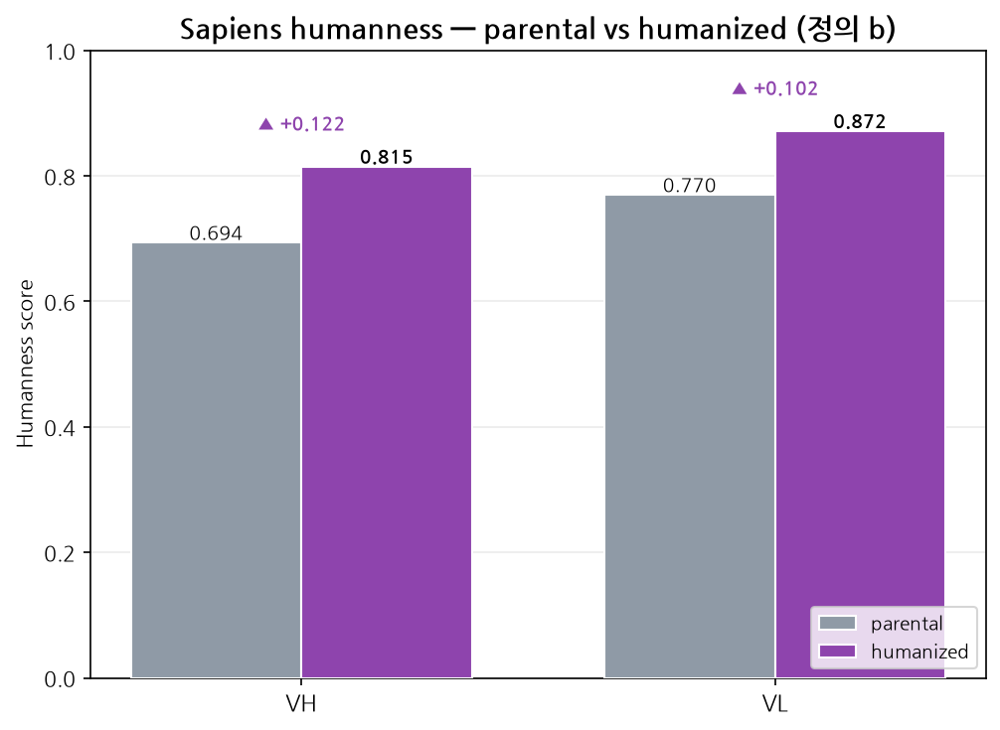

# Ch.05 — BioPhi / Sapiens / OASis

드디어 후보 서열을 만들 차례입니다. 그런데 많은 분들이 **첫 줄에서 막힙니다.** `pip install biophi`가 안 되기 때문입니다. 겨우 설치를 끝내고 나면 두 번째 함정이 기다립니다. 도구가 준 서열을 그대로 받아쓰면, **CDR이 통째로 갈려 나갑니다.**

이 챕터에서는 BioPhi 계열 도구를 제대로 깔고, Sapiens로 humanization을 직접 돌리고, 나온 서열을 **의심하며 읽는 법**을 익힙니다. 마지막엔 "사람다워졌는가"를 숫자와 그래프로 확인하고, 그 숫자가 **정의에 따라 달라진다**는 사실까지 짚습니다.

> **실습 — `05_sapiens_lab.ipynb`** · ① 직접 실행 → ② 내 결과 확인 → ③ 레퍼런스 대조 · **전 셀 6초**
>
> Sapiens 를 직접 돌려 인간화 서열을 만들고, **CDR 가드가 없으면 CDR-L1 이 부서지는 사고**를 재현해 봅니다. 이 챕터의 수치는 `sapiens` 1.1.0을 실제 설치·실행해 뽑았습니다. 입력은 [Ch.04](../04_sequence_qc/04_sequence_qc.md)의 parental VH/VL입니다.

---

## 5.1 설치 — 또 하나의 함정

BioPhi는 머크(Merck)가 공개한 humanization 통합 도구입니다. 그 안에서 실제 사람화를 담당하는 엔진이 **Sapiens**(항체 서열 전용 언어모델), humanness를 평가하는 게 **OASis**입니다.

문제는 설치입니다. 초안 그대로 `pip install biophi`를 돌리면 이렇게 죽습니다.

```
ERROR: Could not find a version that satisfies the requirement biophi (from versions: none)
ERROR: No matching distribution found for biophi
```

확인해보니 BioPhi는 **bioconda 전용(v1.0.11)**이고 PyPI에는 아예 없습니다. 반면 humanization 엔진인 **Sapiens는 PyPI에 `sapiens`(v1.1.0)로 따로** 올라와 있습니다. 그래서 "후보 서열만 빨리 뽑고 싶다"면 `pip install sapiens`가 제일 빠른 길입니다. 모델 가중치는 첫 실행 때 HuggingFace Hub에서 자동으로 받아옵니다.

```bash
conda activate abhuman

# BioPhi 전체(웹/CLI 포함) — PyPI 아님, bioconda 채널에서
conda install -c bioconda biophi

# humanization 엔진만 필요하면 이쪽이 훨씬 빠름 (PyPI)
python -m pip install sapiens
```

---

## 5.2 Sapiens로 실제 humanization 돌리기

Sapiens 1.1.0의 핵심 함수는 `predict_scores` 하나입니다. 서열을 넣으면 **position마다 20개 아미노산에 대한 사람 모델의 확률 분포**를 DataFrame으로 돌려줍니다. 행이 position, 열이 20개 아미노산입니다.

그럼 humanized 서열은 어떻게 만들까요? 각 position에서 확률이 가장 높은 잔기, 즉 **argmax**를 뽑아 이어 붙이면 그게 Sapiens-humanized 서열입니다.

```python
import sapiens

vh = "QVQLQQSGPELVKPGASVKMSCKASGYTFTDYVINWGKQRSGQGLEWIGEIYPGSGTNYYNEKFKAKATLTADKSSNIAYMQLSSLTSEDSAVYFCARRGRYGLYAMDYWGQGTSVTVSS"

# 위치별 사람 아미노산 확률 (rows=position, cols=20 AA)
df = sapiens.predict_scores(vh, "H")   # "H" = heavy chain, 경쇄는 "L"

# 각 위치에서 가장 사람다운 잔기 = argmax
humanized_vh = "".join(df.columns[df.values.argmax(axis=1)])
```

이 네 줄이 전부입니다. 너무 쉬워서 위험한 게 문제입니다. **argmax는 CDR인지 framework인지 구분하지 않습니다.** 다음 절에서 바로 터집니다.

---

## 5.3 결과 해석 — 실제 출력으로

위 코드를 [Ch.04](../04_sequence_qc/04_sequence_qc.md)의 parental 서열에 그대로 돌린 **실측 결과**입니다.

**Heavy chain (VH)** — 120 residue 중 **21개 mutation**(parental 대비 약 82.5% identity).

```
PARENTAL : QVQLQQSGPELVKPGASVKMSCKASGYTFTDYVINWGKQRSGQGLEWIGEIYPGSGTNYYNEKFKAKATLTADKSSNIAYMQLSSLTSEDSAVYFCARRGRYGLYAMDYWGQGTSVTVSS
SAPIENS  : QVQLVQSGPELKKPGASVKVSCKASGYTFTDYVINWVRQAPGQGLEWIGWINPGSGTTYYAEKFKGRVTLTADKSTNTAYMELSSLTSEDTAVYFCARRGRYGDYAMDVWGQGTLVTVSS
muts     : Q5V, V12K, M20V, G37V, K38R, R40A, S41P, E50W, Y52N, N58T, N61A, A66G, K67R, A68V, S76T, I78T, Q82E, S91T, L104D, Y109V, S115L
```

중쇄는 신호가 좋습니다. `R40A`, `A66G`, `K67R` 같은 자리는 전형적인 framework murine→human 치환이기 때문입니다. 우리가 기대하던 그림입니다.

**Light chain (VL)** — **17개 mutation**.

```
PARENTAL : QSALTQPPSASGSPGQSVTISCTGTSSDVGHKFPVSWYQQYPGKAPKLLIYKNLLRPSGVPDRFSGSKSGTSASLAITGLQAEDGADYYCQSYDSSLRVVFGGGTKTVVLG
SAPIENS  : QSALTQPPSASGSPGQSVTISCTGTSSDVGAYNDVSWYQQYPGKAPKLLIYGNSNRPSGVPDRFSGSKSGTSASLAITGLQAEDEADYYCQSYDSSLSVVVFGGGTKVTVL
muts     : H31A, K32Y, F33N, P34D, K52G, L54S, L55N, G85E, R98S, F101V, G102F, T105G, K106T, T107K, V109T, L110V, G111L
```

경쇄 mutation 목록의 앞머리를 다시 보십시오. **H31, K32, F33, P34.** [Ch.04](../04_sequence_qc/04_sequence_qc.md)에서 뽑은 light CDR1이 `SSDVGHKFP`(IMGT, 26–34번 자리)였습니다. 그 네 자리가 **전부 CDR-L1 안**입니다. 실제로 CDR-L1은 `SSDVGHKFP`에서 `SSDVGAYND`로, 알아볼 수 없게 갈려 나갔습니다. 이어지는 `K52G`·`L54S`도 CDR-L2(`KNL`) 안입니다.

즉 가드 없이 argmax humanization을 돌리면, 모델은 **항원과 직접 만나는 자리까지 사람 잔기로 갈아엎습니다.** 사람다움은 올라가지만 결합력은 사라질 수 있습니다. 모델은 "사람 항체에서 이 자리에 뭐가 자주 오는가"만 알지, "이 항체가 무엇에 붙어야 하는가"는 모르기 때문입니다.

> **주의 —** 그래서 실무에서는 셋 중 하나를 꼭 합니다. ① ANARCI로 뽑은 CDR 좌표를 argmax 대상에서 제외하거나, ② BioPhi humanization 모드처럼 CDR을 자동 보호하게 하거나, ③ 후처리로 CDR 내 mutation을 전부 parental로 되돌립니다. "도구가 준 서열을 그대로 쓰지 않는다"는 [Ch.02](../02_nomenclature_strategy/02_nomenclature_strategy.md)의 원칙이 이래서 중요합니다.

---

## 5.4 humanness가 정말 좋아졌나요? — 실측

mutation을 21개 넣었다고 사람다워졌다는 보장은 없습니다. 숫자로 확인해야 합니다. Sapiens 모델이 서열의 **자기 잔기에 부여하는 확률의 평균**(높을수록 사람답다)으로 parental과 humanized를 비교했습니다.



*parental 서열과 Sapiens humanized 서열의 humanness를 체인별로 비교한 막대입니다(값이 클수록 사람다움). [Ch.04](../04_sequence_qc/04_sequence_qc.md)의 parental VH/VL에 `sapiens` 1.1.0을 직접 돌려 나온 실측값을 `05_sapiens_lab.ipynb`에서 `humanization_viz.humanness_bars(rows, title, outpath)`로 그렸습니다(공용 모듈 → `humanization_viz.py`).*

| 체인 | parental mean human-prob | humanized mean human-prob | 변화 |
|---|---:|---:|---|
| VH | 0.694 | **0.815** | ▲ +0.121 |
| VL | 0.770 | **0.872** | ▲ +0.102 |

이야기가 깔끔하게 맞아떨어집니다. **VL은 출발점(0.770)이 이미 높았습니다.** [Ch.04](../04_sequence_qc/04_sequence_qc.md)에서 light germline identity가 81%로 높았던 것과 정확히 일치합니다. 반대로 **VH는 출발점이 낮았다가(0.694) 크게 개선**됐습니다. ANARCI germline 분석과 Sapiens humanness가 같은 결론을 가리키는 것입니다.

### 같은 실행, 다른 정의, 다른 값

여기서 한 가지를 못 박고 갑니다. "humanized의 humanness"는 계산 방법이 두 가지고, **값이 서로 다릅니다.**

| 정의 | 계산 방식 | 의미 |
|---|---|---|
| (a) argmax-on-parental | parental 문맥의 확률행렬에서 position별 **최대 확률**의 평균 | 모델이 각 자리에서 가장 자신 있던 값. humanized 서열을 다시 스코어링하진 않습니다 |
| (b) 재스코어링 self-prob | humanized 서열을 `predict_scores`에 **다시 넣어**, 그 서열 자기 잔기의 확률 평균 | 만들어진 서열이 실제로 얼마나 사람다운가 |

**위 표와 그림의 0.815 / 0.872는 (b)입니다.** 똑같은 실행을 (a)로 계산하면 0.782 / 0.851이 나옵니다. 숫자가 다르다고 어느 하나가 틀린 게 아닙니다. 재는 대상이 다를 뿐입니다. 그러니 humanness를 보고할 때는 **어느 정의인지 반드시 밝혀야 합니다.** 노트북에서는 둘 다 직접 계산해서 눈으로 확인합니다.

그리고 5.3의 CDR 가드를 적용하면 humanness는 조금 내려갑니다. CDR을 사람화하지 않았으니 당연하고, 그게 맞습니다. 결합력을 지키는 대가이기 때문입니다.

> **심화 — OASis는?** BioPhi의 OASis는 서열을 9-mer 펩타이드로 쪼개, 각 펩타이드가 OAS(Observed Antibody Space)의 실제 사람 항체에서 얼마나 자주 관찰되는지로 humanness를 매깁니다(`biophi oasis ...`). 다만 OAS DB 다운로드가 필요해 이 가이드에서는 다루지 않습니다. 위 표는 Sapiens 모델 확률로 계산한 대용 지표입니다.

---

## 이 챕터 핵심 요약

1. BioPhi는 **bioconda**, Sapiens는 **PyPI(`sapiens`)** — `pip install biophi`는 실패합니다.
2. Sapiens humanization = `predict_scores`의 **position별 argmax**.
3. 실측: VH 21 mutation·VL 17 mutation, humanness VH 0.694→0.815 / VL 0.770→0.872.
4. **가드 없이 돌리면 CDR까지 바뀝니다** — CDR-L1 `SSDVGHKFP`가 실제로 갈렸습니다. CDR 보호는 필수.
5. humanness는 **정의를 밝혀야** 합니다. 위 값은 (b) 재스코어링, (a)로는 0.782 / 0.851입니다.

---

다음 → **[06. CDR-safe 도구: Humatch · AnthroAb](../06_cdr_safe_tools/06_cdr_safe_tools.md)**
