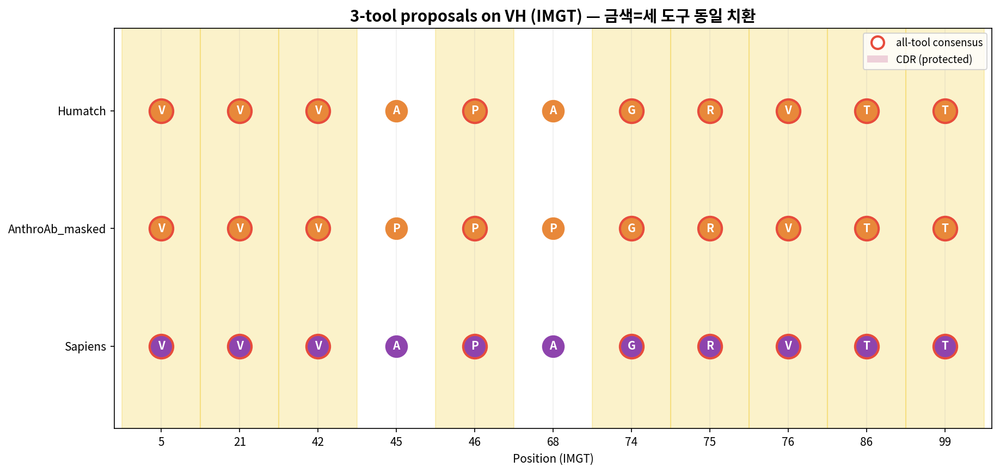

# Ch.06 — CDR-safe 도구: Humatch · AnthroAb

[Ch.05](../05_humanize_sapiens/05_humanize_sapiens.md)의 Sapiens는 후보를 잘 만들었어요. 그런데 가드 없이 돌리자 **CDR-L1을 건드려버렸죠.** 그럼 이런 생각이 들어요. 도구가 알아서 CDR을 지켜주면 안 되나요?

이 챕터의 두 도구가 그 질문에 각자 답해요. **Humatch**는 CDR 보호를 도구 안에 내장했고, **AnthroAb**는 내가 `*`로 찍은 자리만 채워요. 마지막엔 세 생성 모델(Sapiens·Humatch·AnthroAb)을 나란히 놓고, **세 도구가 똑같은 치환을 제안한 자리**를 실측으로 세어 봐요. 이 챕터의 수치는 Humatch 1.0.1(GitHub source)·AnthroAb 1.1.0(PyPI)을 실제 설치·실행해 뽑았어요.

> **실습 — `06_tools_lab.ipynb`** · ① 직접 실행 → ② 내 결과 확인 → ③ 레퍼런스 대조 · **전 셀 32초**
>
> Humatch·AnthroAb 를 직접 실행해 CDR 보존 여부를 확인하고, **세 도구의 합의 위치**를 실측으로 계산해요.

---

## 6.1 Humatch — gene-specific·paired humanization

BioPhi/Sapiens가 "서열 humanness" 축이라면, Humatch는 다른 축을 봐요. heavy와 light를 따로 보지 않고 **gene-specific하게, 그리고 VH/VL 페어링까지 함께** 고려해서 사람화해요. OPIG(옥스퍼드)에서 나온 도구예요.

### 6.1.1 설치 — GitHub source

```bash
# 함정: pip install humatch 는 안 돼요(PyPI에 없어요). GitHub에서 설치해요.
conda create -n humatch -c conda-forge python=3.10 -y
conda activate humatch
git clone https://github.com/oxpig/Humatch.git
cd Humatch
python -m pip install .          # humatch 1.0.1 + tensorflow 2.21 설치됨

# (핵심) Humatch는 내부적으로 anarci 모듈을 import해요. 같은 env에 꼭 깔아주세요.
conda install -c bioconda -c conda-forge anarci -y
```

설치에서 두 번 넘어져요. 첫째, `pip install Humatch`는 `No matching distribution found`로 실패해요(PyPI에 없거든요). GitHub source로 깔면 `humatch 1.0.1`과 TensorFlow 2.21이 문제없이 설치돼요. 둘째, 그렇게 깔고 `Humatch-humanise --help`를 돌리면 이렇게 죽어요.

```text
File ".../Humatch/align.py", line 12, in <module>
    import anarci
ModuleNotFoundError: No module named 'anarci'
```

Humatch가 정렬에 ANARCI를 쓰는데, 의존성으로 자동 설치되진 않아요. 같은 env에 `conda install -c bioconda anarci`로 깔아주면 CLI가 바로 정상 동작해요. [Ch.03](../03_setup/03_setup.md)의 `abhuman` env에 Humatch를 함께 깔면 이 문제를 아예 피할 수 있어요.

### 6.1.2 CLI 사용 예시

```bash
Humatch-humanise \
  -H QVQLQQSGPELVKPGASVKMSCKASGYTFTDYVINWGKQRSGQGLEWIGEIYPGSGTNYYNEKFKAKATLTADKSSNIAYMQLSSLTSEDSAVYFCARRGRYGLYAMDYWGQGTSVTVSS \
  -L QSALTQPPSASGSPGQSVTISCTGTSSDVGHKFPVSWYQQYPGKAPKLLIYKNLLRPSGVPDRFSGSKSGTSASLAITGLQAEDGADYYCQSYDSSLRVVFGGGTKTVVLG \
  -v
```

### 6.1.3 실행하면 무슨 일이 일어나나요? — 실제 로그

`Humatch-humanise`를 돌리면 먼저 모델 가중치(heavy/light/paired CNN)를 Zenodo에서 받고, config를 출력한 뒤 humanization을 시작해요. 실제 로그의 config 부분이 이것이에요.

```text
Config:                         Value
max_edit                           60
GL_allow_CDR_mutations_H        False    ← heavy CDR은 기본 보호
CNN_allow_CDR_mutations_H       False
GL_allow_CDR_mutations_L        False    ← light CDR도 기본 보호
CNN_allow_CDR_mutations_L       False
CNN_target_score_H               0.95    ← 이 점수에 도달할 때까지 사람화
CNN_target_score_L               0.95
...
Loading CNNs
Downloading heavy/light/paired model weights from zenodo... done
Humanising 1 sequences
```

여기서 Sapiens와 결정적으로 갈려요. [Ch.05](../05_humanize_sapiens/05_humanize_sapiens.md)의 가드 없는 argmax는 CDR-L1을 건드렸지만, Humatch는 **`allow_CDR_mutations=False`가 기본값**이에요. 시키지 않는 한 CDR을 아예 안 건드려요. CDR 보호가 도구 안에 내장돼 있는 거죠. 대신 framework는 **CNN 점수가 목표치(0.95)에 닿을 때까지 single-point variant를 반복 탐색**하며 사람화해요. 이 탐색은 시간이 꽤 걸려요. 코어를 여러 개 쓰거나 GPU에서 돌리면 빨라져요.

Python API로 직접 부를 땐 multiprocessing 함정이 하나 더 있어요. config의 `num_cpus`가 16이면, macOS처럼 프로세스를 spawn 방식으로 띄우는 플랫폼에서 `An attempt has been made to start a new process before the current process has finished its bootstrapping phase` 오류로 죽어요. 해결은 둘 중 하나예요. ① 스크립트를 `if __name__ == "__main__":` 가드 안에서 실행하거나, ② `config["num_cpus"]=1`로 단일 코어로 돌려요(느리지만 확실해요).

### 6.1.4 결과 해석 — 실측, 그리고 Sapiens와의 결정적 차이

위 명령을 [Ch.04](../04_sequence_qc/04_sequence_qc.md)의 parental 서열에 실제로 돌린(single-thread) 실측 결과예요. Humatch가 분류한 gene family는 **HV=`hv1`, LV=`lv2`** 로, Ch.04의 ANARCI 결과(IGHV1·IGLV1-40)와 **정확히 일치**해요. 두 도구가 독립적으로 같은 결론을 낸 거예요.

| 체인 | gene | mutation 수 | 최종 CNN 점수 | CDR 변경 |
|---|---|---:|---:|---|
| VH | hv1 | **18** | 0.972 | **0개** (CDR-H3 `ARRGRYGLYAMDY` 그대로) |
| VL | lv2 | **2** | 1.000 | **0개** (CDR-L1 그대로) |

VH mutation(18개: `Q5V, R40A, A66G, K67R, I78T, ...`)은 **전부 framework**예요. Sapiens가 찾은 mutation과 `Q5V·M20V·R40A·A66G·K67R·I78T·Q82E·S91T` 등 상당수가 겹쳐요. 두 도구가 공통으로 제안하는 자리라 **신뢰도가 높은 humanizing position**이라는 뜻이에요([Ch.02](../02_nomenclature_strategy/02_nomenclature_strategy.md) 심화의 "교차검증" 원칙이 실제로 작동해요).

경쇄에서는 차이가 더 극적으로 드러나요.

> **주의 — 같은 입력, 전혀 다른 CDR 안전성.** 똑같은 경쇄에 Sapiens(가드 없는 argmax)는 CDR-L1에 mutation 4개(`H31A, K32Y, F33N, P34D`)를 넣었어요. Humatch(기본 설정)는 VL 전체에 2개(`G85E, V108T`), **CDR에는 0개**예요. 도구의 성능이 아니라 **"CDR을 보호하느냐"는 설계 철학**의 차이가 이 결과를 갈라요.

그래서 실무에서는 두 축을 나눠 써요. **BioPhi/Sapiens**는 sequence humanness 중심의 후보 축이고, CDR 보호는 내가 직접 챙겨야 해요(Ch.05). **Humatch**는 gene-specific + paired humanization 보완 축이고, CDR 보호가 내장돼 있으며 **paired CNN**으로 VH/VL 페어링 타당성까지 점수화해요. 두 축의 결과를 나란히 놓고 **공통 mutation은 신뢰**하고(위 VH에서 실제로 다수 겹쳤죠), 단독 mutation은 검토 대상으로 남겨요.

---

## 6.2 AnthroAb — masked-LM targeted infilling

AnthroAb는 사람 항체 서열에 특화된 **RoBERTa 계열 masked language model**이에요. 빈칸(`*`)을 뚫어 둔 자리에 "사람이라면 여기 뭐가 올까?"를 채워주는(infilling) 도구죠. VH·VL 모델이 따로 있어요.

<!-- 근거: anthroab/predict.py(predict_best_score=전체 argmax / predict_masked=*·X 자리만), anthroab/cli.py(--humanize는 predict_masked만 사용), notebooks/antibody_infilling.ipynb("humanize all positions, not just masks" / "Predictions can even be made in CDR3 regions") -->

### 6.2.1 두 가지 사용 모드 — 자동 전체 변경 vs 커스텀 마스킹

AnthroAb로 humanization하는 길은 사실 **두 갈래**예요. repo의 `anthroab/predict.py`를 직접 열어 확인했는데, 두 함수의 동작이 정반대예요.

| 모드 | 함수 | 무엇을 바꾸나 | 노출 |
|---|---|---|---|
| **① 자동 전체 변경** | `predict_best_score(seq, chain)` | **모든 position**을 각 자리에서 가장 사람다운(human-likely) 잔기로 교체 | **API 전용** (CLI 없음) |
| **② 커스텀 마스킹** | `predict_masked(seq, chain)` | `*`(또는 `X`)로 표시한 **자리만** 교체, 나머지는 parental 그대로 | **CLI(`--humanize`) + API** |

**① 자동 전체 변경 — `predict_best_score`**

각 position의 사람 모델 확률 분포(`predict_scores`)에서 argmax(가장 확률 높은 잔기)를 뽑아 **서열 전체를 다시 써요.** 마스킹이 필요 없어요. parental 서열을 그대로 넣으면 돼요.

```python
import anthroab
vh = "QVQLQQSGPELVKPGASVKMSCKASG...YAMDYWGQGTSVTVSS"   # 마스킹 없이 그대로
humanized_vh = anthroab.predict_best_score(vh, "H")    # 모든 자리를 가장 사람다운 잔기로
```

이건 [Ch.05](../05_humanize_sapiens/05_humanize_sapiens.md)의 Sapiens `predict_scores` → argmax와 **개념·구현이 같아요**(AnthroAb README도 "Sapiens 인터페이스·기능을 그대로 따른다"고 밝혀요).

문제는 이 모드가 CDR을 전혀 보호하지 않는다는 점이에요. repo 노트북(`antibody_infilling.ipynb`)이 대놓고 "humanize **all positions**, not just masks"라고 적고, 따로 "Predictions can even be made in **CDR3** regions"라고도 명시해요. 즉 자동 모드는 Ch.05의 가드 없는 Sapiens argmax와 똑같이 **CDR까지 바꿔버려요.** 자동 모드를 쓸 거면 [Ch.04](../04_sequence_qc/04_sequence_qc.md)의 ANARCI CDR 좌표로 **후처리 복원**을 하거나, CDR을 마스킹에서 빼야 해요.

**② 커스텀 마스킹 — `predict_masked`**

바꾸고 싶은 자리만 `*`(또는 `X`)로 표시하면, **그 자리만** 사람 잔기로 채우고 나머지는 parental을 보존해요. 내부적으로는 `predict_best_score`를 돌린 뒤 **마스킹 안 한 자리를 원래대로 되돌리는** 방식이에요(repo 소스 기준). CLI `--humanize`가 쓰는 게 바로 이 모드이고, 구체적 사용법은 §6.2.4에서 다뤄요.

그래서 기본은 ②번이에요. humanization에는 절대 건드리면 안 되는 CDR이 있으니까요(Ch.04). 안전한 기본값은 "FWR 후보 자리만 `*`로 찍는" 커스텀 마스킹이에요. ①번 자동 모드는 "최대 사람화" 후보를 빠르게 훑고 싶을 때 쓰되, 반드시 CDR 가드와 함께 써요.

### 6.2.2 어떻게 쓰는 게 안전한가요?

AnthroAb는 "서열 전체를 한 방에 자동 humanization"하는 도구로 쓰기보다, **콕 집은 자리만 채워보는** 용도가 안전해요.

- BioPhi/Sapiens나 Humatch가 제안한 framework mutation을 **독립적으로 재확인**
- ANARCI로 정한 FWR 후보 위치만 `*`로 masking → targeted infilling
- CDR은 기본 보호, 꼭 필요할 때만 low-risk CDR edge에 제한적으로
- aggressive보다 **conservative·backmutation 후보** 설계의 보조 근거로

### 6.2.3 설치

```bash
conda activate abhuman
python -m pip install anthroab        # anthroab 1.1.0 설치됨
# 또는 source:
git clone https://github.com/nagarh/AnthroAb && cd AnthroAb && pip install -e .
```

AnthroAb 1.1.0은 `pip install`로 깔려요. RoBERTa-base 모델(VH `hemantn/roberta-base-humAb-vh`, VL `...-vl`)은 첫 실행 때 HuggingFace에서 자동으로 받아와요(가중치 약 164MB). API가 Sapiens와 거의 똑같아서(`predict_masked`, `predict_scores`) 배우기 쉬워요.

### 6.2.4 masked FASTA 규칙과 실행

`*`로 표시한 자리를 사람다운 잔기로 채워요. header는 `{name}_VH` / `{name}_VL` 형식을 권장해요.

```bash
cat > anthroab_input.fasta <<'FASTA'
>cloneA_VH
**QL*QSGPELVKPGASVKMSCKASGYTFTDYVINWGKQRSGQGLEWIGEIYPGSGTNYYNEKFKAKATLTADKSSNIAYMQLSSLTSEDSAVYFCARRGRYGLYAMDYWGQGTSVTVSS
>cloneA_VL
QSALTQPPSASGSPGQSVTISCTGTSSDVGHKFPVSWYQQYPGKAPKLLIYKNLLRPSGVPDRFSGSKSGTSASLAITGLQAEDGADYYCQSYDSSLRVVFGGGTKTVVLG
FASTA

anthroab -i anthroab_input.fasta -o anthroab_output.fasta --humanize
```

```python
import anthroab
masked_vh = "**QL*QSGPELVKPGASVKMSCKASG..."   # 바꿀 자리만 *
humanized_vh = anthroab.predict_masked(masked_vh, "H")
```

### 6.2.5 masking 전략

| masking 대상 | 권장 여부 | 설명 |
|---|---|---|
| FWR exposed residue | ✅ 권장 | humanness 개선 크고 결합 위험 낮음 |
| FWR buried residue | ⚠️ 주의 | packing 불안정 가능, 구조 검증 |
| Vernier zone | 🔸 제한적 | CDR conformation 받침대, backmutation과 함께 |
| VH/VL interface | ⚠️ 주의 | 페어링 orientation 변화 가능 |
| CDR core/paratope | ⛔ 보호 | 근거 없이는 절대 masking 안 함 |
| CDR edge residue | 🔸 제한적 | immunogenicity/developability 명확할 때만 |

### 6.2.6 실측 — Sapiens 제안을 AnthroAb로 교차검증

[Ch.05](../05_humanize_sapiens/05_humanize_sapiens.md)에서 Sapiens가 제안한 framework 위치(`Q5V, V12K, M20V, R40A, A66G, K67R, A68V, I78T, Q82E, S91T`)를 `*`로 masking해서 AnthroAb에게 독립적으로 물어봤어요. "이 자리, 사람이라면 뭐가 올까?" 두 도구가 같은 답을 내면 신뢰도가 올라가죠.

```python
import anthroab
VH = "QVQLQQSGPELVKPGASVKMSCKASG...YAMDYWGQGTSVTVSS"
masked = VH 위치 [5,12,20,40,66,67,68,78,82,91]을 "*"로 치환
filled = anthroab.predict_masked(masked, "H")
```

masking한 10곳 중 두 도구의 제안이 갈린 자리와 붙은 자리를 뽑으면 이래요.

| 위치 | parental | Sapiens 제안 | AnthroAb 제안 | 합의? |
|---:|:---:|:---:|:---:|:---:|
| 78 | I | **T** | **T** | ✅ 합의 |
| 5 | Q | V | Q | ✗ |
| 40 | R | A | G | ✗ |
| 66 | A | G | D | ✗ |
| 67 | K | R | K | ✗ |

여기까지만 보면 "합의는 78번 하나뿐"이라고 결론 내기 쉬워요. **그런데 그게 아니에요.** 위 표는 AnthroAb의 **FR-masked 모드**에서 Sapiens와 겹치는 자리 일부를 뽑은 것일 뿐이에요. 세 도구(Sapiens·Humatch·AnthroAb)가 **똑같은 치환을 제안한 자리**를 전부 세어 보면(`data/three_way_consensus.csv`, 노트북에서 직접 계산해요) 그림이 달라져요.

- **AnthroAb best-score 모드** — 합의 **7곳**. H5(Q→V), H21(M→V), H42(G→V), H68(N→A), H74(A→G), H75(K→R), L99(G→E) *(IMGT 번호)*. 이 모드에서는 `I78T`가 합의에 **들지 않아요.**
- **AnthroAb FR-masked 모드** — 합의 **12곳**. 위 7곳에 H46·H76·H86·H99 등이 더해지고, `I78T`(IMGT `H86`)가 **여기 포함돼요.**



*FR-masked 모드에서 VH의 IMGT 위치별 세 도구 제안을 한 장에 겹쳐 그린 그림. 금색 배경 + 빨간 테두리 = 세 도구가 **똑같은 치환**을 낸 자리, 흰 배경(H45·H68) = AnthroAb만 다른 잔기(P)를 제안해 합의에서 빠진 자리예요. 값은 노트북이 만든 `data/three_way_consensus.csv`, 그림은 `humanization_viz.mutation_map(rows, title, outpath)`에서 나왔어요.*

즉 `I78T`는 **합의 중 하나**이지 "유일한 합의"가 아니에요(이전 판의 서술을 실측에 맞게 바로잡았어요). 그럼에도 `I78T`가 특별한 이유는 따로 있어요. **번호 체계나 도구 모드를 바꿔도 살아남는**, 가장 강건한 합의라는 점이에요. 반대로 H45·H68처럼 **모드에 따라 제안 잔기가 갈리는 자리**(R→A vs R→P)는 합의로 치면 안 돼요.

도구마다 답이 갈리는 게 정상이에요. 그래서 도구 하나의 출력을 그대로 쓰지 않고, **여러 표를 모아 합의를 보는** 워크플로우가 중요해요. 합의를 셀 때는 **어떤 모드로 돌린 결과인지 반드시 함께** 적어요. 모드가 다르면 합의 개수가 7이 되기도, 12가 되기도 하니까요.

> **주의 — raw 인덱스와 IMGT 번호를 섞지 마세요.** Sapiens·AnthroAb의 변이 표기(`I78T`)는 **서열 1-based 인덱스**이고, 위 합의 목록은 **IMGT 번호**예요(`I78T` = IMGT `H86`). 섞어 쓰면 엉뚱한 잔기를 건드려요. 노트북의 `raw2imgt_H.json` 매핑으로 항상 변환해 쓰세요.

### 6.2.7 결과 해석

AnthroAb 출력은 최종 후보가 아니라 **mutation 제안의 한 표(vote)** 로 봐요. 우선순위를 올릴 만한 경우는 이래요.

- BioPhi/Sapiens·Humatch·AnthroAb가 **같은 자리에 같은 잔기**를 제안 (실측: best-score 모드 7곳, FR-masked 모드 12곳)
- 제안 잔기가 human germline·OAS repertoire에서 흔히 관찰됨
- 구조(ABodyBuilder3) 상 CDR geometry·interface가 안정적
- AbNatiV/TAP 지표가 parental 대비 개선

반대로 CDR·Vernier·interface·buried core에서 **AnthroAb만 단독 제안**한 mutation은 보수적으로 다뤄요.

---

<!-- 근거: biophi/biophi/humanization/methods/humanization.py(argmax+CDR graft), Humatch/Humatch/humanise.py·model.py(Conv1D CNN + germline-likeness + single-point greedy), HF config prihodad/biophi-sapiens1-vh(4L/128H) vs hemantn/roberta-base-humAb-vh(12L/768H), model.safetensors 2.2MB vs 164MB, AnthroAb README, Antibody_humanization_project/results/anthroab_argmax_softmax_comparison/ -->

## 6.3 모델 비교 — BioPhi/Sapiens vs Humatch vs AnthroAb

Ch.05~06에서 세 생성 도구를 하나씩 봤어요. 이제 **나란히 놓고** 언제 무엇을 쓸지 정리해요. 아래는 각 repo 소스를 직접 확인한 결과예요.

### 6.3.1 BioPhi/Sapiens vs Humatch — 학습 알고리즘 차이 및 장단점

| | BioPhi/Sapiens | Humatch |
|---|---|---|
| 방식 | 생성형 **언어모델(LM)** — RoBERTa masked-LM | 판별형 **CNN 분류기**(Conv1D; heavy/light/paired) + germline-likeness |
| 사람화 원리 | 위치별 사람 잔기 확률 → **argmax(greedy)**, iterative | **탐색**: ① germline-likeness 매칭 → ② CNN 점수가 목표(기본 0.95)에 닿을 때까지 single-point greedy |
| 페어링 | VH/VL 따로 | **VH/VL paired CNN**까지 함께 |
| CDR | 기본 보호(parental CDR graft back) + Vernier backmutation 옵션 | 기본 보호(`allow_CDR_mutations=False`) + 위치 고정 지원 |
| 속도 | 빠름(LM 추론 × iter) | 반복 탐색이라 무거움(§6.1.3) |

- **BioPhi/Sapiens(LM)** — 장점은 문맥을 학습한 부드러운 per-position 사람 프로파일, OASis 검증, **확률행렬**을 줘서 설명·마스킹·targeted에 유리하다는 점이에요. 단점은 argmax가 **결정적 단일 답**이고, 사람 분류기나 페어링을 직접 최적화하진 않는다는 점이에요.
- **Humatch(CNN 탐색)** — 장점은 사람 분류기 점수를 **목표치까지 직접 최적화**하고, gene-specific + **paired**이며, CDR 보호·위치 고정이 된다는 점이에요. 단점은 반복 탐색이라 계산 부담이 크고, 분류기 결정경계로 밀어붙이는 경향이 있으며, 상대적으로 신규 도구라는 점이에요.
- 근거: `biophi/.../humanization/methods/humanization.py`(argmax + CDR graft), `Humatch/Humatch/humanise.py`·`model.py`(CNN + single-point search).

### 6.3.2 BioPhi/Sapiens vs AnthroAb — 학습 데이터·모델 구조·크기, CDR

둘은 **API가 같아요**(둘 다 `RobertaForMaskedLM`, `predict_scores`/`predict_masked`/`predict_best_score`). AnthroAb README가 "Sapiens 인터페이스·기능을 그대로 따른다"고 명시하거든요. 차이는 **데이터와 덩치**예요.

| | BioPhi/Sapiens (`prihodad/biophi-sapiens1-vh`) | AnthroAb (`hemantn/roberta-base-humAb-vh`) |
|---|---|---|
| 구조 | RoBERTa, **4층 / 128차원** / 8 heads / FFN 256 | RoBERTa-base, **12층 / 768차원** / 12 heads / FFN 3072 |
| 가중치 크기 | **~2.2 MB** (≈0.5M params) | **~164 MB** (≈85M params) |
| max position | 146 | 192(VH) / 145(VL) |
| 학습 데이터 | OAS 항체 레퍼토리 (BioPhi/Sapiens, Prihoda 2022) | **human OAS (≤2025)** 에서 from scratch (README) |
| CDR | BioPhi 파이프라인이 **자동 보호**(parental CDR graft + Vernier 옵션) | 모델 자체엔 보호 없음 — `predict_best_score`(자동)는 **CDR 포함 전체 변경**, `predict_masked`만 마스킹 자리 변경(§6.2.1) |

한 줄로 줄이면 이래요. **AnthroAb는 Sapiens 설계를 그대로 따르되, 약 75배 큰 RoBERTa-base로 더 최신 human OAS에 재학습한 버전**이에요. 단 CDR 보호가 BioPhi처럼 파이프라인에 내장돼 있지 않으니 §6.2.1의 두 모드 구분이 중요해요.

- 근거: HF config(`prihodad/biophi-sapiens1-vh` 4L/128H vs `hemantn/roberta-base-humAb-vh` 12L/768H), 가중치 `model.safetensors` 2.2MB vs 164MB, AnthroAb README.

### 6.3.3 BioPhi의 argmax 방법 vs softmax 방법 — 차이 및 장단점

BioPhi/Sapiens는 위치별 **softmax 확률분포**를 만들어요. 갈리는 건 그다음이에요. 그 분포를 **어떻게 쓰느냐**죠.

| | argmax (BioPhi 기본) | softmax (sampling) |
|---|---|---|
| 방식 | 위치별 **최고 확률 잔기** 선택(greedy) | 분포에서 **확률적으로 샘플**(temperature) |
| 결과 | 결정적 **단일 서열 1개** | 같은 자리에서 **다양한 후보 다수** |
| 다양성 | 없음 | temperature↑ → 다양성↑, T→0 ≈ argmax |
| 용도 | "최대 사람화" 1안, 재현성 | 후보 라이브러리 생성 → downstream 스크리닝 |

- **argmax** — 장점은 결정적·재현 가능하고 "가장 사람다운" 단일 답을 준다는 점이에요. 단점은 후보가 1개뿐이라 더 나은 대안을 놓칠 수 있다는 점이에요.
- **softmax(sampling)** — 장점은 후보 다양성(스크리닝용 라이브러리)과 분포 탐색이에요. 단점은 시드에 의존하는 확률적 결과이고, 낮은 확률(위험) 잔기가 섞일 수 있어 downstream 필터링이 필수라는 점이에요.
- 근거: `biophi/.../humanization.py`는 `pred.idxmax(axis=1)` = **argmax만** 구현(BioPhi 기본). softmax 샘플링은 동일 확률출력의 대안적 사용으로, 같은 인터페이스의 Sapiens/AnthroAb에서 실측했어요(`ANTHROAB_ARGMAX_SOFTMAX_COMPARISON.md`: argmax H=10개 고정 mutation, softmax T=1=시드마다 11~15개).

정리하면 BioPhi 자체는 argmax만 제공해요. softmax 샘플링은 같은 확률출력을 다르게 쓰는 방법이고, 동일 API의 Sapiens/AnthroAb에서 구현·검증했어요. 어떤 방식을 쓰든 최종 후보는 구조·결합·발현 실험으로 검증해야 해요.

---

## 이 챕터 핵심 요약

1. **Humatch**는 `allow_CDR_mutations=False`가 기본값이에요. CDR 보호가 도구에 **내장**돼 있고, CNN 점수 0.95를 목표로 framework를 반복 탐색해요. 실측은 VH 18 mut(CNN 0.972)·VL 2 mut, **CDR 변경 0개**예요.
2. **AnthroAb**는 두 모드가 정반대예요. `predict_best_score`(전체 변경, CDR 미보호) vs `predict_masked`(마스킹 자리만). 기본은 **커스텀 마스킹**이에요.
3. 세 도구 합의는 **모드에 따라 달라져요** — best-score **7곳**, FR-masked **12곳**. `I78T`(IMGT `H86`)는 FR-masked 모드에서만 나타나지만, 번호 체계나 모드를 바꿔도 살아남는 **가장 강건한 합의**예요. 합의를 셀 땐 모드를 반드시 함께 적어요.
4. 세 모델은 축이 달라요. Sapiens(LM·확률행렬) · Humatch(CNN 탐색·paired) · AnthroAb(75배 큰 RoBERTa-base·targeted infilling).

---

다음 → **[07. Nativeness — AbNatiV · Ab-RoBERTa](../07_nativeness/07_nativeness.md)**
