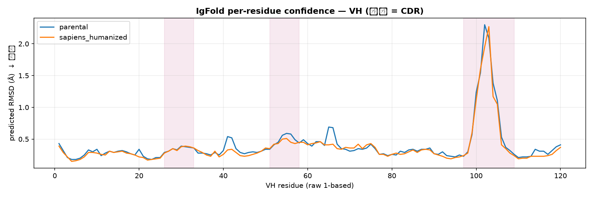

# Ch.08 — 구조 검증: ABodyBuilder3 / ImmuneBuilder / AntiFold

서열 점수는 전부 좋아졌어요. humanness도 올랐고, liability도 안 늘었고요. 그런데 여기서 아무도 대답 못 하는 질문이 하나 남아요. **그래서 CDR loop 모양은 그대로인가요?** 서열만 봐서는 알 수 없어요. framework를 몇 개 바꿨을 뿐인데 CDR-H3가 흔들리면 결합력은 그냥 사라져요.

그래서 이 챕터에서는 parental과 humanized 후보를 **둘 다 다시 접어서** 겹쳐 봐요. 핵심은 **만든 사람과 검증하는 사람을 분리**하는 거예요. 서열을 만든 건 Sapiens지만, 접는 건 그걸 전혀 모르는 독립 모델이에요. 그 모델이 내놓은 구조에서 CDR-H3가 얼마나 움직였는지를 Å로 재고, 그 값을 Ch.10 랭킹의 구조 보존 항목으로 넘길게요.

> **실습 — `08_structure_lab.ipynb`** · ① 직접 실행 → ② 내 결과 확인 → ③ 레퍼런스 대조 · **전 셀 7초**
>
> IgFold 로 parental·humanized 구조를 직접 예측하고 CDR-H3 RMSD 로 비교해요.

---

## 8.1 실행 예시 〔ABodyBuilder3·ImmuneBuilder는 본 환경 미실행 — GPU/모델 가중치〕

항체 구조 예측기는 여러 개예요. ImmuneBuilder 계열은 이런 식으로 불러요.

```bash
pip install ImmuneBuilder   # 설치는 최신 README 기준 확인
python predict_ab_structure.py --heavy H.fasta --light L.fasta --out candidate.pdb
```

실제로 돌린 건 **IgFold**예요. VH+VL Fv 하나를 접는 데 **parental 7.1초 · humanized 12.0초**가 걸렸어요(CPU 실측). 다만 기본값으로 부르면 두 번 죽어요. 아래 두 옵션을 반드시 꺼야 해요.

```python
runner.fold(out_pdb, sequences={"H": VH, "L": VL},
            do_refine=False,   # True 면 PyRosetta 를 요구하고, 없으면 그 자리에서 exit()
            do_renum=False)    # True 면 abnumber 재numbering — VL C-말단 G 가 IMGT 범위 밖이라 AssertionError
```

> **주의 —** ABodyBuilder3·ImmuneBuilder·AntiFold는 이 가이드를 검증한 환경에서 **실행하지 않았어요.** 그 도구들의 수치는 싣지 않고 명령 템플릿과 판정 기준만 둬요. 임의 값을 지어내지 않으려는 의도예요. 도구별 실행 상태는 [부록 재현 환경](../11_appendix/11_appendix.md)에 있어요.

---

## 8.2 구조 비교 지표

접었으면 이제 무엇을 볼지 정해야죠. 항목은 여럿이지만, **가장 결정적인 단일 지표는 CDR-H3 backbone RMSD**예요.

| 비교 항목 | 기준 |
|---|---|
| CDR-H3 backbone RMSD | parental 대비 낮을수록 선호 (가장 중요) |
| CDR-L1/L2/L3, H1/H2 RMSD | canonical loop 유지 |
| VH/VL orientation | interface mutation 영향 |
| buried residue mutation | packing 불안정 여부 |
| solvent-exposed hydrophobic patch | aggregation risk |
| positive/negative charge patch | viscosity/clearance risk |

재는 순서가 중요해요. **framework CA로 먼저 정렬**한 뒤, 그 상태에서 CDR-H3만 RMSD를 재요. 전체를 한꺼번에 정렬하면 loop의 변화가 framework 오차에 묻혀 버려요. 실습에서 나온 값은 이래요.

| 지표 | 값 | CA 개수 |
|---|---|---|
| framework 정렬 RMSD | **0.2707 Å** | 91 |
| CDR-H3 RMSD (framework 정렬 후) | **0.5406 Å** | 13 |
| VH 전체 RMSD | **0.3207 Å** | 120 |

CDR-H3가 framework보다 **2배 크게** 움직였어요. 그래도 0.54 Å 수준이면 canonical 구조는 유지된 것으로 봐요. loop가 다른 자리보다 잘 흔들린다는 건 IgFold 자신도 알고 있어요. per-residue 예측 오차(PDB의 B-factor 자리에 적혀요. 낮을수록 확신)를 그려 보면 바로 드러나요.



*IgFold가 VH 잔기마다 스스로 매긴 예측 오차(Å, 낮을수록 확신). 파란 선이 parental, 주황 선이 humanized이고 분홍 띠가 CDR 구간이에요. CDR-H3 구간에서만 값이 크게 솟는데, loop라서 정상이에요. `08_structure_lab.ipynb`가 두 예측 구조의 B-factor를 읽어 그린 그림이에요.*

> **심화 —** Sapiens는 CDR-H3 안에 mutation을 하나도 넣지 않았어요. 그런데도 loop가 움직였죠. framework 치환이 loop 받침대(Vernier)를 통해 CDR을 간접적으로 흔들기 때문이에요. "CDR을 안 건드렸으니 안전하다"는 서열만 보고 내리는 결론은 이래서 위험해요.

---

## 8.3 AntiFold로 backmutation 우선순위 잡기 〔본 환경 미실행〕

CDR-H3가 흔들렸다면, 다음 질문은 "그럼 어느 자리를 되돌릴까"예요. AntiFold는 구조 기반 inverse folding으로, 각 자리에 **구조적으로 어떤 잔기가 허용되는지**(residue tolerance)를 알려줘요. humanized 후보 구조에서 AntiFold가 "이 자리는 사람 잔기를 잘 허용 안 한다"고 하면, 그 자리가 backmutation 1순위 후보예요.

Sapiens mutation 목록과 AntiFold tolerance를 겹쳐 보면, "사람답게 바꾸고 싶지만 구조가 거부하는" 자리를 콕 집을 수 있어요. [Ch.01](../01_why_humanization/01_why_humanization.md)의 backmutation 우선순위 표(CDR 인접 → Vernier → interface → buried core …)를 구조 모델의 점수로 **데이터화**하는 셈이에요. 즉 "어디를 되돌릴까"를 감이 아니라 숫자로 정해요.

---

## 이 챕터 핵심 요약

1. 서열 지표가 좋아져도 **CDR-H3 geometry·VH/VL orientation·packing이 깨지면 실패**예요. 만든 도구와 다른 도구로 검증해요.
2. IgFold로 VH+VL Fv를 접는 데 **7.1초(parental)·12.0초(humanized)**가 걸렸어요. `do_refine=False`·`do_renum=False`가 필수예요.
3. 가장 중요한 단일 지표는 **CDR-H3 backbone RMSD**(parental 대비). 실측 **0.5406 Å**, framework 자체는 0.2707 Å이에요.
4. **AntiFold**의 residue tolerance는 backmutation 후보 우선순위를 정하는 데 유용해요.
5. ABodyBuilder3·ImmuneBuilder·AntiFold는 **〔본 환경 미실행〕** — 명령 템플릿과 판정 기준만 제공해요.

---

다음 → **[09. Developability 평가](../09_developability/09_developability.md)**
