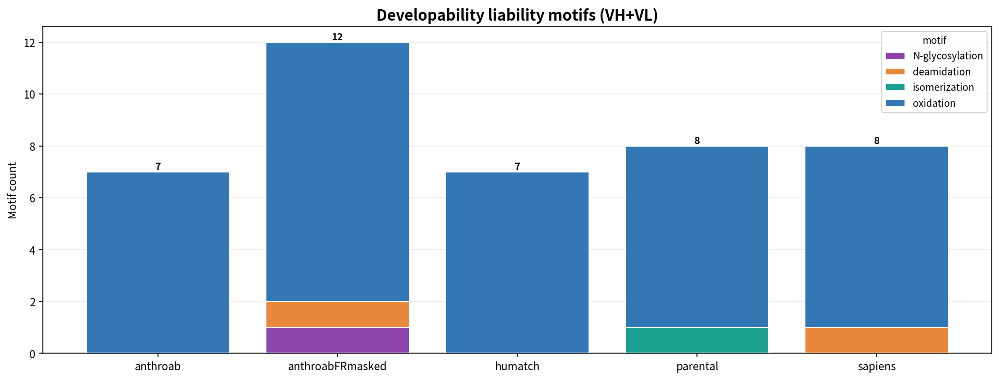

# Ch.09 — Developability 평가

humanness 점수가 제일 높은 후보를 골랐습니다. 그런데 그 후보에 당쇄가 하나 더 붙습니다. 보관하다 보면 전하가 변합니다. **사람다운데 만들 수가 없습니다.**

이 챕터에서는 후보를 humanness로만 줄 세우면 안 되는 이유를 봅니다. 발현·안정성·응집·점도 같은 **개발성(developability)** liability를 어떤 지도로 훑는지, 그리고 humanization이 **없던 liability를 새로 만든 자리**를 어떻게 잡아내는지 실측 결과로 풀어드리겠습니다.

> **실습 — `09_developability_lab.ipynb`** · ① 직접 실행 → ② 내 결과 확인 → ③ 레퍼런스 대조 · **전 셀 1초**
>
> liability 모티프(N-glyc·deamidation·oxidation·isomerization)를 직접 스캔해 후보별 위험을 비교합니다.

---

## 9.1 무엇을 보나 — liability 지도

liability는 한 종류가 아닙니다. 서열만 봐도 잡히는 것이 있고, 구조가 있어야 잡히는 것이 있습니다. 먼저 전체 지도를 펼쳐 보겠습니다.

| 항목 | 예시 liability |
|---|---|
| Chemical liability | N-glycosylation `NXS/T`, deamidation `NG/NS`, oxidation `Met/Trp`, isomerization `DG`, unpaired Cys |
| Aggregation risk | exposed hydrophobic patch, high SAP |
| Charge risk | high pI, large positive patch, 비대칭 charge 분포 |
| Stability risk | buried polar mutation, proline/glycine disruption |
| Expression risk | non-natural motif, 비정상 framework residue |
| Polyspecificity | 큰 hydrophobic/positive paratope |

위쪽 chemical liability는 **서열 한 줄이면 스캔**됩니다. 정규식으로 바로 잡히기 때문입니다. unpaired Cys도 마찬가지로 짝 없는 시스테인이 미스폴딩·이량체를 부르는 자리입니다.

반면 아래쪽은 구조가 필요합니다. **SAP**(Spatial Aggregation Propensity)는 표면 소수성 패치를 정량화하니까, [Ch.08](../08_structure/08_structure.md)에서 예측한 구조가 있어야 계산됩니다. **charge patch**는 표면 전하가 한쪽으로 몰린 정도이고, 점도(viscosity)·클리어런스 위험과 연결됩니다.

> **심화 —** 구조 기반 지표는 예측 구조의 품질을 그대로 물려받습니다. 그래서 SAP·charge patch 값은 절대 기준선으로 자르기보다 **후보 간 상대 비교**로 읽는 것이 안전합니다. 같은 파이프라인으로 뽑은 값끼리는 오차가 같은 방향으로 실리기 때문입니다.

---

## 9.2 가장 흔한 사고 — humanization이 새 liability를 만든다

humanization은 framework를 사람 서열로 갈아끼우는 일입니다. 그 과정에서 어떤 자리가 N으로 바뀌고, 하필 두 칸 뒤가 S나 T입니다. 그러면 없던 `NXS/T` glycosylation 모티프가 **새로 생깁니다**. 후보를 사람답게 만들다가 약을 못 만들게 되는 것입니다.

그래서 절대 개수보다 중요한 건 **parental 대비 증분**입니다. 원래 있던 모티프는 parental 항체가 이미 견디던 자리입니다. 진짜 위험은 humanization이 새로 심은 자리입니다. 스캔은 정규식 네 줄이면 끝납니다.

```python
import re

MOTIFS = {
    "N-glycosylation": r"N[^P][ST]",   # NXS/T (X != P) — P 가 끼면 당쇄가 안 붙습니다
    "deamidation":     r"N[GS]",       # NG / NS
    "isomerization":   r"DG",
    "oxidation":       r"[MW]",
}

def scan(seq):
    return {name: [m.start() + 1 for m in re.finditer(p, seq)]
            for name, p in MOTIFS.items()}

# parental 에 없던 자리만 = humanization 이 새로 만든 liability
new_flags = {k: sorted(set(scan(humanized)[k]) - set(scan(parental)[k])) for k in MOTIFS}
```

후보 다섯 종을 이렇게 스캔해 쌓아 보면 그림이 확 갈립니다.



*후보별 liability 모티프 개수(VH+VL 합)를 모티프 종류로 쌓은 그림입니다. `09_developability_lab.ipynb` 의 정규식 스캔 결과를 `humanization_viz.liability_overview` 로 그린 것이고, 레퍼런스 값은 `data/liability_reference.csv` 에 들어 있습니다.*

parental은 **8건**이고 그중 isomerization이 1건입니다. 나머지는 대부분 oxidation(`Met/Trp`)인데, Met·Trp은 서열에 흔해서 개수만으로는 잘 갈리지 않습니다. 눈에 띄는 건 anthroAb **FR-masked** 후보입니다. 총 **12건**으로 가장 많고, parental에 **없던** N-glycosylation 모티프가 **1건**, deamidation이 **1건** 새로 생겼습니다. Sapiens 후보도 새 deamidation이 1건 붙었습니다. humanness가 오른 만큼 liability도 같이 올라간 셈입니다.

신규 `NXS/T`는 그중에서도 제일 위험합니다. 예상치 못한 당쇄는 이질성과 클리어런스 문제로 바로 이어지기 때문입니다. [Ch.10](../10_ranking_report/10_ranking_report.md)에서 이런 자리를 **hard filter**로 거릅니다.

> **주의 —** 같은 모티프라도 **CDR 안**에 떨어지면 위험도가 다릅니다. 결합에 직접 영향을 주기 때문입니다. 다만 CDR 좌표는 parental 기준입니다. indel이 있는 후보(Humatch VL)는 위치가 한 칸씩 밀릴 수 있으니, 번호를 그대로 믿지 말고 다시 매핑하십시오.

---

## 9.3 TAP — 임상 항체 분포와 비교하기 〔웹 전용, 본 환경 미실행〕

**TAP**(Therapeutic Antibody Profiler)는 임상단계 항체 분포와 비교해 developability flag를 줍니다. 여러분의 후보가 실제 약이 된 항체들의 분포 안에 있는지를 보는 것입니다. 단, TAP도 구조 예측 품질에 의존합니다. 그래서 절대값보다 **후보 간 상대 비교**에 더 유용합니다.

---

## 이 챕터 핵심 요약

1. humanness가 높아도 **liability가 붙으면 약이 못 됩니다** — 랭킹에 developability를 반드시 포함하십시오([Ch.10](../10_ranking_report/10_ranking_report.md)).
2. humanization은 **새 모티프를 만들 수 있습니다**(특히 신규 `NXS/T`) — parental 대비 **증분 스캔**이 정답입니다. FR-masked 후보가 실제로 그랬습니다.
3. 구조 기반 지표(SAP·charge patch·TAP)는 Ch.08의 예측 구조 위에서 돌아가고, **후보 간 상대 비교**로 읽습니다.

---

다음 → **[10. 후보 랭킹·GuideDB·실험 검증](../10_ranking_report/10_ranking_report.md)**
