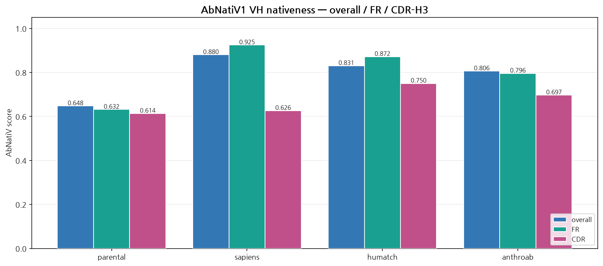
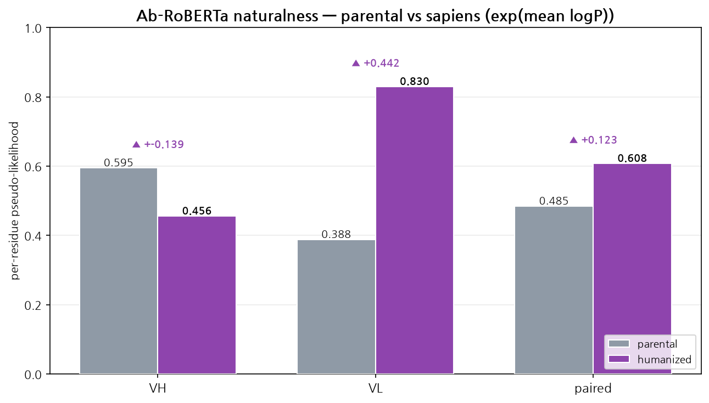

<div style="text-align:center">

# 항체 Humanization 완전 정복 — 비인간 항체를 사람 항체로

</div>

> **이 과정은 항체 humanization을 처음부터 끝까지 다루는 자기완결형(self-contained) 통합 실무 가이드예요.**
> 입력 서열 정리(numbering·CDR annotation)에서 출발해, 도구별 후보 생성(BioPhi/Sapiens·Humatch·AnthroAb)·정량 평가(humanness·nativeness·naturalness)·구조 검증·developability·랭킹·실험 검증 제안까지 한 문서 세트로 끝내요.
> 모든 명령과 수치는 **실제 실행 결과 기반**이에요. 돌리지 못한 도구는 **〔본 환경 미실행〕** 으로 정직하게 표시했어요. (실행 환경 상세 → [부록 재현 환경](11_appendix/11_appendix.md))

## 0. 과정 개요

Humanization은 mouse·rat·rabbit 항체의 variable domain을 사람 항체 레퍼토리에 가깝게 바꾸는 일이에요. 그런데 항원에 달라붙는 CDR과 그걸 떠받치는 핵심 framework는 건드리면 안 돼요. 이 두 요구가 정면으로 부딪히죠. 그래서 도구 하나로 끝나지 않아요.

대신 네 단계를 오가는 워크플로우로 보면 안전해요.

1. **입력 정리** — VH/VL 분리, numbering, CDR/FWR annotation, germline assignment
2. **후보 생성** — BioPhi/Sapiens, Humatch, AnthroAb, CDR grafting/backmutation으로 humanized 후보 만들기
3. **평가** — humanness/nativeness, CDR 보존성, germline identity, liability, developability, VH/VL 페어링 점검
4. **구조 검증** — 구조 예측으로 CDR geometry·residue tolerance 확인

이 과정은 다음을 **모두** 담아요.

- **개념·이론** — 왜 humanization을 하는가, CDR grafting·resurfacing·backmutation의 원리, 명명법의 함정
- **실무 전 과정** — 입력 준비(QC·numbering) → 설치 → 도구별 실행 → 메트릭 해석 → 랭킹
- **도구별 실습** — ANARCI · IgBLAST · BioPhi/Sapiens · Humatch · AnthroAb · AbNatiV · Ab-RoBERTa · 구조 검증
- **재현 가능한 명령과 그래프**, 그리고 실제 실행해 얻은 수치

### 0.1 한눈에 보는 권장 파이프라인

```text
Raw VH/VL FASTA
  → ANARCI / IgBLAST      : numbering, CDR/FWR annotation, germline assignment
  → BioPhi/Sapiens        : humanized 후보 생성
  → Humatch               : gene/pairing 관점 후보 보완
  → AnthroAb (masked-LM)  : targeted infilling + mutation 교차검증
  → AbNatiV / Ab-RoBERTa  : nativeness·naturalness 평가, 후보 필터링
  → ABodyBuilder3/ImmuneBuilder : 구조 예측, CDR loop sanity check
  → TAP / developability  : liability flagging
  → 후보 5~20개 rank
  → 실험 발현·결합·열안정성 검증
```


## 1. 대상 독자와 사전 요구사항

**대상**

- 비인간 항체 서열(mouse/rat/rabbit hybridoma 등)을 손에 쥐고, 이걸 치료용으로 사람화해야 하는 연구자
- in silico humanization 결과를 정량 해석하고, 후보에 순위를 매겨 실험으로 넘기려는 실무자
- BioPhi·Humatch·AnthroAb·AbNatiV·ANARCI·IgBLAST를 하나의 워크플로우로 엮으려는 계산생물학 실무자

**준비물**

- **웹 브라우저.** 실습 노트북은 Colab에서 그대로 열려요. 챕터 상단 **실습 콜아웃**에 노트북 링크가 붙어 있어요. 설치 없이 그 챕터의 명령을 따라 할 수 있어요.
- Python·CLI 기본기와 conda 경험. 없어도 괜찮아요 — [Ch.03](03_setup/03_setup.md)에서 환경을 함께 만들어요.
- 항체 구조 기초(VH/VL, CDR/FWR, IgG/Fab/Fv). 핵심 용어는 본문과 [부록 용어집](11_appendix/11_appendix.md)에서 다시 설명해요.
- 로컬에서 직접 돌리고 싶다면 conda 환경 하나면 돼요([Ch.03](03_setup/03_setup.md)). 체크포인트를 내려받는 도구는 본문에 용량을 적어 뒀어요.


## 2. 과정 구성 — 챕터별 자기완결

각 챕터는 **자기 폴더 안에 본문(.md)·노트북(.ipynb)·그래프(.png)** 를 함께 담아요. 한 스텝을 배울 때 그 폴더만 보면 돼요.

### Part A — 개념과 전략

| Ch | 폴더 | 영역 | 핵심 내용 |
|----|------|------|-----------|
| **01** | [01_why_humanization/](01_why_humanization/01_why_humanization.md) | 왜 humanization인가 | 항체 구조, CDR/FWR, Vernier zone, 면역원성(ADA/HAMA), CDR grafting + backmutation |
| **02** | [02_nomenclature_strategy/](02_nomenclature_strategy/02_nomenclature_strategy.md) | 명명법·도구 지도·전략 | `-ximab/-zumab/-umab`과 2021 신체계, 생성 vs 평가 도구, 후보 스펙트럼, end-to-end 워크플로우 |
| **03** | [03_setup/](03_setup/03_setup.md) | 환경 구성 | conda env, 도구별 설치 경로(bioconda·PyPI·GitHub), 설치 검증 |

### Part B — 도구별 실습 (실측 검증)

| Ch | 폴더 | 도구 | 본 환경 검증 |
|----|------|------|--------------|
| **04** | [04_sequence_qc/](04_sequence_qc/04_sequence_qc.md) | ANARCI · IgBLAST | ✅ ANARCI · ✅ IgBLAST |
| **05** | [05_humanize_sapiens/](05_humanize_sapiens/05_humanize_sapiens.md) | BioPhi / Sapiens | ✅ Sapiens |
| **06** | [06_cdr_safe_tools/](06_cdr_safe_tools/06_cdr_safe_tools.md) | Humatch · AnthroAb (+3-모델 비교) | ✅ Humatch · ✅ AnthroAb |
| **07** | [07_nativeness/](07_nativeness/07_nativeness.md) | AbNatiV · Ab-RoBERTa | ✅ AbNatiV · ✅ Ab-RoBERTa |
| **08** | [08_structure/](08_structure/08_structure.md) | ABodyBuilder3 / ImmuneBuilder / AntiFold | 〔본 환경 미실행〕 |
| **09** | [09_developability/](09_developability/09_developability.md) | liability 모티프 · TAP | 〔TAP 본 환경 미실행〕 |

### Part C — 정리와 운영

| Ch | 폴더 | 내용 |
|----|------|------|
| **10** | [10_ranking_report/](10_ranking_report/10_ranking_report.md) | 후보 랭킹 스키마 · 운영형 GuideDB YAML · 실험 검증 제안 · lab-in-the-loop |
| **11** | [11_appendix/](11_appendix/11_appendix.md) | 최종 체크리스트 · 참고자료 · 재현 환경 · 용어집 |


## 3. 실습 노트북 (각 챕터 폴더 안)

노트북은 별도 폴더에 모여 있지 않아요. **해당 챕터 폴더 안**에 있고, 본문 상단 실습 콜아웃에서 링크돼요. 브라우저(Colab)가 기본 경로이고, 로컬 주피터에서도 그대로 열려요.

각 노트북은 **① 도구를 직접 실행 → ② 내가 만든 결과 확인 → ③ 레퍼런스 대조** 순서로 흘러가요. 여러분이 돌린 산출물은 챕터 폴더의 `my_run/`에 쌓여요. 저장소에 커밋된 `data/`는 **대조군**으로만 써요. 어느 단계를 건너뛰거나 실패해도 자동으로 `data/`로 폴백하니 다음 절이 계속 돌아가요. 어느 쪽을 쓰는지는 노트북이 출력해 줘요.

아래 **소요 시간은 노트북의 모든 셀을 실제로 실행해 측정한 값**이에요.

| 노트북 | 챕터 | 직접 실행하는 것 | 전 셀 실행 |
|--------|------|------------------|-----------|
| `03_setup_check.ipynb` | 03 | 도구 설치·환경 점검 | 6초 |
| `04_numbering_lab.ipynb` | 04 | ANARCI/abnumber numbering → CDR 추출 → germline 할당 | 1초 |
| `05_sapiens_lab.ipynb` | 05 | Sapiens 인간화 + **CDR 가드 실패 재현** | 6초 |
| `06_tools_lab.ipynb` | 06 | Humatch·AnthroAb 실행 + **3도구 합의 계산** | 32초 |
| `07_nativeness_lab.ipynb` | 07 | Ab-RoBERTa pseudo-likelihood 계산 (AbNatiV는 선택) | 96초 |
| `08_structure_lab.ipynb` | 08 | IgFold 구조 예측 + CDR-H3 RMSD | 7초 |
| `09_developability_lab.ipynb` | 09 | liability 모티프 스캔 | 1초 |
| `10_ranking_lab.ipynb` | 10 | 앞 랩 결과를 모아 랭킹 + candidate report | 5초 |

> 표의 시간은 **셀 실행 시간**이에요. Colab에서 처음 열면 여기에 패키지 설치가 더해져요 — 실측으로 노트북 한 권당 **1~6분**(설치 포함, 두 번째 실행부터는 표의 시간).

공용 그래프 모듈 `humanization_viz.py`는 `humanization_guide/` 루트에 있어요. 각 노트북이 `sys.path`에 루트를 추가해 import해요.

AbNatiV만 예외예요. 체크포인트가 약 2GB라 노트북에서 기본 비활성(`RUN_ABNATIV = False`)이에요. 켜지 않으면 커밋된 점수로 이어지고, 켜는 법은 Ch.07에 있어요.


## 4. 빠른 시작 (Quick Start)

### (A) 브라우저에서 바로 — 설치 없음 (권장 입문)

[Ch.01](01_why_humanization/01_why_humanization.md)부터 읽으면서, 챕터 상단 실습 콜아웃의 노트북 링크를 Colab으로 열어요. 명령·수치·그래프가 본문과 1:1로 대응해요.

### (B) 로컬에서 직접 돌리기 — conda 환경 하나

```bash
# 1) 공용 환경 (Ch.03 상세) — ANARCI는 PyPI가 아니라 bioconda에 있습니다
conda create -n abhuman -c conda-forge -c bioconda python=3.10 anarci hmmer -y
conda activate abhuman
ANARCI --help

# 2) humanization 엔진 (Ch.05)
python -m pip install sapiens

# 3) parental 서열 numbering + germline (Ch.04)
ANARCI -i parental.fasta --scheme imgt --assign_germline --use_species human --csv -o anarci_gl
```

> **주의 —** `pip install anarci` / `pip install biophi` / `pip install humatch` 는 **모두 실패**해요. 각각 bioconda·bioconda·GitHub source가 정답이에요. 자세한 사정은 [Ch.03](03_setup/03_setup.md)에 있어요.


## 5. 학습 경로

```text
[개념]  01 왜 humanization → 02 명명법·도구 지도·전략
                                   │
[준비]  03 환경 구성 ───────────────┘
            │
[실습]  04 입력 QC(ANARCI/IgBLAST) → 05 BioPhi/Sapiens → 06 Humatch·AnthroAb
            → 07 AbNatiV·Ab-RoBERTa → 08 구조 검증 → 09 developability
            │
[정리]  10 랭킹·GuideDB·실험 검증 → 11 부록(체크리스트·참고자료·용어집)
```

- **입문자** — 01부터 11까지 순서대로.
- **급하면** — 03(환경) → 04(입력 QC) → 관심 도구 챕터로 바로. 단, 처음이라면 **04를 먼저** 보세요. 뒤의 모든 단계가 04에서 만든 numbering·annotation 위에서 돌아가거든요.


## 6. 표기 규약

- `코드` = 실제 명령·파일명·함수명·메트릭 컬럼명
- **실습 —** 직접 따라 할 부분 · **심화 —** 더 깊이 · **주의 —** 흔한 함정 · **케이스 스터디 —** 실제 겪은 사례
- 수치는 전부 실제 실행 결과예요. 이 가이드를 검증한 환경에서 돌리지 못한 GPU·웹 전용 도구는 **〔본 환경 미실행〕** 으로 표시해요. 임의 값을 지어내지 않으려는 뜻이에요.
- 실행 환경(하드웨어·버전)은 [부록 재현 환경](11_appendix/11_appendix.md)에 모아 뒀어요.

<div class="pagebreak"></div>

<div style="text-align:center">

# Ch.01 — 항체 humanization, 왜 하고 무엇을 지켜야 하나요?

</div>

mouse 항체가 실험실에서는 항원에 기가 막히게 잘 붙어요. 그런데 사람 몸에 넣는 순간 이야기가 달라져요. 면역계가 그걸 "남의 단백질"로 귀신같이 알아보거든요. 그래서 서열을 사람답게 고쳐요. 그러다 결합력을 통째로 날려먹기도 하고요.

이 챕터에서는 humanization이 **왜** 필요한지, 그리고 왜 그게 "사람처럼 보이게 칠하는 일"이 아니라 **결합력과 사람다움 사이의 줄타기**인지를 짚어요. 항체 구조에서 건드려도 되는 자리와 절대 건드리면 안 되는 자리, 그리고 고전 해법인 CDR grafting·backmutation까지 훑을게요.


## 1.1 항체는 어떻게 생겼나요? — 손가락은 CDR, 손바닥은 framework

항체는 heavy chain과 light chain으로 이뤄져요. 항원에 달라붙는 일은 주로 variable domain, 그중에서도 **VH와 VL의 CDR1/2/3**가 맡아요. CDR이 항원과 직접 악수하는 손가락이라면, framework region(FWR)은 그 손가락을 받쳐주는 손바닥·손목이에요.

여기서 흔한 오해가 하나 나와요. "그럼 framework는 사람 것으로 다 갈아끼워도 되겠네?" 아니에요. framework 안에도 결합에 중요한 자리가 숨어 있어요. 대표적으로 네 종류예요.

| 숨은 자리 | 하는 일 |
|---|---|
| **Vernier zone** | CDR loop의 모양(conformation)을 아래에서 받쳐줘요 |
| **VH/VL interface residue** | 두 도메인이 맞물리는 면이에요 |
| **canonical loop determinant** | CDR의 표준 형태를 결정해요 |
| **buried core residue** | 안쪽에 파묻혀 패킹을 잡아줘요 |

이 자리들을 함부로 사람 잔기로 바꾸면 어떻게 될까요? 서열은 사람다워졌는데 정작 항원에 안 붙는 사태가 벌어져요. 사람다움 점수만 보고 좋아하다가 약을 잃는 셈이죠.

> **주의 —** framework를 통째로 사람화하면 사람다움 점수는 확실히 올라가요. 그런데 CDR을 받치던 자리까지 함께 바뀌면 결합이 무너져요. 실제로 그런 일이 벌어지는 걸 [Ch.05](05_humanize_sapiens/05_humanize_sapiens.md)에서 직접 보게 돼요.


## 1.2 그래서, humanization은 왜 하나요? — ADA/HAMA와 네 가지 균형

가장 근본적인 질문부터 볼게요. 비인간 항체를 사람 몸에 넣으면 무슨 일이 생길까요?

우리 면역계는 남의 단백질을 그냥 두지 않아요. mouse 유래 항체를 사람에게 투여하면 **항-약물 항체(ADA)** 반응이 생겨요. 옛날 표현으로는 **HAMA(Human Anti-Mouse Antibody)**죠. 그다음은 도미노예요.

- 약이 금방 제거돼서 **반감기(PK)가 짧아져요**
- 효능이 떨어지거나 **알러지·아나필락시스 같은 안전성 문제**가 생겨요
- 결국 **규제 승인**도 어려워져요

그래서 humanization의 진짜 목표는 "사람처럼 보이기" 하나가 아니에요. 네 가지의 **균형**이에요.

- 사람 항체 레퍼토리에 가까운 sequence profile 확보 (면역원성 ↓)
- CDR/paratope geometry 유지 (결합력 유지)
- 발현량·안정성·용해도 확보, aggregation 위험 ↓ (개발성)
- 제조 가능성·규제 적합성 개선

쉽게 비유하면 번역이에요. **외국어를 현지인처럼 자연스럽게 다듬되, 원문의 핵심 메시지는 한 글자도 바꾸지 않는 번역**이죠. 문장을 매끄럽게 고치다가 정작 뜻이 바뀌면 그건 번역 실패예요.


## 1.3 CDR grafting과 backmutation — 고전이지만 여전히 핵심

가장 고전적인 humanization은 **CDR grafting**이에요. murine 항체의 CDR을 통째로 떼어내요. 그리고 사람 germline(또는 사람 acceptor framework) 위에 이식해요. 손가락(CDR)은 그대로 두고 손바닥(framework)만 사람 것으로 바꾸는 셈이에요.

그런데 이렇게만 하면 결합력이 뚝 떨어지는 경우가 많아요. 왜 그럴까요? 사람 framework가 원래 CDR loop를 받쳐주던 미묘한 받침대 역할을 못 하기 때문이에요. 그래서 **backmutation**을 해요. framework의 일부 자리를 원래 murine 잔기로 되돌리는 작업이죠. 어디를 되돌릴지는 보통 이 순서로 검토해요.

| 우선순위 | 되돌림 후보 위치 | 이유 |
|---:|---|---|
| 1 | CDR 바로 인접 framework residue | CDR 모양에 직접 영향 |
| 2 | Vernier zone residue | loop conformation 받침대 |
| 3 | VH/VL interface residue | 두 도메인 페어링 유지 |
| 4 | buried core residue | 패킹 안정성 |
| 5 | canonical loop 지지 residue | 표준 loop 형태 유지 |
| 6 | 항원과 직접 접촉하는 framework residue | 드물지만 결정적 |

위쪽일수록 CDR 모양에 직접 영향을 줘요. 그래서 상위 후보부터 하나씩 되돌리며 결합력이 돌아오는지 확인해요. 반대로 되돌리는 자리가 늘어날수록 사람다움은 다시 내려가요. 이게 바로 줄타기예요.

> **심화 —** 요즘은 grafting 대신 **resurfacing**도 써요. 표면 노출 잔기만 사람 것으로 바꿔 면역원성을 낮추고 buried core는 보존하는 방식이에요. 사람 germline framework에 직접 맞추기도 하고요. BioPhi/Sapiens·Humatch 같은 **데이터 기반 자동 humanization**이 이 가이드가 다루는 현대적 방법이에요.


## 이 챕터 핵심 요약

1. 항원 결합은 **VH/VL의 CDR**이 담당해요. 하지만 framework에도 **Vernier zone·VH/VL interface·canonical determinant·buried core** 같은 "건드리면 안 되는" 자리가 숨어 있어요.
2. humanization의 목적은 면역원성(ADA/HAMA)을 줄이는 거예요. 다만 그 대가로 **결합력을 잃으면 실패**예요.
3. 고전 해법은 **CDR grafting + backmutation**이에요. 현대 해법은 데이터 기반 자동 humanization(Ch.05~07)이고요. 원리는 똑같아요. **CDR은 지키고 framework를 사람화한다**예요.

<div class="pagebreak"></div>

<div style="text-align:center">

# Ch.02 — 명명법·도구 지도·전략·end-to-end 워크플로우

</div>

`rituximab`은 chimeric, `trastuzumab`은 humanized. 이름 끝 몇 글자만 보고 항체 유래를 읽는 요령이에요. 그런데 최근 신규 후보명 앞에서는 이 요령이 통하지 않아요. **어미가 더 이상 유래를 말해주지 않거든요.** 규칙이 바뀐 줄 모르면 시작부터 이름을 잘못 읽어요.

Ch.01에서 "무엇을 지켜야 하는가"를 봤어요. 이번 챕터는 그 위에 판을 깔아요. 이름 규칙이 왜 끝났는지, 어떤 도구가 무슨 일을 하는지, 후보를 몇 개나 어떤 성격으로 만들지, 전체 파이프라인이 어떻게 굴러가는지를 차례로 봐요.


## 2.1 -ximab, -zumab, -umab — 이름만 봐도 알 수 있을까요?

결론부터 말하면 예전 약물명만 그래요. 신규 후보명은 아니에요. 왜 그렇게 됐는지 규칙과 사정을 함께 짚을게요.

### 옛 명명법: source substem

과거 monoclonal antibody INN(국제일반명) 명명법에서는 `-mab` 앞의 source substem이 항체의 유래를 나타냈어요.

| 어미 | 의미 | 일반적 해석 |
|---|---|---|
| `-omab` | murine antibody | 거의 mouse 서열 |
| `-ximab` | chimeric antibody | mouse variable + human constant |
| `-zumab` | humanized antibody | CDR 등 일부만 비인간 + 대부분 human framework |
| `-umab` | human antibody | human 서열 기반 |

그래서 `rituximab`은 chimeric(`-ximab`), `trastuzumab`은 humanized(`-zumab`)로 읽혔어요. 이 가이드에서 만드는 결과물도 개념상 `-zumab` 범주예요. CDR은 비인간 유래를 지키고 framework만 사람화하니까요.

### 2021년 새 명명 체계 — 왜 바뀌었고, 어떻게 바뀌었나

> **주의 —** 2017년부터 WHO INN은 신규 항체명에서 source substem(`-o-/-xi-/-zu-/-u-`)을 쓰지 않는 방향으로 바꿨어요. 2021년에는 `-mab` 어미 자체를 네 개의 새 접미사로 쪼갰고요. 별개의 두 변화지만, 이름으로 유래를 읽는 관행을 함께 끝냈어요.

바꾼 이유는 두 가지예요. 첫째, source substem이 부정확해졌어요. `-zu-`(humanized)와 `-u-`(human)의 경계가 흐려졌거든요. transgenic mouse나 phage display로 만든 항체는 사람 유래지만 완전한 human germline은 아니에요. 엔지니어링까지 섞이면 어미 하나로 가르기 어려워요.

둘째, `-mab`으로 끝나는 이름이 너무 많아졌어요. 발음도 구별도 어려웠죠. 게다가 단일클론항체가 아닌 새 형식까지 전부 `-mab`을 달았어요. 이중특이체나 fragment 말이에요. 그러면서 이름이 담던 정보가 사라졌어요.

그래서 2021년부터 신규 INN은 `-mab` 대신 다음 네 어미 중 하나를 써요.

| 새 어미 | 의미 | 적용 대상 |
|---|---|---|
| `-tug` | unmodified immunoglobulin | 표준 형식의 온전한 항체 |
| `-bart` | artificial antibody | 인공 설계·비천연 구성 항체 |
| `-mig` | multi-specific immunoglobulin | 이중·다중특이성 항체 |
| `-ment` | antibody fragment | Fab·scFv·VHH 등 fragment |

표를 자세히 보면 축이 완전히 바뀐 걸 알 수 있어요. 새 어미는 **유래(mouse/human)가 아니라 구조 형식(format)** 을 나타내요. `-zumab`처럼 humanized 여부를 이름만으로 알던 정보가 새 이름에는 아예 담기지 않아요.

그러니 "`-zumab`이면 무조건 humanized"라는 설명은 기존 약물명을 해석할 때만 유효해요. 최근 신규 후보명에는 적용되지 않아요. 유래는 이름이 아니라 **실제 서열을 ANARCI/IgBLAST로 분석해 판단**하세요([Ch.04](04_sequence_qc/04_sequence_qc.md)). 우리 결과물은 개념상 humanized 항체지만, 최종 이름은 위 새 체계를 따르게 돼요.


## 2.2 Humanization 도구 지도 — 누가 무슨 일을 하나요?

도구가 많아서 처음엔 헷갈려요. 겁먹지 마세요. **후보를 만드는 도구**와 **후보를 평가·검증하는 도구**, 두 부류로 나누면 단순해져요.

### 후보를 만드는 도구 (generation)

| No. | 도구 | 역할 | 장점 | 한계 | 권장 용도 |
|---:|---|---|---|---|---|
| 1 | **BioPhi/Sapiens** | 자동 humanization + humanness 평가 | 오픈소스, 재현성, OAS 기반, Sapiens/OASis 통합 | 구조·결합력 보장은 아님 | 1차 후보 생성 |
| 2 | **Humatch** | gene-specific joint humanization | VH/VL 페어링까지 고려, 빠름 | 비교적 신규, 구조 검증 별도 | BioPhi와 병렬 후보 생성 |
| 3 | **AnthroAb** | RoBERTa masked-LM 기반 infilling | API·CLI 단순, position별 human-like residue 제안 | repo maturity 확인 필요, masking 설계 중요 | 교차검증, targeted mutation |
| 4 | Hu-mAb | legacy humanization/classifier | 개념 이해에 좋음 | SAbPred에서 humanization 비활성, Humatch 권장 | 역사·비교 섹션 |
| 5 | HuDiff/HuAbDiffusion | diffusion 기반 | 다양한 후보 | 연구용 성격 강함 | advanced/optional |
| 6 | IgCraft | human seq generation/inpainting | CDR motif scaffolding | 최신 연구용 | 후보 다양화 |

앞의 세 도구가 실무 주력이에요. 아래 세 개는 비교와 다양화용으로 알아두면 돼요.

### 후보를 평가·검증하는 도구 (evaluation)

| 도구 | 역할 | 워크플로우 내 위치 |
|---|---|---|
| **ANARCI** | numbering, CDR/FWR annotation, germline assignment | 입력 QC, CDR 보존성 비교 |
| **IgBLAST** | V/D/J germline assignment | germline similarity, species/gene 확인 |
| **AbNatiV** | nativeness/humanness 평가 | 후보 필터링·rank score |
| **ABodyBuilder3** | antibody 구조 예측 | 구조 보존성, CDR loop sanity check |
| **ImmuneBuilder** | antibody/nanobody/TCR 구조 예측 프레임워크 | 구조 예측 백엔드 |
| **AntiFold** | 구조 기반 residue tolerance/inverse folding | backmutation 후보 prioritization |
| **TAP** | developability profile | 후보별 risk flagging |
| Thera-SAbDab/SAbDab | 치료항체·구조 데이터 참조 | 레퍼런스, benchmark |

이 중 실제로 돌린 도구를 밝혀둘게요. ANARCI·IgBLAST·Sapiens·Humatch·AnthroAb·AbNatiV 6종은 설치·실행해서 수치를 직접 뽑았어요. GPU나 웹 전용인 ABodyBuilder3·AntiFold·TAP·Hu-mAb 등은 **〔본 환경 미실행〕** 표시와 함께 정확한 명령 템플릿만 제공해요. 임의 값을 지어내지 않으려는 의도예요. 도구별 버전과 실행 환경은 [부록 재현 환경](11_appendix/11_appendix.md)에 정리해 뒀어요.


## 2.3 Humanization 전략 — 어떤 후보 세트를 만들까요?

후보를 딱 하나만 만들어 "이게 사람화 결과예요" 하면 안 돼요. 자동 도구의 출력 하나는 **여러 가능한 답 중 하나**일 뿐이거든요. 실무에서는 한 parental 항체에서 공격적(aggressive)부터 보수적(conservative)까지 스펙트럼으로 여러 후보를 만들어 비교해요.

### 후보 스펙트럼

| 후보 성격 | mutation 양 | 노리는 것 | 위험 |
|---|---|---|---|
| Aggressive | 많음 | 최대 humanness | 결합력·구조 손실 위험 ↑ |
| Conservative | 적음 | 결합력 보존 | humanness 개선 폭 ↓ |
| Consensus | 도구 공통 | 신뢰도 높은 mutation만 | 보수적 |
| Backmutated | conservative+선택적 복귀 | 결합 복원 | 설계 노력 ↑ |

### 권장 후보 조합 (최종 5~20개)

- aggressive humanization 2~3개
- conservative humanization 2~3개
- BioPhi-derived 2~3개 / Humatch-derived 2~3개 / AnthroAb-derived 2~3개
- consensus·backmutation 후보 3~5개
- developability-optimized 후보 2~3개

> **심화 — 왜 여러 도구를 같이 쓰나요?** BioPhi/Sapiens는 "서열 humanness" 축, Humatch는 "gene-specific + paired" 축, AnthroAb는 "targeted infilling" 축이에요. 축이 다른 세 도구가 같은 자리에 같은 사람 잔기를 제안하면, 그 mutation은 신뢰도가 높아요.

거꾸로 한 도구만 제안하는 mutation은 구조·결합 관점에서 한 번 더 따져봐요. ChatGPT·Claude·Gemini에게 같은 질문을 던지고 답이 겹치는 부분을 신뢰하는 것과 똑같은 발상이에요.

이 원칙은 [Ch.06](06_cdr_safe_tools/06_cdr_safe_tools.md)에서 실제 수치로 확인돼요. 세 도구가 똑같은 치환을 제안한 자리는 실행 모드에 따라 **7곳 또는 12곳**이었어요. 그중 `I78T`는 모드를 바꿔도 살아남는 가장 강건한 합의였고요.


## 2.4 권장 end-to-end 워크플로우

이제 전체 그림을 쭉 훑어볼게요. 각 단계의 도구 사용법은 Ch.04부터 하나씩 깊이 들어가요.

### 입력 요구사항

최소한 이것만 있으면 시작할 수 있어요.

```text
VH amino acid sequence
VL amino acid sequence
species/source        : mouse / rat / rabbit / unknown
antigen name
binding data (있으면) : KD, EC50, SPR/BLI, ELISA
structure (있으면)    : antibody-only 또는 antibody-antigen complex
must-preserve residues: 알려진 paratope, mutagenesis hotspot
```

### Step A — 서열 QC

1. VH/VL이 정확히 분리됐는지 확인 (scFv라면 linker 기준으로 자르기)
2. stop codon·비표준 아미노산·truncation 확인
3. ANARCI로 chain type과 numbering 확인
4. IgBLAST(또는 ANARCI `--assign_germline`)로 V/J gene과 germline identity 확인

### Step B — 후보 생성

BioPhi/Sapiens와 Humatch를 **병렬로** 돌리는 게 기본값이에요. 여기에 AnthroAb를 더해 masked position별 residue 제안을 받아요. 공통 mutation은 우선 반영하고, 단독 제안 mutation은 따로 검토해요.

### Step C — 평가 지표

| 지표 | 목적 | 권장 해석 |
|---|---|---|
| CDR identity | 결합 유지 가능성 | CDR mutation은 원칙적으로 제한 |
| FWR human mutation count | humanization 정도 | 과하면 구조 리스크 |
| Human germline identity | human-likeness | VH/VL 각각 평가 |
| OASis humanness | human repertoire peptide 관점 | 낮은 peptide risk 선호 |
| AbNatiV score | natural human repertoire 유사성 | rank에 반영 |
| CDR RMSD | 구조 유지 | antibody-only라도 비교 |
| VH/VL interface risk | chain 페어링 | interface mutation 주의 |
| developability flags | 제조·안정성 | hydrophobic/charge patch, liabilities |

한 지표만 보고 순위를 매기지 마세요. 결합(CDR identity)·human-likeness·구조·개발성을 함께 봐야 후보가 제대로 갈려요.

### Step D — 구조 검증

ABodyBuilder3 또는 ImmuneBuilder로 parental과 humanized 후보 구조를 모두 예측하고 비교해요. complex 구조가 있으면 CDR conformation이 크게 흔들리는 후보를 낮은 rank로 내려요. 없으면 antibody-only라도 CDR-H3 geometry·VH/VL orientation·buried/interface mutation을 확인해요.

### Step E — 최종 후보 선정

5~20개를 남기고, §2.3의 조합으로 다양성을 확보해요. 그리고 이게 핵심인데, **in silico 결과는 출발점이지 결승선이 아니에요.** 최종 판정은 실험이 해요([Ch.10](10_ranking_report/10_ranking_report.md)).


## 이 챕터 핵심 요약

1. 2021년 새 INN 체계에서 **어미는 유래가 아니라 형식(format)** 을 나타내요 — 이름으로 humanized 여부를 읽지 말고 **서열을 분석**하세요.
2. 도구는 **생성(BioPhi/Sapiens·Humatch·AnthroAb)** 과 **평가(ANARCI·IgBLAST·AbNatiV·구조·TAP)** 두 부류로 나눠 보면 단순해져요.
3. 후보는 하나가 아니라 **aggressive~conservative 스펙트럼 5~20개**로 만들고, **도구 간 합의(consensus) mutation**을 우선 신뢰해요.
4. 전체 흐름은 **QC → 생성 → 평가 → 구조 → 선정**, 그리고 마지막 판정은 실험이에요.

<div class="pagebreak"></div>

<div style="text-align:center">

# Ch.03 — 환경 구성 (설치·검증)

</div>

도구마다 설치 채널이 다 달라요. 습관대로 `pip install`을 치면 절반은 실패해요. ANARCI는 bioconda에 있고, BioPhi도 bioconda에만 있고, Humatch는 아예 PyPI에 없어서 GitHub 소스를 받아야 해요. 이걸 모르면 뒤 챕터마다 "왜 pip이 안 되지?" 하며 멈춰 서게 돼요.

그래서 이 챕터에서는 **채널 지도부터 손에 쥐고 갑니다**. conda 환경 `abhuman` 하나를 만들고, 도구별로 어디서 받아야 하는지 표로 정리하고, 마지막에 `import anarci`까지 확인해요. 브라우저에서 노트북으로 따라올 거라면 설치는 첫 셀이 대신해 주니 훑고 지나가도 돼요. 로컬에서 직접 굴릴 거라면, 여기서 만드는 환경 하나가 Ch.04~07의 실습을 거의 다 커버해요.

> **실습 — `03_setup_check.ipynb`** · ① 직접 실행 → ② 내 결과 확인 → ③ 레퍼런스 대조 · **전 셀 6초**
>
> 도구를 직접 설치하고(ANARCI·abnumber·Sapiens) 러닝 예제 서열을 불러와 환경이 준비됐는지 확인해요.


## 3.1 공용 환경 만들기 — `abhuman`

먼저 바닥을 깔아요. 뒤에 나오는 도구 상당수가 `anarci`를 공통으로 쓰기 때문에, 이걸 품은 환경 하나를 먼저 만들어 두는 게 가장 편해요.

```bash
# ANARCI는 PyPI가 아니라 bioconda에 있습니다. (이게 첫 번째 함정!)
conda create -n abhuman -c conda-forge -c bioconda python=3.10 anarci hmmer -y
conda activate abhuman
ANARCI --help
```

`ANARCI --help`가 사용법을 출력하면 성공이에요. 이 `abhuman` 환경 하나에 Sapiens·AnthroAb를 얹으면 Ch.04·05·06의 실습이 그대로 돌아가요.

> **주의 — `pip install anarci`는 안 돼요.** ANARCI는 HMMER에 의존하는 bioconda 패키지예요. PyPI에서 찾으면 못 찾거나 엉뚱한 패키지를 받게 돼요. 반드시 `-c bioconda`로 설치하세요. bioconda의 noarch 빌드라 설치 자체는 간단해요.


## 3.2 도구별 설치 경로 지도 — 어디서 받아야 하나

이제 나머지 도구예요. 채널이 제각각이라 한 번에 정리해 두는 편이 나아요. 각 챕터에서 다시 헤매지 않으려면 이 표를 기준으로 삼으세요.

| 도구 | 설치 채널 | 같은 env에 꼭 필요한 것 | 상세 |
|---|---|---|---|
| **ANARCI** | `conda -c bioconda` (`anarci`, `hmmer`) | — | §3.1 · [Ch.04](04_sequence_qc/04_sequence_qc.md) |
| **IgBLAST** | `conda -c bioconda` (`igblast`) | germline DB를 직접 빌드 | [Ch.04](04_sequence_qc/04_sequence_qc.md) |
| **BioPhi** | `conda -c bioconda` (**PyPI에 없음**) | — | [Ch.05](05_humanize_sapiens/05_humanize_sapiens.md) |
| **Sapiens** | `pip install sapiens` (PyPI) | 모델 가중치는 첫 실행 시 HF에서 자동 다운로드 | [Ch.05](05_humanize_sapiens/05_humanize_sapiens.md) |
| **Humatch** | **GitHub source** (PyPI에 없음) | `anarci` (없으면 `ModuleNotFoundError`) | [Ch.06](06_cdr_safe_tools/06_cdr_safe_tools.md) |
| **AnthroAb** | `pip install anthroab` (PyPI) | RoBERTa-base 모델(약 164MB) 자동 다운로드 | [Ch.06](06_cdr_safe_tools/06_cdr_safe_tools.md) |
| **AbNatiV** | `pip install abnativ` (PyPI) | `abnativ init`(체크포인트 **모델당 약 1GB**) + `anarci` | [Ch.07](07_nativeness/07_nativeness.md) |
| **Ab-RoBERTa** | HuggingFace (`mogam-ai/Ab-RoBERTa`) | 첫 실행 시 자동 다운로드 | [Ch.07](07_nativeness/07_nativeness.md) |
| ABodyBuilder3 / ImmuneBuilder / AntiFold / TAP | pip · 웹 | — 〔본 환경 미실행〕 | [Ch.08](08_structure/08_structure.md) · [Ch.09](09_developability/09_developability.md) |

표를 한 줄로 요약하면 **세 번의 `pip install` 실패**예요. `pip install anarci`, `pip install biophi`, `pip install humatch` — 셋 다 안 돼요. 정답은 각각 **bioconda·bioconda·GitHub source**예요. 실제 오류 메시지와 우리가 빠져나온 과정은 해당 챕터의 케이스 스터디에 그대로 남겨 뒀어요.

모델 가중치는 대부분 첫 실행 때 알아서 내려와요. 예외는 AbNatiV 하나예요. `abnativ init`을 먼저 돌려 체크포인트를 받아 둬야 하고, 용량이 **모델당 약 1GB**라 디스크와 시간을 미리 잡아 두세요.


## 3.3 환경을 나눌까, 합칠까

시작은 **합치는 쪽**을 권해요. `abhuman` 하나에 ANARCI·IgBLAST·Sapiens·AnthroAb·Humatch를 전부 넣으면, Humatch가 `import anarci`에서 넘어지는 문제가 애초에 생기지 않아요. 환경이 하나라 뒤 챕터를 오갈 때도 편해요.

`anarci`는 **세 도구가 공통으로 import**해요. ANARCI 자체, Humatch의 정렬, 그리고 AbNatiV의 `-align`이에요. 그래서 env를 나누더라도 **각 env에 anarci를 넣어야** 해요. 이 한 줄이 Ch.06·07에서 가장 흔한 에러를 막아 줘요.

> **심화 — 의존성이 충돌하면 나누세요.** Humatch는 TensorFlow를, AbNatiV는 PyTorch와 ImmuneBuilder를 끌고 와요. 한 env에 다 넣기 부담스러우면 `humatch`·`abnativ`를 별도 env로 분리하세요. 각 챕터의 설치 절이 이 분리 기준에 맞춰 쓰여 있어요.


## 3.4 설치 검증 체크

설치가 끝났으면 넘어가기 전에 네 줄만 확인해요.

```bash
conda activate abhuman
ANARCI --help                       # numbering 도구
python -c "import sapiens; print('sapiens ok')"
python -c "import anthroab; print('anthroab ok')"
python -c "import anarci; print('anarci import ok')"   # Humatch·AbNatiV가 내부적으로 쓰는 경로
```

마지막 줄이 특히 중요해요. CLI로 `ANARCI`가 잘 돌아가도 **파이썬 모듈 `anarci`가 import되지 않는** 상태일 수 있거든요. 이러면 Humatch와 AbNatiV `-align`이 한참 뒤에서 조용히 죽어요. 여기서 걸러내는 게 훨씬 싸요.


## 이 챕터 핵심 요약

1. 공용 env `abhuman`을 **bioconda**로 만들어요(`anarci` + `hmmer`).
2. 설치 채널은 도구마다 달라요 — **bioconda(ANARCI·IgBLAST·BioPhi) · PyPI(Sapiens·AnthroAb·AbNatiV) · GitHub(Humatch)**.
3. 모델 가중치는 대부분 **첫 실행 때 자동 다운로드**되지만, AbNatiV만은 `abnativ init`을 먼저 돌려야 하고 체크포인트가 **모델당 약 1GB**예요.
4. `import anarci`가 되는지 반드시 확인하세요 — Humatch·AbNatiV가 이 모듈에 의존해요.

<div class="pagebreak"></div>

<div style="text-align:center">

# Ch.04 — 입력 QC: ANARCI / IgBLAST

</div>

뒤 챕터에서 "왜 CDR이 안 맞지?" 하며 반나절을 태우는 일, 거의 전부 여기서 시작돼요. humanization의 모든 단계가 이 챕터에서 만든 **numbering과 annotation 위에서** 돌아가거든요. 좌표 하나가 밀리면 그 뒤는 전부 밀려요.

이 챕터에서는 parental 서열을 ANARCI에 넣어 numbering·CDR·germline을 뽑고, **어디를 보호하고 어디를 고칠지**를 숫자로 확정해요. 그리고 IgBLAST로 같은 결론이 나오는지 독립 검증까지 해볼게요.

> **실습 — `04_numbering_lab.ipynb`** · ① 직접 실행 → ② 내 결과 확인 → ③ 레퍼런스 대조 · **전 셀 1초**
>
> ANARCI/abnumber 로 직접 numbering 해 CDR 6개를 뽑고, germline 을 할당해 **보호할 좌표**를 확정해요.


## 4.1 ANARCI 실행 — numbering + germline

ANARCI는 antibody/TCR variable domain을 numbering하고 chain type을 분류해요. IMGT·Chothia·Kabat·Martin·AHo scheme을 지원하는데, 이 가이드는 **IMGT를 기본**으로 둘게요.

이 챕터의 모든 명령과 수치는 **ANARCI 2024.05.21 · IgBLAST 1.22.0**을 실제로 설치해 돌려 본 결과예요. 환경은 [Ch.03](03_setup/03_setup.md)의 `abhuman`을 그대로 씁니다.

넣을 서열은 다음 parental 항체예요(mouse hybridoma 가정). **이 서열이 가이드 전체를 관통하는 예제**라, Ch.05~07의 모든 수치가 이 두 체인에서 나와요.

```bash
cat > parental.fasta <<'FASTA'
>parental_H
QVQLQQSGPELVKPGASVKMSCKASGYTFTDYVINWGKQRSGQGLEWIGEIYPGSGTNYYNEKFKAKATLTADKSSNIAYMQLSSLTSEDSAVYFCARRGRYGLYAMDYWGQGTSVTVSS
>parental_L
QSALTQPPSASGSPGQSVTISCTGTSSDVGHKFPVSWYQQYPGKAPKLLIYKNLLRPSGVPDRFSGSKSGTSASLAITGLQAEDGADYYCQSYDSSLRVVFGGGTKTVVLG
FASTA

# numbering + CDR/FWR (CSV로 출력)
ANARCI -i parental.fasta --scheme imgt --csv -o anarci_out

# germline assignment까지 (humanization에서 핵심!)
ANARCI -i parental.fasta --scheme imgt --assign_germline --use_species human --csv -o anarci_gl
```

`--assign_germline`이 이 챕터의 알맹이예요. IgBLAST 없이도 "가장 가까운 사람 germline과 % identity"를 바로 주거든요. humanization의 출발점을 잡는 데 이보다 빠른 방법이 없어요.


## 4.2 결과 해석 — germline 컬럼이 전략을 말해줘요

많은 분들이 "돌아갔다"에서 멈춰요. 그런데 진짜 정보는 germline 컬럼에 있어요. 위 명령을 실제로 돌려 `anarci_gl_H.csv`/`anarci_gl_KL.csv`에서 핵심 컬럼만 뽑으면 이렇게 나와요.

| 체인 | chain_type | 가장 가까운 human V gene | V identity | J gene | J identity |
|---|---|---|---:|---|---:|
| Heavy | H | `IGHV1-69*06` | **63%** | `IGHJ6*01` | 86% |
| Light | L (lambda) | `IGLV1-40*01` | **81%** | `IGLJ2*01` | 83% |

이 표 한 장이 humanization 전략을 거의 다 말해줘요.

Heavy chain의 V identity가 **63%**예요. 사람 germline과 꽤 멀어요. 이 항체가 진짜 비인간 유래임을 확인해주는 동시에, **heavy framework에 손댈 여지가 크다**는 뜻이에요. 반대로 light chain은 **81%**죠. 람다 경쇄가 이미 상당히 사람다워요. 고칠 자리가 적다는 신호예요. 즉 **노력의 무게중심을 heavy에 둬야 해요.**

J 유전자는 이야기가 좀 달라요. 여기서 도구가 갈려요.

> **주의 — J 유전자는 도구마다 다르게 나와요.** ANARCI는 `IGHJ6*01`, abnumber는 같은 서열에 `IGHJ4*01`을 답해요. 틀린 게 아니라 **완전한 동점**이에요. J 절편 14잔기 중 12개가 맞아 둘 다 **85.71%**라, 어느 쪽이 먼저 나오냐는 도구의 tie-break(참조 세트·순회 순서) 문제예요.

V 유전자는 격차가 커서 이런 일이 없어요(`IGHV1-69*06` 63%). **J는 짧아서 동점이 흔해요.** 그러니 backmutation 판단의 근거로는 V 유전자를 쓰고, J는 참고로만 봐요. 더 엄밀한 V(D)J 분석이나 junction 분석이 필요하면 IgBLAST를 병행하세요(§4.4).


## 4.3 CDR 추출 — 무엇을 지켜야 하는지부터 못 박기

humanization에서 가장 먼저 할 일은 고칠 곳을 찾는 게 아니에요. **"여기는 절대 안 건드린다"를 표시하는 것**이에요. ANARCI의 IMGT numbering에서 CDR 위치(27–38, 56–65, 105–117)를 뽑으면 위 서열의 실제 CDR이 이렇게 나와요.

| 체인 | CDR1 | CDR2 | CDR3 |
|---|---|---|---|
| Heavy | `GYTFTDYV` | `IYPGSGTN` | `ARRGRYGLYAMDY` |
| Light | `SSDVGHKFP` | `KNL` | `QSYDSSLRVV` |

이 잔기들은 뒤에서 어떤 도구를 쓰든 **기본적으로 보호**해요. 특히 **CDR-H3(`ARRGRYGLYAMDY`)** 는 항원 결합에 가장 결정적인 loop예요. 여기에 mutation이 들어가면 빨간불이에요.

왜 이렇게까지 못을 박을까요. 자동 humanization 도구를 가드 없이 돌리면, 모델이 "사람 레퍼토리에서 이 자리는 보통 X더라" 하면서 **CDR까지 사람 잔기로 바꿔버려요.** 좌표를 미리 고정해두지 않으면 알아채기도 어렵고요. [Ch.05](05_humanize_sapiens/05_humanize_sapiens.md)에서 실제로 그 사고가 나는 걸 보여드릴게요.


## 4.4 IgBLAST — ANARCI 결과를 독립적으로 한 번 더 확인하기

ANARCI의 germline 추정이 맞는지, 두 번째 도구로 교차확인하면 더 든든해요. IgBLAST는 V/D/J germline assignment를 BLAST 방식으로 해줘요.

진입장벽은 **germline DB를 직접 마련해야** 한다는 점이에요. 여기서 깔끔한 트릭이 하나 있어요. ANARCI 패키지 안에 사람 germline 서열이 들어 있으니, 그걸 FASTA로 뽑아 DB로 만들면 돼요. 외부 다운로드 없이 그대로 재현돼요.

```bash
conda install -c bioconda igblast -y       # igblastp, makeigblastdb 포함

# (트릭) ANARCI 패키지 안에 사람 IGHV germline 250개가 들어 있습니다. 이걸 FASTA로 뽑아 DB로 만듭니다.
python - <<'PY'
from anarci import germlines
g = germlines.all_germlines
with open("human_IGHV.fasta","w") as fh:
    for gene, alleles in g['V']['H']['human'].items():
        seq = "".join(next(iter(alleles.values()))).replace("-","").replace(".","")
        fh.write(f">{gene}\n{seq}\n")
PY

makeigblastdb -in human_IGHV.fasta -dbtype prot -out db/human_gl_V

export IGDATA=$(dirname $(dirname $(which igblastp)))/share/igblast
igblastp -query parental_H.fasta -germline_db_V db/human_gl_V -organism human -outfmt 7
```

parental heavy chain의 top V hit는 이렇게 나왔어요.

```text
# Fields: query, subject, % identity, alignment length, mismatches, ..., evalue, bit score
V  parental_H  IGHV1-8*01    63.27   98  36  ...  1.87e-43  130
V  parental_H  IGHV1-69*08   63.27   98  36  ...  2.66e-43  130
```

> **심화 — 두 도구가 같은 곳을 가리켜요.** IgBLAST top hit는 **IGHV1-8\*01, 63.27%**, §4.2의 ANARCI는 **IGHV1-69, 63%**예요. 유전자명은 한 끗 다르지만 **둘 다 IGHV1 subgroup이고 identity가 63%로 같아요.** 정렬 시드와 점수 방식이 다른 두 도구가 독립적으로 같은 결론을 냈어요.

즉 "IGHV1 계열, 사람과 약 63% 거리"라는 §4.2의 판단이 한 번 더 확인된 거예요. humanization 여지가 크다는 결론도 그대로 유지돼요. 참고로 `igblastp`는 단백질 모드라 J·junction은 다루지 않아요. V gene과 % identity 확인이 주 용도예요.

humanization에서 IgBLAST는 "parental의 V gene이 뭔지, humanized 후보의 germline identity가 얼마나 올라갔는지"를 엄밀히 확인하는 데 써요.


## 이 챕터 핵심 요약

1. ANARCI는 `pip`이 아니라 **bioconda**로 설치해요(HMMER 의존).
2. `--assign_germline`으로 **가장 가까운 사람 germline과 % identity**를 바로 얻어요 — 실측 heavy 63%(IGHV1-69), light 81%(IGLV1-40).
3. J 유전자는 `IGHJ6*01`과 `IGHJ4*01`이 **85.71%로 완전 동점**이라 도구마다 갈려요. 판단 근거는 V로 잡아요.
4. IgBLAST로 교차확인하면 **IGHV1-8 63.27%** — 같은 IGHV1 계열·같은 identity로 ANARCI와 결론 일치.
5. V identity가 낮은 체인(여기선 heavy)에 humanization 여지가 커요.
6. 뒤 단계로 가기 전에 **CDR 좌표를 못 박아** 보호 대상을 명확히 합니다.

<div class="pagebreak"></div>

<div style="text-align:center">

# Ch.05 — BioPhi / Sapiens / OASis

</div>

드디어 후보 서열을 만들 차례예요. 그런데 많은 분들이 **첫 줄에서 막혀요.** `pip install biophi`가 안 되거든요. 겨우 설치를 끝내고 나면 두 번째 함정이 기다려요. 도구가 준 서열을 그대로 받아쓰면, **CDR이 통째로 갈려 나가요.**

이 챕터에서는 BioPhi 계열 도구를 제대로 깔고, Sapiens로 humanization을 직접 돌리고, 나온 서열을 **의심하며 읽는 법**을 익혀요. 마지막엔 "사람다워졌나"를 숫자와 그래프로 확인하고, 그 숫자가 **정의에 따라 달라진다**는 사실까지 짚어요.

> **실습 — `05_sapiens_lab.ipynb`** · ① 직접 실행 → ② 내 결과 확인 → ③ 레퍼런스 대조 · **전 셀 6초**
>
> Sapiens 를 직접 돌려 인간화 서열을 만들고, **CDR 가드가 없으면 CDR-L1 이 부서지는 사고**를 재현해 봅니다. 이 챕터의 수치는 `sapiens` 1.1.0을 실제 설치·실행해 뽑았어요. 입력은 [Ch.04](04_sequence_qc/04_sequence_qc.md)의 parental VH/VL이에요.


## 5.1 설치 — 또 하나의 함정

BioPhi는 머크(Merck)가 공개한 humanization 통합 도구예요. 그 안에서 실제 사람화를 담당하는 엔진이 **Sapiens**(항체 서열 전용 언어모델), humanness를 평가하는 게 **OASis**예요.

문제는 설치예요. 초안 그대로 `pip install biophi`를 돌리면 이렇게 죽어요.

```
ERROR: Could not find a version that satisfies the requirement biophi (from versions: none)
ERROR: No matching distribution found for biophi
```

확인해보니 BioPhi는 **bioconda 전용(v1.0.11)**이고 PyPI에는 아예 없어요. 반면 humanization 엔진인 **Sapiens는 PyPI에 `sapiens`(v1.1.0)로 따로** 올라와 있어요. 그래서 "후보 서열만 빨리 뽑고 싶다"면 `pip install sapiens`가 제일 빠른 길이에요. 모델 가중치는 첫 실행 때 HuggingFace Hub에서 자동으로 받아와요.

```bash
conda activate abhuman

# BioPhi 전체(웹/CLI 포함) — PyPI 아님, bioconda 채널에서
conda install -c bioconda biophi

# humanization 엔진만 필요하면 이쪽이 훨씬 빠름 (PyPI)
python -m pip install sapiens
```


## 5.2 Sapiens로 실제 humanization 돌리기

Sapiens 1.1.0의 핵심 함수는 `predict_scores` 하나예요. 서열을 넣으면 **position마다 20개 아미노산에 대한 사람 모델의 확률 분포**를 DataFrame으로 돌려줘요. 행이 position, 열이 20개 아미노산이에요.

그럼 humanized 서열은 어떻게 만들까요? 각 position에서 확률이 가장 높은 잔기, 즉 **argmax**를 뽑아 이어 붙이면 그게 Sapiens-humanized 서열이에요.

```python
import sapiens

vh = "QVQLQQSGPELVKPGASVKMSCKASGYTFTDYVINWGKQRSGQGLEWIGEIYPGSGTNYYNEKFKAKATLTADKSSNIAYMQLSSLTSEDSAVYFCARRGRYGLYAMDYWGQGTSVTVSS"

# 위치별 사람 아미노산 확률 (rows=position, cols=20 AA)
df = sapiens.predict_scores(vh, "H")   # "H" = heavy chain, 경쇄는 "L"

# 각 위치에서 가장 사람다운 잔기 = argmax
humanized_vh = "".join(df.columns[df.values.argmax(axis=1)])
```

이 네 줄이 전부예요. 너무 쉬워서 위험한 게 문제죠. **argmax는 CDR인지 framework인지 구분하지 않아요.** 다음 절에서 바로 터집니다.


## 5.3 결과 해석 — 실제 출력으로

위 코드를 [Ch.04](04_sequence_qc/04_sequence_qc.md)의 parental 서열에 그대로 돌린 **실측 결과**예요.

**Heavy chain (VH)** — 120 residue 중 **21개 mutation**(parental 대비 약 82.5% identity).

```
PARENTAL : QVQLQQSGPELVKPGASVKMSCKASGYTFTDYVINWGKQRSGQGLEWIGEIYPGSGTNYYNEKFKAKATLTADKSSNIAYMQLSSLTSEDSAVYFCARRGRYGLYAMDYWGQGTSVTVSS
SAPIENS  : QVQLVQSGPELKKPGASVKVSCKASGYTFTDYVINWVRQAPGQGLEWIGWINPGSGTTYYAEKFKGRVTLTADKSTNTAYMELSSLTSEDTAVYFCARRGRYGDYAMDVWGQGTLVTVSS
muts     : Q5V, V12K, M20V, G37V, K38R, R40A, S41P, E50W, Y52N, N58T, N61A, A66G, K67R, A68V, S76T, I78T, Q82E, S91T, L104D, Y109V, S115L
```

중쇄는 신호가 좋아요. `R40A`, `A66G`, `K67R` 같은 자리는 전형적인 framework murine→human 치환이거든요. 우리가 기대하던 그림이에요.

**Light chain (VL)** — **17개 mutation**.

```
PARENTAL : QSALTQPPSASGSPGQSVTISCTGTSSDVGHKFPVSWYQQYPGKAPKLLIYKNLLRPSGVPDRFSGSKSGTSASLAITGLQAEDGADYYCQSYDSSLRVVFGGGTKTVVLG
SAPIENS  : QSALTQPPSASGSPGQSVTISCTGTSSDVGAYNDVSWYQQYPGKAPKLLIYGNSNRPSGVPDRFSGSKSGTSASLAITGLQAEDEADYYCQSYDSSLSVVVFGGGTKVTVL
muts     : H31A, K32Y, F33N, P34D, K52G, L54S, L55N, G85E, R98S, F101V, G102F, T105G, K106T, T107K, V109T, L110V, G111L
```

경쇄 mutation 목록의 앞머리를 다시 보세요. **H31, K32, F33, P34.** [Ch.04](04_sequence_qc/04_sequence_qc.md)에서 뽑은 light CDR1이 `SSDVGHKFP`(IMGT, 26–34번 자리)였죠. 그 네 자리가 **전부 CDR-L1 안**이에요. 실제로 CDR-L1은 `SSDVGHKFP`에서 `SSDVGAYND`로, 알아볼 수 없게 갈려 나갔어요. 이어지는 `K52G`·`L54S`도 CDR-L2(`KNL`) 안이고요.

즉 가드 없이 argmax humanization을 돌리면, 모델은 **항원과 직접 만나는 자리까지 사람 잔기로 갈아엎어요.** 사람다움은 올라가지만 결합력은 사라질 수 있어요. 모델은 "사람 항체에서 이 자리에 뭐가 자주 오는가"만 알지, "이 항체가 무엇에 붙어야 하는가"는 모르니까요.

> **주의 —** 그래서 실무에서는 셋 중 하나를 꼭 해요. ① ANARCI로 뽑은 CDR 좌표를 argmax 대상에서 제외하거나, ② BioPhi humanization 모드처럼 CDR을 자동 보호하게 하거나, ③ 후처리로 CDR 내 mutation을 전부 parental로 되돌려요. "도구가 준 서열을 그대로 쓰지 않는다"는 [Ch.02](02_nomenclature_strategy/02_nomenclature_strategy.md)의 원칙이 이래서 중요해요.


## 5.4 humanness가 정말 좋아졌나요? — 실측

mutation을 21개 넣었다고 사람다워졌다는 보장은 없어요. 숫자로 확인해야죠. Sapiens 모델이 서열의 **자기 잔기에 부여하는 확률의 평균**(높을수록 사람답다)으로 parental과 humanized를 비교했어요.


*parental 서열과 Sapiens humanized 서열의 humanness를 체인별로 비교한 막대예요(값이 클수록 사람다움). [Ch.04](04_sequence_qc/04_sequence_qc.md)의 parental VH/VL에 `sapiens` 1.1.0을 직접 돌려 나온 실측값을 `05_sapiens_lab.ipynb`에서 `humanization_viz.humanness_bars(rows, title, outpath)`로 그렸어요(공용 모듈 → `humanization_viz.py`).*

| 체인 | parental mean human-prob | humanized mean human-prob | 변화 |
|---|---:|---:|---|
| VH | 0.694 | **0.815** | ▲ +0.121 |
| VL | 0.770 | **0.872** | ▲ +0.102 |

이야기가 깔끔하게 맞아떨어져요. **VL은 출발점(0.770)이 이미 높았어요.** [Ch.04](04_sequence_qc/04_sequence_qc.md)에서 light germline identity가 81%로 높았던 것과 정확히 일치해요. 반대로 **VH는 출발점이 낮았다가(0.694) 크게 개선**됐고요. ANARCI germline 분석과 Sapiens humanness가 같은 결론을 가리키는 거예요.

### 같은 실행, 다른 정의, 다른 값

여기서 한 가지를 못 박고 가요. "humanized의 humanness"는 계산 방법이 두 가지고, **값이 서로 달라요.**

| 정의 | 계산 방식 | 의미 |
|---|---|---|
| (a) argmax-on-parental | parental 문맥의 확률행렬에서 position별 **최대 확률**의 평균 | 모델이 각 자리에서 가장 자신 있던 값. humanized 서열을 다시 스코어링하진 않아요 |
| (b) 재스코어링 self-prob | humanized 서열을 `predict_scores`에 **다시 넣어**, 그 서열 자기 잔기의 확률 평균 | 만들어진 서열이 실제로 얼마나 사람다운가 |

**위 표와 그림의 0.815 / 0.872는 (b)예요.** 똑같은 실행을 (a)로 계산하면 0.782 / 0.851이 나와요. 숫자가 다르다고 어느 하나가 틀린 게 아니에요. 재는 대상이 다를 뿐이죠. 그러니 humanness를 보고할 때는 **어느 정의인지 반드시 밝혀야 해요.** 노트북에서는 둘 다 직접 계산해서 눈으로 확인해요.

그리고 5.3의 CDR 가드를 적용하면 humanness는 조금 내려가요. CDR을 사람화하지 않았으니 당연하고, 그게 맞는 거예요. 결합력을 지키는 대가니까요.

> **심화 — OASis는?** BioPhi의 OASis는 서열을 9-mer 펩타이드로 쪼개, 각 펩타이드가 OAS(Observed Antibody Space)의 실제 사람 항체에서 얼마나 자주 관찰되는지로 humanness를 매겨요(`biophi oasis ...`). 다만 OAS DB 다운로드가 필요해 이 가이드에서는 다루지 않아요. 위 표는 Sapiens 모델 확률로 계산한 대용 지표예요.


## 이 챕터 핵심 요약

1. BioPhi는 **bioconda**, Sapiens는 **PyPI(`sapiens`)** — `pip install biophi`는 실패해요.
2. Sapiens humanization = `predict_scores`의 **position별 argmax**.
3. 실측: VH 21 mutation·VL 17 mutation, humanness VH 0.694→0.815 / VL 0.770→0.872.
4. **가드 없이 돌리면 CDR까지 바뀌어요** — CDR-L1 `SSDVGHKFP`가 실제로 갈렸어요. CDR 보호는 필수.
5. humanness는 **정의를 밝혀야** 해요. 위 값은 (b) 재스코어링, (a)로는 0.782 / 0.851이에요.

<div class="pagebreak"></div>

<div style="text-align:center">

# Ch.06 — CDR-safe 도구: Humatch · AnthroAb

</div>

[Ch.05](05_humanize_sapiens/05_humanize_sapiens.md)의 Sapiens는 후보를 잘 만들었어요. 그런데 가드 없이 돌리자 **CDR-L1을 건드려버렸죠.** 그럼 이런 생각이 들어요. 도구가 알아서 CDR을 지켜주면 안 되나요?

이 챕터의 두 도구가 그 질문에 각자 답해요. **Humatch**는 CDR 보호를 도구 안에 내장했고, **AnthroAb**는 내가 `*`로 찍은 자리만 채워요. 마지막엔 세 생성 모델(Sapiens·Humatch·AnthroAb)을 나란히 놓고, **세 도구가 똑같은 치환을 제안한 자리**를 실측으로 세어 봐요. 이 챕터의 수치는 Humatch 1.0.1(GitHub source)·AnthroAb 1.1.0(PyPI)을 실제 설치·실행해 뽑았어요.

> **실습 — `06_tools_lab.ipynb`** · ① 직접 실행 → ② 내 결과 확인 → ③ 레퍼런스 대조 · **전 셀 32초**
>
> Humatch·AnthroAb 를 직접 실행해 CDR 보존 여부를 확인하고, **세 도구의 합의 위치**를 실측으로 계산해요.


## 6.1 Humatch — gene-specific·paired humanization

BioPhi/Sapiens가 "서열 humanness" 축이라면, Humatch는 다른 축을 봐요. heavy와 light를 따로 보지 않고 **gene-specific하게, 그리고 VH/VL 페어링까지 함께** 고려해서 사람화해요. OPIG(옥스퍼드)에서 나온 도구예요.

### 6.1.1 설치 — GitHub source

```bash
# 함정: pip install humatch 는 안 돼요(PyPI에 없어요). GitHub에서 설치해요.
conda create -n humatch -c conda-forge python=3.10 -y
conda activate humatch
git clone https://github.com/oxpig/Humatch.git
cd Humatch
python -m pip install .          # humatch 1.0.1 + tensorflow 2.21 설치됨

# (핵심) Humatch는 내부적으로 anarci 모듈을 import해요. 같은 env에 꼭 깔아주세요.
conda install -c bioconda -c conda-forge anarci -y
```

설치에서 두 번 넘어져요. 첫째, `pip install Humatch`는 `No matching distribution found`로 실패해요(PyPI에 없거든요). GitHub source로 깔면 `humatch 1.0.1`과 TensorFlow 2.21이 문제없이 설치돼요. 둘째, 그렇게 깔고 `Humatch-humanise --help`를 돌리면 이렇게 죽어요.

```text
File ".../Humatch/align.py", line 12, in <module>
    import anarci
ModuleNotFoundError: No module named 'anarci'
```

Humatch가 정렬에 ANARCI를 쓰는데, 의존성으로 자동 설치되진 않아요. 같은 env에 `conda install -c bioconda anarci`로 깔아주면 CLI가 바로 정상 동작해요. [Ch.03](03_setup/03_setup.md)의 `abhuman` env에 Humatch를 함께 깔면 이 문제를 아예 피할 수 있어요.

### 6.1.2 CLI 사용 예시

```bash
Humatch-humanise \
  -H QVQLQQSGPELVKPGASVKMSCKASGYTFTDYVINWGKQRSGQGLEWIGEIYPGSGTNYYNEKFKAKATLTADKSSNIAYMQLSSLTSEDSAVYFCARRGRYGLYAMDYWGQGTSVTVSS \
  -L QSALTQPPSASGSPGQSVTISCTGTSSDVGHKFPVSWYQQYPGKAPKLLIYKNLLRPSGVPDRFSGSKSGTSASLAITGLQAEDGADYYCQSYDSSLRVVFGGGTKTVVLG \
  -v
```

### 6.1.3 실행하면 무슨 일이 일어나나요? — 실제 로그

`Humatch-humanise`를 돌리면 먼저 모델 가중치(heavy/light/paired CNN)를 Zenodo에서 받고, config를 출력한 뒤 humanization을 시작해요. 실제 로그의 config 부분이 이것이에요.

```text
Config:                         Value
max_edit                           60
GL_allow_CDR_mutations_H        False    ← heavy CDR은 기본 보호
CNN_allow_CDR_mutations_H       False
GL_allow_CDR_mutations_L        False    ← light CDR도 기본 보호
CNN_allow_CDR_mutations_L       False
CNN_target_score_H               0.95    ← 이 점수에 도달할 때까지 사람화
CNN_target_score_L               0.95
...
Loading CNNs
Downloading heavy/light/paired model weights from zenodo... done
Humanising 1 sequences
```

여기서 Sapiens와 결정적으로 갈려요. [Ch.05](05_humanize_sapiens/05_humanize_sapiens.md)의 가드 없는 argmax는 CDR-L1을 건드렸지만, Humatch는 **`allow_CDR_mutations=False`가 기본값**이에요. 시키지 않는 한 CDR을 아예 안 건드려요. CDR 보호가 도구 안에 내장돼 있는 거죠. 대신 framework는 **CNN 점수가 목표치(0.95)에 닿을 때까지 single-point variant를 반복 탐색**하며 사람화해요. 이 탐색은 시간이 꽤 걸려요. 코어를 여러 개 쓰거나 GPU에서 돌리면 빨라져요.

Python API로 직접 부를 땐 multiprocessing 함정이 하나 더 있어요. config의 `num_cpus`가 16이면, macOS처럼 프로세스를 spawn 방식으로 띄우는 플랫폼에서 `An attempt has been made to start a new process before the current process has finished its bootstrapping phase` 오류로 죽어요. 해결은 둘 중 하나예요. ① 스크립트를 `if __name__ == "__main__":` 가드 안에서 실행하거나, ② `config["num_cpus"]=1`로 단일 코어로 돌려요(느리지만 확실해요).

### 6.1.4 결과 해석 — 실측, 그리고 Sapiens와의 결정적 차이

위 명령을 [Ch.04](04_sequence_qc/04_sequence_qc.md)의 parental 서열에 실제로 돌린(single-thread) 실측 결과예요. Humatch가 분류한 gene family는 **HV=`hv1`, LV=`lv2`** 로, Ch.04의 ANARCI 결과(IGHV1·IGLV1-40)와 **정확히 일치**해요. 두 도구가 독립적으로 같은 결론을 낸 거예요.

| 체인 | gene | mutation 수 | 최종 CNN 점수 | CDR 변경 |
|---|---|---:|---:|---|
| VH | hv1 | **18** | 0.972 | **0개** (CDR-H3 `ARRGRYGLYAMDY` 그대로) |
| VL | lv2 | **2** | 1.000 | **0개** (CDR-L1 그대로) |

VH mutation(18개: `Q5V, R40A, A66G, K67R, I78T, ...`)은 **전부 framework**예요. Sapiens가 찾은 mutation과 `Q5V·M20V·R40A·A66G·K67R·I78T·Q82E·S91T` 등 상당수가 겹쳐요. 두 도구가 공통으로 제안하는 자리라 **신뢰도가 높은 humanizing position**이라는 뜻이에요([Ch.02](02_nomenclature_strategy/02_nomenclature_strategy.md) 심화의 "교차검증" 원칙이 실제로 작동해요).

경쇄에서는 차이가 더 극적으로 드러나요.

> **주의 — 같은 입력, 전혀 다른 CDR 안전성.** 똑같은 경쇄에 Sapiens(가드 없는 argmax)는 CDR-L1에 mutation 4개(`H31A, K32Y, F33N, P34D`)를 넣었어요. Humatch(기본 설정)는 VL 전체에 2개(`G85E, V108T`), **CDR에는 0개**예요. 도구의 성능이 아니라 **"CDR을 보호하느냐"는 설계 철학**의 차이가 이 결과를 갈라요.

그래서 실무에서는 두 축을 나눠 써요. **BioPhi/Sapiens**는 sequence humanness 중심의 후보 축이고, CDR 보호는 내가 직접 챙겨야 해요(Ch.05). **Humatch**는 gene-specific + paired humanization 보완 축이고, CDR 보호가 내장돼 있으며 **paired CNN**으로 VH/VL 페어링 타당성까지 점수화해요. 두 축의 결과를 나란히 놓고 **공통 mutation은 신뢰**하고(위 VH에서 실제로 다수 겹쳤죠), 단독 mutation은 검토 대상으로 남겨요.


## 6.2 AnthroAb — masked-LM targeted infilling

AnthroAb는 사람 항체 서열에 특화된 **RoBERTa 계열 masked language model**이에요. 빈칸(`*`)을 뚫어 둔 자리에 "사람이라면 여기 뭐가 올까?"를 채워주는(infilling) 도구죠. VH·VL 모델이 따로 있어요.

<!-- 근거: anthroab/predict.py(predict_best_score=전체 argmax / predict_masked=*·X 자리만), anthroab/cli.py(--humanize는 predict_masked만 사용), notebooks/antibody_infilling.ipynb("humanize all positions, not just masks" / "Predictions can even be made in CDR3 regions") -->

### 6.2.1 두 가지 사용 모드 — 자동 전체 변경 vs 커스텀 마스킹

AnthroAb로 humanization하는 길은 사실 **두 갈래**예요. repo의 `anthroab/predict.py`를 직접 열어 확인했는데, 두 함수의 동작이 정반대예요.

| 모드 | 함수 | 무엇을 바꾸나 | 노출 |
|---|---|---|---|
| **① 자동 전체 변경** | `predict_best_score(seq, chain)` | **모든 position**을 각 자리에서 가장 사람다운(human-likely) 잔기로 교체 | **API 전용** (CLI 없음) |
| **② 커스텀 마스킹** | `predict_masked(seq, chain)` | `*`(또는 `X`)로 표시한 **자리만** 교체, 나머지는 parental 그대로 | **CLI(`--humanize`) + API** |

**① 자동 전체 변경 — `predict_best_score`**

각 position의 사람 모델 확률 분포(`predict_scores`)에서 argmax(가장 확률 높은 잔기)를 뽑아 **서열 전체를 다시 써요.** 마스킹이 필요 없어요. parental 서열을 그대로 넣으면 돼요.

```python
import anthroab
vh = "QVQLQQSGPELVKPGASVKMSCKASG...YAMDYWGQGTSVTVSS"   # 마스킹 없이 그대로
humanized_vh = anthroab.predict_best_score(vh, "H")    # 모든 자리를 가장 사람다운 잔기로
```

이건 [Ch.05](05_humanize_sapiens/05_humanize_sapiens.md)의 Sapiens `predict_scores` → argmax와 **개념·구현이 같아요**(AnthroAb README도 "Sapiens 인터페이스·기능을 그대로 따른다"고 밝혀요).

문제는 이 모드가 CDR을 전혀 보호하지 않는다는 점이에요. repo 노트북(`antibody_infilling.ipynb`)이 대놓고 "humanize **all positions**, not just masks"라고 적고, 따로 "Predictions can even be made in **CDR3** regions"라고도 명시해요. 즉 자동 모드는 Ch.05의 가드 없는 Sapiens argmax와 똑같이 **CDR까지 바꿔버려요.** 자동 모드를 쓸 거면 [Ch.04](04_sequence_qc/04_sequence_qc.md)의 ANARCI CDR 좌표로 **후처리 복원**을 하거나, CDR을 마스킹에서 빼야 해요.

**② 커스텀 마스킹 — `predict_masked`**

바꾸고 싶은 자리만 `*`(또는 `X`)로 표시하면, **그 자리만** 사람 잔기로 채우고 나머지는 parental을 보존해요. 내부적으로는 `predict_best_score`를 돌린 뒤 **마스킹 안 한 자리를 원래대로 되돌리는** 방식이에요(repo 소스 기준). CLI `--humanize`가 쓰는 게 바로 이 모드이고, 구체적 사용법은 §6.2.4에서 다뤄요.

그래서 기본은 ②번이에요. humanization에는 절대 건드리면 안 되는 CDR이 있으니까요(Ch.04). 안전한 기본값은 "FWR 후보 자리만 `*`로 찍는" 커스텀 마스킹이에요. ①번 자동 모드는 "최대 사람화" 후보를 빠르게 훑고 싶을 때 쓰되, 반드시 CDR 가드와 함께 써요.

### 6.2.2 어떻게 쓰는 게 안전한가요?

AnthroAb는 "서열 전체를 한 방에 자동 humanization"하는 도구로 쓰기보다, **콕 집은 자리만 채워보는** 용도가 안전해요.

- BioPhi/Sapiens나 Humatch가 제안한 framework mutation을 **독립적으로 재확인**
- ANARCI로 정한 FWR 후보 위치만 `*`로 masking → targeted infilling
- CDR은 기본 보호, 꼭 필요할 때만 low-risk CDR edge에 제한적으로
- aggressive보다 **conservative·backmutation 후보** 설계의 보조 근거로

### 6.2.3 설치

```bash
conda activate abhuman
python -m pip install anthroab        # anthroab 1.1.0 설치됨
# 또는 source:
git clone https://github.com/nagarh/AnthroAb && cd AnthroAb && pip install -e .
```

AnthroAb 1.1.0은 `pip install`로 깔려요. RoBERTa-base 모델(VH `hemantn/roberta-base-humAb-vh`, VL `...-vl`)은 첫 실행 때 HuggingFace에서 자동으로 받아와요(가중치 약 164MB). API가 Sapiens와 거의 똑같아서(`predict_masked`, `predict_scores`) 배우기 쉬워요.

### 6.2.4 masked FASTA 규칙과 실행

`*`로 표시한 자리를 사람다운 잔기로 채워요. header는 `{name}_VH` / `{name}_VL` 형식을 권장해요.

```bash
cat > anthroab_input.fasta <<'FASTA'
>cloneA_VH
**QL*QSGPELVKPGASVKMSCKASGYTFTDYVINWGKQRSGQGLEWIGEIYPGSGTNYYNEKFKAKATLTADKSSNIAYMQLSSLTSEDSAVYFCARRGRYGLYAMDYWGQGTSVTVSS
>cloneA_VL
QSALTQPPSASGSPGQSVTISCTGTSSDVGHKFPVSWYQQYPGKAPKLLIYKNLLRPSGVPDRFSGSKSGTSASLAITGLQAEDGADYYCQSYDSSLRVVFGGGTKTVVLG
FASTA

anthroab -i anthroab_input.fasta -o anthroab_output.fasta --humanize
```

```python
import anthroab
masked_vh = "**QL*QSGPELVKPGASVKMSCKASG..."   # 바꿀 자리만 *
humanized_vh = anthroab.predict_masked(masked_vh, "H")
```

### 6.2.5 masking 전략

| masking 대상 | 권장 여부 | 설명 |
|---|---|---|
| FWR exposed residue | ✅ 권장 | humanness 개선 크고 결합 위험 낮음 |
| FWR buried residue | ⚠️ 주의 | packing 불안정 가능, 구조 검증 |
| Vernier zone | 🔸 제한적 | CDR conformation 받침대, backmutation과 함께 |
| VH/VL interface | ⚠️ 주의 | 페어링 orientation 변화 가능 |
| CDR core/paratope | ⛔ 보호 | 근거 없이는 절대 masking 안 함 |
| CDR edge residue | 🔸 제한적 | immunogenicity/developability 명확할 때만 |

### 6.2.6 실측 — Sapiens 제안을 AnthroAb로 교차검증

[Ch.05](05_humanize_sapiens/05_humanize_sapiens.md)에서 Sapiens가 제안한 framework 위치(`Q5V, V12K, M20V, R40A, A66G, K67R, A68V, I78T, Q82E, S91T`)를 `*`로 masking해서 AnthroAb에게 독립적으로 물어봤어요. "이 자리, 사람이라면 뭐가 올까?" 두 도구가 같은 답을 내면 신뢰도가 올라가죠.

```python
import anthroab
VH = "QVQLQQSGPELVKPGASVKMSCKASG...YAMDYWGQGTSVTVSS"
masked = VH 위치 [5,12,20,40,66,67,68,78,82,91]을 "*"로 치환
filled = anthroab.predict_masked(masked, "H")
```

masking한 10곳 중 두 도구의 제안이 갈린 자리와 붙은 자리를 뽑으면 이래요.

| 위치 | parental | Sapiens 제안 | AnthroAb 제안 | 합의? |
|---:|:---:|:---:|:---:|:---:|
| 78 | I | **T** | **T** | ✅ 합의 |
| 5 | Q | V | Q | ✗ |
| 40 | R | A | G | ✗ |
| 66 | A | G | D | ✗ |
| 67 | K | R | K | ✗ |

여기까지만 보면 "합의는 78번 하나뿐"이라고 결론 내기 쉬워요. **그런데 그게 아니에요.** 위 표는 AnthroAb의 **FR-masked 모드**에서 Sapiens와 겹치는 자리 일부를 뽑은 것일 뿐이에요. 세 도구(Sapiens·Humatch·AnthroAb)가 **똑같은 치환을 제안한 자리**를 전부 세어 보면(`data/three_way_consensus.csv`, 노트북에서 직접 계산해요) 그림이 달라져요.

- **AnthroAb best-score 모드** — 합의 **7곳**. H5(Q→V), H21(M→V), H42(G→V), H68(N→A), H74(A→G), H75(K→R), L99(G→E) *(IMGT 번호)*. 이 모드에서는 `I78T`가 합의에 **들지 않아요.**
- **AnthroAb FR-masked 모드** — 합의 **12곳**. 위 7곳에 H46·H76·H86·H99 등이 더해지고, `I78T`(IMGT `H86`)가 **여기 포함돼요.**


*FR-masked 모드에서 VH의 IMGT 위치별 세 도구 제안을 한 장에 겹쳐 그린 그림. 금색 배경 + 빨간 테두리 = 세 도구가 **똑같은 치환**을 낸 자리, 흰 배경(H45·H68) = AnthroAb만 다른 잔기(P)를 제안해 합의에서 빠진 자리예요. 값은 노트북이 만든 `data/three_way_consensus.csv`, 그림은 `humanization_viz.mutation_map(rows, title, outpath)`에서 나왔어요.*

즉 `I78T`는 **합의 중 하나**이지 "유일한 합의"가 아니에요(이전 판의 서술을 실측에 맞게 바로잡았어요). 그럼에도 `I78T`가 특별한 이유는 따로 있어요. **번호 체계나 도구 모드를 바꿔도 살아남는**, 가장 강건한 합의라는 점이에요. 반대로 H45·H68처럼 **모드에 따라 제안 잔기가 갈리는 자리**(R→A vs R→P)는 합의로 치면 안 돼요.

도구마다 답이 갈리는 게 정상이에요. 그래서 도구 하나의 출력을 그대로 쓰지 않고, **여러 표를 모아 합의를 보는** 워크플로우가 중요해요. 합의를 셀 때는 **어떤 모드로 돌린 결과인지 반드시 함께** 적어요. 모드가 다르면 합의 개수가 7이 되기도, 12가 되기도 하니까요.

> **주의 — raw 인덱스와 IMGT 번호를 섞지 마세요.** Sapiens·AnthroAb의 변이 표기(`I78T`)는 **서열 1-based 인덱스**이고, 위 합의 목록은 **IMGT 번호**예요(`I78T` = IMGT `H86`). 섞어 쓰면 엉뚱한 잔기를 건드려요. 노트북의 `raw2imgt_H.json` 매핑으로 항상 변환해 쓰세요.

### 6.2.7 결과 해석

AnthroAb 출력은 최종 후보가 아니라 **mutation 제안의 한 표(vote)** 로 봐요. 우선순위를 올릴 만한 경우는 이래요.

- BioPhi/Sapiens·Humatch·AnthroAb가 **같은 자리에 같은 잔기**를 제안 (실측: best-score 모드 7곳, FR-masked 모드 12곳)
- 제안 잔기가 human germline·OAS repertoire에서 흔히 관찰됨
- 구조(ABodyBuilder3) 상 CDR geometry·interface가 안정적
- AbNatiV/TAP 지표가 parental 대비 개선

반대로 CDR·Vernier·interface·buried core에서 **AnthroAb만 단독 제안**한 mutation은 보수적으로 다뤄요.


<!-- 근거: biophi/biophi/humanization/methods/humanization.py(argmax+CDR graft), Humatch/Humatch/humanise.py·model.py(Conv1D CNN + germline-likeness + single-point greedy), HF config prihodad/biophi-sapiens1-vh(4L/128H) vs hemantn/roberta-base-humAb-vh(12L/768H), model.safetensors 2.2MB vs 164MB, AnthroAb README, Antibody_humanization_project/results/anthroab_argmax_softmax_comparison/ -->

## 6.3 모델 비교 — BioPhi/Sapiens vs Humatch vs AnthroAb

Ch.05~06에서 세 생성 도구를 하나씩 봤어요. 이제 **나란히 놓고** 언제 무엇을 쓸지 정리해요. 아래는 각 repo 소스를 직접 확인한 결과예요.

### 6.3.1 BioPhi/Sapiens vs Humatch — 학습 알고리즘 차이 및 장단점

| | BioPhi/Sapiens | Humatch |
|---|---|---|
| 방식 | 생성형 **언어모델(LM)** — RoBERTa masked-LM | 판별형 **CNN 분류기**(Conv1D; heavy/light/paired) + germline-likeness |
| 사람화 원리 | 위치별 사람 잔기 확률 → **argmax(greedy)**, iterative | **탐색**: ① germline-likeness 매칭 → ② CNN 점수가 목표(기본 0.95)에 닿을 때까지 single-point greedy |
| 페어링 | VH/VL 따로 | **VH/VL paired CNN**까지 함께 |
| CDR | 기본 보호(parental CDR graft back) + Vernier backmutation 옵션 | 기본 보호(`allow_CDR_mutations=False`) + 위치 고정 지원 |
| 속도 | 빠름(LM 추론 × iter) | 반복 탐색이라 무거움(§6.1.3) |

- **BioPhi/Sapiens(LM)** — 장점은 문맥을 학습한 부드러운 per-position 사람 프로파일, OASis 검증, **확률행렬**을 줘서 설명·마스킹·targeted에 유리하다는 점이에요. 단점은 argmax가 **결정적 단일 답**이고, 사람 분류기나 페어링을 직접 최적화하진 않는다는 점이에요.
- **Humatch(CNN 탐색)** — 장점은 사람 분류기 점수를 **목표치까지 직접 최적화**하고, gene-specific + **paired**이며, CDR 보호·위치 고정이 된다는 점이에요. 단점은 반복 탐색이라 계산 부담이 크고, 분류기 결정경계로 밀어붙이는 경향이 있으며, 상대적으로 신규 도구라는 점이에요.
- 근거: `biophi/.../humanization/methods/humanization.py`(argmax + CDR graft), `Humatch/Humatch/humanise.py`·`model.py`(CNN + single-point search).

### 6.3.2 BioPhi/Sapiens vs AnthroAb — 학습 데이터·모델 구조·크기, CDR

둘은 **API가 같아요**(둘 다 `RobertaForMaskedLM`, `predict_scores`/`predict_masked`/`predict_best_score`). AnthroAb README가 "Sapiens 인터페이스·기능을 그대로 따른다"고 명시하거든요. 차이는 **데이터와 덩치**예요.

| | BioPhi/Sapiens (`prihodad/biophi-sapiens1-vh`) | AnthroAb (`hemantn/roberta-base-humAb-vh`) |
|---|---|---|
| 구조 | RoBERTa, **4층 / 128차원** / 8 heads / FFN 256 | RoBERTa-base, **12층 / 768차원** / 12 heads / FFN 3072 |
| 가중치 크기 | **~2.2 MB** (≈0.5M params) | **~164 MB** (≈85M params) |
| max position | 146 | 192(VH) / 145(VL) |
| 학습 데이터 | OAS 항체 레퍼토리 (BioPhi/Sapiens, Prihoda 2022) | **human OAS (≤2025)** 에서 from scratch (README) |
| CDR | BioPhi 파이프라인이 **자동 보호**(parental CDR graft + Vernier 옵션) | 모델 자체엔 보호 없음 — `predict_best_score`(자동)는 **CDR 포함 전체 변경**, `predict_masked`만 마스킹 자리 변경(§6.2.1) |

한 줄로 줄이면 이래요. **AnthroAb는 Sapiens 설계를 그대로 따르되, 약 75배 큰 RoBERTa-base로 더 최신 human OAS에 재학습한 버전**이에요. 단 CDR 보호가 BioPhi처럼 파이프라인에 내장돼 있지 않으니 §6.2.1의 두 모드 구분이 중요해요.

- 근거: HF config(`prihodad/biophi-sapiens1-vh` 4L/128H vs `hemantn/roberta-base-humAb-vh` 12L/768H), 가중치 `model.safetensors` 2.2MB vs 164MB, AnthroAb README.

### 6.3.3 BioPhi의 argmax 방법 vs softmax 방법 — 차이 및 장단점

BioPhi/Sapiens는 위치별 **softmax 확률분포**를 만들어요. 갈리는 건 그다음이에요. 그 분포를 **어떻게 쓰느냐**죠.

| | argmax (BioPhi 기본) | softmax (sampling) |
|---|---|---|
| 방식 | 위치별 **최고 확률 잔기** 선택(greedy) | 분포에서 **확률적으로 샘플**(temperature) |
| 결과 | 결정적 **단일 서열 1개** | 같은 자리에서 **다양한 후보 다수** |
| 다양성 | 없음 | temperature↑ → 다양성↑, T→0 ≈ argmax |
| 용도 | "최대 사람화" 1안, 재현성 | 후보 라이브러리 생성 → downstream 스크리닝 |

- **argmax** — 장점은 결정적·재현 가능하고 "가장 사람다운" 단일 답을 준다는 점이에요. 단점은 후보가 1개뿐이라 더 나은 대안을 놓칠 수 있다는 점이에요.
- **softmax(sampling)** — 장점은 후보 다양성(스크리닝용 라이브러리)과 분포 탐색이에요. 단점은 시드에 의존하는 확률적 결과이고, 낮은 확률(위험) 잔기가 섞일 수 있어 downstream 필터링이 필수라는 점이에요.
- 근거: `biophi/.../humanization.py`는 `pred.idxmax(axis=1)` = **argmax만** 구현(BioPhi 기본). softmax 샘플링은 동일 확률출력의 대안적 사용으로, 같은 인터페이스의 Sapiens/AnthroAb에서 실측했어요(`ANTHROAB_ARGMAX_SOFTMAX_COMPARISON.md`: argmax H=10개 고정 mutation, softmax T=1=시드마다 11~15개).

정리하면 BioPhi 자체는 argmax만 제공해요. softmax 샘플링은 같은 확률출력을 다르게 쓰는 방법이고, 동일 API의 Sapiens/AnthroAb에서 구현·검증했어요. 어떤 방식을 쓰든 최종 후보는 구조·결합·발현 실험으로 검증해야 해요.


## 이 챕터 핵심 요약

1. **Humatch**는 `allow_CDR_mutations=False`가 기본값이에요. CDR 보호가 도구에 **내장**돼 있고, CNN 점수 0.95를 목표로 framework를 반복 탐색해요. 실측은 VH 18 mut(CNN 0.972)·VL 2 mut, **CDR 변경 0개**예요.
2. **AnthroAb**는 두 모드가 정반대예요. `predict_best_score`(전체 변경, CDR 미보호) vs `predict_masked`(마스킹 자리만). 기본은 **커스텀 마스킹**이에요.
3. 세 도구 합의는 **모드에 따라 달라져요** — best-score **7곳**, FR-masked **12곳**. `I78T`(IMGT `H86`)는 FR-masked 모드에서만 나타나지만, 번호 체계나 모드를 바꿔도 살아남는 **가장 강건한 합의**예요. 합의를 셀 땐 모드를 반드시 함께 적어요.
4. 세 모델은 축이 달라요. Sapiens(LM·확률행렬) · Humatch(CNN 탐색·paired) · AnthroAb(75배 큰 RoBERTa-base·targeted infilling).

<div class="pagebreak"></div>

<div style="text-align:center">

# Ch.07 — Nativeness: AbNatiV · Ab-RoBERTa

</div>

사람답기만 하면 끝일까요? 후보 서열이 사람 잔기로 가득 차 있다고 해서, 그게 **자연계에 실제로 존재할 법한 항체**인 건 아니에요. 사람 잔기를 여기저기서 짜깁기하면 각 자리는 사람다운데 전체 조합은 어색한 **프랑켄슈타인 서열**이 나와요.

이 챕터에서는 축을 두 개 더 세워요. **nativeness**(AbNatiV)는 후보가 자연 사람 레퍼토리에 얼마나 그럴듯하게 들어맞는지를 보고, **naturalness**(Ab-RoBERTa pseudo-likelihood)는 항체 언어모델이 그 서열을 얼마나 자연스럽다고 여기는지를 봐요. 그리고 humanness·nativeness·naturalness 셋이 **서로 어긋나는 순간**을 실측으로 직접 보게 돼요.

> **실습 — `07_nativeness_lab.ipynb`** · ① 직접 실행 → ② 내 결과 확인 → ③ 레퍼런스 대조 · **전 셀 96초**
>
> Ab-RoBERTa pseudo-likelihood를 직접 계산해 변이체를 줄 세우고, nativeness와 humanness가 어떻게 다른지 봐요. 이 챕터의 수치는 AbNatiV 2.0.8과 `mogam-ai/Ab-RoBERTa`를 실제로 돌려 얻은 값이에요.


## 7.1 AbNatiV — 자연 레퍼토리에 얼마나 들어맞나

AbNatiV는 자연 항체 레퍼토리로 학습한 VQ-VAE 모델이에요. 후보 서열을 넣으면 **0~1 사이 nativeness score**를 주고, 높을수록 자연 사람 항체에 가까워요. humanness가 "사람 잔기를 얼마나 썼나"라면, nativeness는 "그 조합이 실제 항체로서 얼마나 자연스러운가"예요. 그래서 humanness는 높은데 nativeness가 낮으면 프랑켄슈타인을 의심해요.

### 7.1.1 설치 — 두 가지 함정을 먼저 넘어요

설치는 한 줄인데, 그대로 돌리면 두 번 막혀요. 함정을 미리 넘고 가요.

```bash
conda create -n abnativ -c conda-forge python=3.10 -y
conda activate abnativ
python -m pip install abnativ                 # abnativ 2.0.8 설치됨 (ImmuneBuilder도 함께 딸려옴)

# (함정 1) 모델 가중치를 먼저 받아야 해요. 안 받으면 score에서 FileNotFoundError가 나요.
abnativ init                                  # VQ-VAE 체크포인트 다운로드 (각 ~1GB, 시간 걸림)

# (함정 2) score -align 은 내부적으로 anarci를 import해요. 같은 env에 깔아주세요.
conda install -c bioconda -c conda-forge anarci hmmer -y
```

첫 번째 함정부터 볼게요. `pip install abnativ` 직후 바로 `abnativ score`를 돌리면 `FileNotFoundError: .../pretrained_models/vh_model.ckpt`가 나요. AbNatiV는 모델 가중치를 패키지에 포함하지 않고 **`abnativ init`으로 따로 받게** 되어 있거든요. VQ-VAE 체크포인트가 **모델당 약 1GB**라 다운로드가 꽤 길어요.

두 번째 함정은 init을 받은 뒤에 나와요. `-align` 옵션이 ANARCI numbering을 쓰기 때문에, **Humatch에서 겪은 것과 똑같은 `import anarci` 에러**가 나요. 같은 env에 ANARCI를 깔면 풀려요.

### 7.1.2 사용 예시

입력은 단일 서열 문자열이나 FASTA예요. `-nat`으로 모델을 고르는데, 여기서 **어떤 모델을 고르느냐가 점수의 스케일을 좌우해요**(7.1.3의 함정으로 이어져요).

```bash
# -nat 으로 모델 선택(VH / VKappa / VLambda / VHH)
abnativ score -nat VH -i "$PARENTAL_VH" -odir abn -oid par_vh -align -mean
abnativ score -nat VH -i "$HUMANIZED_VH" -odir abn -oid hum_vh -align -mean
# 결과: abn/{oid}_abnativ_seq_scores.csv  (서열당 nativeness score)
```

`-align`은 ANARCI로 번호를 매겨 FR·CDR 구간을 나눠 주고, `-mean`은 잔기별 점수를 평균해 서열 하나당 한 값으로 접어 줘요. 그래서 전체 score뿐 아니라 **FR score와 CDR score를 따로** 볼 수 있어요. 이 분해가 다음 절의 핵심이에요.

### 7.1.3 실측 — parental vs humanized nativeness

[Ch.04](04_sequence_qc/04_sequence_qc.md)의 parental과 [Ch.05](05_humanize_sapiens/05_humanize_sapiens.md)의 Sapiens-humanized VH, 그리고 lambda 경쇄에 AbNatiV를 돌린 **실측 결과**예요. 이 표는 **AbNatiV1**(`-nat VH` / `-nat VLambda`) 기준이에요.

| 서열 | AbNatiV1 전체 score | FR score | CDR-H3 score |
|---|---:|---:|---:|
| VH parental | **0.648** | 0.632 | 0.614 |
| VH humanized (Sapiens) | **0.880** | 0.925 | 0.626 |
| VL (lambda) parental | **0.902** | 0.940 | 0.999 |



*네 후보의 AbNatiV1 VH nativeness를 overall / FR / CDR-H3로 분해한 실측 막대예요. `abnativ score -nat VH ... -align -mean`의 출력을 `07_nativeness_lab.ipynb`에서 그린 것이고, 표의 parental(0.648)·sapiens(0.880) 열이 왼쪽 두 그룹이에요. 초록(FR) 막대만 크게 솟고 분홍(CDR) 막대는 제자리인 패턴이 한눈에 보여요.*

숫자를 읽어 볼게요. VH parental의 nativeness는 **0.648**로 낮아요. 그리고 이건 앞 챕터들과 정확히 맞물려요 — ANARCI/IgBLAST germline identity가 **63%**로 낮았고(Ch.04), Sapiens humanness도 **0.694**로 낮았죠(Ch.05). humanization 후 nativeness는 **0.880**으로 크게 오르는데, 그 상승분 **+0.232**는 거의 전부 framework에서 나와요(FR 0.632 → **0.925**).

반면 람다 경쇄는 parental이 이미 **0.902**예요. 손댈 여지가 적다는 뜻이고, 이 역시 light germline identity **81%**·humanness **0.770**과 일치해요. germline identity·humanness·nativeness는 서로 독립적인 세 축인데, 셋 모두 **"heavy는 손볼 게 많고 light는 이미 사람답다"**는 같은 결론을 가리켜요.

흥미로운 건 CDR-H3예요. humanized VH의 CDR-H3 score(**0.626**)는 parental(**0.614**)과 사실상 같아요. Sapiens가 CDR-H3를 건드리지 않았으니 당연한 결과인데(Ch.05), 덕분에 **"framework만 사람화하고 CDR은 보존한다"**는 humanization 원칙이 점수 프로파일에도 그대로 찍혀 나와요. 그림에서 FR 막대만 솟고 CDR 막대가 평평한 게 바로 그거예요.

> **주의 — AbNatiV는 세대를 구분해 적어요.** 위 표는 **AbNatiV1**(`-nat VH` / `-nat VLambda`), 7.2.3의 표는 **AbNatiV2**(`-nat VH2` / `-nat VL2`) 기준이에요. 같은 후보인데 숫자가 달라 보이는 건 **모델 세대가 다르기 때문**이지 오류가 아니에요. 세대를 섞어서 비교하지 마세요.


<!-- 근거: Antibody_humanization_project/scripts/score_abroberta_pseudolikelihood.py (MODEL_ID=mogam-ai/Ab-RoBERTa, masked pseudo-LL), results/abroberta_pseudolikelihood.tsv, results/INDEPENDENT_HUMANNESS_METRICS_COMPARISON.md -->

## 7.2 naturalness 평가 — Ab-RoBERTa pseudo-likelihood (AbNatiV 보완)

AbNatiV가 "사람 레퍼토리에 들어맞나"를 본다면, 한 축 더 세울 수 있어요. **항체 서열 자체의 자연스러움(naturalness)** 을 독립 언어모델로 점검하는 거예요. mutation 후보를 검증할 때 AbNatiV와 **나란히** 보는 직교(orthogonal) 지표예요. 이 절의 수치는 `Antibody_humanization_project/` 실측 결과예요.

### 7.2.1 무엇으로 재나 — Ab-RoBERTa pseudo-log-likelihood

항체 전용 언어모델 `mogam-ai/Ab-RoBERTa`로 각 position을 차례로 `<mask>`로 가리고, **그 자리에 있던 진짜 잔기의 로그확률**을 받아 모아 평균해요. 이게 masked pseudo-log-likelihood예요. 핵심 지표는 네 가지예요.

- `mean_log_prob` — **높을수록** 자연스러움(좋음)
- `perplexity = exp(-mean_log_prob)` — **낮을수록** 좋음
- `top1_fraction` / `top5_fraction` — 모델 1·5순위 안에 실제 잔기가 든 비율
- `paired` — VH·VL **길이가중 평균**

모델은 첫 실행 때 HF에서 자동으로 내려받아요.

```bash
# 후보 FASTA(헤더 {name}_VH / {name}_VL)를 점수화
python scripts/score_abroberta_pseudolikelihood.py \
  --fasta candidates.fasta --output abroberta_pseudolikelihood.tsv
```

### 7.2.2 실측 — paired length-weighted

`results/abroberta_pseudolikelihood.tsv` 기준이에요.

| 후보 | paired mean log prob ↑ | perplexity ↓ |
|---|---:|---:|
| BioPhi/Sapiens | **-0.4973** | **1.6444** |
| AnthroAb (best-score) | -0.5285 | 1.6965 |
| parental | -0.7240 | 2.0627 |
| Humatch | -0.7717 | 2.1635 |
| AnthroAb (FR-masked) | -1.4223 | 4.1467 |

이 표는 **재실행으로 값이 바뀐 곳**이라 짚고 갈게요. 이전 판에는 Sapiens가 **-0.6928**, AnthroAb가 **-0.8733**으로 적혀 있었어요. 그런데 같은 방식으로 다시 계산하니 위 값이 나왔어요. parental(**-0.7240**)과 Humatch(**-0.7717**)는 이전 값과 정확히 일치했고, **Sapiens·AnthroAb 두 값만 재현되지 않았어요.** 그래서 표를 실측값으로 교체했고, 순위도 이에 따라 바뀌어요 — Sapiens가 여전히 1위지만 AnthroAb best-score가 parental보다 위로 올라와요.



*parental과 Sapiens humanized를 VH·VL·paired로 나눠 본 Ab-RoBERTa 실측이에요. 세로축은 `perplexity`의 역수에 해당하는 per-residue pseudo-likelihood, 즉 `exp(mean_log_prob)`이라 **높을수록 자연스러움**이에요. 값은 `results/abroberta_pseudolikelihood.tsv`에서 왔어요. 보라색(humanized) 막대가 VL과 paired에서는 올라가는데, **VH에서만 오히려 내려간다**는 게 이 그림의 요점이에요.*

그림의 VH 막대가 이 절에서 가장 중요한 사실이에요. humanization이 VH의 naturalness를 **떨어뜨렸어요**. VH만 떼어 놓고 보면 **parental VH가 -0.5188로 가장 자연스러워요.** AbNatiV도 Humatch도 모두 humanized VH가 더 사람답다고 하는데도 그래요. 사람다움을 올리는 편집이 자연스러움을 깎을 수 있다는 뜻이에요.

> **주의 — naturalness는 humanness가 아니에요.** Ab-RoBERTa는 사람다움(human-specific)이 아니라 **자연스러움**을 재요. 그래서 "가장 사람다운 것"과 "가장 자연스러운 것"이 어긋나요. Ab-RoBERTa를 **주 humanness 점수로 쓰면 안 돼요.** 보조 축으로만 쓰세요.

### 7.2.3 다른 축과 나란히 보기

세 축을 한 표에 놓아요. **AbNatiV 열은 AbNatiV2**(`-nat VH2` / `-nat VL2`) 기준이에요.

| 후보 | AbNatiV2 VH | AbNatiV2 VL | Humatch CNN (H/L) | Ab-RoBERTa paired |
|---|---:|---:|---:|---:|
| parental | 0.4927 | 0.6958 | — | -0.7240 |
| BioPhi/Sapiens | **0.7777** | **0.9525** | — | **-0.4973** |
| Humatch | 0.6925 | 0.7898 | 0.972 / 1.000 | -0.7717 |
| AnthroAb (best-score) | 0.7189 | 0.9195 | — | -0.5285 |

여기도 정정한 값이 있어요. 이전 판은 Sapiens 인간화 VH의 AbNatiV2를 **0.6900**으로 적었는데, 실제로 돌리면 **0.7777**이에요. 0.6900은 **어떤 후보에서도 나오지 않았어요** — Humatch가 **0.6925**로 가장 가까울 뿐이에요. parental **0.4927**은 정확히 일치했고요.

OASis 열은 뺐어요. OASis 백분위는 OAS 9-mer 데이터베이스(수십 GB)가 있어야 계산되는데, 이 과정의 실습 환경에서는 그 DB를 구할 수 없어요. 재현할 수 없는 값을 표에 남겨 두는 대신 **humanness 축은 Sapiens 확률(Ch.05)로** 봐요.

마지막은 역할 분담이에요. 주 human-likeness 패널은 **Humatch CNN + AbNatiV2**로 잡고(OASis를 쓸 수 있는 환경이면 여기에 더해요), **Ab-RoBERTa pseudo-likelihood는 naturalness 이상치(outlier) 탐지용 보조 지표**로 써요. 사람 잔기는 많은데(humanness↑) 서열이 부자연스러운(naturalness↓) 후보를 한 번 더 걸러내는 안전장치예요.


## 이 챕터 핵심 요약

1. **AbNatiV**는 `abnativ init`(체크포인트 모델당 약 1GB)과 `anarci`가 선행 조건이에요. 이 둘을 안 넘으면 `abnativ score`가 안 돌아가요.
2. 실측(AbNatiV1): VH nativeness **0.648 → 0.880**(FR 0.632 → 0.925), CDR-H3는 0.614 → 0.626으로 거의 불변이에요. "framework만 사람화" 원칙이 점수에 그대로 보여요. VL(lambda)은 parental이 이미 0.902예요.
3. **AbNatiV1과 AbNatiV2는 세대가 달라요.** 값의 스케일이 다르니 표기를 구분하고, 섞어 비교하지 마세요.
4. **humanness · nativeness · naturalness는 서로 다른 축이에요.** Ab-RoBERTa로 보면 **parental VH가 -0.5188로 가장 자연스러워요** — 사람다움과 자연스러움은 일치하지 않아요.
5. 그래서 주 패널은 Humatch CNN + AbNatiV2로 잡고, Ab-RoBERTa는 **이상치 탐지 보조**로 써요.

<div class="pagebreak"></div>

<div style="text-align:center">

# Ch.08 — 구조 검증: ABodyBuilder3 / ImmuneBuilder / AntiFold

</div>

서열 점수는 전부 좋아졌어요. humanness도 올랐고, liability도 안 늘었고요. 그런데 여기서 아무도 대답 못 하는 질문이 하나 남아요. **그래서 CDR loop 모양은 그대로인가요?** 서열만 봐서는 알 수 없어요. framework를 몇 개 바꿨을 뿐인데 CDR-H3가 흔들리면 결합력은 그냥 사라져요.

그래서 이 챕터에서는 parental과 humanized 후보를 **둘 다 다시 접어서** 겹쳐 봐요. 핵심은 **만든 사람과 검증하는 사람을 분리**하는 거예요. 서열을 만든 건 Sapiens지만, 접는 건 그걸 전혀 모르는 독립 모델이에요. 그 모델이 내놓은 구조에서 CDR-H3가 얼마나 움직였는지를 Å로 재고, 그 값을 Ch.10 랭킹의 구조 보존 항목으로 넘길게요.

> **실습 — `08_structure_lab.ipynb`** · ① 직접 실행 → ② 내 결과 확인 → ③ 레퍼런스 대조 · **전 셀 7초**
>
> IgFold 로 parental·humanized 구조를 직접 예측하고 CDR-H3 RMSD 로 비교해요.


## 8.1 실행 예시 〔ABodyBuilder3·ImmuneBuilder는 본 환경 미실행 — GPU/모델 가중치〕

항체 구조 예측기는 여러 개예요. ImmuneBuilder 계열은 이런 식으로 불러요.

```bash
pip install ImmuneBuilder   # 설치는 최신 README 기준 확인
python predict_ab_structure.py --heavy H.fasta --light L.fasta --out candidate.pdb
```

실제로 돌린 건 **IgFold**예요. VH+VL Fv 하나를 접는 데 **parental 7.1초 · humanized 12.0초**가 걸렸어요(CPU 실측). 다만 기본값으로 부르면 두 번 죽어요. 아래 두 옵션을 반드시 꺼야 해요.

```python
runner.fold(out_pdb, sequences={"H": VH, "L": VL},
            do_refine=False,   # True 면 PyRosetta 를 요구하고, 없으면 그 자리에서 exit()
            do_renum=False)    # True 면 abnumber 재numbering — VL C-말단 G 가 IMGT 범위 밖이라 AssertionError
```

> **주의 —** ABodyBuilder3·ImmuneBuilder·AntiFold는 이 가이드를 검증한 환경에서 **실행하지 않았어요.** 그 도구들의 수치는 싣지 않고 명령 템플릿과 판정 기준만 둬요. 임의 값을 지어내지 않으려는 의도예요. 도구별 실행 상태는 [부록 재현 환경](11_appendix/11_appendix.md)에 있어요.


## 8.2 구조 비교 지표

접었으면 이제 무엇을 볼지 정해야죠. 항목은 여럿이지만, **가장 결정적인 단일 지표는 CDR-H3 backbone RMSD**예요.

| 비교 항목 | 기준 |
|---|---|
| CDR-H3 backbone RMSD | parental 대비 낮을수록 선호 (가장 중요) |
| CDR-L1/L2/L3, H1/H2 RMSD | canonical loop 유지 |
| VH/VL orientation | interface mutation 영향 |
| buried residue mutation | packing 불안정 여부 |
| solvent-exposed hydrophobic patch | aggregation risk |
| positive/negative charge patch | viscosity/clearance risk |

재는 순서가 중요해요. **framework CA로 먼저 정렬**한 뒤, 그 상태에서 CDR-H3만 RMSD를 재요. 전체를 한꺼번에 정렬하면 loop의 변화가 framework 오차에 묻혀 버려요. 실습에서 나온 값은 이래요.

| 지표 | 값 | CA 개수 |
|---|---|---|
| framework 정렬 RMSD | **0.2707 Å** | 91 |
| CDR-H3 RMSD (framework 정렬 후) | **0.5406 Å** | 13 |
| VH 전체 RMSD | **0.3207 Å** | 120 |

CDR-H3가 framework보다 **2배 크게** 움직였어요. 그래도 0.54 Å 수준이면 canonical 구조는 유지된 것으로 봐요. loop가 다른 자리보다 잘 흔들린다는 건 IgFold 자신도 알고 있어요. per-residue 예측 오차(PDB의 B-factor 자리에 적혀요. 낮을수록 확신)를 그려 보면 바로 드러나요.


*IgFold가 VH 잔기마다 스스로 매긴 예측 오차(Å, 낮을수록 확신). 파란 선이 parental, 주황 선이 humanized이고 분홍 띠가 CDR 구간이에요. CDR-H3 구간에서만 값이 크게 솟는데, loop라서 정상이에요. `08_structure_lab.ipynb`가 두 예측 구조의 B-factor를 읽어 그린 그림이에요.*

> **심화 —** Sapiens는 CDR-H3 안에 mutation을 하나도 넣지 않았어요. 그런데도 loop가 움직였죠. framework 치환이 loop 받침대(Vernier)를 통해 CDR을 간접적으로 흔들기 때문이에요. "CDR을 안 건드렸으니 안전하다"는 서열만 보고 내리는 결론은 이래서 위험해요.


## 8.3 AntiFold로 backmutation 우선순위 잡기 〔본 환경 미실행〕

CDR-H3가 흔들렸다면, 다음 질문은 "그럼 어느 자리를 되돌릴까"예요. AntiFold는 구조 기반 inverse folding으로, 각 자리에 **구조적으로 어떤 잔기가 허용되는지**(residue tolerance)를 알려줘요. humanized 후보 구조에서 AntiFold가 "이 자리는 사람 잔기를 잘 허용 안 한다"고 하면, 그 자리가 backmutation 1순위 후보예요.

Sapiens mutation 목록과 AntiFold tolerance를 겹쳐 보면, "사람답게 바꾸고 싶지만 구조가 거부하는" 자리를 콕 집을 수 있어요. [Ch.01](01_why_humanization/01_why_humanization.md)의 backmutation 우선순위 표(CDR 인접 → Vernier → interface → buried core …)를 구조 모델의 점수로 **데이터화**하는 셈이에요. 즉 "어디를 되돌릴까"를 감이 아니라 숫자로 정해요.


## 이 챕터 핵심 요약

1. 서열 지표가 좋아져도 **CDR-H3 geometry·VH/VL orientation·packing이 깨지면 실패**예요. 만든 도구와 다른 도구로 검증해요.
2. IgFold로 VH+VL Fv를 접는 데 **7.1초(parental)·12.0초(humanized)**가 걸렸어요. `do_refine=False`·`do_renum=False`가 필수예요.
3. 가장 중요한 단일 지표는 **CDR-H3 backbone RMSD**(parental 대비). 실측 **0.5406 Å**, framework 자체는 0.2707 Å이에요.
4. **AntiFold**의 residue tolerance는 backmutation 후보 우선순위를 정하는 데 유용해요.
5. ABodyBuilder3·ImmuneBuilder·AntiFold는 **〔본 환경 미실행〕** — 명령 템플릿과 판정 기준만 제공해요.

<div class="pagebreak"></div>

<div style="text-align:center">

# Ch.09 — Developability 평가

</div>

humanness 점수가 제일 높은 후보를 골랐어요. 그런데 그 후보에 당쇄가 하나 더 붙어요. 보관하다 보면 전하가 변해요. **사람다운데 만들 수가 없어요.**

이 챕터에서는 후보를 humanness로만 줄 세우면 안 되는 이유를 봐요. 발현·안정성·응집·점도 같은 **개발성(developability)** liability를 어떤 지도로 훑는지, 그리고 humanization이 **없던 liability를 새로 만든 자리**를 어떻게 잡아내는지 실측 결과로 풀어드릴게요.

> **실습 — `09_developability_lab.ipynb`** · ① 직접 실행 → ② 내 결과 확인 → ③ 레퍼런스 대조 · **전 셀 1초**
>
> liability 모티프(N-glyc·deamidation·oxidation·isomerization)를 직접 스캔해 후보별 위험을 비교해요.


## 9.1 무엇을 보나 — liability 지도

liability는 한 종류가 아니에요. 서열만 봐도 잡히는 것이 있고, 구조가 있어야 잡히는 것이 있어요. 먼저 전체 지도를 펼쳐 볼게요.

| 항목 | 예시 liability |
|---|---|
| Chemical liability | N-glycosylation `NXS/T`, deamidation `NG/NS`, oxidation `Met/Trp`, isomerization `DG`, unpaired Cys |
| Aggregation risk | exposed hydrophobic patch, high SAP |
| Charge risk | high pI, large positive patch, 비대칭 charge 분포 |
| Stability risk | buried polar mutation, proline/glycine disruption |
| Expression risk | non-natural motif, 비정상 framework residue |
| Polyspecificity | 큰 hydrophobic/positive paratope |

위쪽 chemical liability는 **서열 한 줄이면 스캔**돼요. 정규식으로 바로 잡히거든요. unpaired Cys도 마찬가지로 짝 없는 시스테인이 미스폴딩·이량체를 부르는 자리예요.

반면 아래쪽은 구조가 필요해요. **SAP**(Spatial Aggregation Propensity)는 표면 소수성 패치를 정량화하니까, [Ch.08](08_structure/08_structure.md)에서 예측한 구조가 있어야 계산돼요. **charge patch**는 표면 전하가 한쪽으로 몰린 정도이고, 점도(viscosity)·클리어런스 위험과 연결돼요.

> **심화 —** 구조 기반 지표는 예측 구조의 품질을 그대로 물려받아요. 그래서 SAP·charge patch 값은 절대 기준선으로 자르기보다 **후보 간 상대 비교**로 읽는 게 안전해요. 같은 파이프라인으로 뽑은 값끼리는 오차가 같은 방향으로 실리니까요.


## 9.2 가장 흔한 사고 — humanization이 새 liability를 만든다

humanization은 framework를 사람 서열로 갈아끼우는 일이에요. 그 과정에서 어떤 자리가 N으로 바뀌고, 하필 두 칸 뒤가 S나 T예요. 그러면 없던 `NXS/T` glycosylation 모티프가 **새로 생겨요**. 후보를 사람답게 만들다가 약을 못 만들게 되는 거죠.

그래서 절대 개수보다 중요한 건 **parental 대비 증분**이에요. 원래 있던 모티프는 parental 항체가 이미 견디던 자리예요. 진짜 위험은 humanization이 새로 심은 자리예요. 스캔은 정규식 네 줄이면 끝나요.

```python
import re

MOTIFS = {
    "N-glycosylation": r"N[^P][ST]",   # NXS/T (X != P) — P 가 끼면 당쇄가 안 붙어요
    "deamidation":     r"N[GS]",       # NG / NS
    "isomerization":   r"DG",
    "oxidation":       r"[MW]",
}

def scan(seq):
    return {name: [m.start() + 1 for m in re.finditer(p, seq)]
            for name, p in MOTIFS.items()}

# parental 에 없던 자리만 = humanization 이 새로 만든 liability
new_flags = {k: sorted(set(scan(humanized)[k]) - set(scan(parental)[k])) for k in MOTIFS}
```

후보 다섯 종을 이렇게 스캔해 쌓아 보면 그림이 확 갈려요.


*후보별 liability 모티프 개수(VH+VL 합)를 모티프 종류로 쌓은 그림이에요. `09_developability_lab.ipynb` 의 정규식 스캔 결과를 `humanization_viz.liability_overview` 로 그린 것이고, 레퍼런스 값은 `data/liability_reference.csv` 에 들어 있어요.*

parental은 **8건**이고 그중 isomerization이 1건이에요. 나머지는 대부분 oxidation(`Met/Trp`)인데, Met·Trp은 서열에 흔해서 개수만으로는 잘 갈리지 않아요. 눈에 띄는 건 anthroAb **FR-masked** 후보예요. 총 **12건**으로 가장 많고, parental에 **없던** N-glycosylation 모티프가 **1건**, deamidation이 **1건** 새로 생겼어요. Sapiens 후보도 새 deamidation이 1건 붙었고요. humanness가 오른 만큼 liability도 같이 올라간 셈이에요.

신규 `NXS/T`는 그중에서도 제일 위험해요. 예상치 못한 당쇄는 이질성과 클리어런스 문제로 바로 이어지거든요. [Ch.10](10_ranking_report/10_ranking_report.md)에서 이런 자리를 **hard filter**로 걸러요.

> **주의 —** 같은 모티프라도 **CDR 안**에 떨어지면 위험도가 달라요. 결합에 직접 영향을 주니까요. 다만 CDR 좌표는 parental 기준이에요. indel이 있는 후보(Humatch VL)는 위치가 한 칸씩 밀릴 수 있으니, 번호를 그대로 믿지 말고 다시 매핑하세요.


## 9.3 TAP — 임상 항체 분포와 비교하기 〔웹 전용, 본 환경 미실행〕

**TAP**(Therapeutic Antibody Profiler)는 임상단계 항체 분포와 비교해 developability flag를 줘요. 여러분의 후보가 실제 약이 된 항체들의 분포 안에 있는지를 보는 거죠. 단, TAP도 구조 예측 품질에 의존해요. 그래서 절대값보다 **후보 간 상대 비교**에 더 유용해요.


## 이 챕터 핵심 요약

1. humanness가 높아도 **liability가 붙으면 약이 못 돼요** — 랭킹에 developability를 반드시 포함하세요([Ch.10](10_ranking_report/10_ranking_report.md)).
2. humanization은 **새 모티프를 만들 수 있어요**(특히 신규 `NXS/T`) — parental 대비 **증분 스캔**이 정답이에요. FR-masked 후보가 실제로 그랬어요.
3. 구조 기반 지표(SAP·charge patch·TAP)는 Ch.08의 예측 구조 위에서 돌아가고, **후보 간 상대 비교**로 읽어요.

<div class="pagebreak"></div>

<div style="text-align:center">

# Ch.10 — 후보 랭킹 · GuideDB · 실험 검증

</div>

후보가 5개인데, 뭘 먼저 실험하죠? Ch.04~09를 지나오며 점수는 잔뜩 쌓였어요. humanness, nativeness, CDR RMSD, liability… 표를 아무리 들여다봐도 **하나를 고르는 순간은 오지 않아요.** 지표가 많다는 건 아직 판단을 안 했다는 뜻이거든요.

이 챕터에서 그 판단을 코드로 못 박아요. 여러 점수를 **하나의 순위**로 합치고, 절대 넘으면 안 되는 선을 **hard filter**로 세우고, 프로젝트를 YAML 한 장으로 관리하고, 마지막에 실험실로 넘겨요. in silico 파트의 종착역이에요.

> **실습 — `10_ranking_lab.ipynb`** · ① 직접 실행 → ② 내 결과 확인 → ③ 레퍼런스 대조 · **전 셀 5초**
>
> 앞 랩들이 만든 내 산출물을 모아 가중합 랭킹을 매기고 candidate report 를 뽑아요.


## 10.1 후보 랭킹 스키마 — 점수를 한 줄로 접기

### 10.1.1 기본 score

지표 6개를 나란히 두면 후보 간 우열이 안 보여요. 그래서 **가중합**으로 접어요. 가중치는 "무엇을 얼마나 중요하게 볼지"를 숫자로 적는 선언이에요.

```text
Final score =
    0.25 * Humanness score          (OASis / Sapiens)
  + 0.20 * Nativeness score         (AbNatiV)
  + 0.20 * CDR/structure 보존 score (CDR RMSD)
  + 0.15 * Developability score     (TAP/liability)
  + 0.10 * Germline/framework 일관성 (IgBLAST/ANARCI)
  + 0.10 * 전문가 수동 review score
```

humanization의 목적 자체인 **humanness가 0.25로 가장 무거워요.** 그 뒤를 nativeness와 CDR/구조 보존이 각각 **0.20**으로 받쳐요. 사람답게 만들면서도 원래 모양을 잃지 않아야 하니까요. developability는 **0.15**, germline 일관성과 전문가 review는 각각 **0.10**이에요.

이 숫자는 고정값이 아니에요. **프로젝트마다 튜닝하세요.** 응집이 문제였던 파이프라인이면 developability 비중을 올리고, 면역원성이 관건이면 humanness를 더 밀어 올리는 식이에요.

### 10.1.2 Hard filter — 즉시 탈락 또는 backmutation 검토

가중합에는 함정이 있어요. **다른 점수가 좋으면 치명적 결함이 묻혀요.** CDR-H3를 건드려 결합이 깨진 후보도, humanness가 높으면 총점 상위에 올라올 수 있거든요. 그래서 점수와 별개로 **무조건 걸리는 선**을 따로 둬요. 아래 항목에 걸리면 즉시 탈락이거나, 최소한 backmutation을 검토해야 해요.

- CDR-H3 핵심 residue 변경
- 알려진 paratope residue 변경
- VH/VL interface core residue 변경
- CDR 구조 RMSD 급증
- CDR/paratope에 N-glycosylation motif 신규 생성
- severe hydrophobic/charge patch 증가
- AbNatiV/OASis가 parental 대비 개선되지 않음

마지막 항목이 특히 중요해요. 사람다워지지도 않았는데 변이만 넣은 후보는, 리스크만 지고 얻은 게 없는 거예요.

### 10.1.3 Candidate report 템플릿

후보 하나는 이 한 장으로 요약돼요. 실험 담당자에게 넘기는 최소 단위예요.

| 필드 | 예시 |
|---|---|
| Candidate ID | `HZ_Sapiens_01` |
| Parent antibody | parental clone name |
| Method | BioPhi/Sapiens |
| VH mutations | `Q5V, M20V, ... S115L` (21개) |
| VL mutations | `K52G, L54S, ...` (CDR 제외 후) |
| CDR mutations | none (보호) / 있으면 명시 |
| Humanness | VH 0.815 / VL 0.872 |
| AbNatiV | H/L score |
| Germline | `IGHV1-69` / `IGLV1-40` |
| Structure note | CDR-H3 stable, interface ok |
| Developability | none / `NXS` motif / charge patch |
| Final recommendation | advance / backmutate / reject |

마지막 줄이 이 표의 존재 이유예요. **advance / backmutate / reject 중 하나로 끝내세요.** 결론 없는 리포트는 다음 회의에서 같은 논쟁을 반복하게 만들어요.


## 10.2 운영형 GuideDB schema

후보가 늘면 노트북과 CSV가 흩어져요. 어떤 서열이 어떤 점수를 받았는지, 왜 그 결정을 내렸는지 3개월 뒤엔 아무도 몰라요. 그래서 가이드를 문서가 아니라 **내부 DB(JSON/YAML)** 로 굴려요. 프로젝트 하나가 입력·annotation·후보·점수·결정까지 **자기완결적으로** 들고 있어야 해요.

```yaml
project:
  id: GPC3_Humanization_001
  target: GPC3
  parent_clone: mouse_clone_A
  date: 2026-06-19

input_sequences:
  heavy: { name: parental_H, sequence: "QVQL...", species: mouse }
  light: { name: parental_L, sequence: "QSALT...", species: mouse }

annotation:
  numbering_scheme: IMGT
  cdr_definition: IMGT
  heavy_germline: IGHV1-69*06   # ANARCI 실측, V identity 0.63
  light_germline: IGLV1-40*01   # ANARCI 실측, V identity 0.81
  heavy_cdr3: ARRGRYGLYAMDY     # 보호 대상
  known_paratope_residues: []

candidates:
  - id: HZ_Sapiens_01
    method: BioPhi/Sapiens
    mutations: { heavy: 21, light: 17 }   # CDR 후처리 전
    scores:
      humanness: { vh: 0.815, vl: 0.872 } # 실측
      abnativ: null
      developability: null
    structure: { pdb: candidate_01.pdb, cdr_h3_rmsd: null }
    decision: pending
```

`null`은 아직 채우지 않은 값이에요. 구조와 developability는 [Ch.08](08_structure/08_structure.md)·[Ch.09](09_developability/09_developability.md)를 돌린 뒤 채워요. 빈 칸을 0으로 메우지 마세요 — **"측정 안 함"과 "나쁨"은 완전히 다른 상태**예요. 가중합에 그대로 들어가면 멀쩡한 후보를 떨어뜨려요.

주석에 근거를 남기는 것도 습관으로 만드세요. 위 YAML의 V identity **0.63**(heavy)·**0.81**(light)과 humanness **0.815 / 0.872**는 모두 실측값이고, 어디서 나온 숫자인지 한 줄로 붙어 있어요.


## 10.3 실험 검증 제안

다시 한 번 짚어요. **in silico 결과만으로 성공 판정하지 않아요.** AI·통계 도구는 실험할 가치가 있는 후보를 빠르게 좁혀주는 출발점이지, 결승선이 아니에요. 최소 검증 순서는 이래요.

1. **소량 발현** — HEK293/CHO transient expression
2. **정제** — Protein A/G, SEC purity
3. **결합력** — ELISA 또는 BLI/SPR (parental 대비 KD 유지 확인)
4. **안정성** — DSF/Tm, accelerated stability
5. **응집** — SEC-MALS 또는 DLS
6. **특이성** — cross-reactivity / polyspecificity panel
7. **기능 assay** — neutralization, blocking, internalization 등 target biology에 맞게

순서에 뜻이 있어요. 앞의 둘은 관문이고, 진짜 판정은 ③에서 나요.

> **주의 —** 가장 먼저, 가장 싸게 확인할 건 ③ **결합력**이에요. humanization의 제1 실패 모드가 "사람다워졌지만 안 붙는다"거든요. parental과 humanized를 같은 조건에서 SPR/BLI로 재서, KD가 유지되는지부터 보세요. 여기서 무너지면 뒤의 Tm·응집 데이터는 볼 이유가 없어요.


<!-- 근거: Frey, Hötzel, Stanton et al. "Lab-in-the-loop therapeutic antibody design with deep learning", bioRxiv 2025.02.19.639050 (Abstract L30-44; Fig.1a caption; §2.2–2.3; §4.4.4–4.4.5). 예측↔wet closed-loop 개념. 논문이 직접 assay한 항목은 결합력(SPR)·발현·비특이성(BV ELISA)·in silico TAP. 중복 점검: wet 검증 패널은 §10.3과 중복되어 재나열 제거하고 §10.3 포인터로 대체 — 이 절은 closed-loop/재학습(§10.3에 없는 부분)만 보완. -->

## 10.4 맺음말 — 예측을 넘어 closed-loop 검증으로 (lab-in-the-loop)

여기까지가 이 가이드가 다룬 **in silico 예측**이에요. ANARCI/IgBLAST로 무엇을 지킬지 못 박고 → BioPhi·Humatch·AnthroAb로 후보를 만들고 → AbNatiV·Ab-RoBERTa·구조 예측으로 사람다움·nativeness·naturalness를 채점했어요. 하지만 이 점수들이 답하는 건 **"계산상 더 사람답고 그럴듯해졌다"** 까지예요. 실제로 붙는지·안정한지·만들어지는지·면역원성이 낮은지는 컴퓨터가 단정할 수 없어요.

그래서 최종 판정은 wet-lab이에요. 그 구체적 순서와 항목은 §10.3에 이미 정리했으니 되풀이하지 않을게요. 이 절이 덧붙이는 건 하나예요. **한 번의 검증을 어떻게 반복 시스템으로 끌어올리는가.**

방법은 고리를 닫는 거예요. 예측 → wet 검증(§10.3) → **그 실험 데이터로 모델을 재학습** → 다시 예측. 이 닫힌 고리가 **lab-in-the-loop**이고, AI 항체 설계를 한 번의 예측이 아니라 라운드를 거듭하며 똑똑해지는 시스템으로 바꿔요. §10.3이 "한 배치를 어떻게 검증하나"라면, 이 절은 "그 결과를 어떻게 다음 설계에 되먹이나"예요.

| 단계 | 하는 일 | 이 가이드 / 사례 |
|---|---|---|
| ① 예측 (in silico) | 후보 생성 + 사람다움·nativeness·구조·developability 채점 | 본 가이드 Ch.04–10 |
| ② wet 검증 | 발현·결합력·Tm·응집·특이성·면역원성 실측 | 본 가이드 §10.3 |
| ③ 재학습 (loop) | 실험 데이터를 generative model·property oracle에 다시 학습 | lab-in-the-loop |

실제로 돌아간 사례가 있어요. Genentech/Roche의 **Lab-in-the-loop(LitL)** 이에요. generative 모델(후보 생성) + property predictor(발현·결합력·비특이성 oracle) + active learning ranking + in vitro SPR을 **하나의 반복 루프**로 묶었어요. 4개 표적(EGFR·IL-6·HER2·OSM)에 대해 **>1,800개 변이체를 설계·실험**했고, **4 라운드** 최적화로 표적마다 **3–100× 결합력 향상**(최고 결합체 ~100 pM)을 얻었어요. 핵심은 매 라운드의 실험 결과를 다시 모델 학습에 먹여 점점 좋은 후보를 내놓는 **flywheel** 구조예요.

> **주의 —** LitL은 *humanization*이 아니라 *affinity maturation* 사례예요. 직접 assay한 property도 **결합력(SPR)·발현·비특이성(BV ELISA)·in silico TAP**뿐이고, Tm·응집·면역원성은 실측이 아니에요. 가져올 건 **루프 구조**예요. oracle을 *결합력 + humanness/면역원성*으로 바꿔 끼우면 humanization 후보 선정에 그대로 적용돼요.

**참고문헌 —** Frey N.C., Hötzel I., Stanton S.D., *et al.* "Lab-in-the-loop therapeutic antibody design with deep learning." *bioRxiv* 2025.02.19.639050 (2025). https://doi.org/10.1101/2025.02.19.639050


## 이 챕터 핵심 요약

1. 랭킹은 **humanness(0.25)·nativeness(0.20)·구조 보존(0.20)·developability(0.15)·germline 일관성(0.10)·전문가 review(0.10)** 의 가중합이에요.
2. 가중합만 믿지 말고 **hard filter**로 치명적 결함을 따로 걸러요(CDR-H3 변경, 신규 glycosylation motif 등).
3. 프로젝트는 **GuideDB YAML** 한 장으로 입력·annotation·후보·점수·결정을 자기완결적으로 관리해요. `null`은 0이 아니에요.
4. 실험 검증의 **1순위는 결합력**이에요. humanization의 제1 실패 모드가 "사람다워졌지만 안 붙는다"거든요.
5. 한 번의 예측으로 끝내지 말고 **예측 → wet 검증 → 재학습**의 closed loop(lab-in-the-loop)로 굴리세요.

<div class="pagebreak"></div>

<div style="text-align:center">

# 부록 (Appendix) — 실무 레퍼런스

</div>

실습을 따라가다 보면 "그 도구 링크가 뭐였지?", "이 수치는 어디서 나온 거지?" 하고 다시 찾게 돼요. 이 부록은 그럴 때 펴 보는 **레퍼런스 모음**이에요. 곁에 두고 필요할 때 찾아보세요.


## A1. 최종 체크리스트

한 항체를 인간화해서 실험으로 넘기기까지 확인할 것들이에요. 왼쪽부터 순서대로 밟으면 돼요.

### 입력 QC (→ Ch.04)

| 확인 항목 | 통과 기준 |
|---|---|
| VH/VL 분리 | 두 체인이 정확히 나뉨 |
| numbering | ANARCI 성공 (scheme: IMGT) |
| germline assignment | V identity 확인 — 낮은 체인일수록 humanization 여지 큼 |
| CDR 좌표 | 6개 CDR 좌표를 못 박아 보호 대상 확정 |

### 후보 생성 (→ Ch.05·06)

| 확인 항목 | 통과 기준 |
|---|---|
| BioPhi/Sapiens 후보 | 생성 완료 |
| Humatch 후보 | 생성 완료 |
| AnthroAb targeted 후보 | 생성 완료 |
| 변이 분류 | 공통 mutation과 tool-specific mutation을 분리 |

### CDR·구조 보호 (→ Ch.04·08)

| 확인 항목 | 통과 기준 |
|---|---|
| CDR 내 mutation | **0개** (또는 명시적 근거) — 가장 흔한 사고 지점 |
| Vernier·interface 잔기 | backmutation 필요 여부 검토 |

### 평가 (→ Ch.05·07·08·09)

| 확인 항목 | 통과 기준 |
|---|---|
| humanness | parental 대비 개선 (실측 예: VH 0.694→0.815) |
| nativeness | AbNatiV 점수 개선 |
| 구조 | ABodyBuilder3/ImmuneBuilder 예측 + CDR RMSD 확인 |
| developability | liability 스캔 — 특히 신규 glycosylation motif |

### 마무리 (→ Ch.10)

| 확인 항목 | 통과 기준 |
|---|---|
| 최종 후보 | 5~20개 (aggressive~conservative 스펙트럼) |
| 실험 설계 | 결합력 검증을 최우선으로 작성 |

> **주의 —** CDR mutation 0개는 체크리스트의 다른 어떤 항목보다 먼저예요. humanness가 아무리 올라도 CDR을 건드린 후보는 결합력을 잃을 수 있어요. 넣어야 한다면 근거를 문서에 남기세요.


## A2. 지표 한눈에 보기

세 지표(humanness · nativeness · naturalness)는 이름이 비슷하지만 **다른 축**이에요. 이 가이드에서 실제로 뽑은 값과 함께 정리해요.

| 지표 | 도구 | 무엇을 보나 | 이 가이드 실측 |
|---|---|---|---|
| humanness | Sapiens | 사람 잔기를 얼마나 썼나 | VH 0.694→**0.815** · VL 0.770→**0.872** |
| OASis | BioPhi | 9-mer의 사람 항체 관찰 빈도 | DB를 구할 수 없어 다루지 않음 |
| nativeness | AbNatiV1 | 사람 항체로서의 자연스러움 | VH 0.6477→**0.8803** (FR 0.6317→0.9245) · VL parental 0.9022 |
| nativeness | AbNatiV2 | 위와 같은 축, **다른 스케일** | VH 0.4927→**0.7777** |
| naturalness | Ab-RoBERTa | 언어모델이 본 서열의 그럴듯함 | Sapiens **-0.4973** · AnthroAb -0.5285 · parental -0.7240 · Humatch -0.7717 |
| paired CNN | Humatch | VH/VL 페어링 타당성 | 0.972 · 1.000 |
| germline identity | ANARCI · IgBLAST | 가장 가까운 사람 germline과의 일치율 | heavy IGHV1-69 **63%** · light IGLV1-40 **81%** |

AbNatiV1과 AbNatiV2는 값이 달라요. 모델 세대가 달라 스케일이 다르기 때문이에요 — 두 세대를 섞어서 비교하면 안 돼요(Ch.07).


## A3. 참고자료

| 도구 | 역할 | 링크 |
|---|---|---|
| BioPhi | humanization 플랫폼 (OASis 포함) | https://github.com/Merck/BioPhi · web: https://biophi.dichlab.org/ |
| Sapiens | masked-LM humanization 엔진 | https://github.com/Merck/Sapiens (PyPI: `sapiens`) |
| Humatch | paired VH/VL humanization | https://github.com/oxpig/Humatch · paper: https://pmc.ncbi.nlm.nih.gov/articles/PMC11610552/ |
| AnthroAb | masked infilling humanization | https://github.com/nagarh/AnthroAb · VH: huggingface.co/hemantn/roberta-base-humAb-vh · VL: `...-vl` |
| Ab-RoBERTa | naturalness (pseudo-log-likelihood) | huggingface.co/mogam-ai/Ab-RoBERTa |
| Hu-mAb/SAbPred | germline 기반 humanization 웹 도구 | https://opig.stats.ox.ac.uk/webapps/sabdab-sabpred/sabpred/humab |
| AbNatiV | nativeness 스코어 | https://gitlab.developers.cam.ac.uk/ch/sormanni/abnativ |
| ANARCI | numbering · germline 할당 | https://github.com/oxpig/ANARCI (bioconda: `anarci`) |
| IgBLAST | germline 교차확인 | https://www.ncbi.nlm.nih.gov/igblast/ |
| ABodyBuilder3 | 항체 구조 예측 | https://github.com/exscientia/abodybuilder3 |
| ImmuneBuilder | 항체 구조 예측 | https://github.com/oxpig/ImmuneBuilder |
| AntiFold | inverse folding · residue tolerance | https://github.com/oxpig/AntiFold |
| TAP/SAbPred | developability 프로파일링 | https://opig.stats.ox.ac.uk/webapps/sabdab-sabpred/sabpred/tap |
| Thera-SAbDab | 임상단계 항체 DB | https://opig.stats.ox.ac.uk/webapps/sabdab-sabpred/TheraSAbDab |
| WHO 신규 mAb 명명법 | 2021 개정 INN 체계 | https://cdn.who.int/media/docs/default-source/international-nonproprietary-names-%28inn%29/new_mab_nomenclature-_2021rev.pdf |
| Lab-in-the-loop (Frey et al. 2025) | closed-loop 항체 설계 사례 | https://doi.org/10.1101/2025.02.19.639050 |


## A4. 재현 환경 (Reproducibility)

이 과정의 수치가 **어디서 나왔는지**를 밝혀 둘게요. 본문에는 실행 환경을 적지 않고, 하드웨어·버전 정보는 여기 한곳에 모았어요.

| 항목 | 값 |
|---|---|
| 가이드 버전 | 0.4 · 2026-06 실제 실행 검증 |
| 검증 환경 | macOS (Apple Silicon, arm64) · conda/mamba · CPU (AbNatiV만 `mps`) |
| 실행·검증한 도구 | ANARCI · IgBLAST · Sapiens · Humatch · AnthroAb · AbNatiV (6종) |
| 예제 입력 | parental VH 120 aa / VL(lambda) 110 aa (mouse hybridoma 가정) |
| 미실행 도구 | ABodyBuilder3 · ImmuneBuilder · AntiFold(GPU) · TAP(웹 전용) |

> **노트북 검증 환경 —** 챕터 노트북 8권은 Colab 런타임과 같은 조건(**Ubuntu 22.04 · Python 3.12 · conda 없이 pip/apt만**)의 컨테이너에서, 패키지 설치부터 마지막 셀까지 **처음부터 끝까지 실제로 실행해** 확인했어요.

### 도구별 실행 상태

| 단계 | 도구·버전 | 환경 | 상태 |
|---|---|---|---|
| numbering + germline | ANARCI 2024.05.21 (bioconda) | macOS arm64 / CPU | ✅ 실행·검증 (heavy IGHV1-69 63% / light IGLV1-40 81%) |
| germline 교차확인 | IgBLAST 1.22.0 (bioconda) | macOS arm64 / CPU | ✅ 실행·검증 (IGHV1-8*01 63.27%, ANARCI와 일치) |
| humanization + humanness | Sapiens 1.1.0 (PyPI) | macOS arm64 / CPU | ✅ 실행·검증 (VH 21 mut / VL 17 mut, humanness ▲) |
| paired humanization | Humatch 1.0.1 (GitHub source) | macOS arm64 / CPU | ✅ 실행·검증 (VH 18 mut / VL 2 mut, CDR 0 mut) |
| masked infilling | AnthroAb 1.1.0 (PyPI) | CPU | ✅ 실행·검증 (Sapiens와 겹치는 자리 다수 — Ch.06) |
| nativeness | AbNatiV 2.0.8 (PyPI) | CPU | ✅ 실행·검증 (**AbNatiV1** VH 0.6477→0.8803 / **AbNatiV2** VH 0.4927→0.7777) |
| naturalness | Ab-RoBERTa (`mogam-ai/Ab-RoBERTa`) | masked pseudo-LL, CPU | ✅ 실행·검증 (Sapiens paired **-0.4973**, parental -0.7240) |
| 구조 예측 | ABodyBuilder3 / ImmuneBuilder 1.2 | GPU 권장 | 〔본 환경 미실행 — 설치는 됨〕 |
| residue tolerance | AntiFold | GPU | 〔본 환경 미실행〕 |
| developability | TAP | 웹 전용 | 〔본 환경 미실행〕 |

GPU·웹 전용 도구(ABodyBuilder3 · AntiFold · TAP)는 돌리지 않았고, 그 사실을 본문에 **〔본 환경 미실행〕** 으로 명시했어요. 구조 검증은 대신 **IgFold(CPU)** 로 실제 돌려 Ch.08 랩을 구성했어요.

### 핵심 실측값이 말하는 것

총 **6개 도구(ANARCI · IgBLAST · Sapiens · Humatch · AnthroAb · AbNatiV)를 실제로 설치·실행**해 수치를 뽑았어요. A2 표의 값들은 모두 한 가지 이야기를 가리켜요 — **heavy chain은 비인간성이 뚜렷해 humanization 여지가 크고, lambda 경쇄는 이미 사람답다.**

몇 가지는 표만 봐서는 놓치기 쉬우니 따로 적어요.

- **germline J 유전자**는 `IGHJ6*01`과 `IGHJ4*01`이 **85.71%로 완전 동점**이에요. 그래서 도구마다 다르게 나와요(Ch.04).
- **humanness 화살표의 오른쪽 값**은 인간화 서열을 **다시 스코어링한** 평균 self-probability예요. 정의를 바꾸면 0.782/0.851이 나와요 — Ch.05에 두 정의를 모두 적어 뒀어요.
- **mutation 수**는 Sapiens VH 21·VL 17, Humatch VH 18·VL 2(CDR 0개)예요.
- **3도구 교차검증**에서 똑같은 치환을 제안한 자리는 AnthroAb 모드에 따라 **7곳(best-score) 또는 12곳(FR-masked)**이에요. `I78T`는 그중 **모드를 바꿔도 살아남는 가장 강건한 합의**예요(Ch.06).

### 이전 판에서 바로잡은 값

이 과정을 만들면서 **모든 도구를 다시 돌렸어요.** 그 결과 이전 판의 몇몇 수치가 재현되지 않아 실측값으로 교체했어요. 재현되지 않은 것을 숨기지 않으려고 여기 남겨요.

| 항목 | 이전 판 | 실측 | 왜 달라졌나 |
|---|---|---|---|
| Ab-RoBERTa (Sapiens) | -0.6928 | **-0.4973** | 같은 방식으로 재계산했으나 값이 다름. parental·Humatch는 정확히 일치했으므로 계산 방식 문제는 아님 |
| Ab-RoBERTa (AnthroAb) | -0.8733 | **-0.5285**(best-score) | 위와 동일 |
| AbNatiV2 VH (인간화) | 0.6900 | **0.7777** | 0.6900은 어떤 후보에서도 나오지 않음(Humatch 0.6925가 가장 근접) |
| "3도구 합의는 `I78T` 하나뿐" | — | **7곳 또는 12곳** | 합의 개수는 AnthroAb 실행 모드에 따라 달라짐 |
| 중쇄 J 유전자 | `IGHJ4*01` | `IGHJ6*01`(ANARCI) | 85.71% 완전 동점 — 도구 tie-break 차이 |

나머지 값은 **문자·소수점 단위까지 재현**됐어요. germline V, CDR 6개, Sapiens 변이 21개 목록, humanness 0.694/0.770→0.815/0.872, Humatch CNN 0.972/1.000과 CDR 0변이, AbNatiV1 7개 값, Ab-RoBERTa의 parental·Humatch 점수가 여기에 해당해요.


## A5. 용어집 (Glossary)

### 구조·영역

| 용어 | 뜻 |
|---|---|
| **VH / VL** | heavy·light chain의 variable domain. humanization의 작업 대상 |
| **CDR** | 항원과 직접 접촉하는 loop 6개(H1/H2/H3, L1/L2/L3). **보호 대상** |
| **CDR-H3** | 항원 결합에 가장 결정적인 loop. 여기 mutation이 들어가면 빨간불 (본 가이드 예제: `ARRGRYGLYAMDY`) |
| **FWR (framework region)** | CDR을 받쳐주는 구조적 뼈대. humanization이 실제로 바꾸는 영역 |
| **Vernier zone** | CDR loop의 conformation을 아래에서 받쳐주는 framework 자리. 사람화하면 결합력이 흔들릴 수 있음 |
| **VH/VL interface** | 두 도메인이 맞물리는 면. 여기 mutation은 페어링 orientation을 바꿀 수 있음 |
| **paratope** | 항원과 실제로 접촉하는 잔기 집합 |

### 인간화 기법

| 용어 | 뜻 |
|---|---|
| **CDR grafting** | murine CDR을 사람 framework에 이식하는 고전적 humanization |
| **backmutation** | 사람화한 framework 자리를 다시 원래(murine) 잔기로 되돌리는 것 — 결합력 복원용 |
| **resurfacing** | 표면 노출 잔기만 사람 것으로 바꾸고 buried core는 보존하는 방식 |
| **ADA / HAMA** | 항-약물 항체 / Human Anti-Mouse Antibody — 비인간 항체 투여 시의 면역 반응 |
| **source substem (`-o-/-xi-/-zu-/-u-`)** | 옛 INN 명명법에서 항체 유래를 나타내던 어미. **2021 신체계에서 폐지**(Ch.02) |
| **lab-in-the-loop** | 예측 → wet 검증 → 재학습을 반복하는 closed-loop 항체 설계 시스템 |

### 지표

| 용어 | 뜻 |
|---|---|
| **germline identity** | 가장 가까운 사람 germline V(J) 유전자와의 서열 일치율(%). 낮을수록 비인간적 = humanization 여지 큼 |
| **IMGT / Kabat / Chothia / Martin / AHo** | 항체 numbering scheme. 이 가이드는 **IMGT** 기본 |
| **humanness** | "사람 잔기를 얼마나 썼나" — Sapiens 확률·OASis %ile 등 |
| **OASis** | 서열을 9-mer 펩타이드로 쪼개 OAS(Observed Antibody Space) 사람 항체에서의 관찰 빈도로 humanness를 매기는 BioPhi 지표 |
| **nativeness** | "그 조합이 실제 사람 항체로서 얼마나 자연스러운가" — AbNatiV score(0~1) |
| **naturalness** | 항체 언어모델이 본 서열의 그럴듯함 — Ab-RoBERTa **pseudo-log-likelihood**. humanness와 **다른 축**(Ch.07) |
| **perplexity** | `exp(-mean_log_prob)`. 낮을수록 모델이 그 서열을 자연스럽다고 봄 |
| **RMSD** | 두 구조의 좌표 차이(Å). CDR-H3 backbone RMSD가 humanization 구조 검증의 핵심 지표 |

### 모델·알고리즘

| 용어 | 뜻 |
|---|---|
| **masked-LM (masked language model)** | 빈칸을 뚫고 그 자리에 올 잔기를 예측하는 모델(Sapiens · AnthroAb · Ab-RoBERTa) |
| **argmax vs softmax(sampling)** | 위치별 최고 확률 잔기 하나를 고르기(결정적) vs 분포에서 확률적으로 뽑기(다양성) |
| **infilling** | 마스킹한 자리만 채워 넣는 것(`predict_masked`) |
| **paired CNN** | VH/VL을 함께 보고 페어링 타당성을 점수화하는 Humatch의 분류기 |
| **inverse folding** | 구조 → 서열 예측. AntiFold가 residue tolerance를 주는 방식 |
| **residue tolerance** | 특정 구조 자리에서 어떤 잔기가 구조적으로 허용되는지의 분포 |

### 개발성

| 용어 | 뜻 |
|---|---|
| **developability / liability** | 약으로 만들 수 있는 정도 / 그 위험 모티프(`NXS/T`, `NG`, `DG`, `M/W` 등) |
| **SAP (Spatial Aggregation Propensity)** | 구조 표면 소수성 패치를 정량화한 응집 위험 지표 |
| **charge patch** | 표면 전하가 몰린 영역. 점도·클리어런스 위험과 연결 |
| **TAP (Therapeutic Antibody Profiler)** | 임상단계 항체 분포와 비교해 developability flag를 주는 웹 도구 |


본문으로 → **[00. 과정 개요](00_README.md)**
